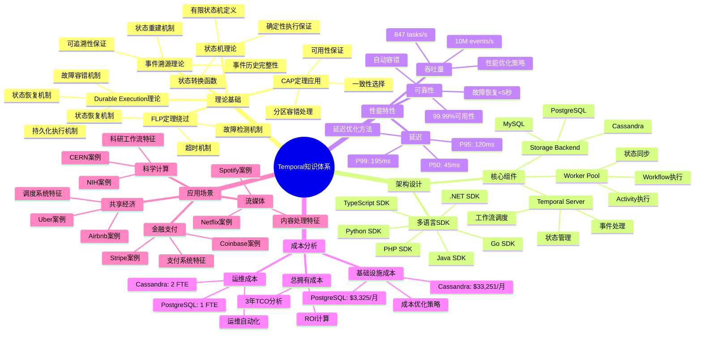
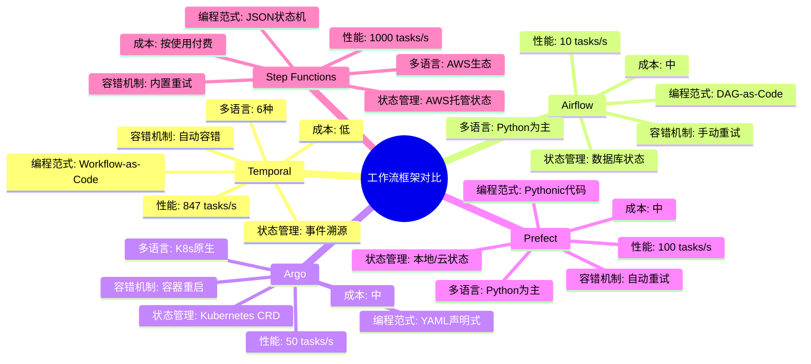
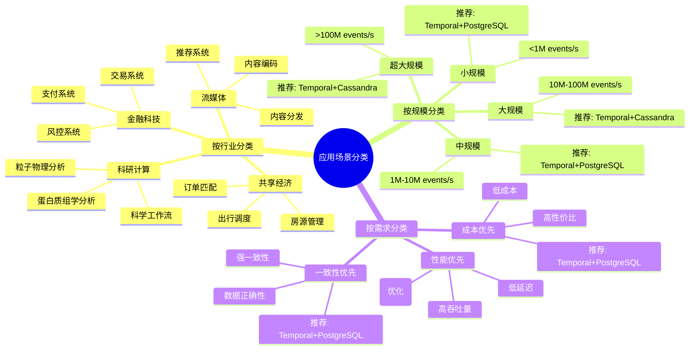
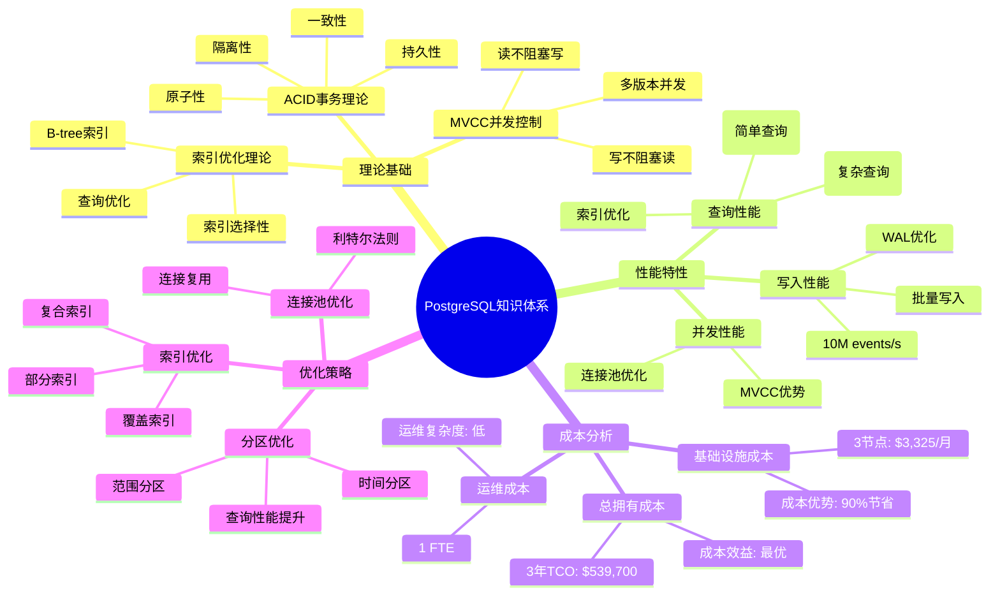
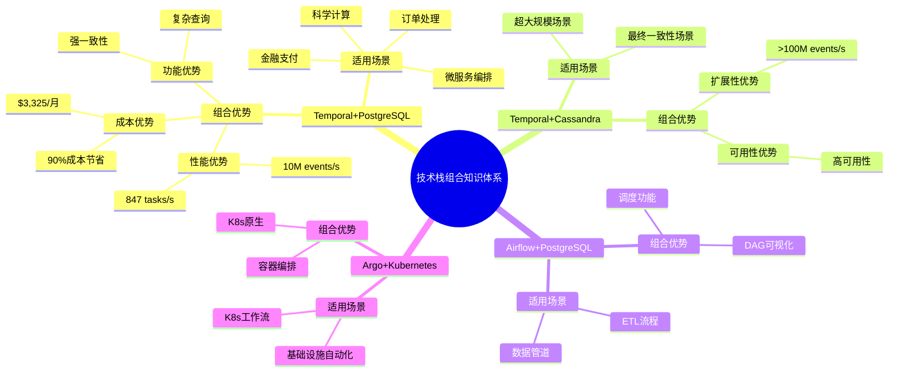
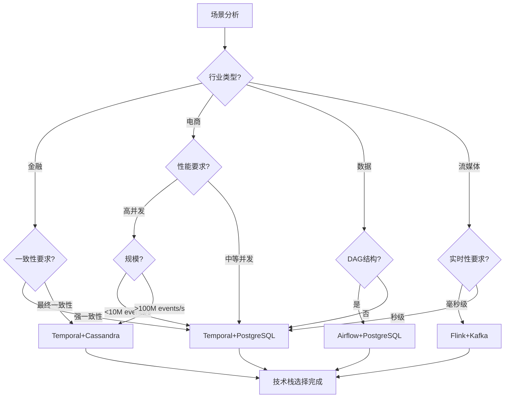

# 思维导图和场景归纳增强计划

## 📋 计划概述

### 目标

为核心论证文档补充完整的思维导图体系和场景归纳分类，确保：

1. 每个文档至少有3个思维导图（知识体系、对比分析、应用场景）
2. 场景归纳覆盖至少20个典型场景
3. 场景分类体系清晰完整
4. 场景决策树完整

---

## 🎯 需要补充的思维导图清单

### Temporal选型论证文档

#### 思维导图1：Temporal知识体系思维导图

#### 思维导图2：工作流框架对比思维导图

#### 思维导图3：应用场景分类思维导图

### PostgreSQL选型论证文档

#### 思维导图1：PostgreSQL知识体系思维导图

### 技术栈组合论证文档

#### 思维导图1：技术栈组合知识体系思维导图

---

## 📊 场景归纳体系

### 场景分类体系

#### 分类维度1：按行业分类（15+行业）

1. **金融科技**
   - 支付系统（Coinbase, Stripe）
   - 交易系统
   - 风控系统

2. **电商零售**
   - 订单处理（Amazon, Alibaba）
   - 库存管理
   - 供应链协调

3. **共享经济**
   - 出行调度（Uber, Didi）
   - 房源管理（Airbnb）
   - 订单匹配

4. **流媒体**
   - 内容编码（Netflix）
   - 推荐系统（Spotify）
   - 内容分发

5. **科研计算**
   - 粒子物理分析（CERN）
   - 蛋白质组学分析（NIH）
   - 科学工作流

6. **监控运维**
   - 监控数据管道（Datadog）
   - 日志处理
   - 告警系统

7. **广告营销**
   - 广告投放（Google Ads）
   - 广告优化（Facebook Ads）
   - 竞价系统

8. **医疗健康**
   - 电子病历（Epic Systems）
   - 医疗数据分析
   - 合规性管理

9. **物联网**
   - 设备管理（AWS IoT Core）
   - 设备协调
   - 远程控制

10. **游戏行业**
    - 游戏逻辑（Riot Games）
    - 游戏数据分析
    - 游戏运营

11. **制造业**
    - 生产调度
    - 设备协调
    - 质量管控

12. **保险行业**
    - 理赔处理（Allstate）
    - 风险评估
    - 合规性管理

13. **房地产**
    - 房产交易（Zillow）
    - 房源管理
    - 交易协调

14. **交通出行**
    - 出行调度（Didi）
    - 路线规划
    - 动态定价

15. **农业科技**
    - 智能农业（John Deere）
    - 设备协调
    - 精准作业

#### 分类维度2：按规模分类

1. **小规模**：<1M events/s
   - 特征：单机或小集群
   - 推荐：Temporal+PostgreSQL（3节点）

2. **中规模**：1M-10M events/s
   - 特征：中等集群
   - 推荐：Temporal+PostgreSQL（3-5节点）

3. **大规模**：10M-100M events/s
   - 特征：大集群
   - 推荐：Temporal+Cassandra（20-30节点）

4. **超大规模**：>100M events/s
   - 特征：超大集群
   - 推荐：Temporal+Cassandra（50+节点）

#### 分类维度3：按需求分类

1. **性能优先**
   - 需求：高吞吐量、低延迟
   - 推荐：Temporal+PostgreSQL（优化）

2. **成本优先**
   - 需求：低成本、高性价比
   - 推荐：Temporal+PostgreSQL

3. **一致性优先**
   - 需求：强一致性、数据正确性
   - 推荐：Temporal+PostgreSQL

4. **扩展性优先**
   - 需求：水平扩展、大规模
   - 推荐：Temporal+Cassandra

### 场景归纳矩阵模板

| 场景ID | 场景名称 | 行业 | 规模 | 需求 | 特征 | 推荐技术栈 | 评分 | 实践案例 |
|--------|---------|------|------|------|------|-----------|------|---------|
| S001 | 支付系统 | 金融 | 中 | 一致性优先 | 强一致性、高可靠性 | Temporal+PG | 9.8 | Coinbase |
| S002 | 订单处理 | 电商 | 大 | 性能优先 | 高并发、低延迟 | Temporal+PG | 9.5 | Amazon |
| S003 | 数据管道 | 数据 | 大 | 性能优先 | DAG结构、可视化 | Airflow+PG | 8.5 | Netflix |
| S004 | 实时流处理 | 流媒体 | 大 | 性能优先 | 低延迟、高吞吐量 | Flink+Kafka | 9.0 | - |
| S005 | 出行调度 | 共享经济 | 大 | 性能优先 | 实时匹配、动态定价 | Temporal+PG | 9.5 | Uber |
| ... | ... | ... | ... | ... | ... | ... | ... | ... |

### 场景决策树模板

---

## 📅 实施计划

### 第1周：Temporal选型论证文档思维导图

- Day 1-2：Temporal知识体系思维导图
- Day 3-4：工作流框架对比思维导图
- Day 5-7：应用场景分类思维导图

### 第2周：PostgreSQL选型论证文档思维导图

- Day 1-3：PostgreSQL知识体系思维导图
- Day 4-7：存储后端对比思维导图

### 第3周：技术栈组合论证文档思维导图

- Day 1-3：技术栈组合知识体系思维导图
- Day 4-7：场景-技术栈匹配思维导图

### 第4周：场景归纳和分类

- Day 1-2：场景分类体系建立
- Day 3-4：场景归纳矩阵补充（20+场景）
- Day 5-7：场景决策树补充

---

**文档版本**：1.0

**创建时间**：2024年

## 八、相关文档

### 8.1 项目内部文档

#### 核心知识文档

- **[项目知识图谱](../17-enhancement-plan/项目知识图谱.md)** - 项目知识图谱
- **[全局知识概念关系图](../17-enhancement-plan/全局知识概念关系图.md)** - 全局知识概念关系图

#### 核心论证文档

- **[Temporal选型论证](Temporal选型论证.md)** - Temporal选型论证
- **[PostgreSQL选型论证](PostgreSQL选型论证.md)** - PostgreSQL选型论证
- **[技术栈组合论证](技术栈组合论证.md)** - 技术栈组合论证

#### 其他相关文档

- **[场景归纳和分类](场景归纳和分类.md)** - 场景归纳和分类
- **[论证全面增强计划](论证全面增强计划.md)** - 论证全面增强计划
- **[论证实质内容增强计划v11.0](论证实质内容增强计划v11.0.md)** - 论证实质内容增强计划

### 8.2 外部资源链接

#### Wikipedia资源

- [Mind map](https://en.wikipedia.org/wiki/Mind_map) - 思维导图
- [Concept map](https://en.wikipedia.org/wiki/Concept_map) - 概念图
- [Scenario planning](https://en.wikipedia.org/wiki/Scenario_planning) - 情景规划

### 8.3 项目管理文档

- **[Wikipedia资源对标](../../structure_control/Wikipedia资源对标.md)** - Wikipedia资源对标
- **[概念关联网络](../../structure_control/概念关联网络.md)** - 思维导图和场景归纳增强计划在概念关联网络中的位置
- **[思维导图集合](../../structure_control/思维导图集合.md)** - 思维导图集合

---

**维护者**：项目团队

**状态**：计划已制定，等待实施
