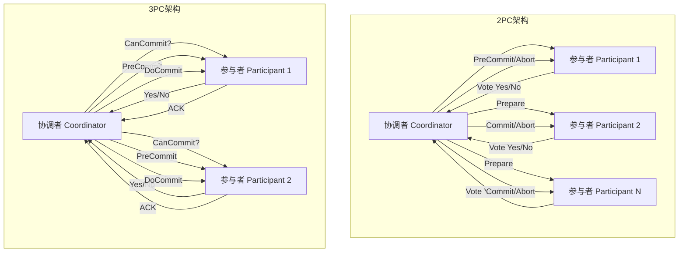

# 2PC与3PC分布式事务协议 专题文档

**文档版本**：v1.0
**创建时间**：2026年
**最后更新**：2026年
**状态**：🔄 编写中

---

## 📋 执行摘要

两阶段提交（2PC）和三阶段提交（3PC）是实现分布式事务原子性的经典协调协议。2PC通过准备和提交两个阶段确保事务一致性，但存在协调者单点故障和阻塞问题；3PC引入预提交阶段和非阻塞超时机制，提高了可用性但增加了复杂度和延迟。

---

## 一、核心概念

### 1.1 定义与原理

#### 两阶段提交（2PC）

2PC（Two-Phase Commit）是一种经典的分布式事务协议，通过引入协调者（Coordinator）来统一管理参与者的提交或回滚操作，确保分布式事务的原子性。

**核心原理**：

- 将事务提交过程分为**准备阶段**（Prepare Phase）和**提交阶段**（Commit Phase）
- 协调者负责收集所有参与者的投票，并根据投票结果决定最终提交或中止事务
- 所有参与者必须遵循协调者的指令，确保全局一致性

#### 三阶段提交（3PC）

3PC（Three-Phase Commit）是2PC的改进版本，通过引入**预提交阶段**（Pre-commit Phase）和超时机制，解决2PC的阻塞问题。

**核心改进**：

- 将提交阶段拆分为预提交和正式提交两个阶段
- 引入超时机制，允许参与者在协调者故障时自主决策
- 降低协调者单点故障对整个系统的影响

### 1.2 关键特性

| 特性 | 2PC | 3PC |
|------|-----|-----|
| **阶段数量** | 2个阶段 | 3个阶段 |
| **阻塞性** | 是（协调者故障时阻塞） | 否（引入超时机制） |
| **容错能力** | 低 | 较高 |
| **消息复杂度** | 3n（n为参与者数） | 5n |
| **延迟** | 较低 | 较高 |
| **一致性保证** | 强一致性 | 强一致性（有限条件下） |

### 1.3 适用场景

| 场景 | 2PC适用性 | 3PC适用性 | 说明 |
|------|-----------|-----------|------|
| 金融交易系统 | ⭐⭐⭐⭐⭐ | ⭐⭐⭐ | 2PC简单可靠，金融系统更关注正确性 |
| 跨数据中心事务 | ⭐⭐⭐ | ⭐⭐⭐⭐⭐ | 3PC网络分区容错能力更强 |
| 高可用要求系统 | ⭐⭐⭐ | ⭐⭐⭐⭐⭐ | 3PC非阻塞特性更适合 |
| 低延迟要求场景 | ⭐⭐⭐⭐⭐ | ⭐⭐⭐ | 2PC延迟更低 |
| 短事务处理 | ⭐⭐⭐⭐⭐ | ⭐⭐⭐⭐ | 两者均可，2PC更简单 |

---

## 二、技术细节

### 2.1 架构设计



### 2.2 算法原理

#### 2PC算法详细流程

**阶段一：准备阶段（Prepare Phase）**

```
协调者行为：
1. 向所有参与者发送 Prepare 请求
2. 等待所有参与者的响应
3. 超时或收到No → 执行Abort
4. 收到所有Yes → 进入提交阶段

参与者行为：
1. 接收到 Prepare 请求
2. 执行本地事务操作（不提交）
3. 写入本地redo/undo日志
4. 锁定相关资源
5. 返回 Yes（成功）或 No（失败）
```

**阶段二：提交阶段（Commit Phase）**

```
情况A：所有参与者返回Yes
协调者：
1. 写入Commit日志
2. 向所有参与者发送 Commit 请求
3. 等待ACK
4. 事务完成

参与者：
1. 接收 Commit 请求
2. 执行本地提交
3. 释放锁资源
4. 返回 ACK

情况B：任一参与者返回No或超时
协调者：
1. 写入Abort日志
2. 向所有参与者发送 Rollback 请求
3. 等待ACK

参与者：
1. 接收 Rollback 请求
2. 执行本地回滚
3. 释放锁资源
4. 返回 ACK
```

#### 3PC算法详细流程

**阶段一：CanCommit阶段**

```
协调者：
1. 向所有参与者发送 CanCommit 询问
2. 询问是否可以执行事务

参与者：
1. 检查自身状态（是否可用、资源是否足够）
2. 不执行实际业务操作
3. 返回 Yes 或 No
```

**阶段二：PreCommit阶段**

```
情况A：所有参与者返回Yes
协调者：
1. 发送 PreCommit 请求
2. 进入预提交状态

参与者：
1. 接收 PreCommit
2. 执行本地事务（不提交）
3. 写入redo/undo日志
4. 返回 ACK

情况B：任一No或超时
→ 执行Abort流程
```

**阶段三：DoCommit阶段**

```
协调者：
1. 收到所有ACK后，发送 DoCommit
2. 或超时后发送 Abort

参与者：
1. 接收 DoCommit → 提交事务 → 返回ACK
2. 接收 Abort → 回滚事务 → 返回ACK
3. 超时未收到消息 → 自主提交（已处于PreCommit状态）
```

### 2.3 协调者故障处理

#### 2PC协调者故障场景分析

```
场景1：协调者在Prepare前故障
- 参与者未收到Prepare
- 参与者超时后自动回滚
- 事务中止，无一致性问题

场景2：协调者在Prepare后、Commit前故障
- 部分参与者可能已投票Yes并锁定资源
- 参与者等待协调者指令，进入阻塞状态
- 直到协调者恢复，才能继续
- 这是最危险的阻塞场景

场景3：协调者在Commit后故障
- 部分参与者可能已收到Commit并执行
- 协调者需要恢复后继续发送Commit给未确认者
- 通过日志保证最终一致性
```

**2PC故障恢复策略**：

| 故障点 | 恢复动作 | 一致性影响 |
|--------|----------|------------|
| Prepare前 | 事务回滚 | 无影响 |
| Prepare-Commit间 | 查看日志，继续原有决策 | 可能阻塞 |
| Commit后 | 重发Commit给未确认者 | 最终一致 |

#### 3PC非阻塞机制

```
3PC超时处理策略：

参与者超时场景：
1. CanCommit阶段超时 → 直接Abort
2. PreCommit阶段超时 → 等待DoCommit或Abort
3. DoCommit阶段超时（已收到PreCommit）→ 自主Commit

关键设计：
- PreCommit状态的参与者可以安全提交
- 因为所有参与者都已承诺可以执行
- 不会出现部分提交、部分回滚的情况
```

### 2.4 阻塞问题分析

#### 2PC阻塞问题

**根本原因**：

- 参与者在投票Yes后，必须等待协调者的最终指令
- 协调者故障时，参与者无法确定其他参与者的状态
- 为保证一致性，参与者只能无限期等待

**阻塞的影响**：

1. **资源锁定**：事务持有的锁无法释放
2. **级联阻塞**：其他等待这些锁的事务也被阻塞
3. **系统不可用**：严重时导致整个系统停摆

#### 3PC解决阻塞的原理

```
关键洞察：
- 在3PC中，如果参与者进入PreCommit状态
- 说明所有参与者都已承诺可以执行事务
- 此时即使协调者故障，参与者也可以安全提交

对比：
2PC：Vote Yes → 不知道其他人是否Yes → 不能决定
3PC：PreCommit → 知道所有人都已准备 → 可以决定
```

---

## 三、系统对比

### 3.1 2PC vs 3PC 对比矩阵

| 维度 | 2PC | 3PC |
|------|-----|-----|
| **协议阶段** | Prepare → Commit | CanCommit → PreCommit → DoCommit |
| **消息轮数** | 2轮 | 3轮 |
| **消息总数** | 4n（n参与者） | 5n |
| **协调者故障容错** | 低（会阻塞） | 高（超时自主决策） |
| **网络分区容忍** | 差 | 较好 |
| **延迟** | 低 | 高（多一轮交互） |
| **吞吐量** | 高 | 较低 |
| **实现复杂度** | 简单 | 复杂 |
| **数据一致性** | 强 | 强（有限条件） |

### 3.2 与Paxos/Raft对比

| 特性 | 2PC/3PC | Paxos/Raft |
|------|---------|------------|
| **核心目标** | 分布式事务原子性 | 分布式共识/日志复制 |
| **一致性级别** | 强一致性 | 强一致性 |
| **容错机制** | 2PC无容错/3PC超时容错 | 多数派容错 |
| **故障模型** | 崩溃-停止 | 拜占庭/崩溃-停止 |
| **领导者** | 协调者（可单点） | Leader（可切换） |
| **适用场景** | 跨服务事务 | 数据复制、配置管理 |
| **可扩展性** | 差（协调者瓶颈） | 较好 |

**关键区别**：

1. **问题域不同**：
   - 2PC/3PC：解决**事务原子性**问题（ACID中的A）
   - Paxos/Raft：解决**共识问题**（多个节点达成一致）

2. **容错能力**：
   - 2PC：协调者单点，故障时阻塞
   - 3PC：引入超时，但网络分区时仍可能不一致
   - Paxos/Raft：容忍少数派故障，自动故障转移

3. **组合使用**：

   ```
   实际系统中常见模式：
   - 使用Raft/Paxos维护协调者的高可用
   - 在Raft组之上运行2PC协议
   - 例如：Spanner使用Paxos组 + 2PC
   ```

### 3.3 性能基准

| 指标 | 2PC | 3PC | 说明 |
|------|-----|-----|------|
| 事务延迟（本地网络） | 2-5ms | 4-8ms | 3PC多一轮RTT |
| 事务延迟（跨机房） | 50-200ms | 100-400ms | 网络延迟放大 |
| 协调者故障恢复时间 | ∞（阻塞） | 超时时间（可配置） | 3PC优势明显 |
| 最大吞吐量 | 高 | 中等 | 2PC消息更少 |
| 资源锁定时间 | 短 | 较长 | 3PC多一个阶段 |

---

## 四、实践指南

### 4.1 超时配置

```yaml
# 2PC超时配置示例
two_phase_commit:
  prepare_timeout: 5000ms      # Prepare等待超时
  commit_timeout: 10000ms      # Commit等待超时
  participant_timeout: 3000ms  # 参与者响应超时
  retry_attempts: 3            # 重试次数
  retry_interval: 1000ms       # 重试间隔

# 3PC超时配置示例
three_phase_commit:
  can_commit_timeout: 3000ms   # CanCommit等待超时
  pre_commit_timeout: 5000ms   # PreCommit等待超时
  do_commit_timeout: 10000ms   # DoCommit等待超时
  participant_decision_timeout: 15000ms  # 参与者自主决策超时
```

### 4.2 最佳实践

1. **协调者高可用**
   - 使用Raft/Paxos实现协调者集群
   - 协调者状态持久化到多副本
   - 快速故障检测和切换

2. **超时参数调优**
   - 根据网络延迟设置合理超时
   - 避免超时过短导致误_abort
   - 避免超时过长增加阻塞风险

3. **日志持久化**
   - 协调者和参与者都必须先写日志再执行
   - 使用WAL（Write-Ahead Logging）
   - 定期日志压缩和清理

4. **资源锁定优化**
   - 尽量减少事务持有锁的时间
   - 使用细粒度锁减少冲突
   - 考虑锁超时和死锁检测

### 4.3 常见问题

**Q1: 2PC协调者故障时如何避免长时间阻塞？**

A: 有以下几种策略：

- 使用协调者集群（基于Raft/Paxos）
- 设置参与者锁超时，超时后主动释放（牺牲一致性）
- 引入外部仲裁服务协助决策

**Q2: 3PC在网络分区时是否能保证一致性？**

A: 3PC在网络分区时仍可能出现不一致：

- 如果协调者和部分参与者在多数派分区
- 另一部分参与者超时后可能自主提交
- 协调者恢复后可能决定回滚
- 需要额外机制（如故障恢复协议）保证一致性

**Q3: 为什么实际系统中2PC比3PC更常见？**

A: 主要原因：

- 3PC实现复杂度高
- 3PC延迟更高，影响性能
- 网络分区场景下3PC也不能完全保证一致性
- 实践中更倾向使用2PC+协调者高可用方案

---

## 五、形式化分析

### 5.1 安全性与活性

**安全性（Safety）**：

- 所有参与者最终要么全部提交，要么全部回滚
- 不会出现部分提交、部分回滚的情况

**活性（Liveness）**：

- 2PC：无故障时保证终止；协调者故障时可能阻塞
- 3PC：无故障时保证终止；引入超时后有限时间内终止

### 5.2 复杂度分析

| 协议 | 时间复杂度 | 消息复杂度 | 空间复杂度 |
|------|-----------|-----------|-----------|
| 2PC | O(1) 轮次 | O(n) | O(n) 状态存储 |
| 3PC | O(1) 轮次 | O(n) | O(n) 状态存储 |

注：n为参与者数量

---

## 六、与其他主题的关联

### 6.1 上游依赖

- [CAP定理](../01-fundamentals/CAP定理.md)
- [分布式一致性](../01-fundamentals/分布式一致性.md)
- [故障模型](../01-fundamentals/故障模型.md)

### 6.2 下游应用

- [分布式事务选型](./分布式事务选型.md)
- [Saga模式](./Saga事务模式.md)
- [TCC模式](./TCC事务模式.md)

### 6.3 相关概念

| 概念 | 关系 | 说明 |
|------|------|------|
| Paxos/Raft | 对比/组合 | 共识协议，可组合使用 |
| Saga | 替代方案 | 最终一致性，适合长事务 |
| TCC | 替代方案 | 业务层补偿，应用广泛 |
| 本地消息表 | 替代方案 | 异步保证最终一致性 |

---

## 七、参考资源

### 7.1 学术论文

1. [Atomic Transactions](https://dl.acm.org/doi/10.1145/128762.128763) - Jim Gray, 1978（2PC原始论文）
2. [Consensus on Transaction Commit](https://arxiv.org/abs/cs/0701157) - Jim Gray & Leslie Lamport, 2006
3. [NonBlocking Commit Protocols](https://dl.acm.org/doi/10.1145/128762.128763) - Skeen, 1981（3PC相关）

### 7.2 开源项目

1. [Atomikos](https://www.atomikos.com/) - Java事务管理器，支持2PC
2. [Narayana](https://narayana.io/) - JBoss事务管理器
3. [Seata](https://seata.io/) - 阿里巴巴开源分布式事务解决方案

### 7.3 学习资料

1. [Designing Data-Intensive Applications](https://dataintensive.net/) - Martin Kleppmann, 第9章
2. [分布式系统：概念与设计](https://www.pearson.com/) - Coulouris等，第17章
3. [数据库事务处理的艺术](https://book.douban.com/) - 李海翔

### 7.4 相关文档

- [分布式事务选型](./分布式事务选型.md)
- [MVCC多版本并发控制](./MVCC多版本并发控制.md)
- [TCC事务模式](./TCC事务模式.md)

---

**维护者**：项目团队
**最后更新**：2026年
