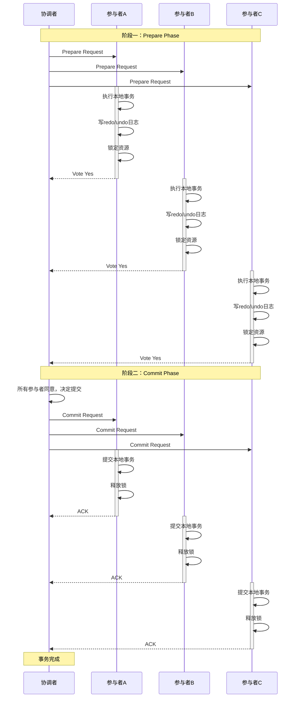

# 2PC两阶段提交详解

**文档版本**：v1.0
**创建时间**：2026年
**最后更新**：2026年
**状态**：✅ 已完成

---

## 📋 执行摘要

两阶段提交（Two-Phase Commit，2PC）是分布式事务领域最经典的协议之一，由Jim Gray于1978年提出。它通过协调者与参与者的协作，确保分布式事务的原子性——要么所有参与者都提交，要么都回滚。

---

## 一、协议原理

### 1.1 核心角色

```
┌─────────────────────────────────────────┐
│              协调者 (Coordinator)        │
│    - 统一决策事务提交或回滚              │
│    - 维护事务状态                        │
│    - 驱动协议执行                        │
└─────────────────────────────────────────┘
                    │
        ┌───────────┼───────────┐
        ▼           ▼           ▼
   ┌─────────┐  ┌─────────┐  ┌─────────┐
   │参与者A  │  │参与者B  │  │参与者C  │
   └─────────┘  └─────────┘  └─────────┘
```

### 1.2 两阶段流程

**阶段一：准备阶段（Prepare Phase）**

协调者向所有参与者发送Prepare请求，参与者执行本地事务但不提交，记录redo/undo日志后返回投票结果。

**阶段二：提交阶段（Commit Phase）**

- 所有参与者返回Yes → 协调者发送Commit，参与者提交事务
- 任一参与者返回No或超时 → 协调者发送Rollback，参与者回滚事务

---

## 二、时序图



---

## 三、Java实现示例

```java
/**
 * 2PC协调者实现
 */
public class TwoPhaseCoordinator {

    private List<Participant> participants;
    private TransactionLog txLog;

    public TwoPhaseCoordinator(List<Participant> participants) {
        this.participants = participants;
        this.txLog = new TransactionLog();
    }

    /**
     * 执行分布式事务
     */
    public boolean executeDistributedTx(String txId) {
        try {
            // 阶段一：Prepare
            List<VoteResult> votes = new ArrayList<>();
            for (Participant p : participants) {
                VoteResult vote = p.prepare(txId);
                votes.add(vote);

                // 记录投票结果
                txLog.logVote(txId, p.getId(), vote);
            }

            // 检查投票结果
            boolean allYes = votes.stream()
                .allMatch(v -> v == VoteResult.YES);

            // 阶段二：Commit或Rollback
            if (allYes) {
                txLog.logDecision(txId, Decision.COMMIT);
                return doCommit(txId);
            } else {
                txLog.logDecision(txId, Decision.ROLLBACK);
                return doRollback(txId);
            }
        } catch (Exception e) {
            txLog.logDecision(txId, Decision.ROLLBACK);
            return doRollback(txId);
        }
    }

    private boolean doCommit(String txId) {
        for (Participant p : participants) {
            try {
                boolean success = p.commit(txId);
                txLog.logAck(txId, p.getId(), success);
            } catch (Exception e) {
                // 记录失败，需要重试
                txLog.logCommitFailure(txId, p.getId());
            }
        }
        return true;
    }

    private boolean doRollback(String txId) {
        for (Participant p : participants) {
            try {
                boolean success = p.rollback(txId);
                txLog.logAck(txId, p.getId(), success);
            } catch (Exception e) {
                txLog.logRollbackFailure(txId, p.getId());
            }
        }
        return false;
    }
}

/**
 * 2PC参与者接口
 */
public interface Participant {
    String getId();

    /**
     * 准备阶段
     */
    VoteResult prepare(String txId) throws Exception;

    /**
     * 提交阶段
     */
    boolean commit(String txId) throws Exception;

    /**
     * 回滚阶段
     */
    boolean rollback(String txId) throws Exception;
}

/**
 * 具体参与者实现（以订单服务为例）
 */
public class OrderParticipant implements Participant {

    @Autowired
    private OrderDao orderDao;

    @Override
    public VoteResult prepare(String txId) {
        try {
            // 1. 执行业务操作但不提交
            Order order = orderDao.createOrderPending(txId);

            // 2. 记录undo日志
            UndoLog log = new UndoLog(txId, "DELETE FROM orders WHERE tx_id = ?");
            undoLogDao.save(log);

            // 3. 锁定相关资源
            orderDao.lockOrder(order.getId());

            return VoteResult.YES;
        } catch (Exception e) {
            return VoteResult.NO;
        }
    }

    @Override
    public boolean commit(String txId) {
        // 提交订单
        return orderDao.confirmOrder(txId) > 0;
    }

    @Override
    public boolean rollback(String txId) {
        // 回滚订单
        return orderDao.cancelOrder(txId) > 0;
    }
}
```

---

## 四、优缺点分析

### 4.1 优点

| 优点 | 说明 |
|------|------|
| **强一致性** | 保证所有参与者最终状态一致 |
| **实现简单** | 协议逻辑清晰，易于理解和实现 |
| **数据库支持** | XA规范基于2PC，主流数据库原生支持 |
| **成熟稳定** | 经过40多年实践检验 |

### 4.2 缺点

| 缺点 | 说明 | 影响 |
|------|------|------|
| **同步阻塞** | 参与者等待协调者指令期间持有锁 | 性能下降，可能出现死锁 |
| **协调者单点** | 协调者故障时参与者无法决策 | 系统可用性降低 |
| **数据不一致风险** | 协调者故障后恢复可能导致部分提交 | 需要人工干预修复 |

### 4.3 阻塞问题详解

```
阻塞场景：
1. 协调者在Prepare后、Commit前故障
2. 参与者已投票Yes并锁定资源
3. 参与者无法确定其他参与者状态
4. 参与者只能无限期等待协调者恢复

后果：
- 资源长期锁定
- 其他事务无法访问
- 级联阻塞导致系统停摆
```

---

## 五、适用场景

| 场景 | 适用性 | 原因 |
|------|--------|------|
| 银行转账 | ⭐⭐⭐⭐⭐ | 强一致性要求 |
| 金融核心系统 | ⭐⭐⭐⭐⭐ | 数据准确第一 |
| 跨库短事务 | ⭐⭐⭐⭐ | 同构数据库环境 |
| 长事务 | ⭐⭐ | 阻塞时间过长 |
| 高并发场景 | ⭐⭐ | 锁竞争严重 |

---

## 六、最佳实践

```yaml
# 2PC超时配置
two_phase_commit:
  prepare_timeout: 5000ms      # Prepare等待超时
  commit_timeout: 10000ms      # Commit等待超时
  participant_timeout: 3000ms  # 参与者响应超时
  retry_attempts: 3            # 重试次数
```

1. **协调者高可用**：使用Raft/Paxos实现协调者集群
2. **超时设置**：根据网络延迟合理设置超时
3. **日志持久化**：协调者和参与者必须先写日志再执行
4. **锁超时**：设置参与者锁超时，避免永久阻塞

---

**维护者**：项目团队
**最后更新**：2026-04-03
