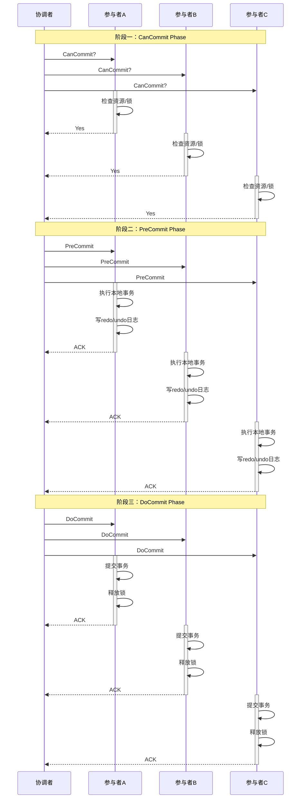
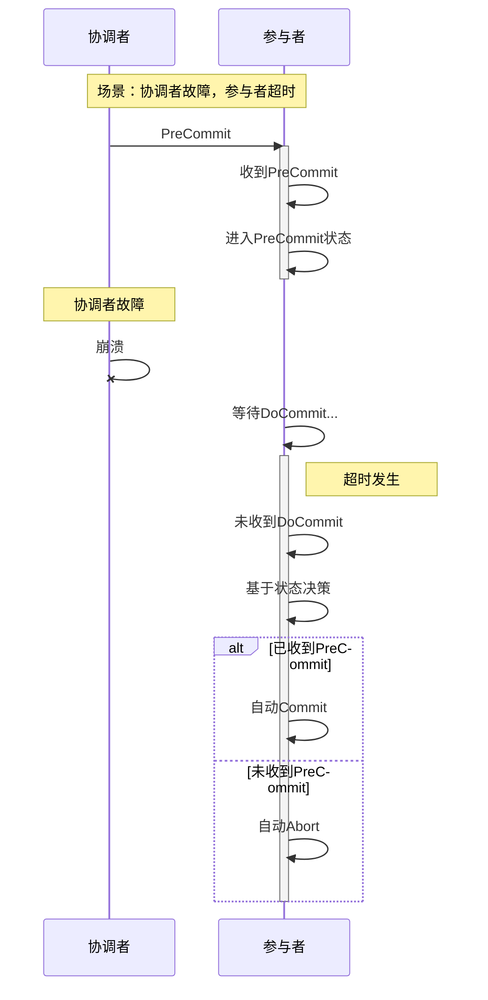

# 3PC三阶段提交详解

**文档版本**：v1.0
**创建时间**：2026年
**最后更新**：2026年
**状态**：✅ 已完成

---

## 📋 执行摘要

三阶段提交（Three-Phase Commit，3PC）是2PC的改进版本，通过引入预提交阶段和超时机制，解决2PC的同步阻塞问题。
3PC允许参与者在协调者故障时基于超时自主决策，提高系统可用性，但增加了协议复杂度和延迟。

---

## 一、协议原理

### 1.1 核心改进

```
┌─────────────────────────────────────────────┐
│              2PC vs 3PC 对比                 │
├─────────────────────────────────────────────┤
│  2PC: Prepare → Commit                      │
│       [投票阶段] → [执行阶段]                │
│                                             │
│  3PC: CanCommit → PreCommit → DoCommit      │
│       [询问阶段] → [预提交阶段] → [确认阶段]  │
└─────────────────────────────────────────────┘
```

### 1.2 三阶段流程

**阶段一：CanCommit阶段**

协调者询问参与者是否可以执行事务，参与者检查自身状态（资源、锁等）后返回Yes/No，不执行实际业务。

**阶段二：PreCommit阶段**

所有参与者返回Yes后，协调者发送PreCommit请求。参与者执行本地事务，写入redo/undo日志，但不提交，返回ACK。

**阶段三：DoCommit阶段**

协调者收到所有ACK后发送DoCommit，参与者正式提交事务并释放锁。

---

## 二、时序图



---

## 三、超时机制

### 3.1 参与者超时处理



### 3.2 超时决策逻辑

| 当前状态 | 超时动作 | 原因 |
|----------|----------|------|
| CanCommit等待 | Abort | 可能无法执行 |
| PreCommit等待 | Commit | 已承诺可以执行 |
| DoCommit等待 | Commit | 其他参与者可能已提交 |

---

## 四、Java实现示例

```java
/**
 * 3PC协调者实现
 */
public class ThreePhaseCoordinator {

    private List<Participant> participants;
    private TransactionLog txLog;

    public enum Phase {
        CAN_COMMIT, PRE_COMMIT, DO_COMMIT
    }

    /**
     * 执行3PC事务
     */
    public boolean executeTransaction(String txId) {
        try {
            // 阶段一：CanCommit
            if (!canCommitPhase(txId)) {
                return abort(txId);
            }

            // 阶段二：PreCommit
            if (!preCommitPhase(txId)) {
                return abort(txId);
            }

            // 阶段三：DoCommit
            return doCommitPhase(txId);

        } catch (Exception e) {
            return abort(txId);
        }
    }

    /**
     * CanCommit阶段：询问参与者是否可以执行
     */
    private boolean canCommitPhase(String txId) {
        txLog.logPhase(txId, Phase.CAN_COMMIT);

        for (Participant p : participants) {
            try {
                Future<Boolean> future = executor.submit(() -> p.canCommit(txId));
                Boolean canCommit = future.get(3000, TimeUnit.MILLISECONDS);

                if (!canCommit) {
                    return false;
                }
                txLog.logCanCommitVote(txId, p.getId(), true);
            } catch (TimeoutException e) {
                txLog.logCanCommitVote(txId, p.getId(), false);
                return false;
            }
        }
        return true;
    }

    /**
     * PreCommit阶段：预提交
     */
    private boolean preCommitPhase(String txId) {
        txLog.logPhase(txId, Phase.PRE_COMMIT);

        for (Participant p : participants) {
            try {
                Future<Boolean> future = executor.submit(() -> p.preCommit(txId));
                Boolean ack = future.get(5000, TimeUnit.MILLISECONDS);
                txLog.logPreCommitAck(txId, p.getId(), ack);
            } catch (TimeoutException e) {
                // PreCommit阶段超时，稍后重试
                txLog.logPreCommitTimeout(txId, p.getId());
            }
        }
        return true;
    }

    /**
     * DoCommit阶段：正式提交
     */
    private boolean doCommitPhase(String txId) {
        txLog.logPhase(txId, Phase.DO_COMMIT);

        for (Participant p : participants) {
            try {
                Future<Boolean> future = executor.submit(() -> p.doCommit(txId));
                future.get(10000, TimeUnit.MILLISECONDS);
            } catch (TimeoutException e) {
                // 记录需要重试
                txLog.logCommitNeedRetry(txId, p.getId());
            }
        }
        return true;
    }

    private boolean abort(String txId) {
        for (Participant p : participants) {
            try {
                p.abort(txId);
            } catch (Exception e) {
                txLog.logAbortFailure(txId, p.getId());
            }
        }
        return false;
    }
}

/**
 * 3PC参与者实现（带超时处理）
 */
public class ThreePhaseParticipant implements Participant {

    @Autowired
    private OrderDao orderDao;

    private Map<String, ParticipantState> stateMap = new ConcurrentHashMap<>();

    public enum ParticipantState {
        IDLE, CAN_COMMIT_WAIT, PRE_COMMIT_WAIT, PRE_COMMIT_DONE, COMMITTED, ABORTED
    }

    @Override
    public boolean canCommit(String txId) {
        try {
            // 检查是否可以执行（不实际执行）
            if (!orderDao.checkResourceAvailable()) {
                return false;
            }
            stateMap.put(txId, ParticipantState.CAN_COMMIT_WAIT);
            return true;
        } catch (Exception e) {
            return false;
        }
    }

    @Override
    public boolean preCommit(String txId) {
        try {
            // 执行业务但不提交
            orderDao.prepareOrder(txId);
            stateMap.put(txId, ParticipantState.PRE_COMMIT_DONE);

            // 启动超时定时器
            startCommitTimeout(txId);
            return true;
        } catch (Exception e) {
            return false;
        }
    }

    @Override
    public boolean doCommit(String txId) {
        try {
            cancelTimeout(txId);
            orderDao.confirmOrder(txId);
            stateMap.put(txId, ParticipantState.COMMITTED);
            return true;
        } catch (Exception e) {
            return false;
        }
    }

    @Override
    public boolean abort(String txId) {
        cancelTimeout(txId);
        orderDao.cancelOrder(txId);
        stateMap.put(txId, ParticipantState.ABORTED);
        return true;
    }

    /**
     * 超时处理：如果在PreCommit状态超时，自动提交
     */
    private void startCommitTimeout(String txId) {
        ScheduledExecutorService scheduler = Executors.newScheduledThreadPool(1);
        scheduler.schedule(() -> {
            ParticipantState state = stateMap.get(txId);
            if (state == ParticipantState.PRE_COMMIT_DONE) {
                // 已收到PreCommit但未收到DoCommit，自动提交
                try {
                    doCommit(txId);
                } catch (Exception e) {
                    log.error("Auto commit failed", e);
                }
            }
        }, 15000, TimeUnit.MILLISECONDS);
    }
}
```

---

## 五、优缺点分析

### 5.1 优点

| 优点 | 说明 |
|------|------|
| **非阻塞** | 引入超时机制，参与者可自主决策 |
| **高可用** | 协调者故障不会导致长时间阻塞 |
| **容错增强** | 网络分区时部分场景可继续执行 |

### 5.2 缺点

| 缺点 | 说明 |
|------|------|
| **复杂度高** | 三阶段交互，实现复杂 |
| **延迟增加** | 多一轮消息交互，性能下降 |
| **极端不一致** | 网络分区时仍可能出现不一致 |
| **消息增多** | 5n消息复杂度（vs 2PC的4n）|

### 5.3 网络分区问题

```
网络分区场景：

分区1：协调者 + 参与者A
分区2：参与者B + 参与者C

场景：
1. 协调者向分区1发送DoCommit
2. 参与者A提交成功
3. 协调者和参与者A所在分区隔离
4. 参与者B、C等待超时
5. 参与者B、C基于PreCommit状态自动提交

结果：
- 如果协调者恢复后决定回滚 → 不一致
- 需要额外的故障恢复协议保证一致性
```

---

## 六、适用场景

| 场景 | 适用性 | 原因 |
|------|--------|------|
| 跨数据中心事务 | ⭐⭐⭐⭐⭐ | 网络延迟大，需要超时机制 |
| 高可用要求系统 | ⭐⭐⭐⭐⭐ | 不能容忍长时间阻塞 |
| 长距离分布式系统 | ⭐⭐⭐⭐ | 网络不稳定场景 |
| 低延迟场景 | ⭐⭐ | 多一轮交互，延迟增加 |
| 强一致金融场景 | ⭐⭐⭐ | 网络分区时仍可能不一致 |

---

## 七、2PC vs 3PC对比

| 维度 | 2PC | 3PC |
|------|-----|-----|
| **阶段数** | 2 | 3 |
| **消息数** | 4n | 5n |
| **阻塞性** | 阻塞 | 非阻塞（超时） |
| **延迟** | 低 | 较高 |
| **复杂度** | 简单 | 复杂 |
| **容错能力** | 低 | 较高 |
| **一致性** | 强 | 强（有限条件） |

---

**维护者**：项目团队
**最后更新**：2026-04-03
