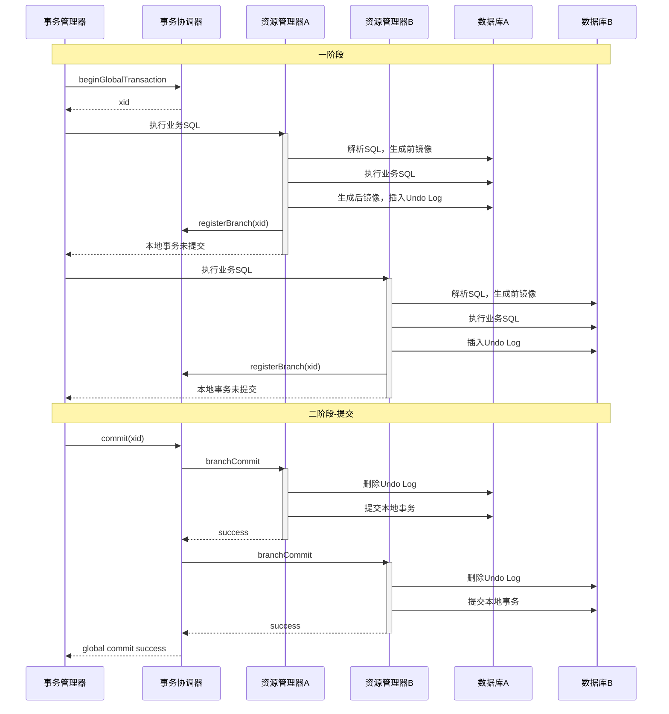
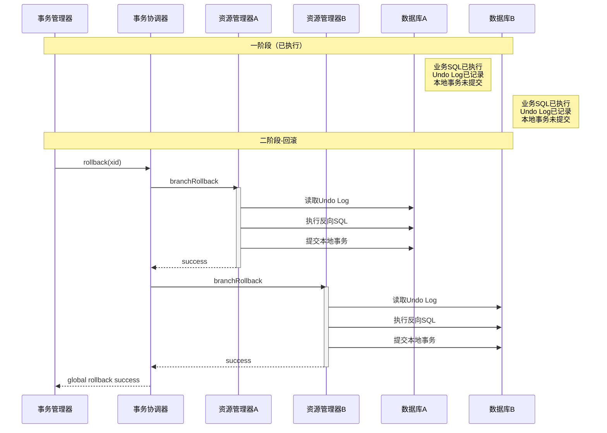

# AT模式详解

**文档版本**：v1.0
**创建时间**：2026年
**最后更新**：2026年
**状态**：✅ 已完成

---

## 📋 执行摘要

AT（Auto Transaction）模式是Seata框架提供的自动补偿型分布式事务方案。它通过代理数据源，在业务SQL执行前后自动生成反向SQL（Undo Log），在需要回滚时自动执行反向SQL完成补偿。AT模式对业务零侵入，开发者像使用本地事务一样使用分布式事务。

---

## 一、核心原理

### 1.1 AT模式架构

```
┌─────────────────────────────────────────────────────────────┐
│                      AT模式架构                              │
├─────────────────────────────────────────────────────────────┤
│                                                             │
│   业务应用                      Seata Server                │
│  ┌─────────────┐              ┌───────────────┐            │
│  │ 业务代码    │              │  TC (协调器)   │            │
│  │ @GlobalTx   │──────────────│  - 全局事务管理│            │
│  └──────┬──────┘              │  - 事务协调    │            │
│         │                     └───────┬───────┘            │
│         │                             │                    │
│  ┌──────▼──────┐              ┌───────▼───────┐            │
│  │ 数据源代理  │              │  TM (事务管理器)│            │
│  │ - 解析SQL   │              └───────────────┘            │
│  │ - 生成Undo  │                                            │
│  │ - 注册分支  │              ┌───────────────┐            │
│  └──────┬──────┘              │  RM (资源管理器)│            │
│         │                     │  - 分支事务    │            │
│         ▼                     │  - Undo执行    │            │
│  ┌─────────────┐              └───────────────┘            │
│  │ 业务数据库   │                                            │
│  │ - 业务数据   │                                            │
│  │ - Undo日志   │                                            │
│  └─────────────┘                                            │
└─────────────────────────────────────────────────────────────┘
```

### 1.2 执行流程

```
一阶段：
1. 解析SQL，获取数据变更前后的镜像
2. 执行业务SQL
3. 生成Undo Log（反向SQL）
4. 注册分支事务

二阶段-成功：
1. 删除Undo Log
2. 提交本地事务

二阶段-回滚：
1. 读取Undo Log
2. 执行反向SQL
3. 提交本地事务
```

---

## 二、时序图

### 2.1 正常提交流程



### 2.2 回滚流程



---

## 三、Java实现示例

```java
/**
 * Seata AT模式配置
 */
@Configuration
public class SeataConfig {

    @Bean
    @ConfigurationProperties(prefix = "spring.datasource")
    public DataSource dataSource() {
        return new DruidDataSource();
    }

    /**
     * 数据源代理（关键配置）
     */
    @Bean
    @Primary
    public DataSource dataSourceProxy(DataSource dataSource) {
        return new DataSourceProxy(dataSource);
    }
}

/**
 * 订单服务（AT模式使用示例）
 */
@Service
public class OrderService {

    @Autowired
    private OrderDao orderDao;
    @Autowired
    private StorageFeignClient storageFeignClient;
    @Autowired
    private AccountFeignClient accountFeignClient;

    /**
     * 创建订单（AT模式）
     * @GlobalTransactional 开启全局事务
     */
    @GlobalTransactional(name = "create-order", rollbackFor = Exception.class)
    public Order createOrder(OrderRequest request) {
        // 1. 创建订单（本地事务）
        Order order = new Order();
        order.setUserId(request.getUserId());
        order.setCommodityCode(request.getCommodityCode());
        order.setCount(request.getCount());
        order.setMoney(request.getCount() * 100); // 单价100
        order.setStatus(OrderStatus.INIT);
        orderDao.insert(order);

        // 2. 扣减库存（远程调用，AT自动代理）
        storageFeignClient.deduct(
            request.getCommodityCode(),
            request.getCount()
        );

        // 3. 扣减账户余额（远程调用，AT自动代理）
        accountFeignClient.debit(
            request.getUserId(),
            order.getMoney()
        );

        // 4. 更新订单状态
        order.setStatus(OrderStatus.SUCCESS);
        orderDao.updateStatus(order);

        return order;
    }
}

/**
 * 库存服务（AT模式自动处理）
 */
@RestController
@RequestMapping("/storage")
public class StorageController {

    @Autowired
    private StorageService storageService;

    @PostMapping("/deduct")
    public void deduct(@RequestParam String commodityCode,
                       @RequestParam int count) {
        // AT模式下，此操作会被Seata代理
        // 自动记录Undo Log
        storageService.deduct(commodityCode, count);
    }
}

/**
 * Undo Log结构示例
 */
/*
{
    "branchId": 123456,
    "xid": "192.168.1.1:8091:123456789",
    "context": "serializer=jackson",
    "undoItems": [
        {
            "sqlType": "UPDATE",
            "tableName": "storage",
            "beforeImage": {
                "rows": [
                    {
                        "fields": [
                            {"name": "id", "type": 4, "value": 1},
                            {"name": "commodity_code", "type": 12, "value": "C001"},
                            {"name": "count", "type": 4, "value": 100}
                        ]
                    }
                ]
            },
            "afterImage": {
                "rows": [
                    {
                        "fields": [
                            {"name": "id", "type": 4, "value": 1},
                            {"name": "commodity_code", "type": 12, "value": "C001"},
                            {"name": "count", "type": 4, "value": 90}
                        ]
                    }
                ]
            },
            "sql": "UPDATE storage SET count = count - 10 WHERE commodity_code = 'C001'"
        }
    ]
}
*/

/**
 * 全局事务监听器
 */
@Component
public class GlobalTransactionListener {

    /**
     * 事务完成后处理
     */
    @TransactionalEventListener(phase = TransactionPhase.AFTER_COMMIT)
    public void afterGlobalCommit(GlobalTransactionEvent event) {
        // 发送订单创建成功通知
        sendOrderNotification(event.getXid(), "SUCCESS");
    }

    @TransactionalEventListener(phase = TransactionPhase.AFTER_ROLLBACK)
    public void afterGlobalRollback(GlobalTransactionEvent event) {
        // 记录回滚日志
        log.warn("全局事务回滚: xid={}", event.getXid());
    }
}
```

---

## 四、AT vs TCC对比

| 维度 | AT模式 | TCC模式 |
|------|--------|---------|
| **业务侵入** | 无（自动代理） | 高（需实现3个接口） |
| **性能** | 中等（需要解析SQL） | 高（无解析开销） |
| **SQL支持** | 有限（复杂SQL可能不支持） | 无限制（业务实现） |
| **隔离性** | 读未提交/读已提交 | 依赖业务实现 |
| **学习成本** | 低 | 高 |
| **适用场景** | 简单CRUD、快速接入 | 复杂业务、高性能要求 |

---

## 五、注意事项

1. **不支持复杂SQL**：存储过程、触发器等可能无法正确解析
2. **隔离级别**：默认读未提交，可通过`@GlobalLock`实现读已提交
3. **全局锁冲突**：高并发场景下可能出现锁等待
4. **Undo Log清理**：定期清理已完成事务的Undo Log

```yaml
# Seata配置示例
seata:
  enabled: true
  application-id: ${spring.application.name}
  tx-service-group: my_tx_group
  service:
    vgroup-mapping:
      my_tx_group: default
  client:
    rm:
      async-commit-buffer-limit: 10000
      report-retry-count: 5
      table-meta-check-enable: false
      report-success-enable: false
```

---

**维护者**：项目团队
**最后更新**：2026-04-03
