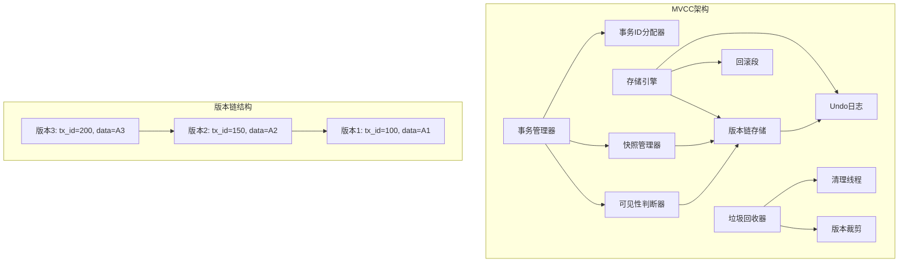

# MVCC多版本并发控制 专题文档

**文档版本**：v1.0
**创建时间**：2026年
**最后更新**：2026年
**状态**：🔄 编写中

---

## 📋 执行摘要

MVCC（Multi-Version Concurrency Control，多版本并发控制）是一种通过维护数据的多个版本来实现高并发事务处理的技术。它通过版本链管理、快照隔离和可见性判断机制，实现了读写互不阻塞，在保证事务隔离性的同时大幅提升系统并发性能。

---

## 一、核心概念

### 1.1 定义与原理

#### 什么是MVCC

MVCC是一种并发控制机制，核心思想是：

- **写操作**创建数据的新版本，不覆盖旧版本
- **读操作**根据事务的可见性规则读取合适的历史版本
- 读写操作互不阻塞，实现**读不阻塞写、写不阻塞读**

**核心优势**：

1. 高并发读写性能
2. 无读写锁冲突
3. 支持快照读（Snapshot Read）
4. 实现可重复读和读已提交隔离级别

#### MVCC基本原理

```
传统锁机制：
读 --[等待]--> 写
写 --[等待]--> 读
写 --[等待]--> 写

MVCC机制：
读 --[读取旧版本]--> 写（不等待）
写 --[创建新版本]--> 读（不等待）
写 --[版本控制]--> 写
```

### 1.2 关键特性

- **版本链管理**：每个数据行维护多个历史版本
- **事务ID管理**：全局递增的事务标识符
- **快照隔离**：事务开始时创建一致性快照
- **可见性判断**：基于事务ID判断数据版本可见性
- **垃圾回收**：定期清理过期版本数据

### 1.3 适用场景

| 场景 | 适用性 | 说明 |
|------|--------|------|
| 读多写少业务 | ⭐⭐⭐⭐⭐ | 读操作几乎无锁，性能最佳 |
| 高并发OLTP | ⭐⭐⭐⭐⭐ | 读写互不阻塞，吞吐量高 |
| 长事务处理 | ⭐⭐⭐⭐ | 快照读保证一致性视图 |
| 报表/分析查询 | ⭐⭐⭐⭐⭐ | 不阻塞业务写入 |
| 写密集型业务 | ⭐⭐⭐ | 版本管理带来额外开销 |
| 短事务高频写入 | ⭐⭐⭐⭐ | 配合垃圾回收机制效果较好 |

---

## 二、技术细节

### 2.1 架构设计



### 2.2 版本链管理

#### 版本链结构

每个数据行（Row）维护一个版本链，链上每个节点包含：

```c
struct RowVersion {
    TransactionId creator_xid;      // 创建此版本的事务ID
    TransactionId deleter_xid;      // 删除此版本的事务ID（0表示未删除）
    Timestamp create_time;          // 创建时间戳
    Timestamp expire_time;          // 过期时间戳
    RowData data;                   // 实际数据内容
    RowVersion* next_version;       // 指向旧版本的指针
    RollbackPointer undo_ptr;       // 指向undo日志
};
```

#### 版本链示例

```
初始状态：
Row A: [xid=100, data='Alice', next=null]

事务200更新：
Row A: [xid=200, data='Alice2', next] --> [xid=100, data='Alice', next=null]

事务300更新：
Row A: [xid=300, data='Alice3', next] --> [xid=200, data='Alice2', next] --> [xid=100, data='Alice']

版本链头始终是最新版本，通过next指针链接历史版本
```

#### 版本创建流程

```
UPDATE操作流程：
1. 获取当前最新版本
2. 创建新版本，xid设为当前事务ID
3. 新版本next指针指向原最新版本
4. 将原最新版本的deleter_xid设为当前事务ID
5. 新版本成为版本链头部
6. 写Undo日志（用于回滚）

DELETE操作流程：
1. 找到目标版本
2. 将deleter_xid设为当前事务ID
3. 写Undo日志

INSERT操作流程：
1. 创建新版本，xid设为当前事务ID
2. 新版本成为版本链头部（只有一个版本）
3. 写Undo日志
```

### 2.3 快照隔离

#### 快照（Snapshot）概念

快照是事务开始时整个数据库的一致性视图，由以下信息定义：

```c
struct Snapshot {
    TransactionId xmin;          // 所有小于xmin的事务已提交
    TransactionId xmax;          // 所有大于等于xmax的事务未启动
    TransactionId* xip;          // 活跃事务ID列表（xmin <= xid < xmax）
    uint32 xip_count;            // 活跃事务数量
    Timestamp snapshot_time;     // 快照创建时间
};
```

#### 快照创建流程

```
创建快照（事务开始时）：

1. 获取当前全局事务ID计数器值，设为xmax
2. 扫描活跃事务表，收集所有活跃事务ID
3. 活跃事务中最小的ID设为xmin
4. 活跃事务列表存入xip数组

示例：
全局当前xid = 200
活跃事务：{150, 180, 190}

则快照为：
xmin = 150（活跃事务中最小）
xmax = 200（下一个要分配的xid）
xip = {150, 180, 190}
```

#### 快照类型

| 快照类型 | 创建时机 | 使用场景 |
|----------|----------|----------|
| 语句级快照 | 每条语句开始时 | Read Committed级别 |
| 事务级快照 | 事务开始时 | Repeatable Read级别 |
| 导出快照 | 显式创建 | 逻辑备份、数据导出 |

### 2.4 可见性判断

#### 可见性判断规则

基于快照判断某个版本对当前事务是否可见：

```
给定：当前快照S(xmin, xmax, xip)，待判断版本V(creator_xid, deleter_xid)

可见性判断算法：

1. 如果 V.creator_xid == 当前事务ID
   → 可见（自己创建的）

2. 如果 V.creator_xid < S.xmin
   → 可见（创建者在快照前已提交）

3. 如果 V.creator_xid >= S.xmax
   → 不可见（创建者在快照后启动）

4. 如果 V.creator_xid 在 S.xip 中
   → 不可见（创建者在快照时仍活跃）

5. 否则（V.creator_xid在[xmin, xmax)但不在xip中）
   → 可见（创建者已提交）

6. 额外检查删除标记：
   如果 V.deleter_xid != 0 且满足上述可见条件
   → 检查删除者是否对当前事务可见
   → 如果删除者可见，则此版本不可见（已被删除）
```

#### 可见性判断流程图

```
开始
  ↓
检查creator_xid
  ↓
┌─────────────────────┐
│ creator_xid < xmin? │───是───→ 可见（已提交）
└─────────────────────┘
  ↓ 否
┌─────────────────────┐
│ creator_xid >= xmax?│───是───→ 不可见（未来事务）
└─────────────────────┘
  ↓ 否
┌─────────────────────────┐
│ creator_xid在xip中？    │───是───→ 不可见（活跃中）
└─────────────────────────┘
  ↓ 否
可见（已提交）
  ↓
检查deleter_xid
  ↓
┌─────────────────────┐
│ deleter_xid == 0?   │───是───→ 可见（未删除）
└─────────────────────┘
  ↓ 否
递归判断删除者是否可见
  ↓
删除者可见 → 不可见（已删除）
删除者不可见 → 可见（删除未生效）
```

#### 判断示例

```
场景：
- 事务100：已提交，创建了版本V1
- 事务150：活跃中，创建了版本V2
- 事务180：已提交，创建了版本V3
- 事务190：活跃中
- 事务200：当前事务，创建快照

快照：xmin=150, xmax=201, xip={150, 190}

判断各版本：
- V1 (creator=100): 100 < 150 → 可见 ✓
- V2 (creator=150): 150在xip中 → 不可见 ✗
- V3 (creator=180): 180在[150,201)且不在xip中 → 可见 ✓
```

### 2.5 隔离级别实现

#### Read Committed（读已提交）

```
实现方式：
- 每条SQL语句开始时获取新快照
- 只能看到语句开始前已提交的数据
- 可能出现不可重复读、幻读

特点：
- 同一条语句看到的数据是一致的
- 不同语句可能看到不同数据（其他事务已提交）
```

#### Repeatable Read（可重复读）

```
实现方式：
- 事务开始时获取快照，整个事务使用同一快照
- 只能看到事务开始前已提交的数据
- 防止不可重复读
- 需要额外机制防止幻读（如间隙锁或索引机制）

特点：
- 事务内多次读取同一数据，结果一致
- PostgreSQL的RR级别实际上实现了SI（Snapshot Isolation）
```

#### Snapshot Isolation（快照隔离）

```
特性：
- 基于快照的并发控制
- 写不阻塞读，读不阻塞写
- 防止脏读、不可重复读、幻读
- 可能出现写倾斜（Write Skew）

写冲突检测：
- 事务提交时检查是否有其他事务修改了相同数据
- 发现冲突时回滚（First-Committer-Wins规则）
```

### 2.6 垃圾回收

#### 为什么需要垃圾回收

```
问题：
- 不断更新会产生大量历史版本
- 历史版本占用存储空间
- 影响查询性能（需要遍历长版本链）

目标：
- 清理不再被任何事务需要的历史版本
- 回收Undo日志空间
- 控制版本链长度
```

#### 垃圾回收策略

| 策略 | 描述 | 优点 | 缺点 |
|------|------|------|------|
| 基于时间戳 | 清理超过一定时间的历史版本 | 简单高效 | 可能清理正在被使用的版本 |
| 基于快照 | 清理所有活跃事务快照之前的版本 | 安全准确 | 长事务阻塞回收 |
| 基于引用计数 | 版本被引用时不清理 | 精确控制 | 实现复杂，开销大 |

#### 典型的垃圾回收流程

```
Vacuum/清理流程：

1. 获取当前所有活跃事务的最小xid（global_xmin）
2. 遍历所有数据页：
   a. 对每个版本链：
      - 如果版本的creator_xid < global_xmin
        且deleter_xid < global_xmin
        → 此版本可以被清理
   b. 将可清理版本标记为可重用空间
3. 清理对应的Undo日志
4. 更新统计信息

优化策略：
- 后台进程定期执行（如PostgreSQL的autovacuum）
- 增量清理，避免单次大量IO
- 优先级队列，优先清理热点表
```

#### 垃圾回收触发条件

```
触发条件：
1. 时间触发：固定间隔执行（如5分钟）
2. 阈值触发：死行数超过阈值
3. 空间触发：表膨胀率超过阈值
4. 手动触发：DBA执行VACUUM命令

防止回收风暴：
- 限制单次回收的数据量
- 使用睡眠间隔平滑IO
- 根据系统负载动态调整
```

---

## 三、系统对比

### 3.1 主流数据库MVCC实现对比

| 维度 | PostgreSQL | MySQL InnoDB | Oracle | SQL Server |
|------|------------|--------------|--------|------------|
| **版本存储** | 表空间（元组版本） | Undo日志 | Undo表空间 | TempDB |
| **事务ID** | 32位循环使用 | 隐藏字段 | SCN（系统变更号） | XSN |
| **快照实现** | 活跃事务列表 | Read View | SCN比较 | 行版本存储 |
| **垃圾回收** | Vacuum进程 | Purge线程 | 自动管理 | 版本清理器 |
| **回滚机制** | 版本链遍历 | Undo日志应用 | Undo应用 | 行版本回退 |
| **索引处理** | 索引指向所有版本 | 逻辑删除标记 | 索引独立管理 | 行版本指针 |

### 3.2 MVCC vs 锁机制对比

| 特性 | MVCC | 锁机制（2PL） |
|------|------|---------------|
| **读写冲突** | 读不阻塞写 | 读阻塞写 |
| **写写冲突** | 检测冲突回滚 | 锁等待 |
| **一致性** | 快照一致性 | 串行化一致性 |
| **性能** | 读性能高 | 写性能稳定 |
| **死锁** | 较少（写冲突回滚） | 可能发生 |
| **幻读** | 需要额外处理 | 间隙锁防止 |
| **存储开销** | 版本存储 | 锁管理器开销 |

### 3.3 性能基准

| 指标 | 纯锁机制 | MVCC | 说明 |
|------|---------|------|------|
| 读吞吐量（无写） | 100K TPS | 100K TPS | 相近 |
| 读吞吐量（有写） | 20K TPS | 80K TPS | MVCC优势明显 |
| 写吞吐量 | 30K TPS | 25K TPS | 锁机制略优 |
| 存储增长（100万更新） | 1GB | 3-5GB | MVCC版本开销 |
| 查询延迟（短查询） | 1ms | 1.2ms | MVCC判断开销 |
| 长事务性能 | 阻塞增加 | 稳定 | MVCC适合长事务 |

---

## 四、实践指南

### 4.1 PostgreSQL MVCC配置

```sql
-- 配置Vacuum行为
ALTER SYSTEM SET autovacuum = on;
ALTER SYSTEM SET autovacuum_vacuum_scale_factor = 0.1;  -- 10%变化时触发
ALTER SYSTEM SET autovacuum_vacuum_threshold = 50;      -- 最小50行
ALTER SYSTEM SET autovacuum_analyze_scale_factor = 0.05;

-- 事务ID相关配置
ALTER SYSTEM SET vacuum_freeze_min_age = 50000000;      -- 冻结阈值
ALTER SYSTEM SET vacuum_freeze_table_age = 150000000;   -- 强制冻结阈值

-- 针对大表的单独配置
ALTER TABLE big_table SET (autovacuum_vacuum_scale_factor = 0.01);
ALTER TABLE big_table SET (autovacuum_vacuum_cost_limit = 1000);
```

### 4.2 MySQL InnoDB MVCC配置

```ini
[mysqld]
# Undo表空间配置
innodb_undo_tablespaces = 4
innodb_undo_logs = 128
innodb_undo_purge_threads = 4

# Purge配置
innodb_purge_batch_size = 300
innodb_purge_threads = 4

# Read View优化
innodb_read_view_refresh_rate = 1000
```

### 4.3 最佳实践

1. **避免长事务**

   ```sql
   -- 设置事务超时
   SET statement_timeout = '30s';

   -- 及时提交/回滚
   BEGIN;
   -- 业务操作
   COMMIT;  -- 不要长时间保持事务打开
   ```

2. **定期监控表膨胀**

   ```sql
   -- PostgreSQL检查表膨胀
   SELECT schemaname, tablename,
          pg_size_pretty(pg_total_relation_size(schemaname||'.'||tablename)) as size,
          n_dead_tup
   FROM pg_stat_user_tables
   WHERE n_dead_tup > 10000
   ORDER BY n_dead_tup DESC;
   ```

3. **合理设置隔离级别**
   - 读多写少：使用Repeatable Read
   - 写密集型：使用Read Committed
   - 强一致性要求：使用Serializable（注意性能）

4. **索引优化**
   - 避免过多索引（更新时维护成本）
   - 定期重建膨胀的索引
   - 使用部分索引减少维护开销

### 4.4 常见问题

**Q1: MVCC如何解决幻读？**

A: 不同数据库有不同实现：

- PostgreSQL：RR级别通过快照+谓词锁部分解决
- MySQL：RR级别使用Next-Key Lock（行锁+间隙锁）
- 纯MVCC无法完全防止幻读，需要锁配合

**Q2: 事务ID回绕（Wraparound）是什么？如何处理？**

A: 32位事务ID会用完并回绕，可能导致可见性判断错误。
处理方式：

- PostgreSQL：冻结旧元组，将xid重置为FrozenXID
- 定期执行VACUUM FREEZE
- 监控年龄：SELECT datname, age(datfrozenxid) FROM pg_database;

**Q3: 为什么MVCC表会膨胀？如何控制？**

A: 膨胀原因：

- 更新和删除产生死行
- 长事务阻止垃圾回收

控制方法：

- 及时提交事务
- 调整autovacuum参数
- 对频繁更新的表单独配置
- 定期手动VACUUM FULL（注意锁表）

---

## 五、形式化分析

### 5.1 理论模型

MVCC可以形式化为一个多版本数据库系统：

```
定义：
- D：数据库状态，是键到版本集合的映射
- V = (v, ts_b, ts_e, tid)：版本v，开始时间ts_b，结束时间ts_e，创建事务tid
- T = (tid, ts_s, ts_c)：事务tid，开始时间戳ts_s，提交时间戳ts_c

读操作：
Read(key, T) = max{v | (v, ts_b, ts_e, tid) ∈ D[key]
                   ∧ ts_b ≤ ts_s(T)
                   ∧ (ts_e > ts_s(T) ∨ ts_e = ∞)}

写操作：
Write(key, v, T)：创建新版本(v, ts_s(T), ∞, tid(T))
                 并将旧版本的ts_e设为ts_s(T)

提交操作：
Commit(T)：设置ts_c(T) = 当前时间戳
```

### 5.2 正确性分析

**定理**：基于快照的MVCC实现了可串行化（Snapshot Isolation）。

**证明概要**：

1. 每个事务看到一致性快照（所有开始时间≤ts_s(T)的已提交事务的写入）
2. 事务执行等价于在时间戳ts_s(T)的串行执行
3. First-Committer-Wins规则保证写-写冲突的可串行化

### 5.3 复杂度分析

| 操作 | 时间复杂度 | 空间复杂度 |
|------|-----------|-----------|
| 读 | O(k)，k为版本链长度 | O(1) |
| 写 | O(1)（创建新版本） | O(版本大小) |
| 快照创建 | O(m)，m为活跃事务数 | O(m) |
| 垃圾回收 | O(n×k)，n为数据页数 | O(1) |

---

## 六、与其他主题的关联

### 6.1 上游依赖

- [ACID特性](../01-fundamentals/ACID特性.md)
- [事务隔离级别](../01-fundamentals/事务隔离级别.md)
- [数据库索引](../05-storage/数据库索引.md)

### 6.2 下游应用

- [分布式事务](./分布式事务选型.md)
- [数据库性能优化](../05-storage/性能优化.md)
- [长事务管理](./长事务处理.md)

### 6.3 相关概念

| 概念 | 关系 | 说明 |
|------|------|------|
| 2PL（两阶段锁） | 对比 | 传统并发控制方式 |
| OCC（乐观并发控制） | 相似 | 都是无锁并发控制 |
| LSM-Tree | 结合 | 常用于LSM存储引擎 |
| HTAP | 应用 | MVCC支持实时分析 |

---

## 七、参考资源

### 7.1 学术论文

1. [A Critique of ANSI SQL Isolation Levels](https://dl.acm.org/doi/10.1145/568271.223784) - Berenson et al., 1995
2. [Serializable Isolation for Snapshot Databases](https://dl.acm.org/doi/10.14778/1687627.1687644) - Cahill et al., 2009
3. [Efficient Optimistic Concurrency Control Using Loosely Synchronized Clocks](https://dl.acm.org/doi/10.1145/191839.191861) - Adya et al., 1995

### 7.2 开源项目

1. [PostgreSQL](https://www.postgresql.org/) - 经典MVCC实现
2. [MySQL InnoDB](https://dev.mysql.com/doc/refman/8.0/en/innodb-multi-versioning.html) - 商业级MVCC
3. [CockroachDB](https://www.cockroachlabs.com/) - 分布式MVCC

### 7.3 学习资料

1. [PostgreSQL Internals](https://www.interdb.jp/pg/) - 第5章MVCC详解
2. [MySQL技术内幕：InnoDB存储引擎](https://book.douban.com/) - 第7章
3. [数据库系统概念](https://www.db-book.com/) - 第18章并发控制

### 7.4 相关文档

- [2PC与3PC](./2PC与3PC.md)
- [分布式事务选型](./分布式事务选型.md)
- [数据库性能优化](../05-storage/性能优化.md)

---

**维护者**：项目团队
**最后更新**：2026年
