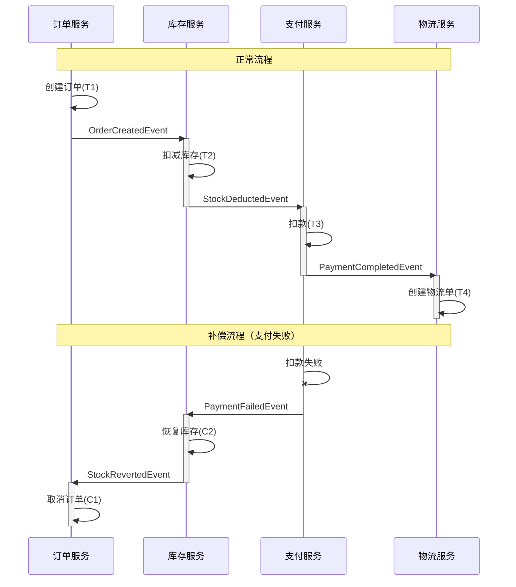
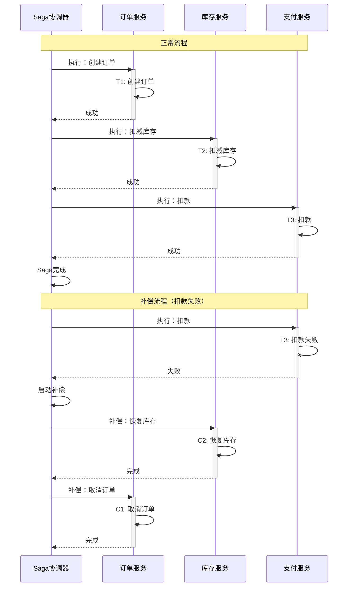
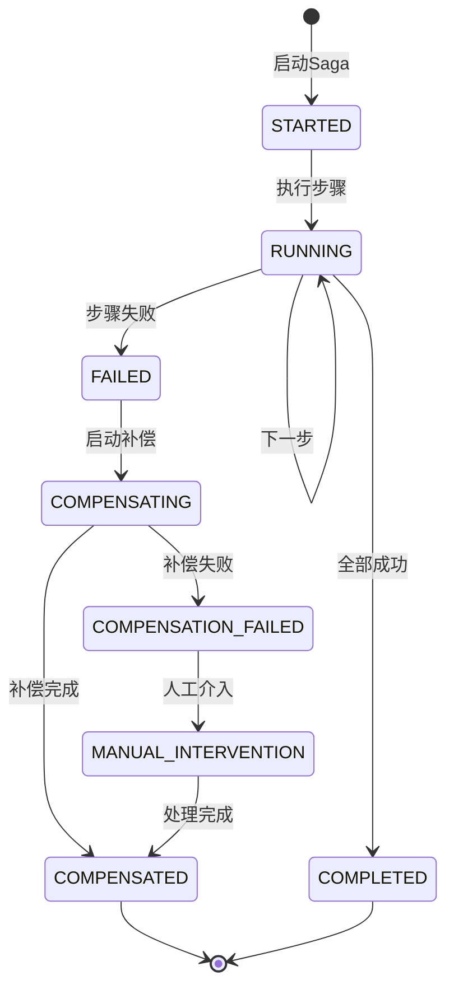

# Saga模式详解

**文档版本**：v1.0
**创建时间**：2026年
**最后更新**：2026年
**状态**：✅ 已完成

---

## 📋 执行摘要

Saga模式是一种长事务解决方案，将一个大事务拆分为一系列本地事务，每个本地事务提交后立即释放资源，失败时通过补偿事务回滚。Saga适用于业务流程长、跨多个服务的场景，支持编排（Choreography）和协调（Orchestration）两种实现方式。

---

## 一、核心概念

### 1.1 Saga基本原理

```
正常流程：
T1 → T2 → T3 → T4 → ... → Tn
└─► 每个Ti是独立本地事务，执行后立即提交

失败补偿：
T1 → T2 → T3 (失败)
           ↓
        C2 → C1  (逆序执行补偿)
        └─► Ci补偿Ti的操作
```

### 1.2 两种实现方式

| 方式 | 描述 | 优点 | 缺点 |
|------|------|------|------|
| **编排(Choreography)** | 各服务通过事件驱动协作 | 松耦合、扩展性好 | 流程分散、难以追踪 |
| **协调(Orchestration)** | 中央协调器统一调度 | 流程集中、易于监控 | 协调器单点、耦合度较高 |

---

## 二、时序图

### 2.1 编排式Saga



### 2.2 协调式Saga



---

## 三、Java实现示例

### 3.1 协调式Saga实现

```java
/**
 * Saga协调器
 */
@Component
public class SagaOrchestrator {

    @Autowired
    private SagaDefinitionRepository definitionRepo;
    @Autowired
    private SagaInstanceRepository instanceRepo;

    /**
     * 启动Saga事务
     */
    public SagaInstance startSaga(String sagaType, SagaContext context) {
        SagaDefinition definition = definitionRepo.findByType(sagaType);
        SagaInstance instance = new SagaInstance();
        instance.setSagaId(UUID.randomUUID().toString());
        instance.setDefinition(definition);
        instance.setStatus(SagaStatus.STARTED);
        instance.setCurrentStep(0);
        instance.setContext(context);

        instanceRepo.save(instance);

        // 异步执行
        executeNextStep(instance);

        return instance;
    }

    /**
     * 执行下一步
     */
    @Async
    protected void executeNextStep(SagaInstance instance) {
        SagaDefinition definition = instance.getDefinition();
        int currentStep = instance.getCurrentStep();

        if (currentStep >= definition.getSteps().size()) {
            // Saga完成
            instance.setStatus(SagaStatus.COMPLETED);
            instanceRepo.save(instance);
            return;
        }

        SagaStep step = definition.getSteps().get(currentStep);

        try {
            // 执行正向操作
            StepResult result = executeStep(step, instance.getContext());

            if (result.isSuccess()) {
                // 记录成功，继续下一步
                instance.setCurrentStep(currentStep + 1);
                instanceRepo.save(instance);
                executeNextStep(instance);
            } else {
                // 执行失败，启动补偿
                startCompensation(instance, currentStep - 1);
            }
        } catch (Exception e) {
            // 异常，启动补偿
            startCompensation(instance, currentStep - 1);
        }
    }

    /**
     * 启动补偿
     */
    protected void startCompensation(SagaInstance instance, int lastCompletedStep) {
        instance.setStatus(SagaStatus.COMPENSATING);
        instanceRepo.save(instance);

        SagaDefinition definition = instance.getDefinition();

        // 逆序执行补偿
        for (int i = lastCompletedStep; i >= 0; i--) {
            SagaStep step = definition.getSteps().get(i);

            if (step.getCompensation() != null) {
                try {
                    executeCompensation(step, instance.getContext());
                } catch (Exception e) {
                    // 补偿失败，记录待人工处理
                    recordCompensationFailure(instance, step, e);
                }
            }
        }

        instance.setStatus(SagaStatus.COMPENSATED);
        instanceRepo.save(instance);
    }

    private StepResult executeStep(SagaStep step, SagaContext context) {
        SagaAction action = SagaActionFactory.getAction(step.getAction());
        return action.execute(context);
    }

    private void executeCompensation(SagaStep step, SagaContext context) {
        SagaAction compensation = SagaActionFactory.getAction(step.getCompensation());
        compensation.execute(context);
    }
}

/**
 * Saga步骤定义
 */
@Data
public class SagaStep {
    private String name;
    private String action;           // 正向操作
    private String compensation;     // 补偿操作
    private int retryCount = 3;      // 重试次数
    private long timeout = 30000;    // 超时时间(ms)
}

/**
 * 订单创建Saga示例
 */
@Component
public class OrderCreationSaga {

    @Autowired
    private SagaOrchestrator orchestrator;

    public SagaInstance createOrder(OrderRequest request) {
        SagaContext context = new SagaContext();
        context.set("orderId", request.getOrderId());
        context.set("userId", request.getUserId());
        context.set("skuId", request.getSkuId());
        context.set("count", request.getCount());
        context.set("amount", request.getAmount());

        return orchestrator.startSaga("ORDER_CREATION", context);
    }
}

/**
 * 扣减库存Action
 */
@Component("deductInventory")
public class DeductInventoryAction implements SagaAction {

    @Autowired
    private InventoryService inventoryService;

    @Override
    public StepResult execute(SagaContext context) {
        String skuId = context.getString("skuId");
        int count = context.getInt("count");

        boolean success = inventoryService.deduct(skuId, count);
        return success ? StepResult.success() : StepResult.failure("库存不足");
    }
}

/**
 * 恢复库存补偿Action
 */
@Component("restoreInventory")
public class RestoreInventoryAction implements SagaAction {

    @Autowired
    private InventoryService inventoryService;

    @Override
    public StepResult execute(SagaContext context) {
        String skuId = context.getString("skuId");
        int count = context.getInt("count");

        inventoryService.restore(skuId, count);
        return StepResult.success();
    }
}
```

### 3.2 编排式Saga实现

```java
/**
 * 事件驱动的Saga
 */
@Component
public class ChoreographySagaHandler {

    @Autowired
    private EventPublisher eventPublisher;

    /**
     * 订单创建事件处理
     */
    @EventListener
    public void onOrderCreated(OrderCreatedEvent event) {
        // 扣减库存
        boolean success = inventoryService.deduct(event.getSkuId(), event.getCount());

        if (success) {
            eventPublisher.publish(new StockDeductedEvent(
                event.getOrderId(),
                event.getSkuId(),
                event.getCount()
            ));
        } else {
            eventPublisher.publish(new InventoryShortageEvent(event.getOrderId()));
        }
    }

    /**
     * 库存扣减成功事件处理
     */
    @EventListener
    public void onStockDeducted(StockDeductedEvent event) {
        // 执行支付
        PaymentResult result = paymentService.charge(event.getOrderId());

        if (result.isSuccess()) {
            eventPublisher.publish(new PaymentCompletedEvent(event.getOrderId()));
        } else {
            eventPublisher.publish(new PaymentFailedEvent(event.getOrderId()));
        }
    }

    /**
     * 支付失败补偿
     */
    @EventListener
    public void onPaymentFailed(PaymentFailedEvent event) {
        // 恢复库存
        inventoryService.restoreByOrderId(event.getOrderId());
        // 取消订单
        orderService.cancel(event.getOrderId());
    }
}
```

---

## 四、状态机模型



---

## 五、Saga设计原则

1. **补偿必须可执行**：每个正向操作都要有对应的补偿操作
2. **补偿必须幂等**：补偿操作可能被多次执行
3. **补偿顺序**：逆序执行补偿，先执行的后补偿
4. **可监控性**：Saga状态需要可查询、可追踪

---

**维护者**：项目团队
**最后更新**：2026-04-03
