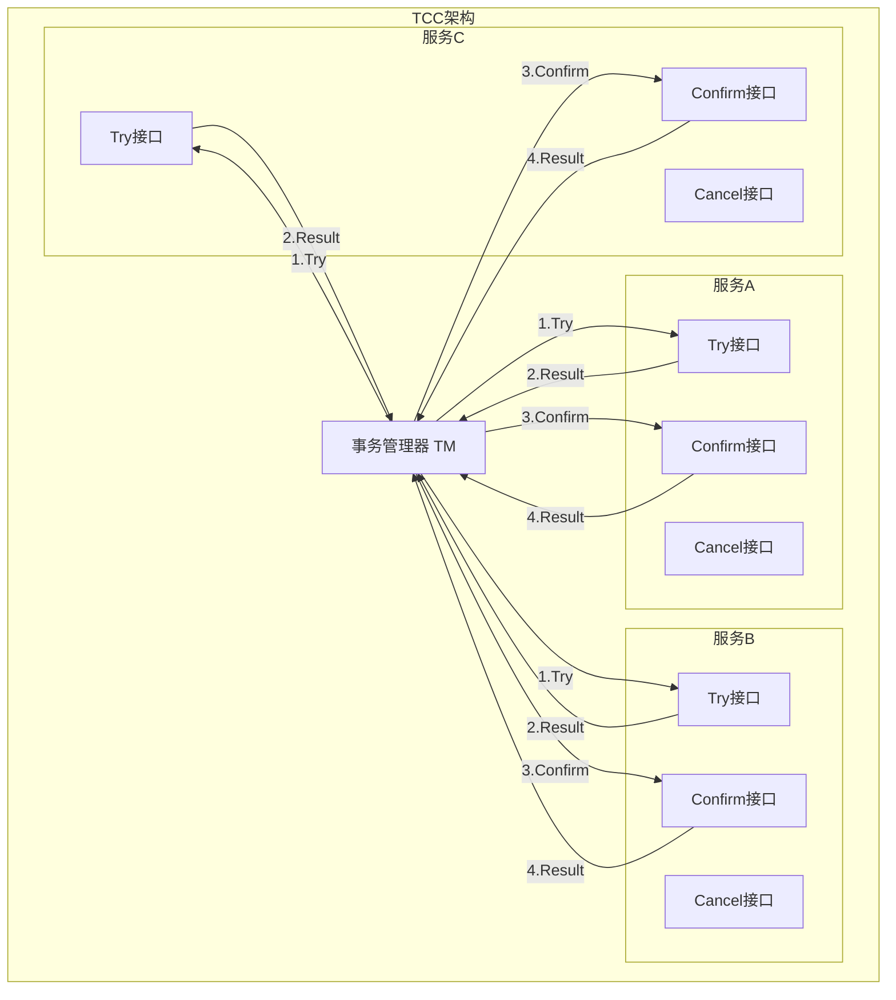

# TCC事务模式 专题文档

**文档版本**：v1.0
**创建时间**：2026年
**最后更新**：2026年
**状态**：🔄 编写中

---

## 📋 执行摘要

TCC（Try-Confirm-Cancel）是一种业务层面的分布式事务模式，通过将业务操作拆分为预留资源（Try）、确认执行（Confirm）和取消回滚（Cancel）三个阶段，实现了柔性事务。
TCC适用于对一致性要求高、业务逻辑复杂的场景，通过业务补偿保证最终一致性。

---

## 一、核心概念

### 1.1 定义与原理

#### 什么是TCC

TCC（Try-Confirm-Cancel）是一种**业务层**的分布式事务解决方案，核心思想是：

- **Try阶段**：预留业务资源，执行业务检查，但不真正执行业务
- **Confirm阶段**：真正执行业务，使用Try阶段预留的资源
- **Cancel阶段**：取消预留，释放资源，回滚业务

**核心特点**：

1. 业务侵入性强，需要业务系统实现三个接口
2. 无全局锁，性能好
3. 最终一致性，不是强一致性
4. 适合长事务、跨服务场景

#### TCC执行流程

```
成功场景：
Try(A) ──► Try(B) ──► Try(C) ──► Confirm(A) ──► Confirm(B) ──► Confirm(C)
    ✓         ✓         ✓            ✓              ✓              ✓

失败场景（Try阶段B失败）：
Try(A) ──► Try(B) ──► Cancel(A)
    ✓         ✗

失败场景（Confirm阶段B失败）：
Try(A) ──► Try(B) ──► Try(C) ──► Confirm(A) ──► Confirm(B) ──► Retry.../Cancel
    ✓         ✓         ✓            ✓              ✗
```

### 1.2 关键特性

- **业务侵入性**：需要业务系统改造，实现Try/Confirm/Cancel三个接口
- **无全局锁**：各阶段独立执行，无需长时间持有锁
- **异步执行**：Confirm/Cancel可以异步执行
- **幂等性要求**：Confirm/Cancel必须支持幂等调用
- **可见性控制**：Try阶段数据对业务不可见，避免脏读

### 1.3 适用场景

| 场景 | 适用性 | 说明 |
|------|--------|------|
| 电商订单（库存+支付+物流） | ⭐⭐⭐⭐⭐ | 典型TCC场景 |
| 金融转账（冻结+扣款+入账） | ⭐⭐⭐⭐⭐ | 资金操作适合预留模式 |
| 优惠券发放 | ⭐⭐⭐⭐⭐ | 先预占，成功后发放 |
| 积分扣减 | ⭐⭐⭐⭐⭐ | 预扣模式 |
| 简单的CRUD操作 | ⭐⭐ | 改造成本高，性价比低 |
| 强一致性要求场景 | ⭐⭐ | TCC是最终一致性 |

---

## 二、技术细节

### 2.1 架构设计



### 2.2 三阶段详细流程

#### Try阶段

**职责**：

- 完成业务检查（一致性）
- 预留必要的业务资源（准隔离性）
- 执行业务操作（但不提交）

**示例：电商下单减库存**

```java
// Try接口实现
public boolean tryDeductStock(String orderId, String skuId, int count) {
    // 1. 检查库存是否足够
    Stock stock = stockDao.get(skuId);
    if (stock.getAvailable() < count) {
        return false; // 库存不足
    }

    // 2. 检查是否已经执行过Try（幂等性检查）
    if (stockLogDao.exists(orderId)) {
        return true; // 已经执行过，直接返回成功
    }

    // 3. 预占库存（实际库存不变，冻结库存增加）
    stockDao.freezeStock(skuId, count);

    // 4. 记录操作日志（用于Confirm/Cancel查找）
    stockLogDao.insert(new StockLog(orderId, skuId, count, "TRY"));

    return true;
}
```

**Try阶段数据状态**：

| 字段 | 变化前 | Try后 | 说明 |
|------|--------|-------|------|
| 总库存 | 100 | 100 | 不变 |
| 可用库存 | 100 | 90 | 减少 |
| 冻结库存 | 0 | 10 | 增加 |
| 已售库存 | 0 | 0 | 不变 |

#### Confirm阶段

**职责**：

- 真正执行业务
- 使用Try阶段预留的资源
- 幂等性保证

**示例**：

```java
// Confirm接口实现
public boolean confirmDeductStock(String orderId) {
    // 1. 幂等性检查：是否已经Confirm过
    StockLog log = stockLogDao.get(orderId);
    if (log == null || "CONFIRMED".equals(log.getStatus())) {
        return true; // 已经处理过
    }
    if (!"TRY".equals(log.getStatus())) {
        return false; // 状态异常
    }

    // 2. 真正扣减库存
    // 冻结库存 -> 已售库存
    stockDao.confirmDeduct(log.getSkuId(), log.getCount());

    // 3. 更新日志状态
    stockLogDao.updateStatus(orderId, "CONFIRMED");

    return true;
}
```

**Confirm阶段数据状态**：

| 字段 | Try后 | Confirm后 | 说明 |
|------|-------|-----------|------|
| 总库存 | 100 | 100 | 不变 |
| 可用库存 | 90 | 90 | 不变 |
| 冻结库存 | 10 | 0 | 释放 |
| 已售库存 | 0 | 10 | 增加 |

#### Cancel阶段

**职责**：

- 释放Try阶段预留的资源
- 回滚业务操作
- 幂等性保证

**示例**：

```java
// Cancel接口实现
public boolean cancelDeductStock(String orderId) {
    // 1. 幂等性检查
    StockLog log = stockLogDao.get(orderId);
    if (log == null || "CANCELLED".equals(log.getStatus())) {
        return true; // 已经处理过或未执行Try
    }

    // 2. 释放冻结库存
    stockDao.unfreezeStock(log.getSkuId(), log.getCount());

    // 3. 更新日志状态
    stockLogDao.updateStatus(orderId, "CANCELLED");

    return true;
}
```

**Cancel阶段数据状态**：

| 字段 | Try后 | Cancel后 | 说明 |
|------|-------|----------|------|
| 总库存 | 100 | 100 | 不变 |
| 可用库存 | 90 | 100 | 恢复 |
| 冻结库存 | 10 | 0 | 释放 |
| 已售库存 | 0 | 0 | 不变 |

### 2.3 业务补偿设计

#### 补偿的核心思想

```
正向流程：A → B → C
补偿流程：如果C失败，需要撤销A和B的影响

补偿与回滚的区别：
- 回滚：使用数据库事务的原子性，自动撤销
- 补偿：使用业务逻辑，显式撤销已完成的操作
```

#### 补偿设计原则

1. **业务语义补偿**

   ```
   正向操作：扣减库存
   补偿操作：增加库存（不是简单的回滚数据库事务）

   正向操作：扣减余额
   补偿操作：增加余额

   正向操作：发送优惠券
   补偿操作：作废优惠券（不是删除记录）
   ```

2. **补偿的幂等性**

   ```java
   // 补偿操作必须能重复执行而不产生副作用
   public boolean compensate(Order order) {
       // 1. 检查是否已补偿
       if (order.isCompensated()) {
           return true; // 幂等返回
       }

       // 2. 执行补偿
       // ...

       // 3. 标记已补偿
       order.markCompensated();
       return true;
   }
   ```

3. **补偿的次序**

   ```
   执行顺序：A → B → C
   补偿顺序：C.Cancel → B.Cancel → A.Cancel（逆序）

   原因：保持业务逻辑的一致性
   示例：先创建订单再扣库存，回滚时先释放库存再取消订单
   ```

### 2.4 幂等性保证

#### 为什么需要幂等性

```
场景：
1. 网络超时导致Confirm请求重发
2. 事务管理器重试机制
3. 服务重启后的恢复操作

结果：同一个操作可能被调用多次
解决方案：所有Confirm/Cancel操作必须幂等
```

#### 幂等性实现方案

| 方案 | 适用场景 | 实现方式 |
|------|----------|----------|
| 数据库唯一约束 | 插入操作 | 使用业务ID作为主键或唯一索引 |
| 状态机检查 | 更新操作 | 检查当前状态，已处理则直接返回 |
| Token机制 | 通用场景 | 调用前申请token，处理时校验 |
| 分布式锁 | 临界区操作 | 使用Redis/ZK分布式锁 |

**状态机实现示例**：

```java
public enum TccStatus {
    INIT,        // 初始状态
    TRYING,      // Try阶段执行中
    TRIED,       // Try阶段成功
    CONFIRMING,  // Confirm阶段执行中
    CONFIRMED,   // Confirm成功（终态）
    CANCELLING,  // Cancel阶段执行中
    CANCELLED    // Cancel成功（终态）
}

public boolean confirm(String xid) {
    TccRecord record = tccDao.get(xid);

    // 幂等性检查
    if (record.getStatus() == CONFIRMED) {
        return true; // 已经处理过
    }

    // 状态合法性检查
    if (record.getStatus() != TRIED) {
        throw new IllegalStateException("Invalid status: " + record.getStatus());
    }

    // 更新状态并执行Confirm
    record.setStatus(CONFIRMING);
    tccDao.update(record);

    try {
        doConfirm(record);
        record.setStatus(CONFIRMED);
        tccDao.update(record);
        return true;
    } catch (Exception e) {
        record.setStatus(TRIED); // 恢复状态，允许重试
        tccDao.update(record);
        throw e;
    }
}
```

---

## 三、系统对比

### 3.1 TCC vs Saga对比

| 维度 | TCC | Saga |
|------|-----|------|
| **阶段设计** | Try-Confirm-Cancel（3阶段） | 正常事务+补偿事务（2阶段） |
| **业务侵入性** | 高（需改造3个接口） | 中（需改造补偿接口） |
| **资源预留** | 是（Try阶段预留） | 否（直接执行业务） |
| **隔离性** | 较好（预隔离） | 弱（业务可见） |
| **实现复杂度** | 高 | 中 |
| **性能** | 高（无全局锁） | 高（无全局锁） |
| **一致性** | 最终一致性 | 最终一致性 |
| **回滚能力** | 强（资源已预留） | 取决于补偿实现 |
| **适用场景** | 金融、库存等需要预留 | 长事务、业务流程 |

**决策建议**：

```
选择TCC：
- 需要预留资源（如库存、余额）
- 业务可以接受改造成本
- 对隔离性有一定要求

选择Saga：
- 业务流程长，步骤多
- 不希望业务侵入太多
- 可以接受较弱的隔离性
```

### 3.2 TCC vs 2PC对比

| 维度 | TCC | 2PC |
|------|-----|-----|
| **实现层级** | 业务层 | 资源层/数据库层 |
| **锁定方式** | 业务预留 | 数据库锁 |
| **阻塞性** | 非阻塞 | 阻塞（协调者故障） |
| **一致性** | 最终一致性 | 强一致性 |
| **性能** | 高 | 较低（锁竞争） |
| **回滚能力** | 业务补偿 | 数据库回滚 |
| **分布式事务时长** | 短（异步Confirm） | 长（持有锁） |
| **适用场景** | 微服务、长事务 | 短事务、强一致 |

### 3.3 主流TCC框架对比

| 框架 | 来源 | 特点 | 活跃程度 |
|------|------|------|----------|
| **Seata TCC** | 阿里巴巴 | 功能完善，生态好 | ⭐⭐⭐⭐⭐ |
| **ByteTCC** | 个人开源 | 轻量级，易集成 | ⭐⭐⭐ |
| **TCC-Transaction** | 个人开源 | 较早实现，参考性强 | ⭐⭐ |
| **Hmily** | Dromara社区 | 支持多种模式 | ⭐⭐⭐⭐ |
| **EasyTransaction** | 个人开源 | 功能全面 | ⭐⭐⭐ |

---

## 四、实践指南

### 4.1 Seata TCC配置

```java
// 1. 定义TCC接口
@LocalTCC
public interface InventoryService {

    @TwoPhaseBusinessAction(name = "deductInventory",
                           commitMethod = "commit",
                           rollbackMethod = "rollback")
    boolean tryDeduct(@BusinessActionContextParameter(paramName = "skuId") String skuId,
                      @BusinessActionContextParameter(paramName = "count") int count);

    boolean commit(BusinessActionContext context);

    boolean rollback(BusinessActionContext context);
}

// 2. 实现TCC接口
@Service
public class InventoryServiceImpl implements InventoryService {

    @Autowired
    private StockDao stockDao;

    @Override
    public boolean tryDeduct(String skuId, int count) {
        // Try逻辑：预占库存
        return stockDao.freezeStock(skuId, count) > 0;
    }

    @Override
    public boolean commit(BusinessActionContext context) {
        String skuId = context.getActionContext("skuId");
        int count = Integer.parseInt(context.getActionContext("count"));
        String xid = context.getXid();

        // Confirm逻辑：确认扣减
        return stockDao.confirmDeduct(skuId, count, xid) > 0;
    }

    @Override
    public boolean rollback(BusinessActionContext context) {
        String skuId = context.getActionContext("skuId");
        int count = Integer.parseInt(context.getActionContext("count"));
        String xid = context.getXid();

        // Cancel逻辑：释放库存
        return stockDao.unfreezeStock(skuId, count, xid) > 0;
    }
}

// 3. 业务代码中使用
@Service
public class OrderService {

    @Autowired
    private InventoryService inventoryService;

    @GlobalTransactional(name = "create-order", rollbackFor = Exception.class)
    public Order createOrder(OrderRequest request) {
        // 1. 创建订单
        Order order = orderDao.insert(request);

        // 2. 预占库存（TCC Try）
        boolean success = inventoryService.tryDeduct(
            request.getSkuId(),
            request.getCount()
        );
        if (!success) {
            throw new BusinessException("库存不足");
        }

        // 3. 扣减余额（另一个TCC分支）
        // ...

        return order;
        // 方法返回后，Seata自动调用各分支的Confirm
        // 异常时自动调用各分支的Rollback
    }
}
```

### 4.2 数据表设计

```sql
-- TCC事务记录表（框架维护）
CREATE TABLE tcc_transaction (
    xid VARCHAR(128) PRIMARY KEY COMMENT '全局事务ID',
    branch_id BIGINT COMMENT '分支事务ID',
    status TINYINT COMMENT '状态：1-TRYING, 2-CONFIRMING, 3-CANCELLING',
    action_name VARCHAR(64) COMMENT 'TCC方法名',
    context JSON COMMENT '业务上下文',
    gmt_create DATETIME COMMENT '创建时间',
    gmt_modified DATETIME COMMENT '修改时间',
    INDEX idx_status_gmt (status, gmt_modified)
) COMMENT='TCC事务记录';

-- 库存表（业务表）
CREATE TABLE stock (
    sku_id VARCHAR(64) PRIMARY KEY,
    total_stock INT NOT NULL DEFAULT 0 COMMENT '总库存',
    available_stock INT NOT NULL DEFAULT 0 COMMENT '可用库存',
    frozen_stock INT NOT NULL DEFAULT 0 COMMENT '冻结库存',
    sold_stock INT NOT NULL DEFAULT 0 COMMENT '已售库存',
    version INT NOT NULL DEFAULT 0 COMMENT '乐观锁版本号',
    gmt_modified DATETIME
) COMMENT='库存表';

-- 库存操作日志表（幂等性和状态机用）
CREATE TABLE stock_tcc_log (
    id BIGINT PRIMARY KEY AUTO_INCREMENT,
    xid VARCHAR(128) NOT NULL,
    sku_id VARCHAR(64) NOT NULL,
    count INT NOT NULL,
    status VARCHAR(16) NOT NULL COMMENT 'INIT/TRYING/TRIED/CONFIRMED/CANCELLED',
    gmt_create DATETIME,
    gmt_modified DATETIME,
    UNIQUE KEY uk_xid (xid),
    INDEX idx_status_gmt (status, gmt_modified)
) COMMENT='库存TCC操作日志';
```

### 4.3 最佳实践

1. **Try阶段设计**

   ```java
   // 好的实践：
   // 1. 业务检查前置
   // 2. 资源预留原子化
   // 3. 记录操作日志
   // 4. 处理幂等性

   public boolean tryDeduct(StockRequest request) {
       // 业务检查
       if (!checkBusiness(request)) {
           return false;
       }

       // 幂等检查
       if (isDuplicate(request.getXid())) {
           return true;
       }

       // 预留资源（使用本地事务）
       return transactionTemplate.execute(status -> {
           // 冻结库存
           stockDao.freeze(request);
           // 记录日志
           tccLogDao.insert(request);
           return true;
       });
   }
   ```

2. **Confirm/Cancel幂等性**

   ```java
   // 使用数据库状态机保证幂等性
   UPDATE stock_tcc_log
   SET status = 'CONFIRMED', gmt_modified = NOW()
   WHERE xid = ? AND status = 'TRIED';

   // 影响行数=0，说明已处理过或状态不对
   // 影响行数=1，说明成功更新
   ```

3. **空回滚处理**

   ```java
   // 场景：Try超时，事务管理器决定回滚
   // 但Try实际未执行或执行失败
   // Cancel需要处理这种情况（空回滚）

   public boolean cancel(BusinessActionContext context) {
       String xid = context.getXid();

       // 检查是否有Try记录
       TccLog log = tccLogDao.get(xid);
       if (log == null) {
           // 空回滚：插入一条CANCELLED记录，防止后续Try执行
           tccLogDao.insertEmptyCancel(xid);
           return true;
       }

       // 正常回滚逻辑
       // ...
   }
   ```

4. **悬挂处理**

   ```java
   // 场景：Try超时后重试，但Cancel已经执行
   // 需要防止Try在Cancel之后执行（悬挂）

   public boolean tryDeduct(StockRequest request) {
       // 检查是否已有回滚记录
       if (tccLogDao.isCancelled(request.getXid())) {
           // 已经回滚，拒绝Try
           throw new TccSuspendedException("Transaction already cancelled");
       }

       // 正常Try逻辑
       // ...
   }
   ```

### 4.4 常见问题

**Q1: TCC和Saga如何选择？**

A: 决策树：

```
需要预留资源？（如库存、余额）
├── 是 → 需要预隔离？
│   ├── 是 → TCC（Try阶段预占）
│   └── 否 → 考虑Saga
└── 否 → 业务流程长？
    ├── 是 → Saga（编排简单）
    └── 否 → 都可，选实现成本低的
```

**Q2: Try阶段失败如何回滚？**

A: Try阶段失败是预期情况（如库存不足），需要：

1. Try方法返回false或抛异常
2. 事务管理器触发Cancel
3. 已成功的Try分支执行Cancel释放资源
4. 失败的Try分支可能产生空回滚（需要处理）

**Q3: Confirm/Cancel失败怎么办？**

A: 需要重试机制：

1. 事务管理器定时重试失败的Confirm/Cancel
2. 业务保证Confirm/Cancel幂等性
3. 重试N次后仍失败，转入人工处理队列
4. 监控告警，及时人工介入

**Q4: TCC事务超时如何设置？**

A: 建议配置：

```
全局事务超时：30s（根据业务调整）
Try阶段超时：5s
Confirm阶段超时：10s
Cancel阶段超时：10s

重试策略：
- 立即重试1次
- 然后间隔1s、2s、4s、8s指数退避
- 最大重试10次后告警
```

---

## 五、形式化分析

### 5.1 正确性分析

**定理**：TCC协议保证最终一致性。

**证明概要**：

1. **成功情况**：所有Try成功 → 所有Confirm成功 → 全局提交
2. **失败情况**：任一Try失败 → 所有已Try分支Cancel → 全局回滚
3. **Confirm失败**：重试直到成功（幂等性保证）
4. **Cancel失败**：重试直到成功（幂等性保证）

### 5.2 复杂度分析

| 阶段 | 时间复杂度 | 空间复杂度 | 网络开销 |
|------|-----------|-----------|----------|
| Try | O(1) | O(1) | 2n消息 |
| Confirm | O(1) | O(1) | 2n消息 |
| Cancel | O(1) | O(1) | 2n消息 |
| 事务恢复 | O(n) | O(n) | 0-2n消息 |

注：n为参与服务数量

---

## 六、与其他主题的关联

### 6.1 上游依赖

- [分布式事务基础](../01-fundamentals/分布式事务基础.md)
- [CAP定理](../01-fundamentals/CAP定理.md)
- [BASE理论](../01-fundamentals/BASE理论.md)

### 6.2 下游应用

- [分布式事务选型](./分布式事务选型.md)
- [Saga事务模式](./Saga事务模式.md)
- [本地消息表](./本地消息表.md)

### 6.3 相关概念

| 概念 | 关系 | 说明 |
|------|------|------|
| Saga | 对比 | 另一种柔性事务模式 |
| 2PC | 对比 | 强一致性事务协议 |
| 幂等性 | 依赖 | TCC要求Confirm/Cancel幂等 |
| 最终一致性 | 实现 | TCC保证最终一致性 |

---

## 七、参考资源

### 7.1 学术论文

1. [Life beyond Distributed Transactions: an Apostate's Opinion](https://dl.acm.org/doi/10.1145/3012426) - Pat Helland, 2016
2. [Sagas](https://www.cs.cornell.edu/andru/cs711/2002fa/reading/sagas.pdf) - Garcia-Molina & Salem, 1987
3. [Enterprise Integration Patterns](https://www.enterpriseintegrationpatterns.com/) - Hohpe & Woolf, 2004

### 7.2 开源项目

1. [Seata](https://seata.io/) - 阿里巴巴分布式事务解决方案
2. [Hmily](https://github.com/dromara/hmily) - 高性能分布式事务框架
3. [ByteTCC](https://github.com/liuyangming/ByteTCC) - 轻量级TCC框架

### 7.3 学习资料

1. [Seata官方文档 - TCC模式](https://seata.io/zh-cn/docs/dev/mode/tcc-mode.html)
2. [分布式事务实践](https://book.douban.com/) - 相关书籍
3. [微服务设计](https://book.douban.com/) - Sam Newman, 第5章事务处理

### 7.4 相关文档

- [分布式事务选型](./分布式事务选型.md)
- [2PC与3PC](./2PC与3PC.md)
- [本地消息表](./本地消息表.md)

---

**维护者**：项目团队
**最后更新**：2026年
