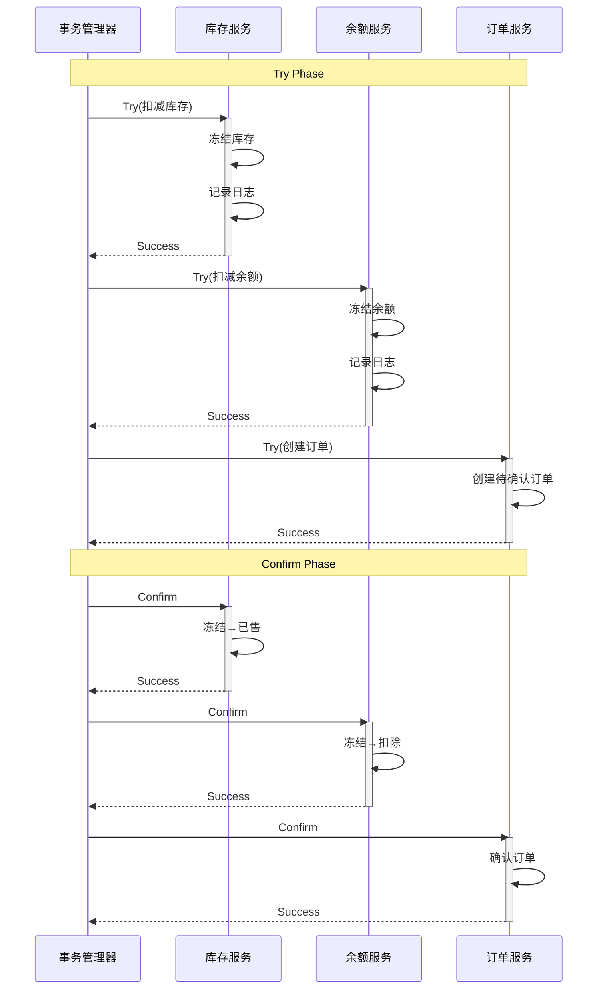
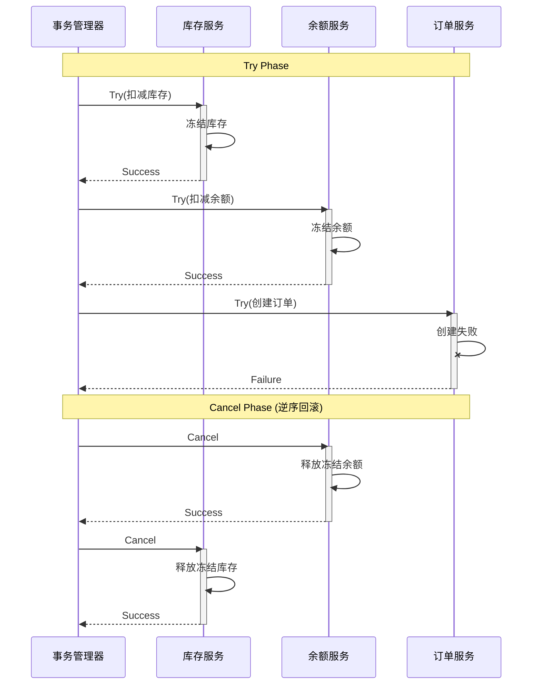

# TCC柔性事务

**文档版本**：v1.0
**创建时间**：2026年
**最后更新**：2026年
**状态**：✅ 已完成

---

## 📋 执行摘要

TCC（Try-Confirm-Cancel）是一种业务层面的柔性事务模式，通过将业务操作拆分为预留资源（Try）、确认执行（Confirm）和取消回滚（Cancel）三个阶段，实现最终一致性。TCC适用于对隔离性有要求、需要资源预留的复杂业务场景。

---

## 一、核心概念

### 1.1 三阶段定义

```
┌─────────────────────────────────────────────────────┐
│                   TCC 三阶段                        │
├─────────────────────────────────────────────────────┤
│                                                     │
│   Try阶段 ──────► Confirm阶段 ──────► 完成         │
│      │                │                             │
│      ▼                ▼                             │
│   预留资源        确认执行                          │
│   执行业务检查    使用预留资源                      │
│   锁定资源        幂等执行                          │
│                                                     │
│   Try阶段 ──────► Cancel阶段 ──────► 回滚          │
│      │                │                             │
│      ▼                ▼                             │
│   预留资源        释放资源                          │
│   失败或取消      回滚业务                          │
│                   幂等执行                          │
└─────────────────────────────────────────────────────┘
```

### 1.2 数据状态变化

以库存扣减为例：

| 阶段 | 总库存 | 可用库存 | 冻结库存 | 已售库存 |
|------|--------|----------|----------|----------|
| 初始 | 100 | 100 | 0 | 0 |
| Try后 | 100 | 90 | 10 | 0 |
| Confirm后 | 100 | 90 | 0 | 10 |
| Cancel后 | 100 | 100 | 0 | 0 |

---

## 二、时序图

### 2.1 成功场景



### 2.2 失败场景



---

## 三、Java实现示例

```java
/**
 * TCC事务注解
 */
@Target(ElementType.METHOD)
@Retention(RetentionPolicy.RUNTIME)
public @interface TccTransaction {
    String confirmMethod();
    String cancelMethod();
}

/**
 * 库存服务TCC实现
 */
@Service
public class InventoryTccService {

    @Autowired
    private StockDao stockDao;
    @Autowired
    private TccLogDao tccLogDao;

    /**
     * Try阶段：预占库存
     */
    @TccTransaction(confirmMethod = "confirmDeduct", cancelMethod = "cancelDeduct")
    public boolean tryDeduct(String xid, String skuId, int count) {
        // 1. 幂等性检查
        TccLog log = tccLogDao.getByXid(xid);
        if (log != null) {
            return "TRY_SUCCESS".equals(log.getStatus());
        }

        // 2. 业务检查
        Stock stock = stockDao.get(skuId);
        if (stock.getAvailable() < count) {
            return false; // 库存不足
        }

        // 3. 预留资源（本地事务）
        return transactionTemplate.execute(status -> {
            try {
                // 扣减可用库存
                int affected = stockDao.decreaseAvailable(skuId, count);
                if (affected == 0) {
                    throw new RuntimeException("库存不足");
                }

                // 增加冻结库存
                stockDao.increaseFrozen(skuId, count);

                // 记录TCC日志
                TccLog newLog = new TccLog();
                newLog.setXid(xid);
                newLog.setSkuId(skuId);
                newLog.setCount(count);
                newLog.setStatus("TRY_SUCCESS");
                tccLogDao.insert(newLog);

                return true;
            } catch (Exception e) {
                status.setRollbackOnly();
                return false;
            }
        });
    }

    /**
     * Confirm阶段：确认扣减
     */
    public boolean confirmDeduct(String xid) {
        // 幂等性检查
        TccLog log = tccLogDao.getByXid(xid);
        if (log == null || "CONFIRMED".equals(log.getStatus())) {
            return true;
        }
        if (!"TRY_SUCCESS".equals(log.getStatus())) {
            throw new IllegalStateException("Invalid status: " + log.getStatus());
        }

        return transactionTemplate.execute(status -> {
            try {
                String skuId = log.getSkuId();
                int count = log.getCount();

                // 冻结库存 -> 已售库存
                stockDao.decreaseFrozen(skuId, count);
                stockDao.increaseSold(skuId, count);

                // 更新日志状态
                tccLogDao.updateStatus(xid, "CONFIRMED");

                return true;
            } catch (Exception e) {
                status.setRollbackOnly();
                throw e;
            }
        });
    }

    /**
     * Cancel阶段：释放库存
     */
    public boolean cancelDeduct(String xid) {
        // 幂等性检查
        TccLog log = tccLogDao.getByXid(xid);
        if (log == null || "CANCELLED".equals(log.getStatus())) {
            return true;
        }

        // 空回滚处理：Try未执行或失败
        if (!"TRY_SUCCESS".equals(log.getStatus())) {
            // 记录空回滚标记
            tccLogDao.insertEmptyCancel(xid);
            return true;
        }

        return transactionTemplate.execute(status -> {
            try {
                String skuId = log.getSkuId();
                int count = log.getCount();

                // 释放冻结库存，恢复可用库存
                stockDao.decreaseFrozen(skuId, count);
                stockDao.increaseAvailable(skuId, count);

                // 更新日志状态
                tccLogDao.updateStatus(xid, "CANCELLED");

                return true;
            } catch (Exception e) {
                status.setRollbackOnly();
                throw e;
            }
        });
    }
}

/**
 * TCC事务管理器
 */
@Component
public class TccTransactionManager {

    @Autowired
    private List<TccParticipant> participants;

    /**
     * 执行TCC事务
     */
    public boolean executeTccTransaction(String xid, TccContext context) {
        List<TccParticipant> successParticipants = new ArrayList<>();

        try {
            // Try阶段
            for (TccParticipant participant : participants) {
                boolean success = participant.tryExecute(xid, context);
                if (!success) {
                    // Try失败，触发Cancel
                    triggerCancel(xid, successParticipants);
                    return false;
                }
                successParticipants.add(participant);
            }

            // Confirm阶段
            for (TccParticipant participant : successParticipants) {
                boolean success = participant.confirm(xid);
                if (!success) {
                    // Confirm失败，记录待重试
                    recordPendingConfirm(xid, participant);
                }
            }

            return true;
        } catch (Exception e) {
            triggerCancel(xid, successParticipants);
            return false;
        }
    }

    private void triggerCancel(String xid, List<TccParticipant> participants) {
        // 逆序执行Cancel
        List<TccParticipant> reverseList = new ArrayList<>(participants);
        Collections.reverse(reverseList);

        for (TccParticipant participant : reverseList) {
            try {
                participant.cancel(xid);
            } catch (Exception e) {
                // 记录Cancel失败，需要人工介入或重试
                recordPendingCancel(xid, participant);
            }
        }
    }
}
```

---

## 四、关键问题处理

### 4.1 幂等性保证

```java
/**
 * 使用数据库唯一约束保证幂等性
 */
public class IdempotentHandler {

    /**
     * Confirm幂等性
     */
    public boolean confirmWithIdempotency(String xid, Runnable confirmAction) {
        try {
            // 尝试插入确认记录
            confirmLogDao.insertIgnore(xid, "CONFIRMING");

            // 执行确认
            confirmAction.run();

            // 更新状态
            confirmLogDao.updateStatus(xid, "CONFIRMED");
            return true;
        } catch (DuplicateKeyException e) {
            // 已处理过，返回成功
            return true;
        }
    }
}
```

### 4.2 空回滚与悬挂

```java
/**
 * 处理空回滚和悬挂
 */
public class TccEdgeCaseHandler {

    /**
     * Try阶段 - 检查是否已Cancel（悬挂防护）
     */
    public boolean tryWithSuspendCheck(String xid) {
        // 检查是否已有Cancel记录
        if (tccLogDao.isCancelled(xid)) {
            throw new TccSuspendedException("Transaction already cancelled: " + xid);
        }
        // 执行正常Try逻辑
        return executeTry(xid);
    }

    /**
     * Cancel阶段 - 处理空回滚
     */
    public boolean cancelWithEmptyCheck(String xid) {
        TccLog log = tccLogDao.getByXid(xid);
        if (log == null) {
            // Try未执行，记录空回滚
            tccLogDao.insertEmptyCancel(xid);
            return true;
        }
        // 执行正常Cancel逻辑
        return executeCancel(xid);
    }
}
```

---

## 五、TCC vs 2PC对比

| 维度 | TCC | 2PC |
|------|-----|-----|
| **一致性** | 最终一致性 | 强一致性 |
| **业务侵入** | 高（需实现3个接口） | 低（数据库层面） |
| **性能** | 高（无全局锁） | 较低（锁持有时间长） |
| **隔离性** | 较好（资源预留） | 强（数据库锁） |
| **回滚能力** | 业务补偿 | 数据库回滚 |
| **适用场景** | 长事务、微服务 | 短事务、强一致 |

---

**维护者**：项目团队
**最后更新**：2026-04-03
