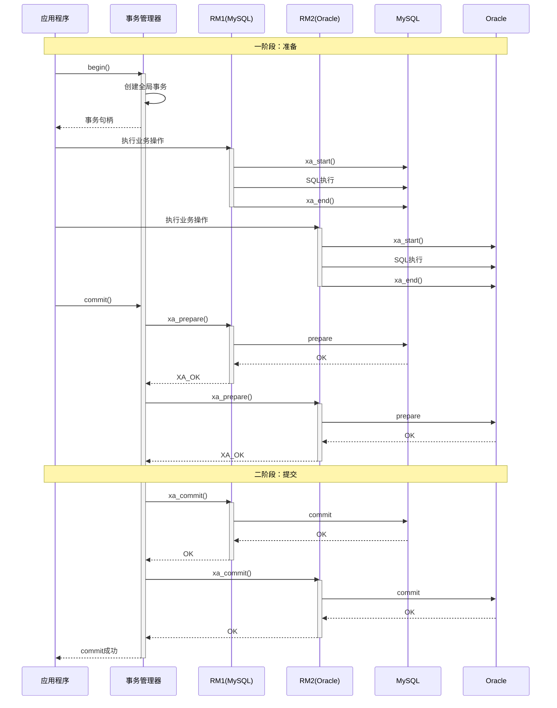

# XA规范详解

**文档版本**：v1.0
**创建时间**：2026年
**最后更新**：2026年
**状态**：✅ 已完成

---

## 📋 执行摘要

XA（eXtended Architecture）是由X/Open组织提出的分布式事务处理标准规范，定义了全局事务管理器（TM）与资源管理器（RM）之间的接口协议。XA基于2PC实现，被主流数据库（MySQL、Oracle、PostgreSQL等）和Java EE（JTA）广泛支持，是企业级分布式事务的经典方案。

---

## 一、核心概念

### 1.1 XA架构组件

```
┌─────────────────────────────────────────────────────────────┐
│                      XA架构                                  │
├─────────────────────────────────────────────────────────────┤
│                                                             │
│                    ┌─────────────────┐                      │
│                    │  应用(AP)       │                      │
│                    │  - 业务逻辑     │                      │
│                    └────────┬────────┘                      │
│                             │                               │
│                    ┌────────▼────────┐                      │
│                    │  事务管理器(TM)  │                      │
│                    │  - 全局事务协调  │                      │
│                    │  - 2PC协议实现   │                      │
│                    └────────┬────────┘                      │
│                             │                               │
│            ┌────────────────┼────────────────┐              │
│            │                │                │              │
│     ┌──────▼──────┐  ┌──────▼──────┐  ┌──────▼──────┐      │
│     │ 资源管理器1  │  │ 资源管理器2  │  │ 资源管理器3  │      │
│     │  (RM1)      │  │  (RM2)      │  │  (RM3)      │      │
│     │ - MySQL     │  │ - Oracle    │  │ - MQ        │      │
│     └──────┬──────┘  └──────┬──────┘  └──────┬──────┘      │
│            │                │                │              │
│     ┌──────▼──────┐  ┌──────▼──────┐  ┌──────▼──────┐      │
│     │   数据库A   │  │   数据库B   │  │   消息队列   │      │
│     └─────────────┘  └─────────────┘  └─────────────┘      │
│                                                             │
└─────────────────────────────────────────────────────────────┘

AP (Application Program): 应用程序，定义事务边界
TM (Transaction Manager): 事务管理器，管理全局事务
RM (Resource Manager): 资源管理器，管理本地资源
```

### 1.2 XA接口

| 接口 | 作用 | 调用方 |
|------|------|--------|
| `xa_start` | 开始一个分支事务 | TM → RM |
| `xa_end` | 结束一个分支事务 | TM → RM |
| `xa_prepare` | 准备阶段投票 | TM → RM |
| `xa_commit` | 提交事务 | TM → RM |
| `xa_rollback` | 回滚事务 | TM → RM |
| `xa_recover` | 恢复事务（故障恢复） | TM → RM |

---

## 二、时序图



---

## 三、Java实现示例

### 3.1 JTA/XA基础使用

```java
/**
 * JTA/XA配置
 */
@Configuration
public class XaConfig {

    @Bean
    public JtaTransactionManager jtaTransactionManager(
            UserTransactionManager userTransactionManager,
            UserTransaction userTransaction) {
        return new JtaTransactionManager(userTransaction, userTransactionManager);
    }

    @Bean
    public UserTransaction userTransaction() throws Exception {
        UserTransactionImp userTransaction = new UserTransactionImp();
        userTransaction.setTransactionTimeout(300);
        return userTransaction;
    }

    @Bean
    public UserTransactionManager userTransactionManager() {
        return new UserTransactionManager();
    }
}

/**
 * XA数据源配置
 */
@Configuration
public class XaDataSourceConfig {

    @Bean
    public XADataSource xaDataSource1() {
        MysqlXADataSource xaDataSource = new MysqlXADataSource();
        xaDataSource.setUrl("jdbc:mysql://localhost:3306/db1");
        xaDataSource.setUser("user1");
        xaDataSource.setPassword("password1");
        return xaDataSource;
    }

    @Bean
    public XADataSource xaDataSource2() {
        OracleXADataSource xaDataSource = new OracleXADataSource();
        xaDataSource.setURL("jdbc:oracle:thin:@localhost:1521:ORCL");
        xaDataSource.setUser("user2");
        xaDataSource.setPassword("password2");
        return xaDataSource;
    }
}

/**
 * XA事务服务
 */
@Service
public class XaTransactionService {

    @Autowired
    private JtaTransactionManager transactionManager;
    @Autowired
    private JdbcTemplate jdbcTemplate1;
    @Autowired
    private JdbcTemplate jdbcTemplate2;

    /**
     * 声明式XA事务
     */
    @Transactional
    public void transferMoney(String fromAccount, String toAccount,
                              BigDecimal amount) {
        // 从数据库1扣款
        jdbcTemplate1.update(
            "UPDATE account SET balance = balance - ? WHERE account_id = ?",
            amount, fromAccount
        );

        // 向数据库2加款
        jdbcTemplate2.update(
            "UPDATE account SET balance = balance + ? WHERE account_id = ?",
            amount, toAccount
        );
    }

    /**
     * 编程式XA事务
     */
    public void transferWithProgrammaticTx(String from, String to, BigDecimal amount) {
        UserTransaction ut = transactionManager.getUserTransaction();

        try {
            ut.begin();

            try {
                // 执行跨库操作
                jdbcTemplate1.update(
                    "UPDATE account SET balance = balance - ? WHERE id = ?",
                    amount, from
                );

                jdbcTemplate2.update(
                    "UPDATE account SET balance = balance + ? WHERE id = ?",
                    amount, to
                );

                ut.commit();
            } catch (Exception e) {
                ut.rollback();
                throw e;
            }
        } catch (Exception e) {
            throw new RuntimeException("Transaction failed", e);
        }
    }
}
```

### 3.2 Spring Boot + XA示例

```java
/**
 * Spring Boot XA配置
 */
@Configuration
@EnableTransactionManagement
public class SpringBootXaConfig {

    @Bean
    @ConfigurationProperties("spring.datasource.db1")
    public DataSource db1DataSource() {
        return DataSourceBuilder.create()
            .type(AtomikosDataSourceBean.class)
            .build();
    }

    @Bean
    @ConfigurationProperties("spring.datasource.db2")
    public DataSource db2DataSource() {
        return DataSourceBuilder.create()
            .type(AtomikosDataSourceBean.class)
            .build();
    }

    @Bean
    @Primary
    public JpaVendorAdapter jpaVendorAdapter() {
        HibernateJpaVendorAdapter adapter = new HibernateJpaVendorAdapter();
        adapter.setDatabase(Database.MYSQL);
        adapter.setGenerateDdl(true);
        return adapter;
    }

    @Bean
    public LocalContainerEntityManagerFactoryBean db1EntityManagerFactory(
            @Qualifier("db1DataSource") DataSource dataSource) {
        LocalContainerEntityManagerFactoryBean em = new LocalContainerEntityManagerFactoryBean();
        em.setDataSource(dataSource);
        em.setPackagesToScan("com.example.entity.db1");
        em.setJpaVendorAdapter(jpaVendorAdapter());
        return em;
    }

    @Bean
    public LocalContainerEntityManagerFactoryBean db2EntityManagerFactory(
            @Qualifier("db2DataSource") DataSource dataSource) {
        LocalContainerEntityManagerFactoryBean em = new LocalContainerEntityManagerFactoryBean();
        em.setDataSource(dataSource);
        em.setPackagesToScan("com.example.entity.db2");
        em.setJpaVendorAdapter(jpaVendorAdapter());
        return em;
    }
}

/**
 * 跨库订单服务
 */
@Service
public class CrossDbOrderService {

    @Autowired
    private OrderRepository orderRepository;  // DB1
    @Autowired
    private InventoryRepository inventoryRepository;  // DB2

    /**
     * 创建订单（跨库XA事务）
     */
    @Transactional
    public Order createOrder(OrderRequest request) {
        // 1. 创建订单（DB1）
        Order order = new Order();
        order.setUserId(request.getUserId());
        order.setAmount(request.getAmount());
        order.setStatus(OrderStatus.CREATED);
        orderRepository.save(order);

        // 2. 扣减库存（DB2）
        Inventory inventory = inventoryRepository
            .findBySkuId(request.getSkuId())
            .orElseThrow(() -> new RuntimeException("库存不存在"));

        if (inventory.getStock() < request.getCount()) {
            throw new RuntimeException("库存不足");
        }

        inventory.setStock(inventory.getStock() - request.getCount());
        inventoryRepository.save(inventory);

        return order;
    }
}
```

---

## 四、XA事务状态

```
┌─────────────┐     start      ┌─────────────┐
│   非活动    │───────────────►│   活动      │
│  (Non-     │                │  (Active)   │
│   Existing)│◄───────────────│             │
└─────────────┘   end/prepare  └──────┬──────┘
                                      │ prepare
                                      ▼
                               ┌─────────────┐
                               │   已准备    │
                               │ (Prepared)  │
                               └──────┬──────┘
                                      │
                        ┌─────────────┼─────────────┐
                        │             │             │
                        ▼             ▼             ▼
                 ┌─────────────┐ ┌─────────────┐ ┌─────────────┐
                 │   提交完成  │ │  回滚完成   │ │  启发式完成  │
                 │ (Committed) │ │ (RolledBack)│ │ (Heuristic) │
                 └─────────────┘ └─────────────┘ └─────────────┘
```

---

## 五、优缺点分析

| 优点 | 缺点 |
|------|------|
| 标准规范，广泛支持 | 同步阻塞，性能较低 |
| 强一致性保证 | 单点故障风险 |
| 数据库原生支持 | 不适合长事务 |
| 成熟稳定 | 跨异构系统困难 |

---

## 六、适用场景

| 场景 | 适用性 | 说明 |
|------|--------|------|
| 同构数据库事务 | ⭐⭐⭐⭐⭐ | XA优势场景 |
| 金融核心账务 | ⭐⭐⭐⭐⭐ | 强一致性要求 |
| 跨库短事务 | ⭐⭐⭐⭐ | 标准方案 |
| 微服务架构 | ⭐⭐ | 更适合Saga/TCC |
| 长事务 | ⭐⭐ | 阻塞时间长 |
| 异构系统 | ⭐⭐ | 兼容性挑战 |

---

**维护者**：项目团队
**最后更新**：2026-04-03
