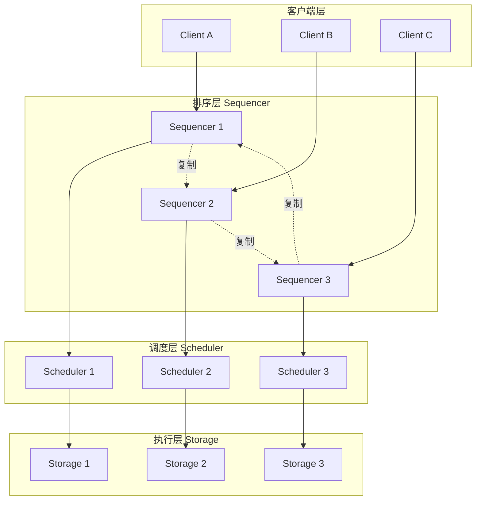
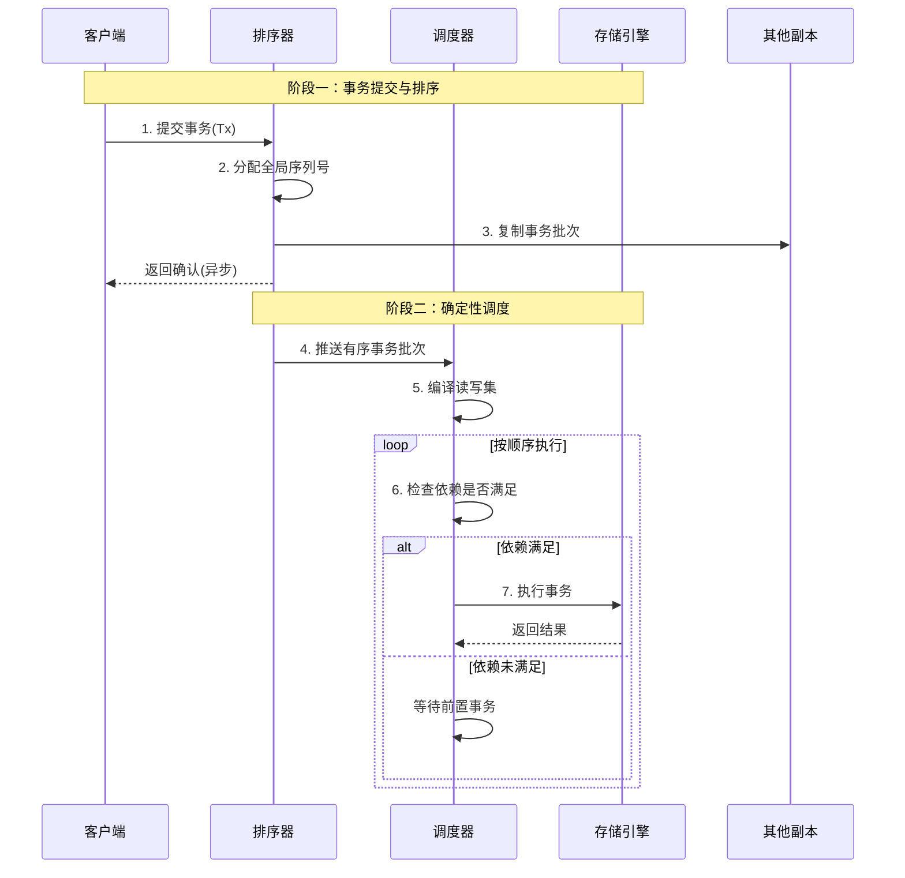
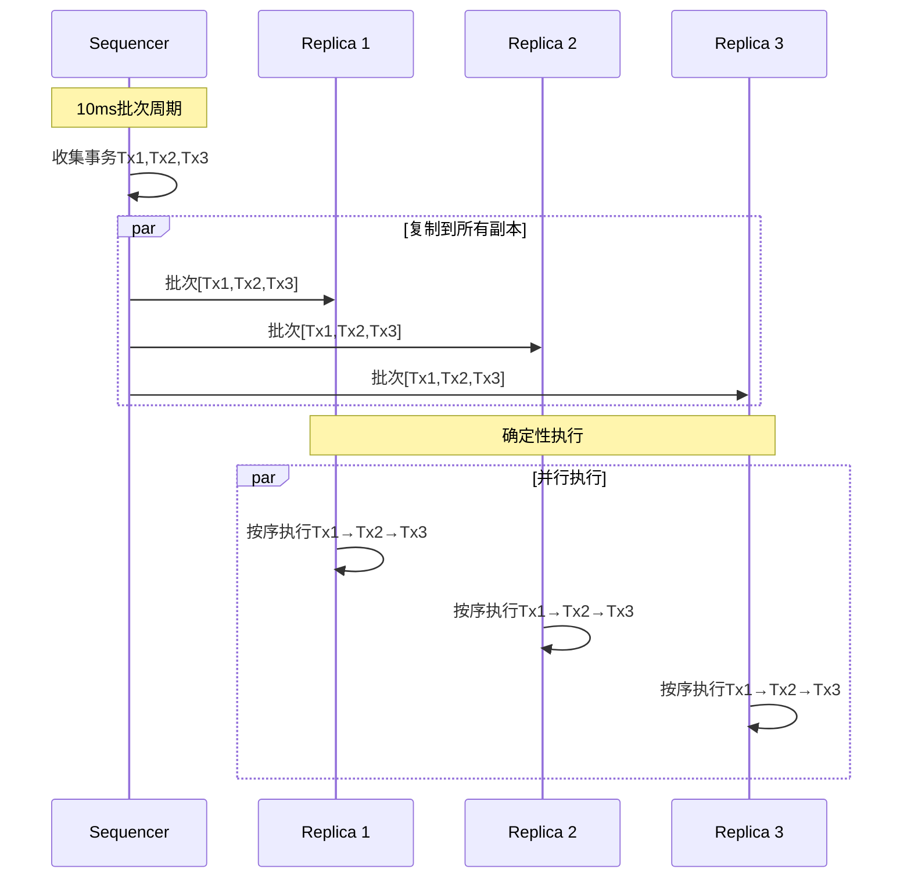

# Calvin确定性事务系统

> Calvin是耶鲁大学提出的确定性分布式事务系统，通过事务预先排序和确定性执行消除分布式协调开销，实现高吞吐低延迟的分布式事务处理。

---

## 📋 目录

- [Calvin确定性事务系统](#calvin确定性事务系统)
  - [📋 目录](#-目录)
  - [1. 概述](#1-概述)
    - [1.1 什么是Calvin](#11-什么是calvin)
    - [1.2 传统vs确定性事务](#12-传统vs确定性事务)
    - [1.3 设计目标](#13-设计目标)
  - [2. 核心架构](#2-核心架构)
    - [2.1 三层架构](#21-三层架构)
    - [2.2 各层职责](#22-各层职责)
  - [3. 确定性执行模型](#3-确定性执行模型)
    - [3.1 事务执行流程](#31-事务执行流程)
    - [3.2 确定性保证机制](#32-确定性保证机制)
    - [3.3 读写集分析](#33-读写集分析)
  - [4. 无锁事务设计](#4-无锁事务设计)
    - [4.1 为什么无死锁](#41-为什么无死锁)
    - [4.2 锁管理实现](#42-锁管理实现)
  - [5. 顺序执行优势](#5-顺序执行优势)
    - [5.1 副本一致性](#51-副本一致性)
    - [5.2 对比传统复制](#52-对比传统复制)
    - [5.3 跨分区事务优化](#53-跨分区事务优化)
  - [6. 性能分析](#6-性能分析)
    - [6.1 性能数据](#61-性能数据)
    - [6.2 扩展性](#62-扩展性)
    - [6.3 优缺点总结](#63-优缺点总结)
  - [7. 工业应用](#7-工业应用)
    - [7.1 FaunaDB实现](#71-faunadb实现)
    - [7.2 应用场景对比](#72-应用场景对比)
    - [7.3 代码示例：存储过程事务](#73-代码示例存储过程事务)
  - [📚 参考资料](#-参考资料)
    - [学术论文](#学术论文)
    - [相关系统](#相关系统)
    - [相关文档](#相关文档)

---

## 1. 概述

### 1.1 什么是Calvin

Calvin是耶鲁大学于2012年发表的确定性数据库系统，发表于SIGMOD会议。它通过**确定性执行模型**彻底改变了分布式事务的设计范式：

> **核心思想**：如果所有副本以相同的顺序执行相同的事务，就无需两阶段提交或分布式协调。

### 1.2 传统vs确定性事务

| 特性 | 传统2PL/2PC | Calvin确定性 |
|:---|:---|:---|
| 协调方式 | 运行时协调 | 预排序，无需协调 |
| 锁管理 | 运行时获取 | 按预定顺序获取 |
| 死锁处理 | 检测与回滚 | 不可能发生 |
| 副本一致性 | Paxos复制日志 | 确定性复制 |
| 跨分区事务 | 高延迟 | 与单分区同延迟 |

### 1.3 设计目标

```
┌─────────────────────────────────────────────────────────┐
│                    Calvin设计目标                        │
├─────────────────────────────────────────────────────────┤
│  1. 高吞吐量：消除分布式协调瓶颈                          │
│  2. 低延迟：跨分区事务与单分区事务延迟相同                 │
│  3. 线性扩展：水平扩展无协调开销                          │
│  4. 强一致性：所有副本确定性地保持一致                    │
└─────────────────────────────────────────────────────────┘
```

---

## 2. 核心架构

### 2.1 三层架构



### 2.2 各层职责

| 层级 | 职责 | 关键特性 |
|:---|:---|:---|
| **Sequencer** | 接收事务，分配全局顺序 | 复制事务批次到所有副本 |
| **Scheduler** | 按顺序调度事务执行 | 分析读写集，确定执行时机 |
| **Storage** | 执行事务逻辑 | 支持任意存储引擎 |

---

## 3. 确定性执行模型

### 3.1 事务执行流程



### 3.2 确定性保证机制

```java
/**
 * Calvin确定性调度器核心实现
 */
public class DeterministicScheduler {
    private final BlockingQueue<Transaction> orderedQueue;
    private final Map<String, Long> lastWriteVersion;

    /**
     * 编译事务的读写集
     */
    public Transaction compileTransaction(Transaction tx) {
        // 存储过程方式：提前知道读写集
        if (tx.isStoredProcedure()) {
            return analyzeStoredProcedure(tx);
        }
        // OLLP：乐观锁位置预测
        return optimisticLockLocationPrediction(tx);
    }

    /**
     * 确定性执行事务
     */
    public void executeDeterministically(Transaction tx) {
        // 1. 等待所有读依赖完成
        for (String readKey : tx.getReadSet()) {
            long lastWrite = lastWriteVersion.getOrDefault(readKey, 0L);
            waitForVersion(readKey, lastWrite);
        }

        // 2. 以预定顺序获取写锁（无死锁风险）
        List<String> sortedWriteKeys = tx.getWriteSet().stream()
            .sorted()
            .collect(Collectors.toList());

        for (String key : sortedWriteKeys) {
            acquireLock(key);
        }

        // 3. 执行事务逻辑
        executeTransactionLogic(tx);

        // 4. 更新写版本
        for (String key : tx.getWriteSet()) {
            lastWriteVersion.put(key, tx.getTransactionId());
            releaseLock(key);
        }
    }
}
```

### 3.3 读写集分析

```sql
-- Calvin事务示例：转账操作
-- 通过存储过程提前声明读写集

CREATE PROCEDURE Transfer(
    IN from_account INT,
    IN to_account INT,
    IN amount DECIMAL
)
LANGUAGE SQL
DETERMINISTIC
BEGIN
    -- 编译时已知读写集：
    -- ReadSet: {accounts[from_account], accounts[to_account]}
    -- WriteSet: {accounts[from_account], accounts[to_account], transaction_log}

    DECLARE from_balance DECIMAL;
    DECLARE to_balance DECIMAL;

    -- 读取
    SELECT balance INTO from_balance FROM accounts WHERE id = from_account;
    SELECT balance INTO to_balance FROM accounts WHERE id = to_account;

    -- 业务逻辑
    IF from_balance >= amount THEN
        -- 写入
        UPDATE accounts SET balance = balance - amount WHERE id = from_account;
        UPDATE accounts SET balance = balance + amount WHERE id = to_account;
        INSERT INTO transaction_log (from_acc, to_acc, amount, ts)
        VALUES (from_account, to_account, amount, NOW());
    ELSE
        SIGNAL SQLSTATE '45000' SET MESSAGE_TEXT = 'Insufficient balance';
    END IF;
END;
```

---

## 4. 无锁事务设计

### 4.1 为什么无死锁

传统数据库的死锁发生在**运行时锁竞争**，而Calvin在**编译期**就确定了锁的获取顺序：

```
传统数据库死锁场景：
┌─────────────────┐          ┌─────────────────┐
│   事务A         │          │   事务B         │
│  1. 锁X         │          │  1. 锁Y         │
│  2. 请求锁Y ←───┼──── 冲突 ────┼── 2. 请求锁X  │
│     (等待)      │          │     (等待)      │
└─────────────────┘          └─────────────────┘
                   ↑
              循环等待 = 死锁

Calvin确定性调度：
┌───────────────────────────────────────────────┐
│  所有事务按全局顺序执行                         │
│  锁按键的字典序获取                            │
│                                               │
│  事务1: 顺序获取锁A → 锁B → 锁C               │
│  事务2: 顺序获取锁A → 锁B → 锁C               │
│                                               │
│  结果：无循环等待，无死锁                       │
└───────────────────────────────────────────────┘
```

### 4.2 锁管理实现

```java
/**
 * Calvin无死锁锁管理器
 */
public class DeadlockFreeLockManager {

    /**
     * 按预定顺序获取锁
     * 确保所有事务以相同的顺序获取锁
     */
    public void acquireLocksInOrder(Transaction tx) {
        // 1. 收集所有需要的锁
        Set<String> requiredLocks = new HashSet<>();
        requiredLocks.addAll(tx.getReadSet());
        requiredLocks.addAll(tx.getWriteSet());

        // 2. 按字典序排序（确定性顺序）
        List<String> orderedLocks = requiredLocks.stream()
            .sorted()
            .collect(Collectors.toList());

        // 3. 按顺序获取锁
        List<Lock> acquiredLocks = new ArrayList<>();
        try {
            for (String lockKey : orderedLocks) {
                Lock lock = lockManager.acquire(lockKey);
                acquiredLocks.add(lock);
            }

            // 4. 执行事务
            tx.execute();

        } finally {
            // 5. 逆序释放锁
            Collections.reverse(acquiredLocks);
            for (Lock lock : acquiredLocks) {
                lock.release();
            }
        }
    }
}
```

---

## 5. 顺序执行优势

### 5.1 副本一致性

由于所有副本以**相同的顺序**执行**相同的事务**，副本间自然保持一致：



### 5.2 对比传统复制

| 复制方式 | 延迟 | 吞吐量 | 一致性 |
|:---|:---:|:---:|:---|
| **异步复制** | 低 | 高 | 最终一致 |
| **Paxos/Raft** | 中 | 中 | 强一致 |
| **Calvin确定性** | 低 | 高 | 强一致 |

### 5.3 跨分区事务优化

Calvin的跨分区事务无需两阶段提交：

```java
/**
 * 跨分区事务处理
 */
public class CrossPartitionTransaction {

    /**
     * 传统2PC跨分区事务
     */
    public void traditionalCrossPartitionTx() {
        // 需要4轮消息延迟
        // 1. Prepare请求
        // 2. Prepare响应
        // 3. Commit请求
        // 4. Commit响应
    }

    /**
     * Calvin跨分区事务
     */
    public void calvinCrossPartitionTx(Transaction tx) {
        // 1. 事务在Sequencer排序（统一决策）
        long globalOrder = sequencer.order(tx);

        // 2. 各分区Scheduler按序执行
        // 无需运行时协调！
        for (Partition partition : tx.involvedPartitions()) {
            partition.scheduler.schedule(tx, globalOrder);
        }

        // 结果：与单分区事务相同延迟
    }
}
```

---

## 6. 性能分析

### 6.1 性能数据

基于Yahoo! Cloud Serving Benchmark (YCSB)的测试结果：

| 工作负载 | 系统 | 吞吐量(tps) | 延迟(ms) |
|:---|:---|:---:|:---:|
| 单分区 | Calvin | ~500,000 | <1 |
| 跨分区10% | Calvin | ~450,000 | <2 |
| 跨分区100% | Calvin | ~400,000 | <3 |
| 单分区 | Spanner | ~400,000 | ~5 |
| 跨分区 | Spanner | ~100,000 | ~50-100 |

### 6.2 扩展性

```
吞吐量
   │
500K│                ┌────────────────────────
    │            ┌───┘
400K│        ┌───┘
    │    ┌───┘
300K│┌───┘
    │
200K│        传统2PC ───────┬──────────
    │                      │
100K│                      └──────────
    │
   0└────┬────┬────┬────┬────┬────┬──→ 节点数
        10   20   30   40   50   60

Calvin: 线性扩展
传统2PC: 协调开销导致扩展受限
```

### 6.3 优缺点总结

| 优势 | 说明 |
|:---|:---|
| 极高吞吐量 | 消除分布式协调瓶颈 |
| 低延迟 | 跨分区事务与单分区同延迟 |
| 无线性一致开销 | 无需Paxos/Raft复制日志 |
| 无死锁 | 确定性调度避免死锁 |

| 局限性 | 说明 |
|:---|:---|
| 需要读写集 | 事务必须提前知道读写范围 |
| 不支持交互式事务 | 用户不能在事务中做决策 |
| 热点问题 | 顺序执行导致热点键串行化 |
| 复杂查询受限 | 分析型查询性能不佳 |

---

## 7. 工业应用

### 7.1 FaunaDB实现

FaunaDB是Calvin架构的商业化实现：

```
┌─────────────────────────────────────────────────────────┐
│                    FaunaDB架构                          │
├─────────────────────────────────────────────────────────┤
│  查询层：GraphQL + FQL (Fauna Query Language)          │
├─────────────────────────────────────────────────────────┤
│  事务层：Calvin确定性调度 + MVCC                        │
├─────────────────────────────────────────────────────────┤
│  存储层：RocksDB / 自定义存储引擎                       │
├─────────────────────────────────────────────────────────┤
│  复制层：跨地域复制，全球一致性                         │
└─────────────────────────────────────────────────────────┘
```

### 7.2 应用场景对比

| 场景 | Calvin适用性 | 原因 |
|:---|:---:|:---|
| 高频OLTP | ⭐⭐⭐⭐⭐ | 高吞吐低延迟 |
| 金融交易 | ⭐⭐⭐⭐ | 确定性保证，需存储过程 |
| 社交网络 | ⭐⭐⭐ | 需要读写集分析 |
| 实时分析 | ⭐⭐ | 顺序执行不利于并行分析 |
| 物联网写入 | ⭐⭐⭐⭐⭐ | 高并发写入场景 |

### 7.3 代码示例：存储过程事务

```java
/**
 * Calvin风格的确定性事务示例
 */
public class CalvinTransactionExample {

    /**
     * 定义转账存储过程
     * 必须提前声明读写集
     */
    @StoredProcedure(
        readSet = {"account:${from}", "account:${to}"},
        writeSet = {"account:${from}", "account:${to}", "txn_log"}
    )
    public class TransferProcedure implements StoredProcedure {

        @Input
        private long fromAccount;

        @Input
        private long toAccount;

        @Input
        private BigDecimal amount;

        @Override
        public void execute(TransactionContext ctx) {
            // 读取阶段
            Account from = ctx.read("account:" + fromAccount);
            Account to = ctx.read("account:" + toAccount);

            // 业务逻辑
            if (from.balance.compareTo(amount) < 0) {
                ctx.abort("Insufficient balance");
                return;
            }

            // 写入阶段
            from.balance = from.balance.subtract(amount);
            to.balance = to.balance.add(amount);

            ctx.write("account:" + fromAccount, from);
            ctx.write("account:" + toAccount, to);
            ctx.write("txn_log", new TransactionLog(fromAccount, toAccount, amount));

            ctx.commit();
        }
    }
}
```

---

## 📚 参考资料

### 学术论文

1. [Calvin: Fast Distributed Transactions for Partitioned Database Systems](https://dl.acm.org/doi/10.1145/2213836.2213838) - Alexander Thomson et al., SIGMOD 2012

### 相关系统

1. [FaunaDB](https://fauna.com/) - Calvin架构的商业化数据库
2. [VoltDB](https://www.voltdb.com/) - 内存数据库，采用类似确定性执行

### 相关文档

- [2PC两阶段提交详解](./2PC两阶段提交详解.md)
- [Spanner事务](./spanner事务.md)

---

> 💡 **总结**：Calvin通过确定性执行模型，从根本上消除了分布式事务的协调开销。虽然牺牲了一定的灵活性（需要提前知道读写集），但在高吞吐OLTP场景下展现出卓越性能。

**文档版本**：v1.0
**最后更新**：2026-04-04
**作者**：分布式计算知识库
