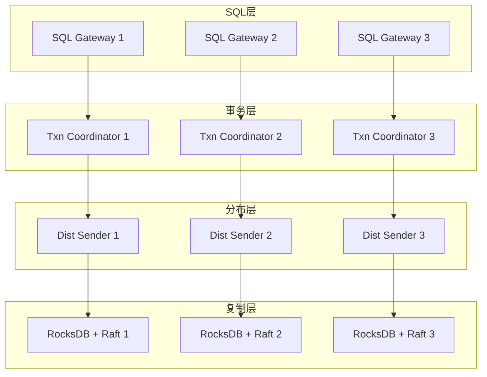
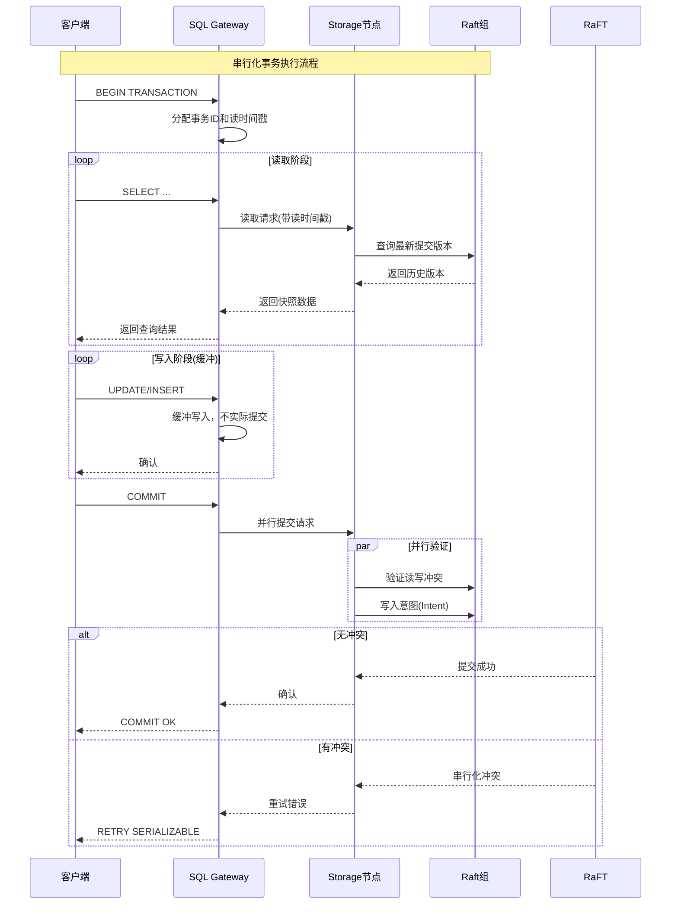
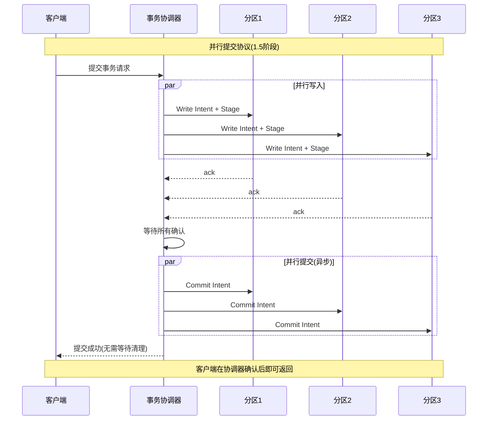

# CockroachDB事务架构

> CockroachDB是开源的分布式SQL数据库，默认提供串行化隔离级别，采用混合逻辑时钟(HLC)和并行提交协议，实现高可用强一致的分布式事务。

---

## 📋 目录

- [1. 概述](#1-概述)
- [2. 架构设计](#2-架构设计)
- [3. 串行化实现](#3-串行化实现)
- [4. 混合逻辑时钟(HLC)](#4-混合逻辑时钟hlc)
- [5. 并行提交协议](#5-并行提交协议)
- [6. 性能优化](#6-性能优化)
- [7. 案例分析](#7-案例分析)

---

## 1. 概述

### 1.1 什么是CockroachDB

CockroachDB（简称CRDB）是受Google Spanner启发的开源分布式SQL数据库，由Cockroach Labs开发。其设计目标：

- **可扩展性**：水平扩展SQL处理能力
- **高可用性**：多活架构，自动故障恢复
- **强一致性**：默认串行化隔离级别
- **PostgreSQL兼容**：支持大部分PG协议和语法

### 1.2 核心特性

| 特性 | 说明 | 优势 |
|:---|:---|:---|
| **串行化默认** | 无需显式设置，自动保证 | 避免数据异常 |
| **HLC时钟** | 混合逻辑时钟 | 无需原子钟，实现因果一致性 |
| **并行提交** | 1.5阶段提交优化 | 降低事务延迟 |
| **在线Schema变更** | 零停机DDL | 运维友好 |

### 1.3 与Spanner对比

| 特性 | Spanner | CockroachDB |
|:---|:---|:---|
| 时钟同步 | TrueTime(原子钟+GPS) | HLC(NTP) |
| 外部一致性 | 严格 | 因果一致性 |
| 部署成本 | 高(需特殊硬件) | 低(标准服务器) |
| 开源 | 否 | 是 |
| 地理复制 | 原生支持 | 原生支持 |

---

## 2. 架构设计

### 2.1 整体架构



### 2.2 事务协调器

```go
// CockroachDB事务协调器结构
type TxnCoordSender struct {
    // 事务元数据
    txnMeta *roachpb.Transaction

    // 交互意图跟踪
    interleavedIntents map[string]struct{}

    // 心跳保持事务存活
    heartbeatLoop *heartbeatLoop

    // 写入缓冲
    writeBuffer *writeBuffer
}

// 发送事务请求
type BatchRequest struct {
    // 事务信息
    Txn *Transaction

    // 请求列表
    Requests []RequestUnion

    // 时间戳信息
    Timestamp hlc.Timestamp
}
```

---

## 3. 串行化实现

### 3.1 串行化快照隔离(SSI)

CockroachDB通过**串行化快照隔离**实现真正的串行化：

```
┌─────────────────────────────────────────────────────────┐
│              串行化快照隔离机制                          │
├─────────────────────────────────────────────────────────┤
│                                                         │
│  读取阶段：获取read timestamp (rts)                     │
│       ↓                                                 │
│  基于rts创建一致性快照                                   │
│       ↓                                                 │
│  执行所有读取操作                                        │
│       ↓                                                 │
│  提交阶段：验证无写写冲突                                │
│       ↓                                                 │
│  验证通过 → 提交成功                                    │
│  验证失败 → 串行化冲突，重试                            │
│                                                         │
└─────────────────────────────────────────────────────────┘
```

### 3.2 冲突检测机制

```go
// 串行化冲突检测
type SerializabilityValidator struct {
    readSet  map[string]hlc.Timestamp
    writeSet map[string]struct{}
}

// 验证串行化冲突
func (v *SerializabilityValidator) ValidateConflict(
    key string,
    proposedWriteTime hlc.Timestamp,
) error {
    // 检查是否有事务在读取后修改了该键
    if readTime, exists := v.readSet[key]; exists {
        // 如果读取后有其他事务写入，则存在冲突
        if proposedWriteTime.Less(readTime) {
            return &roachpb.TransactionRetryError{
                Reason: roachpb.RETRY_SERIALIZABLE,
                Msg: fmt.Sprintf(
                    "serializable conflict: read at %v, write at %v",
                    readTime, proposedWriteTime),
            }
        }
    }
    return nil
}

// 处理写操作
func (v *SerializabilityValidator) OnWrite(key string) {
    v.writeSet[key] = struct{}{}
}

// 处理读操作
func (v *SerializabilityValidator) OnRead(key string, ts hlc.Timestamp) {
    if existingTs, exists := v.readSet[key]; !exists || ts.Less(existingTs) {
        v.readSet[key] = ts
    }
}
```

### 3.3 事务执行时序



---

## 4. 混合逻辑时钟(HLC)

### 4.1 HLC设计原理

CockroachDB采用**混合逻辑时钟**替代Spanner的TrueTime：

```go
// HLC时间戳结构
type Timestamp struct {
    // 物理时间：Unix时间戳（毫秒）
    WallTime int64

    // 逻辑时间：处理同一毫秒内的事件顺序
    Logical int32
}

// HLC时钟管理器
type Clock struct {
    physicalClock func() int64
    maxOffset     time.Duration

    mu            sync.Mutex
    timestamp     Timestamp
}
```

### 4.2 HLC更新规则

```go
// 获取当前HLC时间戳
func (c *Clock) Now() Timestamp {
    c.mu.Lock()
    defer c.mu.Unlock()

    // 获取物理时间
    physicalTime := c.physicalClock()

    if physicalTime > c.timestamp.WallTime {
        // 物理时间前进，重置逻辑计数
        c.timestamp = Timestamp{
            WallTime: physicalTime,
            Logical:  0,
        }
    } else {
        // 物理时间相同或回退，递增逻辑计数
        c.timestamp.Logical++
    }

    return c.timestamp
}

// 接收外部时间戳，更新本地时钟
func (c *Clock) Update(remote Timestamp) {
    c.mu.Lock()
    defer c.mu.Unlock()

    localPhysical := c.physicalClock()

    if remote.WallTime > c.timestamp.WallTime &&
       remote.WallTime > localPhysical {
        // 外部时钟领先，采用外部时间
        c.timestamp = Timestamp{
            WallTime: remote.WallTime,
            Logical:  remote.Logical + 1,
        }
    } else if remote.WallTime == c.timestamp.WallTime {
        // 物理时间相同，取最大逻辑计数
        if remote.Logical > c.timestamp.Logical {
            c.timestamp.Logical = remote.Logical + 1
        } else {
            c.timestamp.Logical++
        }
    }
}
```

### 4.3 HLC vs TrueTime对比

| 特性 | TrueTime(Spanner) | HLC(CockroachDB) |
|:---|:---|:---|
| 物理时钟 | 原子钟 + GPS | NTP |
| 不确定性区间 | 明确(通常<7ms) | 估算(max_clock_offset) |
| 外部一致性 | 严格 | 因果一致性 |
| 部署成本 | 高 | 低 |
| 时钟等待 | 需要 | 不需要 |

---

## 5. 并行提交协议

### 5.1 传统2PC的问题

传统两阶段提交需要4轮消息：

```
传统2PC:                        并行提交:
1. Prepare请求                   1. 并行写入STAGING记录+Intent
2. Prepare响应                   2. 异步确认
3. Commit请求
4. Commit响应                   3. 原子切换状态(单步)
```

### 5.2 并行提交流程



### 5.3 事务记录状态机

```go
// 事务记录状态
type TxnRecordStatus int

const (
    PENDING TxnRecordStatus = iota    // 事务进行中
    STAGING                           // 准备提交(并行提交)
    COMMITTED                         // 已提交
    ABORTED                          // 已回滚
)

// 并行提交流程
type ParallelCommit struct {
    txnRecord *TxnRecord
    intents   []Intent
}

func (pc *ParallelCommit) Execute() error {
    // 阶段1: 写入所有intent，标记为STAGING
    for _, intent := range pc.intents {
        intent.Status = STAGING
        if err := pc.writeIntent(intent); err != nil {
            pc.abort()
            return err
        }
    }

    // 确认所有intent都已持久化
    if err := pc.waitForReplication(); err != nil {
        pc.abort()
        return err
    }

    // 阶段2: 原子切换到COMMITTED状态
    pc.txnRecord.Status = COMMITTED
    if err := pc.writeTxnRecord(); err != nil {
        // 即使失败，其他节点可以基于STAGING推断提交
        return &AmbiguousCommitError{}
    }

    // 异步清理intent标记
    go pc.asyncCleanupIntents()

    return nil
}
```

---

## 6. 性能优化

### 6.1 读写路径优化

```go
// 批处理优化
type BatchRequest struct {
    // 合并多个操作到一个请求
    Requests []RequestUnion

    // 事务信息
    Txn *Transaction

    // 等待策略
    WaitPolicy WaitPolicy
}

// 流水线处理
type Pipeline struct {
    // 异步发送读取
    asyncReads chan ReadRequest

    // 预取缓存
    prefetchCache *Cache

    // 写入缓冲
    writeBuffer *WriteBuffer
}
```

### 6.2 锁优化

| 优化技术 | 说明 | 效果 |
|:---|:---|:---|
| **无锁读** | 快照读不获取锁 | 读性能提升 |
| **写意图** | 延迟锁升级 | 减少锁竞争 |
| **锁等待队列** | 公平锁调度 | 避免饥饿 |

### 6.3 配置建议

```yaml
# CockroachDB事务优化配置
cockroachdb:
  transaction:
    # 默认隔离级别
    default_isolation: SERIALIZABLE

    # 事务超时
    timeout: 10s

    # 心跳间隔(保持事务存活)
    heartbeat_interval: 1s

    # 并行提交启用
    parallel_commit: true

  performance:
    # 批处理大小
    batch_size: 100

    # 最大时钟偏移容忍
    max_clock_offset: 500ms

    # 范围缓存大小
    range_cache_size: 10000
```

---

## 7. 案例分析

### 7.1 金融支付系统

某金融科技公司使用CockroachDB构建支付核心：

```
┌─────────────────────────────────────────────────────────┐
│                  支付系统架构                            │
├─────────────────────────────────────────────────────────┤
│  应用层：支付网关、风控引擎、对账服务                    │
├─────────────────────────────────────────────────────────┤
│  接入层：PostgreSQL协议代理                              │
├─────────────────────────────────────────────────────────┤
│  CRDB集群：3数据中心 × 5节点                             │
│  - 北京：Leader分区                                      │
│  - 上海：Follower分区                                    │
│  - 深圳：Follower分区                                    │
├─────────────────────────────────────────────────────────┤
│  存储：本地SSD，每节点2TB                                │
└─────────────────────────────────────────────────────────┘
```

**关键指标**：

| 指标 | 数值 | 说明 |
|:---|:---:|:---|
| 峰值TPS | 50,000 | 转账交易 |
| P99延迟 | <50ms | 跨地域部署 |
| 可用性 | 99.99% | 多活架构 |
| 数据一致性 | 串行化 | 零数据异常 |

### 7.2 地理复制配置

```sql
-- 创建地理分区表
CREATE TABLE accounts (
    id UUID PRIMARY KEY,
    region STRING,
    balance DECIMAL(19,2),
    FAMILY f1 (id, region, balance)
) PARTITION BY LIST (region) (
    PARTITION beijing VALUES IN ('BJ'),
    PARTITION shanghai VALUES IN ('SH'),
    PARTITION shenzhen VALUES IN ('SZ')
);

-- 配置复制约束
ALTER PARTITION beijing OF TABLE accounts
    CONFIGURE ZONE USING
        constraints = '[+region=beijing]',
        lease_preferences = '[[+region=beijing]]';

-- 申请Follower读取(降低延迟)
SET SESSION CHARACTERISTICS AS TRANSACTION AS OF SYSTEM TIME '-10s';
```

### 7.3 事务重试策略

```go
// 自动重试串行化冲突
func executeWithRetry(db *sql.DB, fn func(*sql.Tx) error) error {
    maxRetries := 10
    baseDelay := 10 * time.Millisecond

    for attempt := 0; attempt < maxRetries; attempt++ {
        tx, err := db.Begin()
        if err != nil {
            return err
        }

        err = fn(tx)
        if err == nil {
            return tx.Commit()
        }

        tx.Rollback()

        // 检查是否是串行化冲突
        if isRetryableError(err) {
            // 指数退避
            delay := baseDelay * time.Duration(1<<attempt)
            jitter := time.Duration(rand.Int63n(int64(delay)))
            time.Sleep(delay + jitter)
            continue
        }

        return err
    }

    return fmt.Errorf("max retries exceeded")
}

func isRetryableError(err error) bool {
    if pqErr, ok := err.(*pq.Error); ok {
        return pqErr.Code == "40001" // serialization_failure
    }
    return false
}
```

---

## 📚 参考资料

### 技术文档

1. [CockroachDB Architecture](https://www.cockroachlabs.com/docs/stable/architecture/overview.html) - 官方架构文档
2. [Serializable Transactions](https://www.cockroachlabs.com/docs/stable/demo-serializable.html) - 串行化事务详解

### 学术论文

1. [CockroachDB: The Resilient Geo-Distributed SQL Database](https://dl.acm.org/doi/10.1145/3318464.3386134) - SIGMOD 2020

### 相关文档

- [Spanner事务](./spanner事务.md)
- [percolator事务](./percolator事务.md)

---

> 💡 **总结**：CockroachDB通过HLC和并行提交协议，在不依赖特殊硬件的情况下实现了接近Spanner的能力，是开源分布式SQL数据库的标杆实现。

**文档版本**：v1.0
**最后更新**：2026-04-04
**作者**：分布式计算知识库
