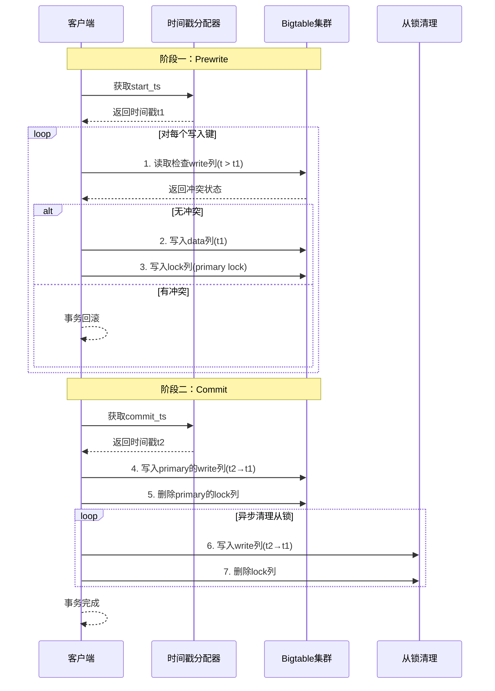
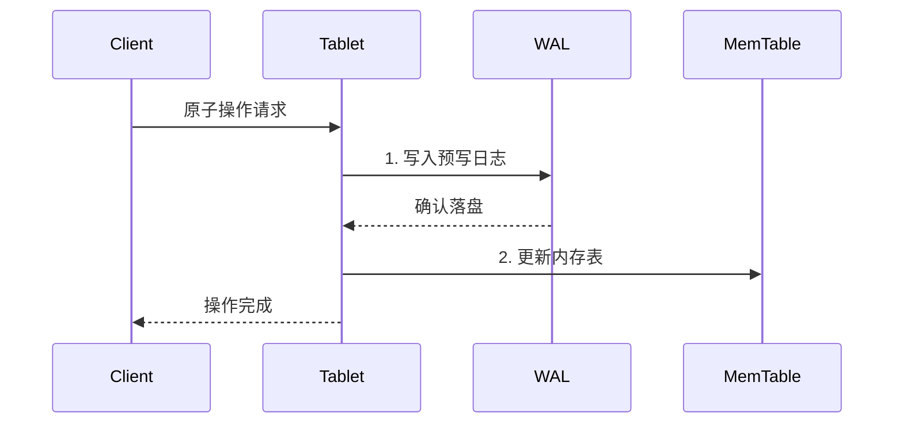

# Google Percolator事务模型

> Google Percolator是Google基于Bigtable构建的分布式事务系统，采用两阶段提交优化和乐观并发控制，为海量数据提供跨行跨表事务支持。

---

## 📋 目录

- [Google Percolator事务模型](#google-percolator事务模型)
  - [📋 目录](#-目录)
  - [1. 概述](#1-概述)
    - [1.1 什么是Percolator](#11-什么是percolator)
    - [1.2 设计动机](#12-设计动机)
    - [1.3 核心特点](#13-核心特点)
  - [2. 核心设计](#2-核心设计)
    - [2.1 数据模型](#21-数据模型)
    - [2.2 时间戳分配器](#22-时间戳分配器)
  - [3. 事务流程](#3-事务流程)
    - [3.1 事务执行时序](#31-事务执行时序)
    - [3.2 事务状态机](#32-事务状态机)
  - [4. 乐观并发控制](#4-乐观并发控制)
    - [4.1 冲突检测机制](#41-冲突检测机制)
    - [4.2 读操作实现](#42-读操作实现)
  - [5. Bigtable事务实现](#5-bigtable事务实现)
    - [5.1 单行事务保证](#51-单行事务保证)
    - [5.2 锁清理机制](#52-锁清理机制)
  - [6. 性能分析](#6-性能分析)
    - [6.1 延迟分析](#61-延迟分析)
    - [6.2 吞吐量优化](#62-吞吐量优化)
    - [6.3 优缺点](#63-优缺点)
  - [7. 工业案例分析](#7-工业案例分析)
    - [7.1 Google索引系统](#71-google索引系统)
    - [7.2 TiDB中的Percolator实现](#72-tidb中的percolator实现)
    - [7.3 适用场景总结](#73-适用场景总结)
  - [📚 参考资料](#-参考资料)
    - [学术论文](#学术论文)
    - [开源实现](#开源实现)
    - [相关文档](#相关文档)

---

## 1. 概述

### 1.1 什么是Percolator

Percolator是Google于2010年发表的分布式事务系统，构建在Bigtable之上，为Google的索引系统提供跨行跨表的ACID事务支持。它采用**乐观并发控制(OCC)**和**两阶段提交(2PC)**的变体，实现了可串行化隔离级别。

### 1.2 设计动机

Google原有的索引系统采用MapReduce批量处理，延迟高达数天。Percolator的目标是实现：

- **增量处理**：文档更新后立即被索引
- **强一致性**：跨行事务保证数据一致性
- **水平扩展**：利用Bigtable的分布式架构

### 1.3 核心特点

| 特性 | 说明 |
|:---|:---|
| 无中心协调者 | 利用Bigtable单行事务，无需独立协调者 |
| 乐观并发控制 | 提交时检测冲突，提高读性能 |
| 多版本存储 | 基于时间戳的MVCC实现 |
| 分布式事务 | 支持跨行、跨表事务 |

---

## 2. 核心设计

### 2.1 数据模型

Percolator在Bigtable的列族设计上增加三个特殊列：

```
┌─────────────────────────────────────────────────────────┐
│                    Percolator数据行                      │
├─────────────┬─────────────┬─────────────┬───────────────┤
│   data列    │   lock列    │  write列    │   notify列    │
├─────────────┼─────────────┼─────────────┼───────────────┤
│ 实际数据值   │ 事务锁信息   │ 提交时间戳   │ 变更通知标记   │
│ <timestamp> │ <timestamp> │ <timestamp> │               │
└─────────────┴─────────────┴─────────────┴───────────────┘
```

**各列作用**：

- **data列**：存储实际数据值，带时间戳版本
- **lock列**：标记数据被哪个事务锁定
- **write列**：记录已提交事务的时间戳映射
- **notify列**：触发下游增量处理

### 2.2 时间戳分配器

Percolator依赖**全局时间戳分配器(TSO)**提供严格递增的时间戳：

```java
public class TimestampOracle {
    private long currentTimestamp;

    /**
     * 获取开始时间戳(start_ts)
     * 用于事务读取数据快照
     */
    public synchronized long getStartTimestamp() {
        return currentTimestamp++;
    }

    /**
     * 获取提交时间戳(commit_ts)
     * 用于事务提交时标记新版本
     */
    public synchronized long getCommitTimestamp() {
        return currentTimestamp++;
    }
}
```

---

## 3. 事务流程

### 3.1 事务执行时序



### 3.2 事务状态机

```
                    ┌─────────────┐
                    │   Start     │
                    └──────┬──────┘
                           │ 获取start_ts
                           ▼
                    ┌─────────────┐
         ┌─────────│   Read      │◄────────┐
         │         └──────┬──────┘         │
         │                │ 读取数据        │
         │                ▼                │
         │         ┌─────────────┐         │
         │    ┌───▶│  Prewrite   │────┐    │
         │    │    └──────┬──────┘    │    │
         │冲突 │           │ 预写入     │    │
         └────┘           ▼            │    │
                    ┌─────────────┐    │    │
                    │   Commit    │────┘    │
                    └──────┬──────┘ 提交成功 │
                           │                │
                           ▼                │
                    ┌─────────────┐         │
                    │  Committed  │─────────┘
                    └─────────────┘
```

---

## 4. 乐观并发控制

### 4.1 冲突检测机制

Percolator在**Prewrite阶段**进行冲突检测：

```java
public class PercolatorTransaction {
    private long startTs;
    private Map<String, byte[]> writes = new HashMap<>();

    /**
     * Prewrite阶段：预写入并检测冲突
     */
    public boolean prewrite(String key, byte[] value) {
        // 1. 检查write列是否存在start_ts之后的提交
        long latestCommit = bigtable.readWriteColumn(key);
        if (latestCommit > startTs) {
            // 发现写写冲突，事务必须回滚
            throw new WriteConflictException(
                "Write conflict detected at key: " + key);
        }

        // 2. 检查是否已有未提交的lock
        Lock existingLock = bigtable.readLockColumn(key);
        if (existingLock != null) {
            // 有其他事务正在进行，需要回滚或等待
            throw new LockConflictException(
                "Lock exists at key: " + key);
        }

        // 3. 写入data列和lock列
        bigtable.putDataColumn(key, startTs, value);
        bigtable.putLockColumn(key, startTs, generateLockInfo());

        return true;
    }
}
```

### 4.2 读操作实现

```java
/**
 * 读取数据时获取start_ts之前的最新已提交版本
 */
public byte[] read(String key) {
    // 1. 首先检查是否有未提交的lock
    Lock lock = bigtable.readLockColumn(key);
    if (lock != null && lock.timestamp <= startTs) {
        // 遇到未提交事务，可能需要等待或清理孤儿锁
        handleLockConflict(key, lock);
    }

    // 2. 从write列找到start_ts之前的最新提交
    WriteRecord write = bigtable.readWriteColumnBefore(key, startTs);
    if (write == null) {
        return null; // 键不存在
    }

    // 3. 根据write记录指向的时间戳读取data列
    return bigtable.readDataColumn(key, write.dataTimestamp);
}
```

---

## 5. Bigtable事务实现

### 5.1 单行事务保证

Percolator依赖Bigtable的**单行原子性**实现分布式事务：



### 5.2 锁清理机制

当事务协调者崩溃时，需要**锁清理(Lock Cleaning)**机制：

```java
/**
 * 处理孤儿锁的清理
 */
public class LockCleaner {

    public void cleanOrphanLock(String key, Lock lock) {
        // 1. 检查primary lock状态
        String primaryKey = lock.primaryKey;
        Lock primaryLock = bigtable.readLockColumn(primaryKey);

        if (primaryLock == null) {
            // Primary已提交，可以安全提交secondary
            WriteRecord write = bigtable.readWriteColumn(primaryKey);
            if (write != null) {
                // Primary已提交，补写secondary的write列
                commitSecondary(key, lock, write.timestamp);
            }
        } else {
            // Primary仍存在，检查锁是否过期
            if (isLockExpired(primaryLock)) {
                // 锁已过期，回滚整个事务
                rollbackTransaction(primaryKey, lock);
            }
        }
    }

    private boolean isLockExpired(Lock lock) {
        long lockTimeout = 10000; // 10秒超时
        return System.currentTimeMillis() - lock.createTime > lockTimeout;
    }
}
```

---

## 6. 性能分析

### 6.1 延迟分析

| 操作 | 延迟来源 | 典型延迟 |
|:---|:---|:---:|
| 获取start_ts | 网络RTT | ~1ms |
| Prewrite | 2×Bigtable写入 | ~10ms |
| 获取commit_ts | 网络RTT | ~1ms |
| Commit | 2×Bigtable写入 | ~10ms |
| **总延迟** | - | **~22ms** |

### 6.2 吞吐量优化

```yaml
# Percolator性能优化配置
percolator:
  # 批处理配置
  batch_write:
    enabled: true
    max_batch_size: 100

  # 锁超时配置
  lock:
    timeout_ms: 10000
    cleanup_interval_ms: 1000

  # 时间戳分配器优化
  timestamp_oracle:
    batch_size: 1000  # 批量分配时间戳
    cache_size: 10000
```

### 6.3 优缺点

| 优势 | 说明 |
|:---|:---|
| 无单点协调者 | 利用Bigtable实现分布式协调 |
| 读性能高 | 乐观并发控制，读操作无锁 |
| 可串行化 | 提供最强隔离级别 |

| 局限性 | 说明 |
|:---|:---|
| 写放大 | 每行数据需要3个Bigtable操作 |
| 冲突回滚 | 高冲突场景下事务失败率高 |
| 延迟较高 | 需要多轮RPC交互 |

---

## 7. 工业案例分析

### 7.1 Google索引系统

Google使用Percolator替代MapReduce进行网页索引：

```
┌──────────────────────────────────────────────────────┐
│              Google Percolator架构                    │
├──────────────────────────────────────────────────────┤
│  应用层：索引处理器、去重服务、PageRank计算           │
├──────────────────────────────────────────────────────┤
│  事务层：Percolator客户端库、时间戳分配器             │
├──────────────────────────────────────────────────────┤
│  存储层：Bigtable集群（数百个Tablet Server）          │
└──────────────────────────────────────────────────────┘
```

**效果对比**：

| 指标 | MapReduce | Percolator | 提升 |
|:---|:---:|:---:|:---:|
| 文档处理延迟 | 数天 | 秒级 | 1000x+ |
| 索引更新频率 | 批量 | 实时 | - |
| 存储开销 | 1x | 3x | - |

### 7.2 TiDB中的Percolator实现

TiDB采用Percolator模型实现分布式事务：

```go
// TiDB事务管理器简化代码
type TxnManager struct {
    store     *TiKVStore
    oracle    *TimestampOracle
    startTS   uint64
    mutations map[string]Mutation
}

// 两阶段提交实现
func (tm *TxnManager) Commit() error {
    // 阶段一：Prewrite
    for key, mutation := range tm.mutations {
        if err := tm.prewriteKey(key, mutation); err != nil {
            return err // 冲突，回滚
        }
    }

    // 获取提交时间戳
    commitTS, err := tm.oracle.GetTimestamp()
    if err != nil {
        tm.rollback()
        return err
    }

    // 阶段二：Commit
    return tm.commitPrimary(commitTS)
}
```

### 7.3 适用场景总结

| 场景 | 适用性 | 原因 |
|:---|:---:|:---|
| 高并发读 | ⭐⭐⭐⭐⭐ | 乐观并发控制，读无锁 |
| 低冲突写 | ⭐⭐⭐⭐ | 提交成功率高 |
| 高冲突写 | ⭐⭐ | 频繁回滚 |
| 长事务 | ⭐⭐ | 锁持有时间长 |
| 跨行事务 | ⭐⭐⭐⭐⭐ | 原生支持 |

---

## 📚 参考资料

### 学术论文

1. [Large-scale Incremental Processing Using Distributed Transactions and Notifications](https://research.google/pubs/pub36726/) - Daniel Peng et al., OSDI 2010

### 开源实现

1. [TiDB Transaction](https://github.com/pingcap/tidb/tree/master/store/driver) - Percolator模型的Go实现
2. [ByteKV](https://github.com/bytedance/bytekv) - 字节跳动分布式KV存储

### 相关文档

- [MVCC多版本并发控制](./MVCC多版本并发控制.md)
- [2PC两阶段提交详解](./2PC两阶段提交详解.md)

---

> 💡 **总结**：Percolator通过乐观并发控制和Bigtable单行事务，实现了无需中心协调者的分布式事务系统。它为后续的NewSQL数据库（如TiDB、CockroachDB）提供了重要参考。

**文档版本**：v1.0
**最后更新**：2026-04-04
**作者**：分布式计算知识库
