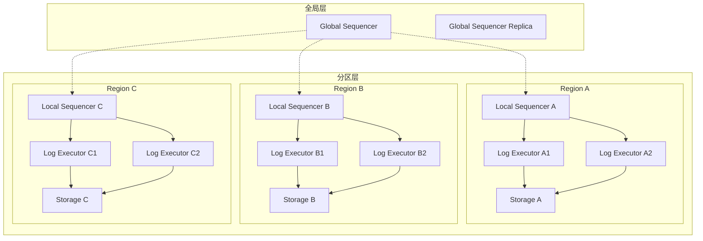
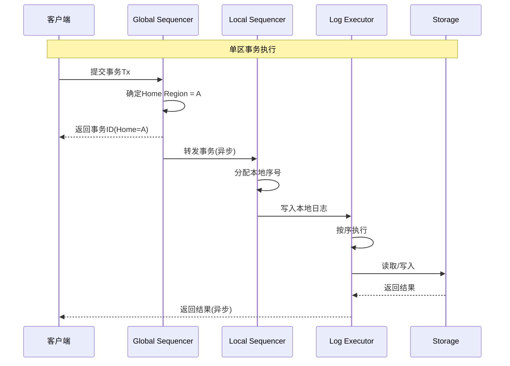
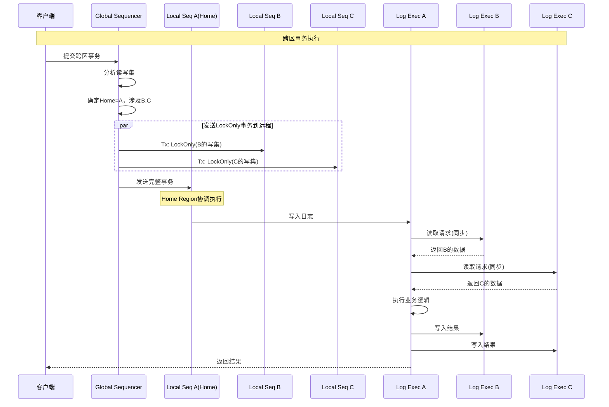
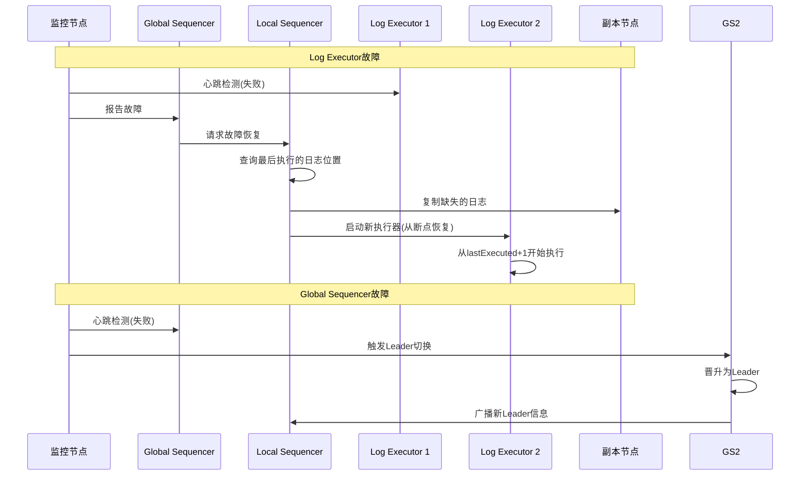

# Slog分区事务系统

> Slog是MIT提出的确定性分区事务系统，通过确定性执行和智能事务路由，实现低延迟高吞吐的跨分区事务处理，无需两阶段提交。

---

## 📋 目录

- [1. 概述](#1-概述)
- [2. 系统架构](#2-系统架构)
- [3. 分区事务模型](#3-分区事务模型)
- [4. 确定性执行](#4-确定性执行)
- [5. 高可用设计](#5-高可用设计)
- [6. 性能分析](#6-性能分析)
- [7. 工业实践](#7-工业实践)

---

## 1. 概述

### 1.1 什么是Slog

Slog是MIT于2018年发表的确定性分区事务系统，发表于SIGMOD会议。它通过**确定性执行**和**事务预分析**，实现了：

- **单分区事务**：本地执行，无需协调
- **跨分区事务**：确定性排序，无需2PC
- **高可用性**：快速故障恢复

### 1.2 核心创新

```
┌─────────────────────────────────────────────────────────┐
│                    Slog核心创新                          │
├─────────────────────────────────────────────────────────┤
│  1. 确定性分区                                           │
│     - 每个事务只属于一个分区(Home Region)                │
│     - 跨分区操作通过确定性消息传递                       │
├─────────────────────────────────────────────────────────┤
│  2. 单日志排序                                           │
│     - 每个分区维护一个确定性日志                         │
│     - 所有副本执行相同日志，保证一致                     │
├─────────────────────────────────────────────────────────┤
│  3. 事务分类处理                                         │
│     - 单区事务：本地直接执行                             │
│     - 跨区事务：协调者驱动，但无需2PC                    │
└─────────────────────────────────────────────────────────┘
```

### 1.3 与Calvin对比

| 特性 | Calvin | Slog |
|:---|:---|:---|
| 全局排序 | 单一Sequencer集群 | 分区本地Sequencer |
| 跨分区事务 | 所有分区参与排序 | 仅涉及分区参与 |
| 扩展性 | Sequencer可能成为瓶颈 | 更好的水平扩展 |
| 延迟 | 批次延迟(通常10ms) | 单区事务延迟更低 |
| 确定性 | 全局确定性 | 分区级确定性 |

---

## 2. 系统架构

### 2.1 整体架构



### 2.2 核心组件

| 组件 | 职责 | 部署方式 |
|:---|:---|:---|
| **Global Sequencer** | 分配事务Home Region | 多副本， Paxos |
| **Local Sequencer** | 本地事务排序 | 每Region一个 |
| **Log Executor** | 执行日志中的事务 | 多实例并行 |
| **Storage** | 数据存储 | 每Region独立 |

### 2.3 事务路由

```go
// Slog事务路由器
type TransactionRouter struct {
    globalSequencer *GlobalSequencer
    partitioner     *Partitioner
}

// 确定事务的Home Region
func (tr *TransactionRouter) RouteTransaction(tx *Transaction) (*RoutingDecision, error) {
    // 分析事务的读写集
    readSet := analyzeReadSet(tx)
    writeSet := analyzeWriteSet(tx)

    // 确定Home Region
    // 策略1: 写入最多的分区
    homeRegion := tr.partitioner.MostWrittenRegion(writeSet)

    // 策略2: 如果均匀分布，选择读取最多的分区
    if isUniformDistribution(writeSet) {
        homeRegion = tr.partitioner.MostReadRegion(readSet)
    }

    // 分类事务类型
    involvedRegions := getInvolvedRegions(readSet, writeSet)

    if len(involvedRegions) == 1 && involvedRegions[0] == homeRegion {
        return &RoutingDecision{
            Type:       SingleHome,
            HomeRegion: homeRegion,
        }, nil
    }

    return &RoutingDecision{
        Type:            MultiHome,
        HomeRegion:      homeRegion,
        InvolvedRegions: involvedRegions,
    }, nil
}
```

---

## 3. 分区事务模型

### 3.1 单区事务



### 3.2 跨区事务



### 3.3 事务类型定义

```go
// Slog事务类型
const (
    // 单区事务：完全在一个Region执行
    SingleHome TxType = iota

    // 跨区事务：需要访问多个Region
    MultiHome

    // LockOnly事务：仅在远程Region获取锁
    LockOnly
)

type SlogTransaction struct {
    Type       TxType
    TxID       string
    HomeRegion RegionID

    // 完整读写集
    ReadSet    map[RegionID][]Key
    WriteSet   map[RegionID][]Key

    // 存储过程(确定性执行)
    Procedure  StoredProcedure

    // 输入参数
    Inputs     map[string]interface{}
}

// 创建LockOnly事务
func NewLockOnlyTx(
    parentTxID string,
    targetRegion RegionID,
    writeSet []Key,
) *SlogTransaction {
    return &SlogTransaction{
        Type:       LockOnly,
        TxID:       fmt.Sprintf("%s-lock-%s", parentTxID, targetRegion),
        HomeRegion: targetRegion,
        WriteSet:   map[RegionID][]Key{targetRegion: writeSet},
    }
}
```

---

## 4. 确定性执行

### 4.1 确定性保证

```
Slog确定性执行保证:

┌─────────────────────────────────────────────────────────┐
│  1. 全局排序：Global Sequencer为事务分配Home Region      │
│  2. 本地排序：Local Sequencer分配单调递增序号            │
│  3. 顺序执行：Log Executor按序号严格顺序执行             │
│  4. 消息排序：跨Region消息带有序列号，保证顺序           │
└─────────────────────────────────────────────────────────┘

结果：所有副本执行相同的日志序列，得到相同的结果
```

### 4.2 日志执行器

```go
// Slog日志执行器
type LogExecutor struct {
    regionID     RegionID
    log          *DeterministicLog
    storage      Storage

    // 执行状态
    lastExecuted uint64
    pendingReads map[uint64]chan Response
}

// 主执行循环
func (le *LogExecutor) Run() {
    for {
        // 获取下一条日志条目
        entry := le.log.Get(le.lastExecuted + 1)

        switch entry.Type {
        case SingleHomeTx:
            le.executeSingleHomeTx(entry)
        case MultiHomeTx:
            le.executeMultiHomeTx(entry)
        case LockOnlyTx:
            le.executeLockOnlyTx(entry)
        case RemoteReadRequest:
            le.handleRemoteRead(entry)
        case RemoteWrite:
            le.handleRemoteWrite(entry)
        }

        le.lastExecuted++
    }
}

// 执行单区事务
func (le *LogExecutor) executeSingleHomeTx(entry *LogEntry) {
    tx := entry.Transaction

    // 按预定顺序获取锁
    locks := acquireLocksInOrder(tx.WriteSet[le.regionID])
    defer releaseLocks(locks)

    // 读取本地数据
    readResults := make(map[Key]Value)
    for _, key := range tx.ReadSet[le.regionID] {
        readResults[key] = le.storage.Read(key)
    }

    // 确定性执行
    result := tx.Procedure.Execute(tx.Inputs, readResults)

    // 写入结果
    for key, value := range result.Writes {
        le.storage.Write(key, value)
    }
}

// 执行跨区事务(Home Region)
func (le *LogExecutor) executeMultiHomeTx(entry *LogEntry) {
    tx := entry.Transaction

    // 1. 确保所有LockOnly已在远程执行
    le.waitForLockOnlyTxs(tx)

    // 2. 发送远程读取请求
    remoteData := make(map[RegionID]map[Key]Value)
    for region, keys := range tx.ReadSet {
        if region != le.regionID {
            remoteData[region] = le.requestRemoteRead(region, keys)
        }
    }

    // 3. 读取本地数据
    localData := make(map[Key]Value)
    for _, key := range tx.ReadSet[le.regionID] {
        localData[key] = le.storage.Read(key)
    }

    // 4. 合并数据并执行
    allData := mergeData(localData, remoteData)
    result := tx.Procedure.Execute(tx.Inputs, allData)

    // 5. 发送远程写入
    for region, writes := range result.Writes {
        if region != le.regionID {
            le.sendRemoteWrite(region, writes)
        } else {
            // 本地写入
            for key, value := range writes {
                le.storage.Write(key, value)
            }
        }
    }
}
```

### 4.3 存储过程示例

```sql
-- Slog存储过程：跨区转账
-- 必须提前声明读写集

CREATE DETERMINISTIC PROCEDURE CrossRegionTransfer(
    IN from_region STRING,
    IN from_account INT,
    IN to_region STRING,
    IN to_account INT,
    IN amount DECIMAL
)
READ_SET(
    from_region: [account:from_account],
    to_region: [account:to_account]
)
WRITE_SET(
    from_region: [account:from_account],
    to_region: [account:to_account]
)
BEGIN
    -- 读取余额(由系统自动从对应Region获取)
    DECLARE from_balance DECIMAL = READ(from_region, account, from_account, balance);
    DECLARE to_balance DECIMAL = READ(to_region, account, to_account, balance);

    -- 业务逻辑
    IF from_balance < amount THEN
        RETURN ERROR('Insufficient balance');
    END IF;

    -- 计算新余额
    DECLARE new_from_balance = from_balance - amount;
    DECLARE new_to_balance = to_balance + amount;

    -- 写入结果(系统自动路由到对应Region)
    WRITE(from_region, account, from_account, balance, new_from_balance);
    WRITE(to_region, account, to_account, balance, new_to_balance);

    RETURN SUCCESS();
END;
```

---

## 5. 高可用设计

### 5.1 故障检测与恢复



### 5.2 快速故障恢复

```go
// Slog故障恢复管理器
type RecoveryManager struct {
    logStore     *LogStore
    checkpoint   *Checkpoint
}

// 恢复Log Executor
func (rm *RecoveryManager) RecoverLogExecutor(
    region RegionID,
    failedLE LogExecutorID,
) error {
    // 1. 获取故障执行器的最后位置
    lastPos := rm.logStore.GetLastExecuted(region, failedLE)

    // 2. 创建新的执行器实例
    newLE := &LogExecutor{
        regionID:     region,
        lastExecuted: lastPos,
    }

    // 3. 从其他副本复制缺失的日志
    missingLog := rm.logStore.FetchMissing(region, lastPos+1)

    // 4. 追赶执行
    for _, entry := range missingLog {
        newLE.replay(entry)
    }

    // 5. 开始正常执行
    go newLE.Run()

    return nil
}

// 恢复Global Sequencer
func (rm *RecoveryManager) RecoverGlobalSequencer() error {
    // Slog使用Paxos选举新Leader
    // 新Leader从Paxos日志恢复状态
    // 无需等待，可立即开始排序

    // 关键：事务可能已被原Leader分配
    // 但可能未发送到Local Sequencer
    // 解决方案：超时重分配

    return rm.electNewLeader()
}
```

### 5.3 副本一致性

| 组件 | 复制策略 | 恢复时间 |
|:---|:---|:---:|
| Global Sequencer | Paxos | <100ms |
| Local Sequencer | 单点(可热备) | <50ms |
| Log Executor | 状态无关，快速重启 | <1s |
| Storage | 每Region多副本 | 自动切换 |

---

## 6. 性能分析

### 6.1 延迟分析

| 事务类型 | 延迟组成 | 典型延迟 |
|:---|:---|:---:|
| 单区事务 | 本地执行 | <1ms |
| 两区事务 | 2×网络RTT + 本地执行 | ~10ms |
| 三区事务 | 4×网络RTT + 本地执行 | ~20ms |
| Calvin(对比) | 批次延迟(通常10ms) | ~15ms |

### 6.2 吞吐量对比

```
吞吐量 (K TPS)
   │
600├─────────────────────┐
   │                     │ Slog单区
500│         ┌───────────┘
   │         │
400│    ┌────┘
   │    │
300├────┘                    ┌──────────
   │                         │
200│                         │ Slog跨区
   │    ┌────────────────────┘
100│    │
   │    │              Calvin
  0└────┴────┬────┬────┬────┬────┬──→ 节点数
            10   20   30   40   50
```

### 6.3 优化技术

```yaml
# Slog性能优化配置
slog:
  sequencer:
    # 批次大小
    batch_size: 100
    # 最大等待时间
    max_wait_ms: 1

  executor:
    # 并行执行线程数
    parallel_threads: 8
    # 预读缓存大小
    prefetch_cache: 10000

  network:
    # 专用RDMA网络
    use_rdma: true
    # 连接池大小
    connection_pool: 100

  partition:
    # 动态分区调整
    dynamic_repartitioning: true
    # 负载均衡阈值
    rebalance_threshold: 0.2
```

---

## 7. 工业实践

### 7.1 适用场景

| 场景 | Slog适用性 | 原因 |
|:---|:---:|:---|
| 高频单区事务 | ⭐⭐⭐⭐⭐ | 本地执行，延迟极低 |
| 低频跨区事务 | ⭐⭐⭐⭐ | 确定性执行，无2PC开销 |
| 高频跨区事务 | ⭐⭐⭐ | 网络开销不可避免 |
| 复杂分析查询 | ⭐⭐ | 确定性执行不适合 |
| 地理分布式OLTP | ⭐⭐⭐⭐⭐ | 分区感知，优化延迟 |

### 7.2 分区策略最佳实践

```go
// Slog分区策略实现
type PartitionStrategy interface {
    GetHomeRegion(tx *Transaction) RegionID
    RebalancePartitions(stats *PartitionStats)
}

// 基于访问模式的分区
type AccessPatternPartitioner struct {
    affinityGraph *AffinityGraph
}

func (ap *AccessPatternPartitioner) GetHomeRegion(tx *Transaction) RegionID {
    // 分析事务历史访问模式
    // 将关联度高的键放在同一Region

    scores := make(map[RegionID]float64)

    for _, key := range tx.WriteSet {
        for region, affinity := range ap.affinityGraph.GetAffinity(key) {
            scores[region] += affinity * 2.0 // 写操作权重更高
        }
    }

    for _, key := range tx.ReadSet {
        for region, affinity := range ap.affinityGraph.GetAffinity(key) {
            scores[region] += affinity
        }
    }

    return maxScoreRegion(scores)
}

// 地理分区策略
type GeoPartitioner struct {
    geoMapping map[Key]RegionID
}

func (gp *GeoPartitioner) GetHomeRegion(tx *Transaction) RegionID {
    // 基于用户地理位置分区
    // 例如：用户在北京，数据放在北京Region

    userRegion := gp.getUserRegion(tx.UserID)
    return userRegion
}
```

### 7.3 代码示例：客户端使用

```java
/**
 * Slog客户端API
 */
public class SlogClient {
    private final GlobalSequencerClient gsClient;

    /**
     * 执行单区事务
     */
    public Result executeSingleHomeTx(
        String procedureName,
        Map<String, Object> inputs
    ) throws SlogException {
        // 1. 创建事务
        Transaction tx = Transaction.builder()
            .procedure(procedureName)
            .inputs(inputs)
            .build();

        // 2. 发送到Global Sequencer
        TransactionID txId = gsClient.submit(tx);

        // 3. 等待执行完成
        return gsClient.waitForResult(txId);
    }

    /**
     * 执行跨区事务
     */
    public Result executeMultiHomeTx(
        String procedureName,
        Map<String, Object> inputs
    ) throws SlogException {
        // 与单区事务API相同
        // Slog自动处理跨区协调
        return executeSingleHomeTx(procedureName, inputs);
    }
}

// 使用示例
public class PaymentService {
    private final SlogClient slogClient;

    public void transfer(
        String fromUser,
        String toUser,
        BigDecimal amount
    ) {
        Map<String, Object> inputs = new HashMap<>();
        inputs.put("from_user", fromUser);
        inputs.put("to_user", toUser);
        inputs.put("amount", amount);

        // Slog自动确定分区，处理跨区情况
        Result result = slogClient.executeMultiHomeTx(
            "CrossRegionTransfer",
            inputs
        );

        if (!result.isSuccess()) {
            throw new TransferException(result.getError());
        }
    }
}
```

---

## 📚 参考资料

### 学术论文

1. [Slog: Serializable, Low-latency, Geo-replicated Transactions](https://dl.acm.org/doi/10.14778/3317315.3317316) - Kun Ren et al., VLDB 2019

### 相关系统

1. [Calvin](./calvin事务.md) - Slog的灵感来源
2. [Spanner](./spanner事务.md) - 跨地域事务处理

### 相关文档

- [分布式事务选型指南](./分布式事务选型指南.md)
- [并发控制算法对比](./并发控制算法对比.md)

---

> 💡 **总结**：Slog通过确定性分区执行，在保持高吞吐的同时显著降低了单区事务延迟。它是Calvin架构的重要演进，特别适合地理分布的OLTP应用。

**文档版本**：v1.0
**最后更新**：2026-04-04
**作者**：分布式计算知识库
