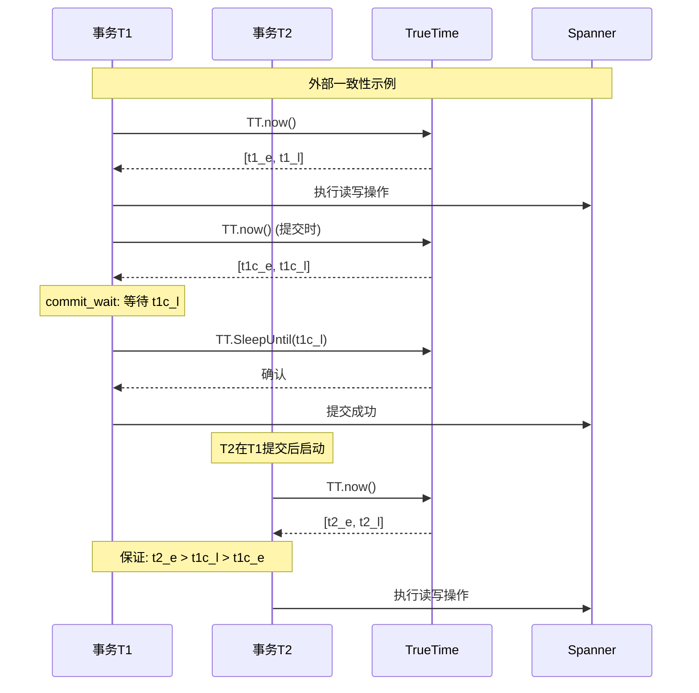
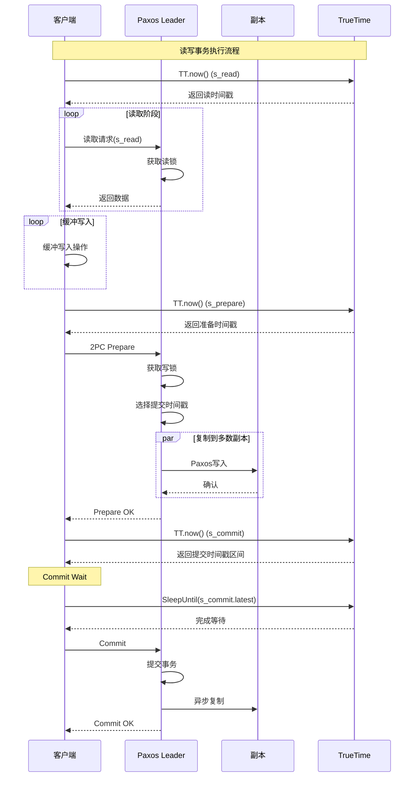
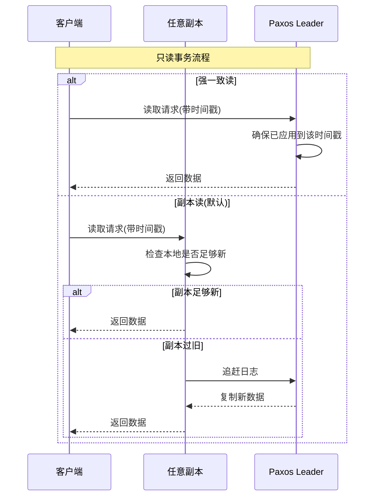
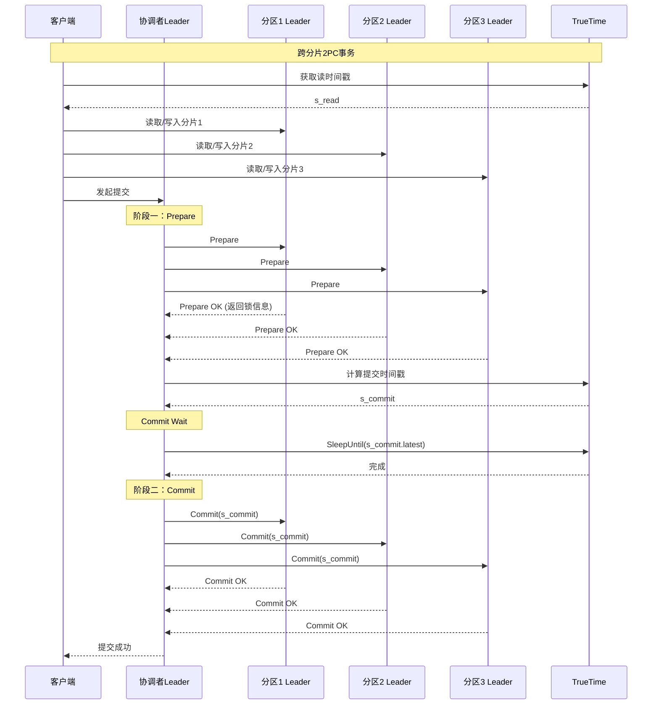

# Spanner分布式事务

> Google Spanner是全球分布式的强一致性数据库，通过TrueTime API实现外部一致性，提供读写事务、只读事务快照和快照读等多种事务模式。

---

## 📋 目录

- [1. 概述](#1-概述)
- [2. TrueTime与外部一致性](#2-truetime与外部一致性)
- [3. 读写事务](#3-读写事务)
- [4. 只读事务快照](#4-只读事务快照)
- [5. 事务实现机制](#5-事务实现机制)
- [6. 性能优化](#6-性能优化)
- [7. 工业案例](#7-工业案例)

---

## 1. 概述

### 1.1 什么是Spanner

Spanner是Google于2012年发表的全球分布式数据库，发表于OSDI会议。它是全球第一个提供：

- **外部一致性**：事务按全局时间顺序执行
- **高可用性**：多副本，自动故障切换
- **水平扩展**：自动分片和负载均衡

### 1.2 核心创新

```
┌─────────────────────────────────────────────────────────┐
│                    Spanner核心创新                       │
├─────────────────────────────────────────────────────────┤
│  1. TrueTime API                                        │
│     - 原子钟 + GPS时钟同步                               │
│     - 提供时间不确定性区间[earliest, latest]             │
├─────────────────────────────────────────────────────────┤
│  2. 外部一致性                                          │
│     - 如果T2在T1提交后启动，则T2的提交时间 > T1          │
│     - 全局有序的事务执行                                 │
├─────────────────────────────────────────────────────────┤
│  3. 多版本并发控制                                       │
│     - 基于提交时间戳的版本管理                           │
│     - 快照读支持任意历史版本                             │
└─────────────────────────────────────────────────────────┘
```

### 1.3 事务类型

| 事务类型 | 一致性级别 | 适用场景 |
|:---|:---|:---|
| **读写事务** | 外部一致性 | 需要写入的OLTP操作 |
| **只读事务** | 外部一致性 | 需要强一致的读取 |
| **快照读** | 快照隔离 | 历史数据查询、分析 |

---

## 2. TrueTime与外部一致性

### 2.1 TrueTime API

```go
// TrueTime API接口
type TrueTime struct {
    // 返回当前时间区间
    // TT.now() = [earliest, latest]
    // 不确定性区间: uncertainty = latest - earliest
}

// 获取当前时间区间
func (tt *TrueTime) Now() TimeInterval {
    return TimeInterval{
        Earliest: tt.estimate(),
        Latest:   tt.estimate() + tt.uncertainty(),
    }
}

// 等待直到可以确信时间已过
func (tt *TrueTime) SleepUntil(t Timestamp) {
    for {
        now := tt.Now()
        if now.Latest >= t {
            return
        }
        time.Sleep(now.Latest - t)
    }
}
```

### 2.2 外部一致性保证



### 2.3 时间戳分配规则

```go
// 外部一致性时间戳分配
type TimestampOracle struct {
    truetime *TrueTime
    lastTs   Timestamp
}

func (to *TimestampOracle) GetReadTimestamp() Timestamp {
    // 读时间戳：当前时间的latest
    // 保证能看到所有已提交事务
    now := to.truetime.Now()
    return now.Latest
}

func (to *TimestampOracle) GetCommitTimestamp() Timestamp {
    // 提交时间戳：max(当前时间, 最后分配时间+ε)
    now := to.truetime.Now()

    // 确保单调递增
    commitTs := max(now.Earliest, to.lastTs+1)
    to.lastTs = commitTs

    // Commit Wait: 等待不确定性区间
    to.truetime.SleepUntil(now.Latest)

    return commitTs
}
```

---

## 3. 读写事务

### 3.1 读写事务流程



### 3.2 读写事务实现

```java
/**
 * Spanner读写事务客户端
 */
public class SpannerReadWriteTransaction {
    private final SpannerClient spanner;
    private final TrueTime trueTime;

    private Timestamp readTimestamp;
    private List<Mutation> bufferedWrites;

    public void begin() {
        // 获取读时间戳
        TimeInterval now = trueTime.now();
        this.readTimestamp = now.latest;
    }

    /**
     * 读取操作
     */
    public ResultSet read(KeySet keys, String table) {
        ReadRequest request = ReadRequest.newBuilder()
            .setTable(table)
            .setKeys(keys)
            .setTimestamp(readTimestamp)
            .build();
        return spanner.read(request);
    }

    /**
     * 缓冲写入
     */
    public void write(Mutation mutation) {
        bufferedWrites.add(mutation);
    }

    /**
     * 提交事务
     */
    public Timestamp commit() {
        // 1. 获取准备时间戳
        TimeInterval prepareTime = trueTime.now();

        // 2. 两阶段提交
        CommitRequest request = CommitRequest.newBuilder()
            .setMutations(bufferedWrites)
            .setPrepareTimestamp(prepareTime.earliest)
            .build();

        CommitResponse response = spanner.commit(request);
        Timestamp commitTs = response.getCommitTimestamp();

        // 3. Commit Wait
        TimeInterval commitInterval = trueTime.now();
        trueTime.sleepUntil(commitInterval.latest);

        return commitTs;
    }
}
```

---

## 4. 只读事务快照

### 4.1 只读事务优势

```
读写事务 vs 只读事务:

┌─────────────────┐          ┌─────────────────┐
│   读写事务       │          │   只读事务       │
├─────────────────┤          ├─────────────────┤
│ - 获取读写锁     │          │ - 无锁           │
│ - 2PC协调       │          │ - 本地读取       │
│ - Commit Wait   │          │ - 无需等待       │
│ - 高延迟        │          │ - 低延迟         │
└─────────────────┘          └─────────────────┘
```

### 4.2 快照读实现

```java
/**
 * 只读事务实现
 */
public class SpannerReadOnlyTransaction {
    private final SpannerClient spanner;
    private final TrueTime trueTime;

    private Timestamp readTimestamp;

    /**
     * 方式1：显式指定时间戳
     */
    public void beginAt(Timestamp timestamp) {
        this.readTimestamp = timestamp;
    }

    /**
     * 方式2：使用当前时间戳
     */
    public void beginNow() {
        TimeInterval now = trueTime.now();
        this.readTimestamp = now.latest;
    }

    /**
     * 方式3：获取过去某个时间的一致性快照
     */
    public void beginAtExactStaleness(Duration staleness) {
        TimeInterval now = trueTime.now();
        // 读取staleness时间之前已提交的数据
        this.readTimestamp = Timestamp.of(
            now.earliest.getSeconds() - staleness.getSeconds()
        );
    }

    /**
     * 读取操作 - 可在任意副本执行
     */
    public ResultSet read(KeySet keys, String table) {
        ReadRequest request = ReadRequest.newBuilder()
            .setTable(table)
            .setKeys(keys)
            .setTimestamp(readTimestamp)
            .setReadOnly(true)
            .build();

        // 路由到最近的副本，无需Leader
        return spanner.readFromNearestReplica(request);
    }
}
```

### 4.3 快照读时序



---

## 5. 事务实现机制

### 5.1 数据布局

```
Spanner数据布局:
┌─────────────────────────────────────────────────────────┐
│  Key: (user_id, timestamp)                              │
├─────────────────────────────────────────────────────────┤
│  (1001, t100) → {name: "Alice", email: "a@example.com"} │
│  (1001, t95)  → {name: "Alice", email: "old@example.com"}│
│  (1002, t98)  → {name: "Bob", email: "b@example.com"}   │
└─────────────────────────────────────────────────────────┘

- 每行数据带提交时间戳
- 支持多版本历史数据
- 垃圾回收旧版本
```

### 5.2 锁管理

```go
// Spanner锁管理器
type LockManager struct {
    // 读锁集
    readLocks map[string]*ReadLock

    // 写锁集
    writeLocks map[string]*WriteLock

    // 等待图(死锁检测)
    waitForGraph *WaitForGraph
}

type ReadLock struct {
    key       string
    holders   []TransactionID
    timestamp Timestamp
}

type WriteLock struct {
    key       string
    holder    TransactionID
    timestamp Timestamp
}

// 获取读锁
func (lm *LockManager) AcquireReadLock(
    txnID TransactionID,
    key string,
) error {
    if writeLock, exists := lm.writeLocks[key]; exists {
        // 检查写写冲突
        if writeLock.holder != txnID {
            return &WriteConflictError{Key: key}
        }
    }

    // 添加读锁
    if _, exists := lm.readLocks[key]; !exists {
        lm.readLocks[key] = &ReadLock{key: key}
    }
    lm.readLocks[key].holders = append(
        lm.readLocks[key].holders, txnID)

    return nil
}

// 获取写锁(用于wound-wait死锁预防)
func (lm *LockManager) AcquireWriteLock(
    txnID TransactionID,
    key string,
) error {
    // Wound-Wait策略
    if readLock, exists := lm.readLocks[key]; exists {
        for _, holder := range readLock.holders {
            if holder != txnID {
                if txnID < holder {
                    // 老事务"伤害"(abort)新事务
                    lm.abortTransaction(holder)
                } else {
                    // 新事务等待
                    lm.waitForGraph.AddEdge(txnID, holder)
                    return &LockWaitError{Key: key}
                }
            }
        }
    }

    lm.writeLocks[key] = &WriteLock{
        key:    key,
        holder: txnID,
    }
    return nil
}
```

### 5.3 跨分片事务



---

## 6. 性能优化

### 6.1 延迟来源分析

| 操作 | 延迟来源 | 典型值 |
|:---|:---|:---:|
| 本地读取 | 本地查询 | <1ms |
| 远程读取 | 网络RTT | 1-100ms |
| 写入 | Paxos复制 | 5-20ms |
| Commit Wait | 时钟不确定性 | 3-7ms |

### 6.2 优化策略

```yaml
# Spanner优化配置
spanner:
  transaction:
    # 副本读取策略
    read_only:
      # 默认路由到最近副本
      route_to_nearest: true
      # 最大副本延迟容忍
      max_replica_staleness: 15s

    # 写优化
    write:
      # 批量提交
      batch_size: 100
      # 乐观并发控制
      use_optimistic_locking: true

    # 分区策略
    partitioning:
      # 根据访问模式分区
      split_keys: ["user_id", "region"]
      # 自动重新分片
      auto_split: true
```

### 6.3 性能数据

| 指标 | 单区域 | 多区域(3个) |
|:---|:---:|:---:|
| 读取吞吐量 | 100K+ QPS | 300K+ QPS |
| 写入吞吐量 | 20K+ TPS | 20K+ TPS |
| 读取延迟(P99) | <5ms | <10ms |
| 写入延迟(P99) | <15ms | <50ms |

---

## 7. 工业案例

### 7.1 Google内部应用

```
┌─────────────────────────────────────────────────────────┐
│                  Google Spanner应用                      │
├─────────────────────────────────────────────────────────┤
│  Gmail: 邮件元数据存储                                   │
│  - 数百PB数据                                            │
│  - 全球多活部署                                          │
├─────────────────────────────────────────────────────────┤
│  Google Play: 应用商店                                   │
│  - 用户购买事务                                          │
│  - 库存管理                                              │
├─────────────────────────────────────────────────────────┤
│  F1(广告系统): 财务数据                                  │
│  - 强一致性要求                                          │
│  - 跨地域事务                                            │
├─────────────────────────────────────────────────────────┤
│  Google Photos: 元数据索引                               │
│  - 照片标签、位置信息                                    │
│  - 时间线查询                                            │
└─────────────────────────────────────────────────────────┘
```

### 7.2 外部一致性保证示例

```python
# Spanner外部一致性示例
from google.cloud import spanner

def demonstrate_external_consistency():
    client = spanner.Client()
    instance = client.instance('my-instance')
    database = instance.database('my-database')

    # 事务1：写入数据
    with database.batch() as batch:
        batch.insert(
            table='Accounts',
            columns=('AccountId', 'Balance'),
            values=[('A', 1000), ('B', 2000)]
        )
    # 返回时，事务1已全局提交

    # 事务2：读取数据
    # 保证看到事务1的写入
    with database.snapshot() as snapshot:
        results = snapshot.execute_sql(
            'SELECT * FROM Accounts'
        )
        for row in results:
            print(row)

    # 即使事务2在远程区域执行
    # 也能保证读取到事务1的写入
```

### 7.3 Cloud Spanner配置

```sql
-- 创建全球数据库
CREATE DATABASE global_bank
    PRIMARY REGION "us-central1"
    REGIONS "europe-west1", "asia-east1"
    OPTIONS (
        optimizer_version = 2,
        version_retention_period = '7d'
    );

-- 创建分区表
CREATE TABLE Accounts (
    AccountId STRING(MAX) NOT NULL,
    Region STRING(10) NOT NULL,
    Balance NUMERIC NOT NULL,
    LastUpdated TIMESTAMP NOT NULL
        OPTIONS (allow_commit_timestamp=true)
) PRIMARY KEY (Region, AccountId),
  INTERLEAVE IN PARENT Regions ON DELETE CASCADE;

-- 创建变更流(用于CDC)
CREATE CHANGE STREAM AllChanges FOR ALL;
```

---

## 📚 参考资料

### 学术论文

1. [Spanner: Google's Globally-Distributed Database](https://dl.acm.org/doi/10.14778/2212351.2212355) - Corbett et al., OSDI 2012

### 技术文档

1. [Cloud Spanner Documentation](https://cloud.google.com/spanner/docs) - Google Cloud官方文档
2. [TrueTime API](https://cloud.google.com/spanner/docs/true-time-external-consistency) - 外部一致性详解

### 相关文档

- [CockroachDB事务](./cockroachdb事务.md)
- [分布式事务选型指南](./分布式事务选型指南.md)

---

> 💡 **总结**：Spanner通过TrueTime API实现了全球范围内的外部一致性，是强一致分布式数据库的标杆。其核心思想是利用高精度时钟消除分布式协调的不确定性。

**文档版本**：v1.0
**最后更新**：2026-04-04
**作者**：分布式计算知识库
