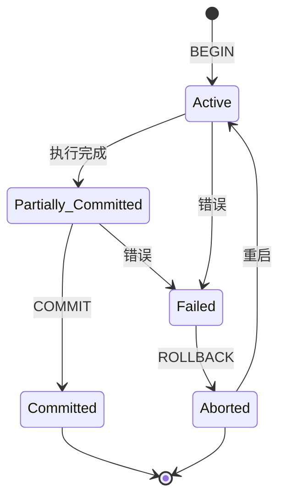
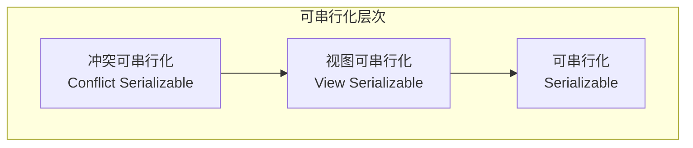
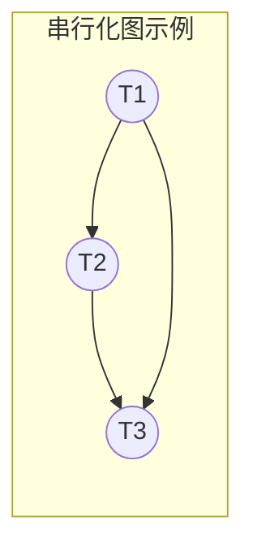
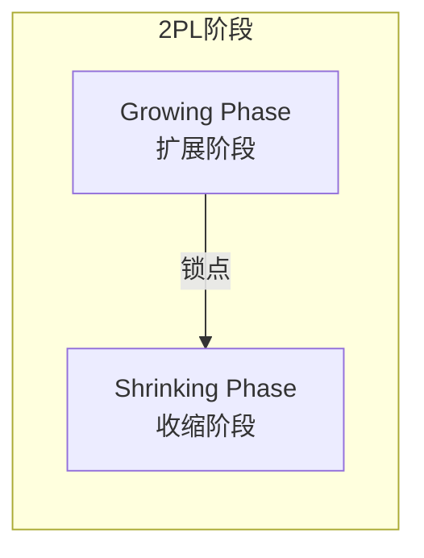
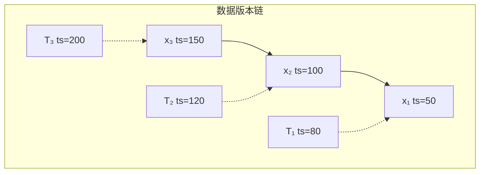
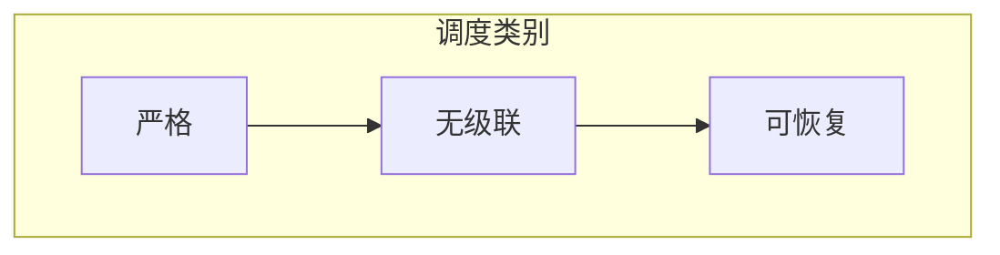

# 分布式事务形式化模型

> 从事务的数学基础出发，深入理解ACID属性的形式化定义与可串行化理论

---

## 📋 目录

- [1. ACID形式化定义](#1-acid形式化定义)
- [2. 串行化理论](#2-串行化理论)
- [3. 可串行化判定](#3-可串行化判定)
- [4. 并发控制理论](#4-并发控制理论)
- [5. 依赖图与串行化图](#5-依赖图与串行化图)

---

## 1. ACID形式化定义

### 1.1 事务的形式化定义

**定义 1.1**（事务）：事务 $T$ 是一个有限的操作序列：

$$
T = \langle o_1, o_2, ..., o_n \rangle
$$

其中 $o_i \in \{read(x), write(x), commit, abort\}$，$x \in \mathcal{D}$ 是数据项，$\mathcal{D}$ 是数据库状态空间。

**定义 1.2**（数据库状态）：数据库状态 $S$ 是从数据项到值的映射：

$$
S: \mathcal{D} \to \mathcal{V}
$$

其中 $\mathcal{V}$ 是值域。

### 1.2 原子性（Atomicity）

**定义 1.3**（原子性）：事务 $T$ 的原子性要求：

$$
\forall S_0 \in \mathcal{S}: exec(T, S_0) = S_1 \implies 
\begin{cases}
\forall o_i \in T: effect(o_i) \text{ applied} & \text{if } commit \in T \\
\forall o_i \in T: effect(o_i) \text{ undone} & \text{if } abort \in T
\end{cases}
$$

即事务的所有操作要么全部生效，要么全部不生效。



### 1.3 一致性（Consistency）

**定义 1.4**（一致性约束）：数据库一致性约束 $C$ 是数据库状态上的谓词：

$$
C: \mathcal{S} \to \{true, false\}
$$

**定义 1.5**（事务一致性）：事务 $T$ 保持一致性当且仅当：

$$
\forall S_0, S_1: C(S_0) \land exec(T, S_0) = S_1 \implies C(S_1)
$$

即如果事务执行前数据库处于一致状态，执行后也必然处于一致状态。

**示例**：转账事务的一致性约束

```
约束C: 所有账户余额之和保持不变

初始状态: S₀ = {A: 100, B: 50}, Σ = 150
事务T: A向B转账30

T = ⟨read(A), A := A-30, write(A), read(B), B := B+30, write(B), commit⟩

执行后: S₁ = {A: 70, B: 80}, Σ = 150

验证: C(S₀) = true, C(S₁) = true ✓
```

### 1.4 隔离性（Isolation）

**定义 1.6**（调度/历史）：调度 $H$ 是多个事务操作的交错序列：

$$
H = \langle o_{i_1}, o_{i_2}, ..., o_{i_m} \rangle, \quad o_{i_j} \in \bigcup_{k} T_k
$$

**定义 1.7**（隔离性）：隔离性要求并发执行的效果等价于某种串行执行：

$$
\exists H_s \in Serial(H): effect(H) \equiv effect(H_s)
$$

其中 $Serial(H)$ 是 $H$ 中事务的所有串行调度集合。

### 1.5 持久性（Durability）

**定义 1.8**（持久性）：一旦事务提交，其效果永久保存：

$$
commit \in T \implies \forall t > t_{commit}: S_t \supseteq effects(T)
$$

即使系统故障，已提交事务的效果不会丢失。

---

## 2. 串行化理论

### 2.1 冲突操作

**定义 2.1**（冲突）：两个操作 $o_i$ 和 $o_j$ 冲突当且仅当：

1. 它们属于不同事务：$T(o_i) \neq T(o_j)$
2. 它们访问同一数据项：$data(o_i) = data(o_j)$
3. 至少一个是写操作：$o_i = write(x) \lor o_j = write(x)$

**冲突类型矩阵**：

| 操作1 \ 操作2 | read(y) | write(y) | read(x) | write(x) |
|:---|:---:|:---:|:---:|:---:|
| read(x) | - | - | - | 冲突 |
| write(x) | - | - | 冲突 | 冲突 |

### 2.2 冲突等价

**定义 2.2**（冲突等价）：两个调度 $H_1$ 和 $H_2$ 冲突等价，当且仅当它们有相同的冲突操作顺序：

$$
H_1 \equiv_c H_2 \iff \forall o_i, o_j: (o_i <_{H_1} o_j \land conflict(o_i, o_j)) \implies o_i <_{H_2} o_j
$$

**定义 2.3**（冲突可串行化）：调度 $H$ 是冲突可串行化的，如果存在串行调度 $H_s$ 使得 $H \equiv_c H_s$。

### 2.3 视图等价

**定义 2.4**（初始读取）：事务 $T_i$ 初始读取数据项 $x$ 在调度 $H$ 中，如果 $T_i$ 执行 $read(x)$ 且在所有其他事务写入 $x$ 之前。

**定义 2.5**（结果写入）：事务 $T_i$ 结果写入数据项 $x$ 在调度 $H$ 中，如果 $T_i$ 的 $write(x)$ 是 $H$ 中关于 $x$ 的最后一个写操作。

**定义 2.6**（视图等价）：两个调度 $H$ 和 H' 视图等价当且仅当：

1. 对每个数据项，初始读取相同
2. 对每个 read(x)，读取的写操作来源相同
3. 对每个数据项，结果写入相同

**定义 2.7**（视图可串行化）：调度 $H$ 是视图可串行化的，如果存在串行调度 $H_s$ 与 $H$ 视图等价。

### 2.4 可串行化层次



**关系**：

$$
\text{Conflict Serializable} \subset \text{View Serializable} \subset \text{All Schedules}
$$

---

## 3. 可串行化判定

### 3.1 串行化图测试

**定义 3.1**（串行化图）：调度 $H$ 的串行化图 $SG(H) = (V, E)$，其中：
- 顶点 $V = \{T_i | T_i \text{ 出现在 } H\}$
- 边 $(T_i, T_j) \in E$ 当且仅当存在冲突操作 $o_i \in T_i$ 和 $o_j \in T_j$ 使得 $o_i <_H o_j$

**定理 3.1**（冲突可串行化判定）：调度 $H$ 是冲突可串行化的当且仅当 $SG(H)$ 是无环的。



上图中无环，因此调度是冲突可串行化的，等价于串行调度 $T_1 \to T_2 \to T_3$。

### 3.2 判定算法实现

```python
from typing import List, Dict, Set, Tuple
from collections import defaultdict, deque

class Operation:
    def __init__(self, transaction: str, op_type: str, data_item: str):
        self.transaction = transaction
        self.op_type = op_type
        self.data_item = data_item

class SerializationGraph:
    def __init__(self):
        self.nodes: Set[str] = set()
        self.edges: Dict[str, Set[str]] = defaultdict(set)
        self.conflicts: List[Tuple[str, str, str]] = []
    
    def add_transaction(self, tid: str):
        self.nodes.add(tid)
    
    def add_edge(self, from_tid: str, to_tid: str, reason: str = ""):
        if from_tid != to_tid:
            self.edges[from_tid].add(to_tid)
            self.conflicts.append((from_tid, to_tid, reason))
    
    def has_cycle(self) -> Tuple[bool, List[str]]:
        in_degree = {node: 0 for node in self.nodes}
        for from_node in self.edges:
            for to_node in self.edges[from_node]:
                in_degree[to_node] += 1
        
        queue = deque([node for node in self.nodes if in_degree[node] == 0])
        topo_order = []
        
        while queue:
            node = queue.popleft()
            topo_order.append(node)
            for neighbor in self.edges[node]:
                in_degree[neighbor] -= 1
                if in_degree[neighbor] == 0:
                    queue.append(neighbor)
        
        if len(topo_order) == len(self.nodes):
            return False, topo_order
        
        cycle = self._find_cycle()
        return True, cycle
    
    def _find_cycle(self) -> List[str]:
        visited = set()
        rec_stack = set()
        path = []
        
        def dfs(node):
            visited.add(node)
            rec_stack.add(node)
            path.append(node)
            
            for neighbor in self.edges[node]:
                if neighbor not in visited:
                    if dfs(neighbor):
                        return True
                elif neighbor in rec_stack:
                    cycle_start = path.index(neighbor)
                    return path[cycle_start:] + [neighbor]
            
            path.pop()
            rec_stack.remove(node)
            return False
        
        for node in self.nodes:
            if node not in visited:
                result = dfs(node)
                if result:
                    return result
        
        return []

def build_serialization_graph(schedule: List[Operation]) -> SerializationGraph:
    sg = SerializationGraph()
    
    for op in schedule:
        sg.add_transaction(op.transaction)
    
    data_item_ops: Dict[str, List[Operation]] = defaultdict(list)
    for op in schedule:
        data_item_ops[op.data_item].append(op)
    
    for data_item, ops in data_item_ops.items():
        for i, op1 in enumerate(ops):
            for op2 in ops[i+1:]:
                if op1.transaction != op2.transaction:
                    if op1.op_type == 'write' or op2.op_type == 'write':
                        sg.add_edge(op1.transaction, op2.transaction, 
                                   f"{op1} before {op2} on {data_item}")
    
    return sg

def check_serializability(schedule: List[Operation]) -> Dict:
    sg = build_serialization_graph(schedule)
    has_cycle, result = sg.has_cycle()
    
    return {
        'is_conflict_serializable': not has_cycle,
        'has_cycle': has_cycle,
        'serialization_order': result if not has_cycle else None,
        'cycle': result if has_cycle else None,
        'conflicts': sg.conflicts
    }
```

---

## 4. 并发控制理论

### 4.1 两阶段锁（2PL）

**定义 4.1**（两阶段锁协议）：事务遵循两阶段锁协议，如果它的所有加锁操作先于所有解锁操作。

**阶段划分**：



**定理 4.1**（2PL正确性）：如果所有事务遵循两阶段锁协议，则任何并发执行都是冲突可串行化的。

### 4.2 严格两阶段锁（Strict 2PL）

**定义 4.2**（严格两阶段锁）：事务在提交/回滚前持有所有排他锁，提交后才释放。

**特性**：
- 避免级联回滚（Cascading Rollback）
- 保证可恢复性（Recoverability）
- 实际数据库系统的标准实现

### 4.3 多版本并发控制（MVCC）

**定义 4.3**（多版本）：每个数据项 $x$ 维护多个版本 $x_1, x_2, ..., x_n$，每个版本包含写入事务ID和时间戳。

**MVCC读规则**：事务 $T_i$ 读取数据项 $x$ 时，选择满足 $write\_ts(x_k) \leq TS(T_i)$ 的最大版本 $x_k$。



---

## 5. 依赖图与串行化图

### 5.1 依赖类型

在串行化图中，边 $T_i \to T_j$ 可以基于不同类型的依赖：

| 依赖类型 | 定义 |
|:---|:---|
| **写-读依赖（WR）** | $T_i$ 写入 $x$，$T_j$ 之后读取 $x$ |
| **读-写依赖（RW）** | $T_i$ 读取 $x$，$T_j$ 之后写入 $x$ |
| **写-写依赖（WW）** | $T_i$ 写入 $x$，$T_j$ 之后写入 $x$ |

### 5.2 串行化图构建示例

```
调度 H:
T1: r₁(x) w₁(x) r₁(y)      w₁(y)        c₁
T2:           r₂(x) w₂(x)       w₂(y)      c₂
T3:                               r₃(y) w₃(y) c₃

步骤1: 识别冲突对
- w₁(x) < r₂(x): T1 --WW+WR(x)--> T2
- w₁(x) < w₂(x): T1 --WW(x)--> T2
- r₁(y) < w₂(y): T1 --RW(y)--> T2
- r₁(y) < w₃(y): T1 --RW(y)--> T3
- w₂(y) < r₃(y): T2 --WR(y)--> T3

步骤2: 构建串行化图
T1 ───┬───► T2 ───► T3
      │
      └──────────► T3

步骤3: 检测环路
图中无环，因此调度是冲突可串行化的。

等价的串行顺序: T1 → T2 → T3
```

### 5.3 可恢复性与无级联性

**定义 5.1**（可恢复调度）：调度 $H$ 是可恢复的，如果对于所有事务 $T_i$ 和 $T_j$，如果 $T_j$ 读取了 $T_i$ 写入的数据，则 $T_i$ 必须在 $T_j$ 提交前提交。

**定义 5.2**（无级联调度）：调度 $H$ 是无级联的，如果事务只读取已提交事务写入的数据。



---

## 总结

| 概念 | 核心要点 |
|:---|:---|
| **ACID** | 原子性、一致性、隔离性、持久性的形式化定义 |
| **冲突可串行化** | 基于冲突操作顺序等价，可通过串行化图判定 |
| **视图可串行化** | 基于读来源和结果写入等价，范围更广但判定复杂 |
| **2PL** | 保证冲突可串行化的充分条件 |
| **MVCC** | 通过多版本实现无锁读取 |

---

## 参考资料

1. Bernstein, P. A., et al. (1987). "Concurrency Control and Recovery in Database Systems"
2. Papadimitriou, C. H. (1986). "The Theory of Database Concurrency Control"

## 相关主题

- [事务隔离级别详解](./theory/事务隔离级别详解.md)
- [MVCC多版本并发控制](./MVCC多版本并发控制.md)
- [2PC两阶段提交详解](./2PC两阶段提交详解.md)

---

**文档版本**：v1.0  
**最后更新**：2026-04-04  
**作者**：分布式计算知识库团队
