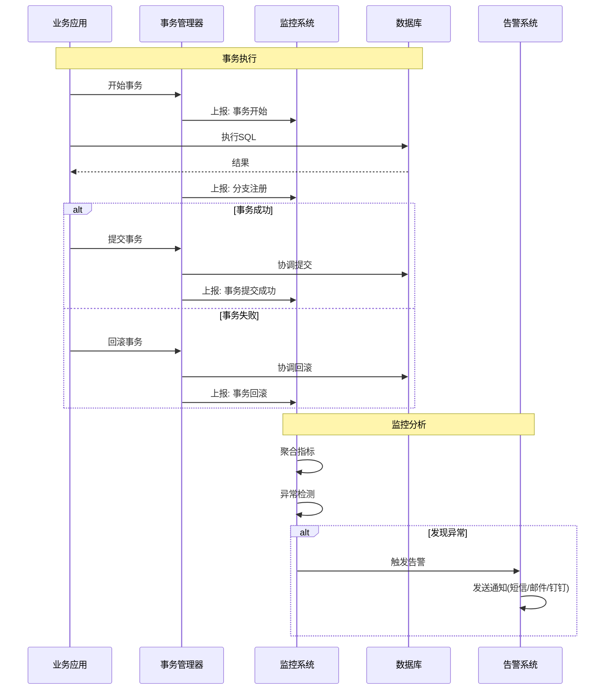
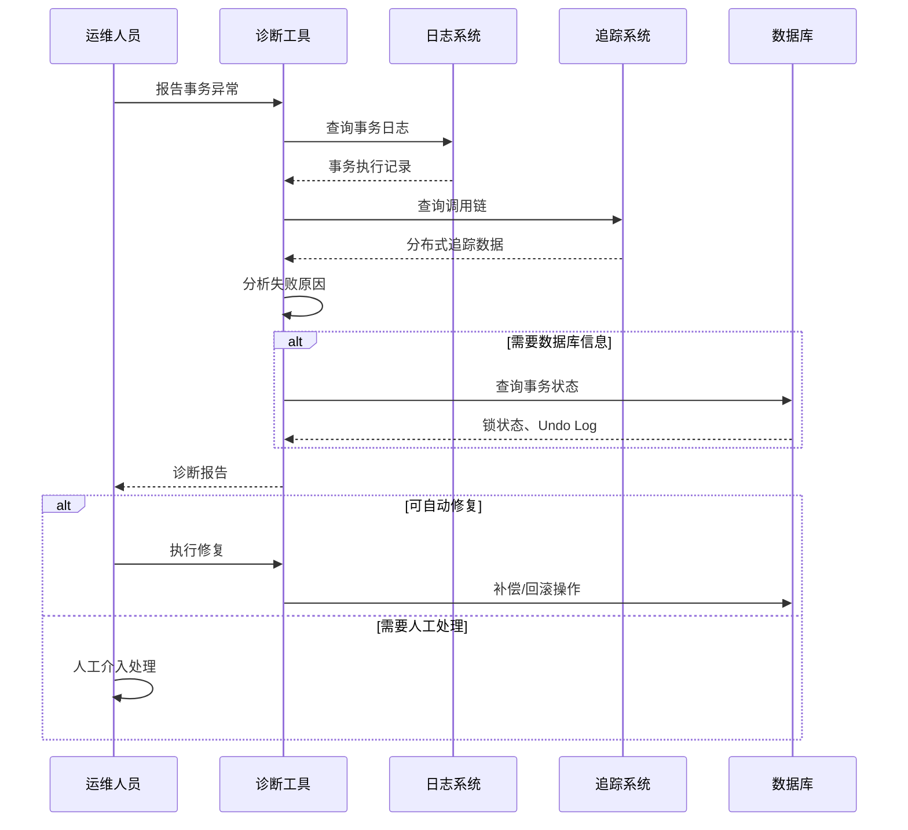

# 事务监控与诊断

**文档版本**：v1.0  
**创建时间**：2026年  
**最后更新**：2026年  
**状态**：✅ 已完成

---

## 📋 执行摘要

事务监控与诊断是保障分布式事务系统稳定运行的关键能力。通过实时监控事务执行状态、性能指标和异常事件，配合完善的日志追踪和诊断工具，能够快速定位和解决事务相关问题，保障系统数据一致性。

---

## 一、监控指标体系

### 1.1 核心指标

```
┌─────────────────────────────────────────────────────────────┐
│                   事务监控指标体系                           │
├─────────────────────────────────────────────────────────────┤
│                                                             │
│  性能指标                                                    │
│  ├── 事务吞吐量 (TPS)                                        │
│  ├── 平均响应时间                                            │
│  ├── P99/P95 延迟                                            │
│  └── 并发事务数                                              │
│                                                             │
│  成功率指标                                                  │
│  ├── 全局事务成功率                                          │
│  ├── 分支事务成功率                                          │
│  ├── 提交成功率                                              │
│  └── 回滚成功率                                              │
│                                                             │
│  异常指标                                                    │
│  ├── 超时事务数                                              │
│  ├── 失败事务数                                              │
│  ├── 补偿失败数                                              │
│  └── 悬挂/空回滚数                                           │
│                                                             │
│  资源指标                                                    │
│  ├── 活跃事务数                                              │
│  ├── 等待锁事务数                                            │
│  └── Undo Log大小                                            │
│                                                             │
└─────────────────────────────────────────────────────────────┘
```

---

## 二、时序图

### 2.1 事务监控流程



### 2.2 问题诊断流程



---

## 三、Java实现示例

### 3.1 事务监控收集器

```java
/**
 * 事务监控指标
 */
@Data
public class TransactionMetrics {
    private String xid;                 // 全局事务ID
    private String application;         // 应用名
    private LocalDateTime startTime;    // 开始时间
    private LocalDateTime endTime;      // 结束时间
    private long duration;              // 执行时长(ms)
    private String status;              // 状态: SUCCESS/FAILED/ROLLBACK
    private int branchCount;            // 分支事务数
    private List<BranchMetrics> branches;
    private String errorMsg;            // 错误信息
}

/**
 * 事务监控收集器
 */
@Component
public class TransactionMonitor {
    
    @Autowired
    private MeterRegistry meterRegistry;
    @Autowired
    private TransactionLogRepository logRepository;
    
    private final Map<String, TransactionMetrics> activeTransactions = 
        new ConcurrentHashMap<>();
    
    /**
     * 事务开始
     */
    public void onGlobalTransactionBegin(String xid) {
        TransactionMetrics metrics = new TransactionMetrics();
        metrics.setXid(xid);
        metrics.setStartTime(LocalDateTime.now());
        metrics.setApplication(getApplicationName());
        
        activeTransactions.put(xid, metrics);
        
        // Prometheus指标
        meterRegistry.counter("tx.global.begin").increment();
        meterRegistry.gauge("tx.global.active", 
            activeTransactions, Map::size);
    }
    
    /**
     * 分支注册
     */
    public void onBranchRegister(String xid, String branchId, 
                                  String resourceId) {
        TransactionMetrics metrics = activeTransactions.get(xid);
        if (metrics != null) {
            metrics.setBranchCount(metrics.getBranchCount() + 1);
            
            BranchMetrics branch = new BranchMetrics();
            branch.setBranchId(branchId);
            branch.setResourceId(resourceId);
            branch.setRegisterTime(LocalDateTime.now());
            
            if (metrics.getBranches() == null) {
                metrics.setBranches(new ArrayList<>());
            }
            metrics.getBranches().add(branch);
        }
        
        meterRegistry.counter("tx.branch.register").increment();
    }
    
    /**
     * 事务提交
     */
    public void onGlobalTransactionCommit(String xid) {
        completeTransaction(xid, "COMMIT", null);
        meterRegistry.counter("tx.global.commit").increment();
    }
    
    /**
     * 事务回滚
     */
    public void onGlobalTransactionRollback(String xid, String reason) {
        completeTransaction(xid, "ROLLBACK", reason);
        meterRegistry.counter("tx.global.rollback").increment();
    }
    
    /**
     * 事务完成
     */
    private void completeTransaction(String xid, String status, String error) {
        TransactionMetrics metrics = activeTransactions.remove(xid);
        if (metrics != null) {
            metrics.setEndTime(LocalDateTime.now());
            metrics.setDuration(
                ChronoUnit.MILLIS.between(
                    metrics.getStartTime(), 
                    metrics.getEndTime()
                )
            );
            metrics.setStatus(status);
            metrics.setErrorMsg(error);
            
            // 记录日志
            logRepository.save(metrics);
            
            // 记录延迟指标
            meterRegistry.timer("tx.global.duration")
                .record(metrics.getDuration(), TimeUnit.MILLISECONDS);
        }
    }
    
    /**
     * 获取活跃事务
     */
    public List<TransactionMetrics> getActiveTransactions() {
        return new ArrayList<>(activeTransactions.values());
    }
    
    /**
     * 获取事务统计
     */
    public TransactionStatistics getStatistics(LocalDateTime from, 
                                                LocalDateTime to) {
        List<TransactionMetrics> transactions = 
            logRepository.findByTimeRange(from, to);
        
        long total = transactions.size();
        long success = transactions.stream()
            .filter(t -> "COMMIT".equals(t.getStatus()))
            .count();
        long rollback = transactions.stream()
            .filter(t -> "ROLLBACK".equals(t.getStatus()))
            .count();
        
        double avgDuration = transactions.stream()
            .mapToLong(TransactionMetrics::getDuration)
            .average()
            .orElse(0);
        
        return TransactionStatistics.builder()
            .totalCount(total)
            .successCount(success)
            .rollbackCount(rollback)
            .successRate(total > 0 ? (double) success / total : 0)
            .avgDuration(avgDuration)
            .build();
    }
}
```

### 3.2 异常检测与告警

```java
/**
 * 事务异常检测器
 */
@Component
public class TransactionAnomalyDetector {
    
    @Autowired
    private TransactionMonitor monitor;
    @Autowired
    private AlertService alertService;
    
    /**
     * 定时检测异常
     */
    @Scheduled(fixedRate = 60000) // 每分钟
    public void detectAnomalies() {
        // 1. 检测长时间未完成的悬挂事务
        detectHangingTransactions();
        
        // 2. 检测失败率异常
        detectFailureRateAnomaly();
        
        // 3. 检测延迟异常
        detectLatencyAnomaly();
    }
    
    /**
     * 检测悬挂事务
     */
    private void detectHangingTransactions() {
        List<TransactionMetrics> activeTx = monitor.getActiveTransactions();
        LocalDateTime now = LocalDateTime.now();
        
        for (TransactionMetrics tx : activeTx) {
            long duration = ChronoUnit.MINUTES.between(tx.getStartTime(), now);
            
            if (duration > 5) { // 超过5分钟
                Alert alert = Alert.builder()
                    .level(AlertLevel.WARNING)
                    .type("HANGING_TRANSACTION")
                    .message(String.format(
                        "事务悬挂超过5分钟: xid=%s, duration=%dmin",
                        tx.getXid(), duration
                    ))
                    .build();
                
                alertService.send(alert);
            }
        }
    }
    
    /**
     * 检测失败率异常
     */
    private void detectFailureRateAnomaly() {
        LocalDateTime fiveMinutesAgo = LocalDateTime.now().minusMinutes(5);
        TransactionStatistics stats = monitor.getStatistics(
            fiveMinutesAgo, LocalDateTime.now()
        );
        
        double failureRate = 1 - stats.getSuccessRate();
        
        if (failureRate > 0.1) { // 失败率超过10%
            Alert alert = Alert.builder()
                .level(AlertLevel.ERROR)
                .type("HIGH_FAILURE_RATE")
                .message(String.format(
                    "事务失败率异常: %.2f%% (success=%d, failed=%d)",
                    failureRate * 100,
                    stats.getSuccessCount(),
                    stats.getRollbackCount()
                ))
                .build();
            
            alertService.send(alert);
        }
    }
    
    /**
     * 检测延迟异常
     */
    private void detectLatencyAnomaly() {
        LocalDateTime fiveMinutesAgo = LocalDateTime.now().minusMinutes(5);
        TransactionStatistics stats = monitor.getStatistics(
            fiveMinutesAgo, LocalDateTime.now()
        );
        
        if (stats.getAvgDuration() > 5000) { // 平均延迟超过5秒
            Alert alert = Alert.builder()
                .level(AlertLevel.WARNING)
                .type("HIGH_LATENCY")
                .message(String.format(
                    "事务平均延迟过高: %.0f ms",
                    stats.getAvgDuration()
                ))
                .build();
            
            alertService.send(alert);
        }
    }
}
```

### 3.3 事务诊断工具

```java
/**
 * 事务诊断器
 */
@Service
public class TransactionDiagnoser {
    
    @Autowired
    private TransactionLogRepository logRepository;
    @Autowired
    private DistributedTracer tracer;
    
    /**
     * 诊断事务问题
     */
    public DiagnosisReport diagnose(String xid) {
        DiagnosisReport report = new DiagnosisReport();
        report.setXid(xid);
        report.setDiagnoseTime(LocalDateTime.now());
        
        // 1. 查询事务记录
        TransactionMetrics metrics = logRepository.findByXid(xid);
        if (metrics == null) {
            report.setStatus("NOT_FOUND");
            return report;
        }
        
        report.setTransaction(metrics);
        
        // 2. 查询调用链
        TraceChain trace = tracer.getTraceByXid(xid);
        report.setTraceChain(trace);
        
        // 3. 分析失败原因
        if ("ROLLBACK".equals(metrics.getStatus())) {
            FailureAnalysis analysis = analyzeFailure(metrics, trace);
            report.setFailureAnalysis(analysis);
        }
        
        // 4. 生成建议
        report.setRecommendations(generateRecommendations(report));
        
        return report;
    }
    
    /**
     * 分析失败原因
     */
    private FailureAnalysis analyzeFailure(TransactionMetrics metrics, 
                                           TraceChain trace) {
        FailureAnalysis analysis = new FailureAnalysis();
        
        String errorMsg = metrics.getErrorMsg();
        
        if (errorMsg != null) {
            if (errorMsg.contains("timeout")) {
                analysis.setType("TIMEOUT");
                analysis.setDescription("事务执行超时");
                analysis.setPossibleCauses(Arrays.asList(
                    "网络延迟",
                    "数据库锁等待",
                    "业务处理耗时过长"
                ));
            } else if (errorMsg.contains("lock")) {
                analysis.setType("LOCK_CONTENTION");
                analysis.setDescription("锁竞争导致失败");
                analysis.setPossibleCauses(Arrays.asList(
                    "并发冲突",
                    "事务粒度过大",
                    "长时间持有锁"
                ));
            } else {
                analysis.setType("BUSINESS_ERROR");
                analysis.setDescription("业务错误");
            }
        }
        
        return analysis;
    }
    
    /**
     * 生成建议
     */
    private List<String> generateRecommendations(DiagnosisReport report) {
        List<String> recommendations = new ArrayList<>();
        
        FailureAnalysis analysis = report.getFailureAnalysis();
        if (analysis != null) {
            switch (analysis.getType()) {
                case "TIMEOUT":
                    recommendations.add("增加事务超时时间");
                    recommendations.add("优化慢查询");
                    recommendations.add("考虑拆分大事务");
                    break;
                case "LOCK_CONTENTION":
                    recommendations.add("减小事务粒度");
                    recommendations.add("优化事务执行顺序");
                    recommendations.add("使用乐观锁替代");
                    break;
                default:
                    recommendations.add("查看详细错误日志");
                    recommendations.add("联系业务方确认业务逻辑");
            }
        }
        
        return recommendations;
    }
}

/**
 * 诊断报告
 */
@Data
public class DiagnosisReport {
    private String xid;
    private LocalDateTime diagnoseTime;
    private String status;
    private TransactionMetrics transaction;
    private TraceChain traceChain;
    private FailureAnalysis failureAnalysis;
    private List<String> recommendations;
}
```

---

## 四、可视化监控面板

```yaml
# Grafana监控面板配置示例
Dashboard:
  Title: "分布式事务监控"
  
  Panels:
    - Title: "事务吞吐量"
      Type: Graph
      Query: 'rate(tx_global_begin_total[1m])'
      
    - Title: "事务成功率"
      Type: Stat
      Query: |
        sum(rate(tx_global_commit_total[5m])) 
        / 
        sum(rate(tx_global_begin_total[5m]))
      
    - Title: "平均响应时间"
      Type: Graph
      Query: 'avg(tx_global_duration_seconds)'
      
    - Title: "活跃事务数"
      Type: Stat
      Query: 'tx_global_active'
      
    - Title: "异常事务列表"
      Type: Table
      Query: |
        tx_global_rollback_total 
        > 0
```

---

## 五、最佳实践

1. **全链路追踪**：事务ID贯穿整个调用链
2. **分级告警**：根据严重程度设置不同告警级别
3. **自动修复**：简单问题自动补偿，复杂问题人工介入
4. **定期巡检**：每日检查悬挂事务和异常事务

---

**维护者**：项目团队  
**最后更新**：2026-04-03
