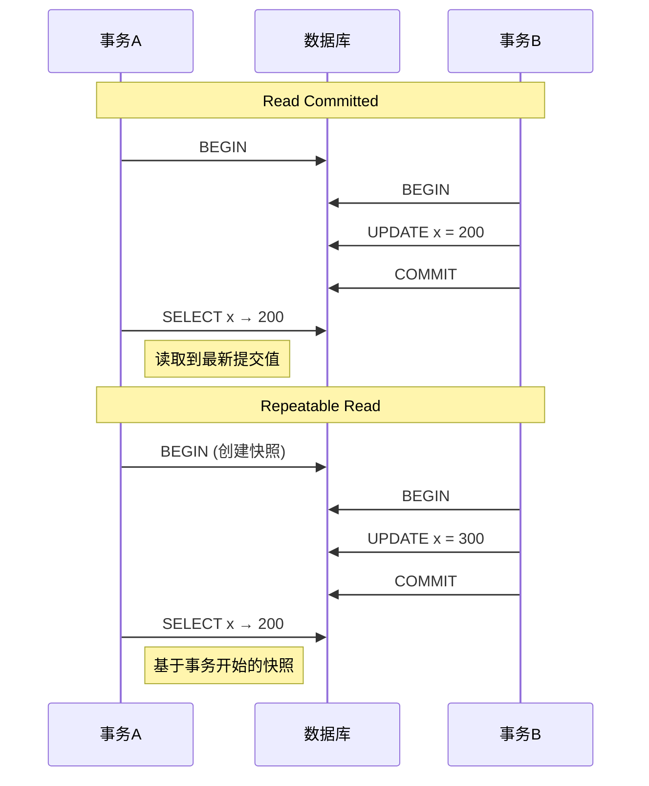
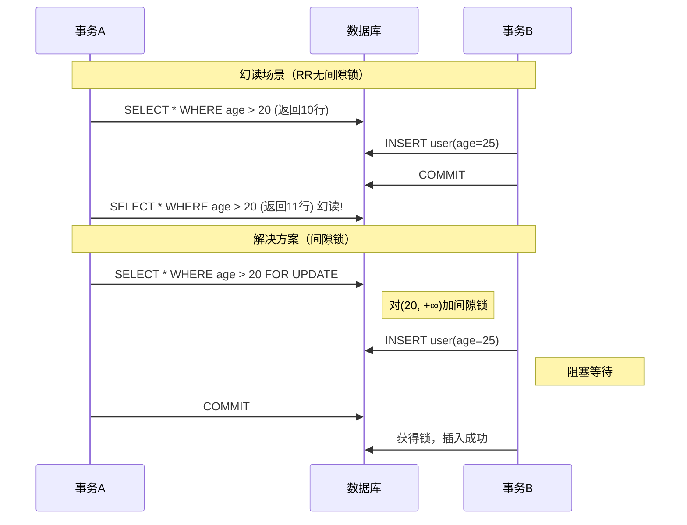

# 事务隔离级别

**文档版本**：v1.0  
**创建时间**：2026年  
**最后更新**：2026年  
**状态**：✅ 已完成

---

## 📋 执行摘要

事务隔离级别定义了并发事务之间的隔离程度，平衡数据一致性与并发性能。SQL标准定义了四种隔离级别：读未提交、读已提交、可重复读、串行化。不同隔离级别解决不同程度的并发异常问题，开发者需要根据业务场景选择合适的隔离级别。

---

## 一、核心概念

### 1.1 并发异常问题

| 异常 | 描述 | 严重程度 |
|------|------|----------|
| **脏读** | 读取到其他事务未提交的数据 | 严重 |
| **不可重复读** | 同一事务两次读取结果不同 | 中等 |
| **幻读** | 同一事务两次查询，行数不同 | 中等 |

```
脏读示例：
事务A                    事务B
UPDATE x = 100
(未提交)                  SELECT x  → 读到100（脏读）
ROLLBACK

不可重复读示例：
事务A                    事务B
SELECT x → 100
                         UPDATE x = 200
                         COMMIT
SELECT x → 200（不一致！）

幻读示例：
事务A                    事务B
SELECT * WHERE age > 20  → 10行
                         INSERT INTO user (age=25)
                         COMMIT
SELECT * WHERE age > 20  → 11行（幻读！）
```

### 1.2 四种隔离级别

| 隔离级别 | 脏读 | 不可重复读 | 幻读 | 实现机制 |
|----------|------|------------|------|----------|
| **读未提交** | ✗ | ✗ | ✗ | 无锁 |
| **读已提交** | ✓ | ✗ | ✗ | MVCC/锁 |
| **可重复读** | ✓ | ✓ | ✗/✓* | MVCC |
| **串行化** | ✓ | ✓ | ✓ | 完全串行化 |

*MySQL InnoDB在可重复读级别通过间隙锁解决幻读

---

## 二、隔离级别详解

### 2.1 读未提交（Read Uncommitted）

```
特点：
- 最低隔离级别
- 事务可以看到其他事务未提交的更改
- 性能最好，但数据一致性最差

使用场景：
- 对数据一致性要求极低的统计场景
-  rarely used in production

Java设置：
@Transactional(isolation = Isolation.READ_UNCOMMITTED)
```

### 2.2 读已提交（Read Committed）

```
特点：
- 只能看到已提交的数据
- 每次查询获取最新快照
- Oracle默认隔离级别

实现（MVCC）：
- 每条语句开始时获取快照
- 读取快照中的数据版本

Java设置：
@Transactional(isolation = Isolation.READ_COMMITTED)
```

### 2.3 可重复读（Repeatable Read）

```
特点：
- 事务开始时创建快照
- 整个事务期间看到一致的数据
- MySQL InnoDB默认隔离级别

实现（MVCC）：
- 事务开始时获取快照
- 所有查询基于同一快照

幻读处理：
- 纯MVCC无法完全防止幻读
- InnoDB使用Next-Key Lock（行锁+间隙锁）

Java设置：
@Transactional(isolation = Isolation.REPEATABLE_READ)
```

### 2.4 串行化（Serializable）

```
特点：
- 最高隔离级别
- 事务完全串行执行
- 彻底解决所有并发问题

实现：
- 所有操作加排他锁
- 或者完全串行执行

性能：
- 并发度最低
- 只用于强一致性要求的场景

Java设置：
@Transactional(isolation = Isolation.SERIALIZABLE)
```

---

## 三、时序图

### 3.1 读已提交 vs 可重复读



### 3.2 幻读与解决



---

## 四、Java实现示例

```java
/**
 * Spring事务隔离级别设置
 */
@Service
public class IsolationLevelDemo {
    
    @Autowired
    private JdbcTemplate jdbcTemplate;
    
    /**
     * 读未提交 - 极少使用
     */
    @Transactional(isolation = Isolation.READ_UNCOMMITTED)
    public int readUncommitted(Long id) {
        // 可能读取到未提交的数据
        return jdbcTemplate.queryForObject(
            "SELECT balance FROM account WHERE id = ?",
            Integer.class, id
        );
    }
    
    /**
     * 读已提交 - Oracle默认
     */
    @Transactional(isolation = Isolation.READ_COMMITTED)
    public List<Account> readCommitted() {
        // 每次查询看到已提交的最新数据
        List<Account> list1 = jdbcTemplate.query(
            "SELECT * FROM account WHERE balance > ?",
            new AccountRowMapper(), 1000
        );
        
        // 其他事务可能已提交更改
        // 第二次查询可能看到不同结果
        List<Account> list2 = jdbcTemplate.query(
            "SELECT * FROM account WHERE balance > ?",
            new AccountRowMapper(), 1000
        );
        
        return list2;
    }
    
    /**
     * 可重复读 - MySQL默认
     */
    @Transactional(isolation = Isolation.REPEATABLE_READ)
    public void repeatableRead(Long fromId, Long toId, int amount) {
        // 事务开始后，多次读取结果一致
        int balance1 = jdbcTemplate.queryForObject(
            "SELECT balance FROM account WHERE id = ?",
            Integer.class, fromId
        );
        
        // ... 其他操作
        
        int balance2 = jdbcTemplate.queryForObject(
            "SELECT balance FROM account WHERE id = ?",
            Integer.class, fromId
        );
        
        // balance1 == balance2，保证可重复读
        
        if (balance1 >= amount) {
            jdbcTemplate.update(
                "UPDATE account SET balance = balance - ? WHERE id = ?",
                amount, fromId
            );
            jdbcTemplate.update(
                "UPDATE account SET balance = balance + ? WHERE id = ?",
                amount, toId
            );
        }
    }
    
    /**
     * 串行化 - 强一致性场景
     */
    @Transactional(isolation = Isolation.SERIALIZABLE)
    public void serializableTransfer(Long fromId, Long toId, int amount) {
        // 事务完全串行执行
        // 性能最低，但一致性最强
        
        Integer balance = jdbcTemplate.queryForObject(
            "SELECT balance FROM account WHERE id = ?",
            Integer.class, fromId
        );
        
        if (balance != null && balance >= amount) {
            jdbcTemplate.update(
                "UPDATE account SET balance = balance - ? WHERE id = ?",
                amount, fromId
            );
            jdbcTemplate.update(
                "UPDATE account SET balance = balance + ? WHERE id = ?",
                amount, toId
            );
        }
    }
}

/**
 * 隔离级别测试
 */
@SpringBootTest
public class IsolationLevelTest {
    
    @Autowired
    private IsolationLevelDemo demo;
    
    @Test
    public void testPhantomRead() throws InterruptedException {
        CountDownLatch latch = new CountDownLatch(2);
        
        // 事务A：两次查询
        new Thread(() -> {
            demo.transactionalOperation(() -> {
                List<Account> list1 = jdbcTemplate.query(
                    "SELECT * FROM account WHERE age > 20",
                    new AccountRowMapper()
                );
                System.out.println("First query: " + list1.size() + " rows");
                
                Thread.sleep(1000); // 等待事务B插入
                
                List<Account> list2 = jdbcTemplate.query(
                    "SELECT * FROM account WHERE age > 20",
                    new AccountRowMapper()
                );
                System.out.println("Second query: " + list2.size() + " rows");
                
                if (list1.size() != list2.size()) {
                    System.out.println("Phantom read occurred!");
                }
            }, Isolation.REPEATABLE_READ);
            latch.countDown();
        }).start();
        
        // 事务B：插入数据
        new Thread(() -> {
            Thread.sleep(500);
            jdbcTemplate.update(
                "INSERT INTO account (name, age, balance) VALUES (?, ?, ?)",
                "NewUser", 25, 1000
            );
            latch.countDown();
        }).start();
        
        latch.await();
    }
}
```

---

## 五、数据库差异

| 数据库 | 默认隔离级别 | 支持RR防幻读 |
|--------|-------------|-------------|
| MySQL InnoDB | 可重复读 | 是（Next-Key Lock） |
| PostgreSQL | 读已提交 | 否（需Serializable） |
| Oracle | 读已提交 | 否 |
| SQL Server | 读已提交 | 是（SNAPSHOT） |

---

## 六、选型建议

| 场景 | 推荐级别 | 原因 |
|------|----------|------|
| 报表统计 | 读已提交 | 看到最新数据即可 |
| 银行转账 | 可重复读/串行化 | 保证余额准确 |
| 库存扣减 | 可重复读 | 防止超卖 |
| 日志记录 | 读未提交 | 性能优先 |
| 配置读取 | 读已提交 | 看到最新配置 |

---

**维护者**：项目团队  
**最后更新**：2026-04-03
