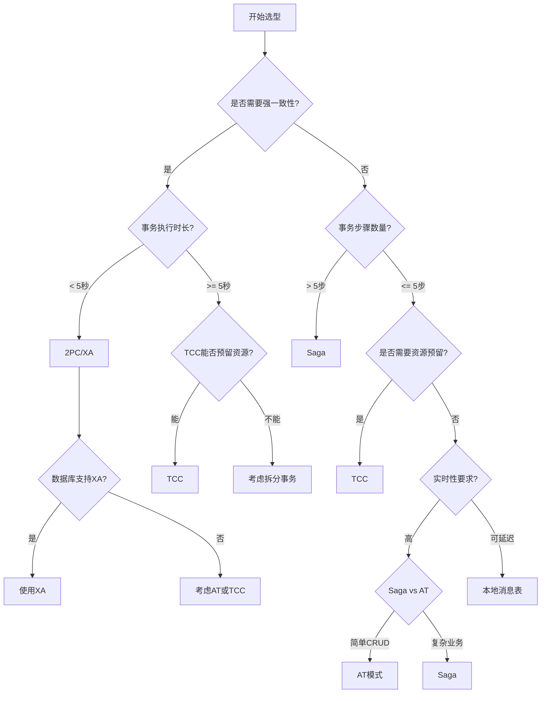

# 分布式事务选型指南

**文档版本**：v1.0
**创建时间**：2026年
**最后更新**：2026年
**状态**：✅ 已完成

---

## 📋 执行摘要

分布式事务选型是分布式系统设计的核心决策，需要综合考虑一致性要求、性能、复杂度、业务特征等多个维度。本文档提供系统化的选型框架、决策树和对比矩阵，帮助在不同场景下选择最适合的分布式事务方案。

---

## 一、选型维度

### 1.1 关键决策因素

```
┌─────────────────────────────────────────────────────────────┐
│                    分布式事务选型维度                         │
├─────────────────────────────────────────────────────────────┤
│                                                             │
│  ┌─────────────┐  ┌─────────────┐  ┌─────────────┐        │
│  │ 一致性要求   │  │ 性能要求     │  │ 事务特征     │        │
│  │             │  │             │  │             │        │
│  │ • 强一致    │  │ • 吞吐量     │  │ • 执行时长   │        │
│  │ • 最终一致  │  │ • 延迟       │  │ • 步骤数量   │        │
│  │             │  │ • 并发度     │  │ • 业务复杂度 │        │
│  └──────┬──────┘  └──────┬──────┘  └──────┬──────┘        │
│         │                │                │               │
│  ┌──────┴──────┐  ┌──────┴──────┐  ┌──────┴──────┐        │
│  │ 技术约束     │  │ 运维成本     │  │ 团队能力     │        │
│  │             │  │             │  │             │        │
│  │ • 数据库类型│  │ • 监控难度   │  │ • 技术储备   │        │
│  │ • 服务架构  │  │ • 故障处理   │  │ • 学习成本   │        │
│  │ • 基础设施  │  │ • 人工成本   │  │ • 维护能力   │        │
│  └─────────────┘  └─────────────┘  └─────────────┘        │
│                                                             │
└─────────────────────────────────────────────────────────────┘
```

### 1.2 方案概览

| 方案 | 一致性 | 性能 | 复杂度 | 侵入性 |
|------|--------|------|--------|--------|
| **2PC/XA** | 强一致 | ⭐⭐ | ⭐⭐⭐ | 低 |
| **3PC** | 强一致 | ⭐⭐ | ⭐⭐⭐⭐ | 低 |
| **TCC** | 最终一致 | ⭐⭐⭐⭐⭐ | ⭐⭐⭐⭐ | 高 |
| **Saga** | 最终一致 | ⭐⭐⭐⭐⭐ | ⭐⭐⭐ | 中 |
| **本地消息表** | 最终一致 | ⭐⭐⭐⭐⭐ | ⭐⭐ | 中 |
| **最大努力通知** | 弱一致 | ⭐⭐⭐⭐⭐ | ⭐⭐ | 低 |
| **AT模式** | 最终一致 | ⭐⭐⭐⭐ | ⭐⭐⭐ | 低 |

---

## 二、决策树



---

## 三、场景化选型

### 3.1 金融核心系统

```
场景特征：
- 资金操作，强一致性要求
- 交易金额敏感，不容差错
- 跨行转账、账户扣款

推荐方案：2PC/XA

原因：
✓ 强一致性保证
✓ 数据库原生支持
✓ 成熟稳定，经过金融验证

示例：跨行转账
- 使用XA事务协调两个银行账户
- 保证两边同时成功或同时失败
```

### 3.2 电商订单系统

```
场景特征：
- 库存扣减 + 订单创建 + 支付
- 高并发，性能要求高
- 需要防止超卖

推荐方案：TCC

原因：
✓ 预留资源，防止超卖
✓ 无全局锁，性能好
✓ 业务可控，灵活度高

示例：下单流程
- Try: 预占库存、预扣余额
- Confirm: 确认扣减
- Cancel: 超时释放
```

### 3.3 物流配送系统

```
场景特征：
- 流程长：下单→拣货→发货→配送→签收
- 每个步骤可能跨天
- 需要状态流转和补偿

推荐方案：Saga

原因：
✓ 适合长事务
✓ 状态流转清晰
✓ 支持复杂业务流程

示例：订单履约流程
- 每个状态变更是一个本地事务
- 发货失败回退到待发货
- 配送异常触发重新分配
```

### 3.4 积分发放系统

```
场景特征：
- 异步场景，可延迟
- 非核心流程
- 失败可重试

推荐方案：本地消息表

原因：
✓ 实现简单
✓ 最终一致即可
✓ 性能好，无全局事务

示例：订单完成后发积分
- 订单完成写消息表
- 后台任务异步投递
- 消费方幂等处理
```

---

## 四、对比矩阵

### 4.1 详细对比

| 维度 | 2PC/XA | TCC | Saga | 本地消息表 | AT |
|------|--------|-----|------|-----------|-----|
| **一致性** | 强一致 | 最终一致 | 最终一致 | 最终一致 | 最终一致 |
| **延迟** | 高 | 低 | 低 | 极低 | 中 |
| **吞吐量** | 低 | 高 | 高 | 极高 | 中 |
| **实现复杂度** | 低 | 高 | 中 | 低 | 低 |
| **业务侵入** | 低 | 高 | 中 | 中 | 低 |
| **隔离性** | 强 | 中 | 弱 | 弱 | 中 |
| **回滚能力** | 自动 | 业务补偿 | 业务补偿 | 人工/业务 | 自动 |
| **长事务支持** | 差 | 一般 | 好 | 好 | 一般 |
| **异构支持** | 差 | 好 | 好 | 好 | 一般 |

### 4.2 选型速查表

| 场景 | 推荐方案 | 备选方案 |
|------|----------|----------|
| 银行转账 | 2PC/XA | TCC |
| 电商下单 | TCC | Saga |
| 库存扣减 | TCC | AT |
| 物流流转 | Saga | 本地消息表 |
| 积分发放 | 本地消息表 | Saga |
| 支付通知 | 最大努力通知 | 本地消息表 |
| 配置变更 | 2PC | AT |
| 数据统计 | 本地消息表 | - |
| 跨服务CRUD | AT | Saga |

---

## 五、Java选型示例

```java
/**
 * 分布式事务策略接口
 */
public interface DistributedTxStrategy {
    boolean execute(DistributedTxContext context);
}

/**
 * 策略工厂
 */
@Component
public class TxStrategyFactory {

    @Autowired
    private Map<String, DistributedTxStrategy> strategies;

    public DistributedTxStrategy getStrategy(TxScenario scenario) {
        switch (scenario) {
            case FINANCIAL_TRANSFER:
                return strategies.get("xaStrategy");
            case ECOMMERCE_ORDER:
                return strategies.get("tccStrategy");
            case LOGISTICS_FLOW:
                return strategies.get("sagaStrategy");
            case POINTS_GRANT:
                return strategies.get("localMessageStrategy");
            case SIMPLE_CRUD:
                return strategies.get("atStrategy");
            default:
                throw new UnsupportedOperationException();
        }
    }
}

/**
 * 场景定义
 */
public enum TxScenario {
    FINANCIAL_TRANSFER,   // 金融转账
    ECOMMERCE_ORDER,      // 电商订单
    LOGISTICS_FLOW,       // 物流流转
    POINTS_GRANT,         // 积分发放
    SIMPLE_CRUD           // 简单CRUD
}

/**
 * 使用示例
 */
@Service
public class BusinessService {

    @Autowired
    private TxStrategyFactory strategyFactory;

    public void processBusiness(BusinessRequest request) {
        // 根据业务场景选择策略
        TxScenario scenario = determineScenario(request);
        DistributedTxStrategy strategy = strategyFactory.getStrategy(scenario);

        // 构建上下文
        DistributedTxContext context = buildContext(request);

        // 执行事务
        boolean success = strategy.execute(context);

        if (!success) {
            handleFailure(request);
        }
    }

    private TxScenario determineScenario(BusinessRequest request) {
        if (request.getBizType().equals("TRANSFER")) {
            return TxScenario.FINANCIAL_TRANSFER;
        } else if (request.getBizType().equals("ORDER")) {
            return TxScenario.ECOMMERCE_ORDER;
        }
        // ...
        return TxScenario.SIMPLE_CRUD;
    }
}
```

---

## 六、最佳实践

1. **渐进式引入**：从简单方案开始，根据需求升级
2. **监控告警**：事务成功率、补偿率、延迟等关键指标
3. **人工兜底**：补偿失败时提供人工介入机制
4. **混合使用**：一个系统可组合使用多种方案

---

**维护者**：项目团队
**最后更新**：2026-04-03
