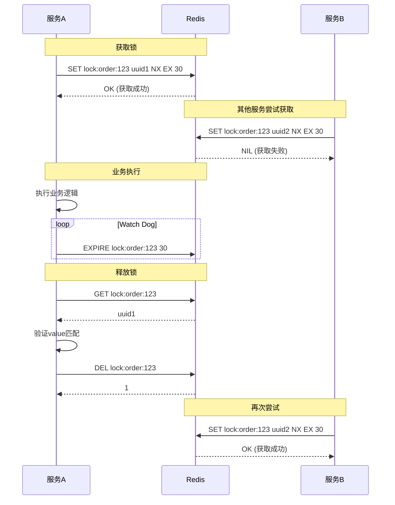
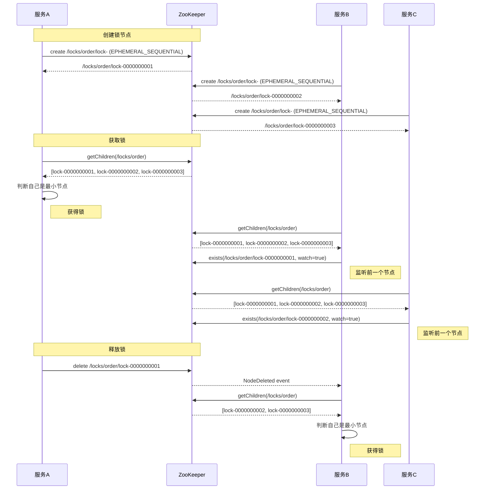

# 分布式锁实现

**文档版本**：v1.0  
**创建时间**：2026年  
**最后更新**：2026年  
**状态**：✅ 已完成

---

## 📋 执行摘要

分布式锁是协调分布式系统中多个节点对共享资源访问的重要机制。常用的分布式锁实现包括基于Redis、ZooKeeper、数据库等方案。本文档详细讲解Redis和ZooKeeper两种主流实现，分析其原理、优缺点及适用场景。

---

## 一、Redis分布式锁

### 1.1 核心原理

```
┌─────────────────────────────────────────────────────────────┐
│                    Redis分布式锁原理                         │
├─────────────────────────────────────────────────────────────┤
│                                                             │
│  获取锁：                                                    │
│  SET lock_key unique_value NX EX 30                         │
│       │      │          │  │                                │
│       │      │          │  └── 过期时间30秒                  │
│       │      │          └───── 仅在key不存在时设置           │
│       │      └──────────────── 唯一标识（用于释放时验证）      │
│       └─────────────────────── 锁的key                       │
│                                                             │
│  释放锁：                                                    │
│  1. 检查锁的value是否匹配（防止误删他人锁）                   │
│  2. 匹配成功则删除key                                        │
│                                                             │
│  续期（Watch Dog）：                                         │
│  获取锁后启动定时任务，在过期前自动续期                       │
│                                                             │
└─────────────────────────────────────────────────────────────┘
```

### 1.2 时序图



### 1.3 Java实现

```java
/**
 * Redis分布式锁实现（Redisson）
 */
@Component
public class RedisDistributedLock {
    
    @Autowired
    private RedissonClient redissonClient;
    
    /**
     * 获取锁
     */
    public boolean tryLock(String lockKey, long waitTime, long leaseTime) {
        RLock lock = redissonClient.getLock(lockKey);
        try {
            return lock.tryLock(waitTime, leaseTime, TimeUnit.SECONDS);
        } catch (InterruptedException e) {
            Thread.currentThread().interrupt();
            return false;
        }
    }
    
    /**
     * 释放锁
     */
    public void unlock(String lockKey) {
        RLock lock = redissonClient.getLock(lockKey);
        if (lock.isHeldByCurrentThread()) {
            lock.unlock();
        }
    }
    
    /**
     * 带锁执行业务
     */
    public <T> T executeWithLock(String lockKey, long waitTime, 
                                  Supplier<T> supplier) {
        RLock lock = redissonClient.getLock(lockKey);
        try {
            boolean acquired = lock.tryLock(waitTime, 30, TimeUnit.SECONDS);
            if (!acquired) {
                throw new LockAcquireException("获取锁失败: " + lockKey);
            }
            
            try {
                return supplier.get();
            } finally {
                lock.unlock();
            }
        } catch (InterruptedException e) {
            Thread.currentThread().interrupt();
            throw new LockAcquireException("获取锁被中断");
        }
    }
}

/**
 * 手动实现Redis锁（基于Lua保证原子性）
 */
@Component
public class ManualRedisLock {
    
    @Autowired
    private StringRedisTemplate redisTemplate;
    
    private static final String LOCK_PREFIX = "lock:";
    private static final long DEFAULT_EXPIRE = 30;
    
    // Lua脚本：释放锁（原子操作）
    private static final String RELEASE_SCRIPT = 
        "if redis.call('get', KEYS[1]) == ARGV[1] then " +
        "    return redis.call('del', KEYS[1]) " +
        "else " +
        "    return 0 " +
        "end";
    
    /**
     * 获取锁
     */
    public String tryLock(String lockKey, long expireSeconds) {
        String key = LOCK_PREFIX + lockKey;
        String value = UUID.randomUUID().toString();
        
        Boolean success = redisTemplate.opsForValue()
            .setIfAbsent(key, value, expireSeconds, TimeUnit.SECONDS);
        
        return Boolean.TRUE.equals(success) ? value : null;
    }
    
    /**
     * 释放锁
     */
    public boolean unlock(String lockKey, String value) {
        String key = LOCK_PREFIX + lockKey;
        
        Long result = redisTemplate.execute(
            new DefaultRedisScript<>(RELEASE_SCRIPT, Long.class),
            Collections.singletonList(key),
            value
        );
        
        return result != null && result == 1;
    }
}

/**
 * 业务使用示例
 */
@Service
public class OrderService {
    
    @Autowired
    private RedisDistributedLock distributedLock;
    @Autowired
    private OrderDao orderDao;
    
    /**
     * 幂等性处理 - 防止重复提交
     */
    public Order createOrder(OrderRequest request) {
        String lockKey = "order:create:" + request.getRequestId();
        
        return distributedLock.executeWithLock(lockKey, 5, () -> {
            // 检查是否已处理
            if (orderDao.existsByRequestId(request.getRequestId())) {
                return orderDao.findByRequestId(request.getRequestId());
            }
            
            // 创建订单
            Order order = new Order();
            order.setOrderId(generateOrderId());
            order.setRequestId(request.getRequestId());
            // ... 设置其他字段
            orderDao.insert(order);
            
            return order;
        });
    }
    
    /**
     * 库存扣减 - 防止超卖
     */
    public boolean deductStock(String skuId, int count) {
        String lockKey = "stock:deduct:" + skuId;
        
        return distributedLock.executeWithLock(lockKey, 3, () -> {
            Stock stock = stockDao.get(skuId);
            if (stock.getAvailable() < count) {
                return false;
            }
            
            stockDao.decrease(skuId, count);
            return true;
        });
    }
}
```

---

## 二、ZooKeeper分布式锁

### 2.1 核心原理

```
┌─────────────────────────────────────────────────────────────┐
│                   ZooKeeper分布式锁原理                      │
├─────────────────────────────────────────────────────────────┤
│                                                             │
│  临时顺序节点：                                              │
│  /locks/order                                              │
│     ├── lock-0000000001  (临时顺序节点)                     │
│     ├── lock-0000000002                                     │
│     └── lock-0000000003                                     │
│                                                             │
│  获取锁：                                                    │
│  1. 在/locks/order下创建临时顺序节点                         │
│  2. 获取所有子节点，排序                                     │
│  3. 如果自己是序号最小的节点，获得锁                         │
│  4. 否则监听前一个节点的删除事件                             │
│                                                             │
│  释放锁：                                                    │
│  1. 删除自己的临时节点                                       │
│  2. 会话断开时自动删除（防止死锁）                           │
│                                                             │
│  优点：                                                      │
│  - CP系统，一致性更强                                        │
│  - 会话断开自动释放，无死锁风险                              │
│                                                             │
└─────────────────────────────────────────────────────────────┘
```

### 2.2 时序图



### 2.3 Java实现

```java
/**
 * ZooKeeper分布式锁
 */
@Component
public class ZkDistributedLock {
    
    @Autowired
    private CuratorFramework curatorFramework;
    
    private static final String LOCK_ROOT = "/locks";
    
    /**
     * 使用Curator的InterProcessMutex
     */
    public boolean tryLock(String lockPath, long timeout) {
        InterProcessMutex lock = new InterProcessMutex(
            curatorFramework, 
            LOCK_ROOT + "/" + lockPath
        );
        
        try {
            return lock.acquire(timeout, TimeUnit.SECONDS);
        } catch (Exception e) {
            log.error("获取ZK锁失败", e);
            return false;
        }
    }
    
    /**
     * 释放锁
     */
    public void unlock(InterProcessMutex lock) {
        try {
            if (lock != null && lock.isAcquiredInThisProcess()) {
                lock.release();
            }
        } catch (Exception e) {
            log.error("释放ZK锁失败", e);
        }
    }
}

/**
 * 手动实现ZK锁
 */
public class ManualZkLock implements Watcher {
    
    private ZooKeeper zk;
    private String lockPath;
    private String currentNode;
    private CountDownLatch latch = new CountDownLatch(1);
    
    public ManualZkLock(String connectString, String lockPath) {
        this.lockPath = lockPath;
        try {
            zk = new ZooKeeper(connectString, 5000, this);
            // 确保根节点存在
            if (zk.exists(lockPath, false) == null) {
                zk.create(lockPath, new byte[0], 
                    ZooDefs.Ids.OPEN_ACL_UNSAFE, CreateMode.PERSISTENT);
            }
        } catch (Exception e) {
            throw new RuntimeException(e);
        }
    }
    
    /**
     * 获取锁
     */
    public void lock() throws Exception {
        // 创建临时顺序节点
        currentNode = zk.create(
            lockPath + "/lock-", 
            new byte[0],
            ZooDefs.Ids.OPEN_ACL_UNSAFE,
            CreateMode.EPHEMERAL_SEQUENTIAL
        );
        
        // 获取所有子节点
        List<String> children = zk.getChildren(lockPath, false);
        Collections.sort(children);
        
        // 判断自己是否是序号最小的
        String nodeName = currentNode.substring(currentNode.lastIndexOf("/") + 1);
        int index = children.indexOf(nodeName);
        
        if (index == 0) {
            // 获得锁
            return;
        }
        
        // 监听前一个节点
        String prevNode = children.get(index - 1);
        zk.exists(lockPath + "/" + prevNode, this);
        
        // 等待
        latch.await();
    }
    
    /**
     * 释放锁
     */
    public void unlock() throws Exception {
        if (currentNode != null) {
            zk.delete(currentNode, -1);
        }
    }
    
    @Override
    public void process(WatchedEvent event) {
        if (event.getType() == Event.EventType.NodeDeleted) {
            // 前一个节点删除，获得锁
            latch.countDown();
        }
    }
}
```

---

## 三、方案对比

| 维度 | Redis | ZooKeeper |
|------|-------|-----------|
| **一致性** | AP（最终一致） | CP（强一致） |
| **性能** | 高 | 中等 |
| **可靠性** | 依赖主从切换 | 高（ZAB协议） |
| **死锁处理** | 依赖过期时间 | 会话断开自动释放 |
| **实现复杂度** | 低（Redisson） | 中等 |
| **可重入** | 支持 | 支持 |
| **阻塞等待** | 自旋/订阅 | Watch事件通知 |
| **适用规模** | 大规模高并发 | 中等规模 |

---

**维护者**：项目团队  
**最后更新**：2026-04-03
