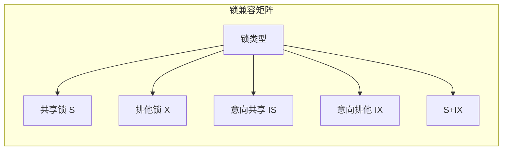
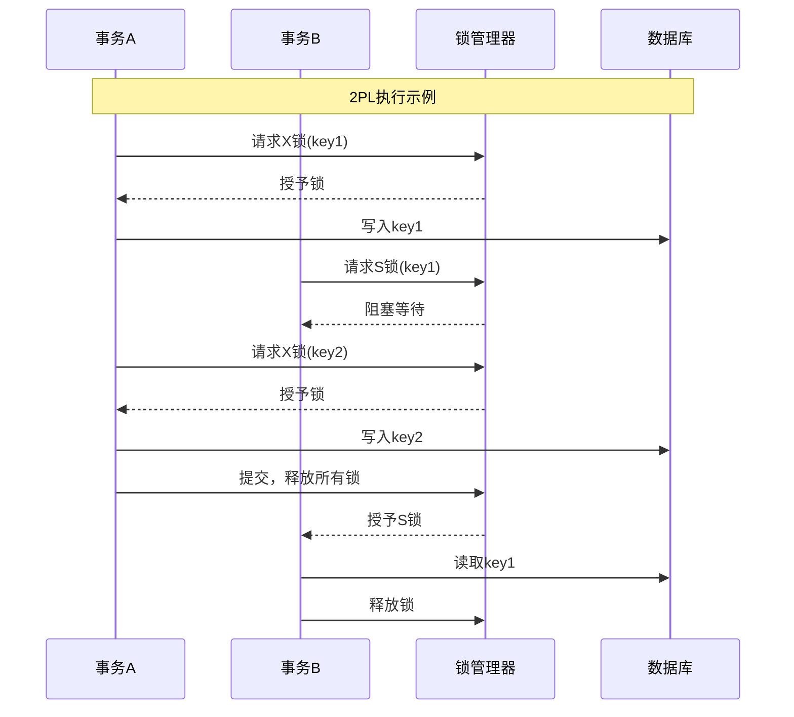
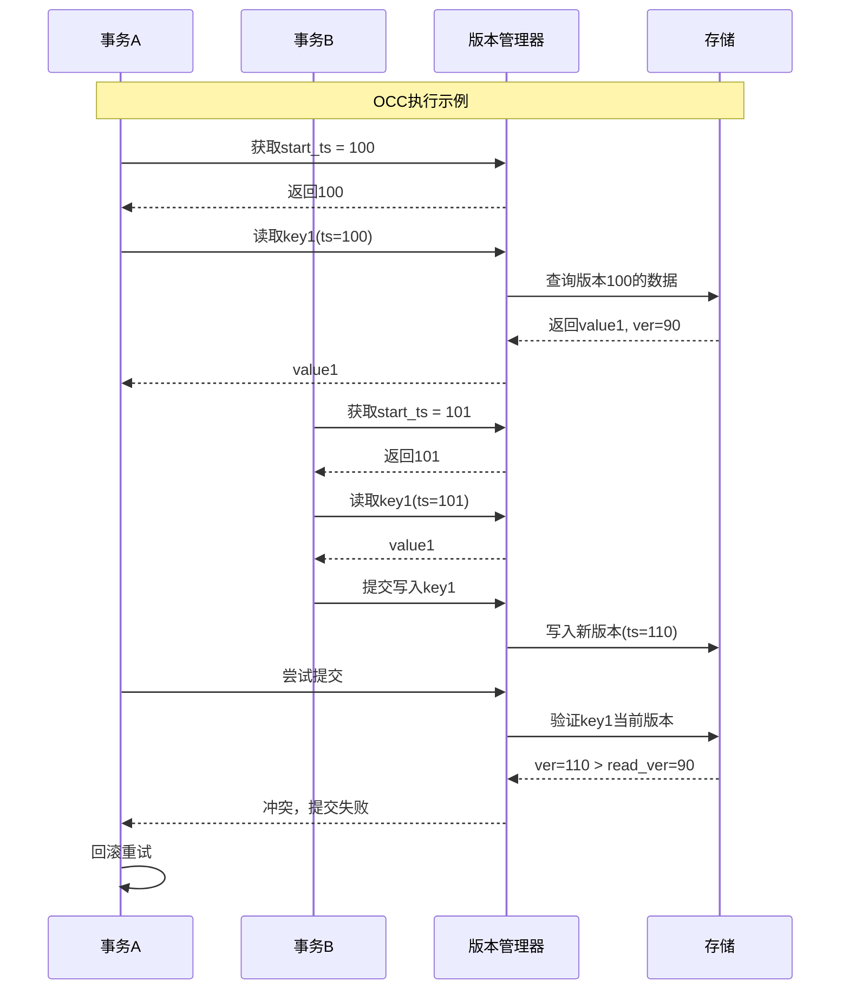
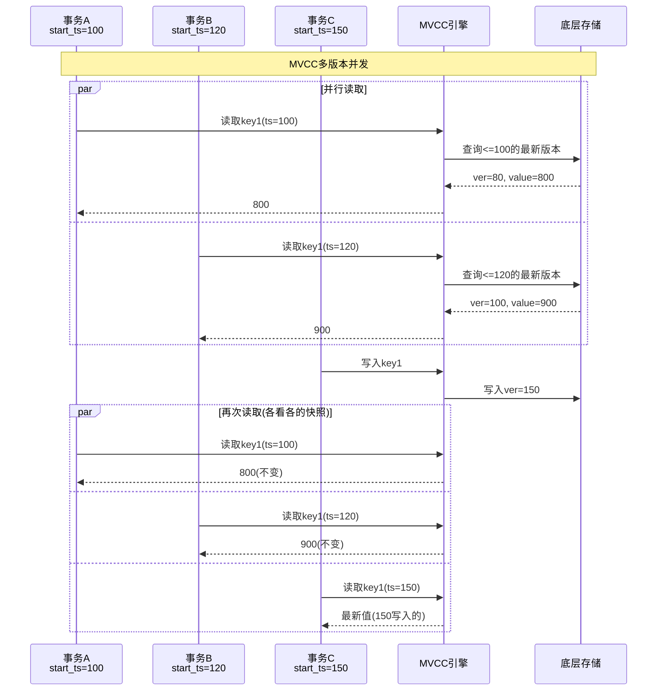

# 并发控制算法对比

> 并发控制是数据库系统的核心机制，本文深入对比两阶段锁(2PL)、乐观并发控制(OCC)和多版本并发控制(MVCC)三种主流算法，分析其原理、性能特征和适用场景。

---

## 📋 目录

- [1. 概述](#1-概述)
- [2. 两阶段锁(2PL)](#2-两阶段锁2pl)
- [3. 乐观并发控制(OCC)](#3-乐观并发控制occ)
- [4. 多版本并发控制(MVCC)](#4-多版本并发控制mvcc)
- [5. 死锁处理](#5-死锁处理)
- [6. 性能对比分析](#6-性能对比分析)
- [7. 工业系统实践](#7-工业系统实践)

---

## 1. 概述

### 1.1 为什么需要并发控制

```
无并发控制的问题示例：

┌─────────────────────────────────────────────────────────┐
│  事务A：读取账户余额 = 1000                              │
│  事务B：读取账户余额 = 1000  ← 脏读/不可重复读           │
│  事务A：写入余额 = 900                                   │
│  事务B：写入余额 = 1100  ← 更新丢失                      │
├─────────────────────────────────────────────────────────┤
│  结果：丢失了一个更新！                                  │
│  正确结果应该是：900 或 1100，取决于提交顺序             │
└─────────────────────────────────────────────────────────┘
```

### 1.2 三种主流算法

| 算法 | 核心思想 | 冲突检测时机 | 代表系统 |
|:---|:---|:---|:---|
| **2PL** | 加锁保护数据 | 运行时 | MySQL、DB2 |
| **OCC** | 提交时验证冲突 | 提交时 | Percolator、CockroachDB |
| **MVCC** | 维护多版本 | 读取时选择版本 | PostgreSQL、Spanner |

### 1.3 隔离级别映射

```
隔离级别 vs 并发控制算法:

读未提交 ──────────────────────────────────────────────►
    │
    ├── 2PL: 不需要锁，直接读最新
    │
读已提交 ──────────────────────────────────────────────►
    │
    ├── 2PL: 短读锁(读完即释放)
    ├── MVCC: 读取最新已提交版本
    │
可重复读 ──────────────────────────────────────────────►
    │
    ├── 2PL: 长读锁(事务结束释放)
    ├── MVCC: 事务开始时创建快照
    │
串行化 ────────────────────────────────────────────────►
    │
    ├── 2PL: 严格两阶段锁 + 谓词锁
    ├── OCC: 提交时验证读写冲突
    └── MVCC: 串行化快照隔离(SSI)
```

---

## 2. 两阶段锁(2PL)

### 2.1 基本原理

```
两阶段锁协议:

阶段一：加锁阶段(Growing)
┌─────────────────────────────────────────────────────────┐
│  事务开始                                                │
│       ↓                                                 │
│  lock(A) ──► lock(B) ──► lock(C)                        │
│  可以不断获取新锁                                        │
│       ↓                                                 │
│  达到最大锁数量(无法获取更多锁)                          │
└─────────────────────────────────────────────────────────┘
                           ↓
阶段二：解锁阶段(Shrinking)
┌─────────────────────────────────────────────────────────┐
│  unlock(A) ──► unlock(B) ──► unlock(C)                  │
│  只能释放锁，不能再获取新锁                              │
│       ↓                                                 │
│  事务结束                                                │
└─────────────────────────────────────────────────────────┘
```

### 2.2 锁类型与兼容性



| 已有锁 \ 请求锁 | S | X | IS | IX | SIX |
|:---:|:---:|:---:|:---:|:---:|:---:|
| **S** | ✅ | ❌ | ✅ | ❌ | ❌ |
| **X** | ❌ | ❌ | ❌ | ❌ | ❌ |
| **IS** | ✅ | ❌ | ✅ | ✅ | ✅ |
| **IX** | ❌ | ❌ | ✅ | ✅ | ❌ |
| **SIX** | ❌ | ❌ | ✅ | ❌ | ❌ |

### 2.3 严格两阶段锁(Strict 2PL)

```java
/**
 * 严格两阶段锁实现
 */
public class StrictTwoPhaseLocking {
    private final LockManager lockManager;
    private final List<Lock> heldLocks = new ArrayList<>();
    private boolean growingPhase = true;

    /**
     * 读取操作
     */
    public Data read(Key key) throws LockException {
        // 加锁阶段：获取共享锁
        if (!growingPhase) {
            throw new IllegalStateException("Cannot acquire lock in shrinking phase");
        }

        Lock lock = lockManager.acquireSharedLock(key);
        heldLocks.add(lock);

        // 读取数据
        return storage.read(key);
    }

    /**
     * 写入操作
     */
    public void write(Key key, Data value) throws LockException {
        // 锁升级：共享锁 -> 排他锁
        Lock existingLock = findLock(key);
        if (existingLock != null && existingLock.getType() == SHARED) {
            // 升级锁
            lockManager.upgradeToExclusive(existingLock);
        } else if (existingLock == null) {
            Lock lock = lockManager.acquireExclusiveLock(key);
            heldLocks.add(lock);
        }

        // 缓冲写入(Commit时统一写入)
        writeBuffer.put(key, value);
    }

    /**
     * 提交事务
     */
    public void commit() {
        // 写入持久化
        flushWriteBuffer();

        // 进入解锁阶段
        growingPhase = false;

        // 严格2PL：事务结束时才释放所有锁
        releaseAllLocks();
    }

    /**
     * 回滚事务
     */
    public void rollback() {
        // 丢弃缓冲的写入
        writeBuffer.clear();

        // 释放所有锁
        growingPhase = false;
        releaseAllLocks();
    }
}
```

### 2.4 2PL时序图



---

## 3. 乐观并发控制(OCC)

### 3.1 基本原理

```
乐观并发控制三阶段:

┌─────────────────────────────────────────────────────────┐
│  1. 读取阶段                                            │
│     - 事务读取数据到本地缓存                             │
│     - 不获取任何锁                                       │
│     - 记录读取的数据版本                                 │
├─────────────────────────────────────────────────────────┤
│  2. 验证阶段                                            │
│     - 检查读取的数据是否被其他事务修改                    │
│     - 如果被修改，事务回滚重试                           │
├─────────────────────────────────────────────────────────┤
│  3. 写入阶段                                            │
│     - 验证通过，写入新数据                               │
│     - 原子性提交                                         │
└─────────────────────────────────────────────────────────┘
```

### 3.2 OCC实现

```java
/**
 * 乐观并发控制实现
 */
public class OptimisticConcurrencyControl {
    private final VersionManager versionManager;

    // 事务私有数据
    private Map<Key, VersionedData> readSet = new HashMap<>();
    private Map<Key, Data> writeSet = new HashMap<>();
    private long startTimestamp;

    public void begin() {
        // 获取开始时间戳
        startTimestamp = versionManager.getCurrentTimestamp();
        readSet.clear();
        writeSet.clear();
    }

    /**
     * 读取操作
     */
    public Data read(Key key) {
        // 检查是否在写集中
        if (writeSet.containsKey(key)) {
            return writeSet.get(key);
        }

        // 读取数据并记录版本
        VersionedData data = versionManager.read(key, startTimestamp);
        readSet.put(key, data);

        return data.getValue();
    }

    /**
     * 写入操作
     */
    public void write(Key key, Data value) {
        // 仅记录到写集，不实际写入
        writeSet.put(key, value);
    }

    /**
     * 提交事务
     */
    public boolean commit() {
        // 1. 获取提交时间戳
        long commitTimestamp = versionManager.getNextTimestamp();

        // 2. 验证阶段：检查读集是否被修改
        for (Map.Entry<Key, VersionedData> entry : readSet.entrySet()) {
            Key key = entry.getKey();
            VersionedData readData = entry.getValue();

            // 检查是否有人在我们读取后写入
            VersionedData currentData = versionManager.readLatest(key);

            if (currentData.getVersion() > readData.getVersion()) {
                // 检测到冲突，事务失败
                rollback();
                return false;
            }
        }

        // 3. 写入阶段：原子性写入
        for (Map.Entry<Key, Data> entry : writeSet.entrySet()) {
            versionManager.write(entry.getKey(), entry.getValue(), commitTimestamp);
        }

        return true;
    }

    public void rollback() {
        readSet.clear();
        writeSet.clear();
    }
}
```

### 3.3 OCC时序图



---

## 4. 多版本并发控制(MVCC)

### 4.1 基本原理

```
MVCC多版本存储:

┌─────────────────────────────────────────────────────────┐
│  Key: user_balance                                       │
├─────────────────────────────────────────────────────────┤
│  Version 150 (ts=150) : value = 1100  ← 最新版本        │
│  Version 120 (ts=120) : value = 1000  ← 事务B可见       │
│  Version 100 (ts=100) : value = 800   ← 事务A可见       │
│  Version 80  (ts=80)  : value = 500   ← GC待清理        │
├─────────────────────────────────────────────────────────┤
│  每个事务看到数据的一致性快照                            │
│  读操作不阻塞写操作，写操作不阻塞读操作                   │
└─────────────────────────────────────────────────────────┘
```

### 4.2 MVCC实现

```go
// MVCC版本控制
type MVCCVersion struct {
    Timestamp uint64
    Value     []byte
    TxID      string
}

type MVCCKey struct {
    Key       string
    Timestamp uint64
}

type MVCCStorage struct {
    // 底层存储：RockSDB/TikV等
    engine StorageEngine

    // 最新版本缓存
    latestCache *LRUCache
}

// 读取指定时间戳的版本
func (s *MVCCStorage) Read(key string, readTs uint64) ([]byte, error) {
    // 找到小于等于readTs的最新版本
    iter := s.engine.NewIterator(Prefix(key))
    defer iter.Close()

    var result *MVCCVersion
    for iter.Valid() {
        version := decodeVersion(iter.Value())
        if version.Timestamp > readTs {
            break
        }
        result = version
        iter.Next()
    }

    if result == nil {
        return nil, ErrKeyNotFound
    }

    return result.Value, nil
}

// 写入新版本
func (s *MVCCStorage) Write(
    key string,
    value []byte,
    startTs uint64,
    commitTs uint64,
) error {
    version := &MVCCVersion{
        Timestamp: commitTs,
        Value:     value,
    }

    mvccKey := MVCCKey{Key: key, Timestamp: commitTs}
    return s.engine.Put(encodeKey(mvccKey), encodeVersion(version))
}

// 垃圾回收旧版本
func (s *MVCCStorage) GC(thresholdTs uint64) error {
    // 删除早于thresholdTs且不是最新版本的记录
    // 保留策略可配置
}
```

### 4.3 MVCC时序图



---

## 5. 死锁处理

### 5.1 死锁检测

```
等待图(Wait-For Graph):

    TxA ─────► TxB
     ▲          │
     │          ▼
    TxD ◄───── TxC

存在环路：TxA → TxB → TxC → TxD → TxA
检测到死锁！
```

```java
/**
 * 死锁检测器
 */
public class DeadlockDetector {
    private Map<TransactionID, Set<TransactionID>> waitForGraph;

    /**
     * 检测是否存在死锁
     */
    public Optional<List<TransactionID>> detectDeadlock() {
        Set<TransactionID> visited = new HashSet<>();
        Set<TransactionID> recStack = new HashSet<>();

        for (TransactionID tx : waitForGraph.keySet()) {
            if (detectCycle(tx, visited, recStack, new ArrayList<>())) {
                return Optional.of(new ArrayList<>(recStack));
            }
        }

        return Optional.empty();
    }

    private boolean detectCycle(
        TransactionID tx,
        Set<TransactionID> visited,
        Set<TransactionID> recStack,
        List<TransactionID> path
    ) {
        visited.add(tx);
        recStack.add(tx);
        path.add(tx);

        for (TransactionID neighbor : waitForGraph.getOrDefault(tx, Collections.emptySet())) {
            if (!visited.contains(neighbor)) {
                if (detectCycle(neighbor, visited, recStack, path)) {
                    return true;
                }
            } else if (recStack.contains(neighbor)) {
                // 发现环路
                return true;
            }
        }

        recStack.remove(tx);
        return false;
    }
}
```

### 5.2 死锁预防策略

| 策略 | 机制 | 适用场景 |
|:---|:---|:---|
| **Wound-Wait** | 老事务伤害新事务 | 长事务优先 |
| **Wait-Die** | 新事务等待或死亡 | 短事务优先 |
| **Timeout** | 超时后回滚 | 简单实现 |
| **Ordered Locking** | 按顺序获取锁 | Calvin/Slog |

```java
/**
 * Wound-Wait死锁预防
 */
public class WoundWaitLockManager {
    private Map<Key, Lock> locks = new ConcurrentHashMap<>();
    private AtomicLong timestampGenerator = new AtomicLong(0);

    public void acquireLock(Transaction txn, Key key) throws LockException {
        Lock existingLock = locks.get(key);

        if (existingLock == null) {
            // 无锁，直接获取
            locks.put(key, new Lock(txn.getID(), txn.getTimestamp()));
            return;
        }

        if (existingLock.holder.equals(txn.getID())) {
            return; // 已持有
        }

        // Wound-Wait策略
        if (txn.getTimestamp() < existingLock.holderTimestamp) {
            // 老事务，"伤害"(abort)新事务
            abortTransaction(existingLock.holder);
            locks.put(key, new Lock(txn.getID(), txn.getTimestamp()));
        } else {
            // 新事务，等待
            txn.waitFor(existingLock.holder);
            throw new LockWaitException(key);
        }
    }
}
```

---

## 6. 性能对比分析

### 6.1 读写性能对比

```
吞吐量对比 (相对值，越高越好)

          读多写少场景              读写均衡场景              写多读少场景

   10 │                    8  │                    6  │
      │    ┌── MVCC         │    ┌── MVCC         │    ┌── 2PL
   8  │    │    ┌── OCC      6  │    │              4  │    │
      │    │    │              │    │              │    │
   6  │    │    │           4  │    │    ┌── 2PL    2  │    │    ┌── MVCC
      │    │    │              │    │    │              │    │    │
   4  │    │    │           2  │    │    │    ┌── OCC   0  │    │    │    ┌── OCC
      │    │    │              │    │    │    │              │    │    │    │
   2  │    │    │           0  │    │    │    │         -2  │    │    │    │
      │    │    │              └────┴────┴────┴────          └────┴────┴────┴────
   0  └────┴────┴────              2PL   OCC   MVCC              2PL   OCC   MVCC
       2PL   OCC   MVCC
```

### 6.2 详细对比表

| 维度 | 2PL | OCC | MVCC |
|:---|:---|:---|:---|
| **读性能** | ⭐⭐ (可能阻塞) | ⭐⭐⭐⭐⭐ (无锁) | ⭐⭐⭐⭐⭐ (无锁) |
| **写性能** | ⭐⭐ (锁竞争) | ⭐⭐⭐ (验证开销) | ⭐⭐⭐⭐ (版本管理) |
| **冲突处理** | 阻塞等待 | 回滚重试 | 不阻塞 |
| **死锁风险** | 有 | 无 | 无 |
| **空间开销** | 低 | 低 | 高(多版本) |
| **实现复杂度** | ⭐⭐⭐ | ⭐⭐⭐⭐ | ⭐⭐⭐⭐⭐ |
| **可串行化** | 容易实现 | 需要额外机制 | 需要SSI |

### 6.3 延迟分析

| 场景 | 2PL | OCC | MVCC |
|:---|:---:|:---:|:---:|
| 无冲突读 | 锁获取延迟 | 直接读 | 直接读 |
| 无冲突写 | 锁获取+释放 | 验证+写入 | 版本写入 |
| 冲突读 | 等待锁释放 | 直接读旧版本 | 读历史版本 |
| 冲突写 | 等待或死锁 | 回滚重试 | 写入新版本 |

---

## 7. 工业系统实践

### 7.1 系统选型对比

| 系统 | 主要算法 | 隔离级别 | 适用场景 |
|:---|:---|:---|:---|
| **MySQL(InnoDB)** | MVCC + 2PL | 可重复读/串行化 | 通用OLTP |
| **PostgreSQL** | MVCC (快照隔离) | 串行化 | 复杂查询 |
| **CockroachDB** | OCC + MVCC | 串行化 | 分布式事务 |
| **TiDB** | Percolator(OCC) | 快照隔离 | 高并发写入 |
| **Spanner** | 2PL + MVCC | 外部一致性 | 全球分布式 |
| **Calvin** | Ordered Locking | 串行化 | 高吞吐OLTP |

### 7.2 算法选择决策树

```
选择并发控制算法:

                    ┌─────────────────┐
                    │  读多写少?      │
                    └────────┬────────┘
                             │
            ┌────────────────┴────────────────┐
            │是                               │否
            ▼                                 ▼
    ┌───────────────┐              ┌─────────────────┐
    │  需要可串行化? │              │  需要可串行化?  │
    └───────┬───────┘              └────────┬────────┘
            │                               │
    ┌───────┴───────┐              ┌────────┴────────┐
    │是             │否            │是               │否
    ▼               ▼              ▼                 ▼
┌───────┐     ┌─────────┐    ┌─────────┐      ┌─────────┐
│ MVCC  │     │ MVCC    │    │ 2PL/OCC │      │ MVCC    │
│ + SSI │     │(快照隔离)│    │         │      │(默认)   │
└───────┘     └─────────┘    └─────────┘      └─────────┘

SSI = Serializable Snapshot Isolation
```

### 7.3 代码示例：混合策略

```java
/**
 * 自适应并发控制
 * 根据工作负载动态选择算法
 */
public class AdaptiveConcurrencyControl {
    private WorkloadAnalyzer analyzer;
    private TwoPhaseLocking twoPL;
    private OptimisticConcurrencyControl occ;
    private MVCCStorage mvcc;

    public Transaction beginTransaction() {
        WorkloadProfile profile = analyzer.getCurrentProfile();

        // 根据工作负载特征选择算法
        if (profile.readWriteRatio > 10 && profile.conflictRate < 0.01) {
            // 读多写少，低冲突 -> MVCC
            return new MVCCTransaction(mvcc);

        } else if (profile.conflictRate > 0.1) {
            // 高冲突 -> 2PL
            return new TwoPLTransaction(twoPL);

        } else if (profile.transactionDuration < 10) {
            // 短事务 -> OCC
            return new OCCTransaction(occ);

        } else {
            // 默认使用MVCC
            return new MVCCTransaction(mvcc);
        }
    }
}

// 工作负载分析器
public class WorkloadAnalyzer {
    private AtomicLong readCount = new AtomicLong(0);
    private AtomicLong writeCount = new AtomicLong(0);
    private AtomicLong conflictCount = new AtomicLong(0);
    private AtomicLong totalTransactions = new AtomicLong(0);

    public WorkloadProfile getCurrentProfile() {
        long reads = readCount.get();
        long writes = writeCount.get();
        long conflicts = conflictCount.get();
        long total = totalTransactions.get();

        return WorkloadProfile.builder()
            .readWriteRatio((double) reads / Math.max(writes, 1))
            .conflictRate((double) conflicts / Math.max(total, 1))
            .build();
    }
}
```

### 7.4 性能调优建议

```yaml
# 并发控制优化配置
concurrency_control:
  # 2PL配置
  two_pl:
    lock_timeout_ms: 5000
    deadlock_detection_interval_ms: 100
    max_locks_per_transaction: 10000

  # OCC配置
  occ:
    max_retries: 10
    retry_backoff_base_ms: 10
    validation_batch_size: 100

  # MVCC配置
  mvcc:
    gc_interval_seconds: 300
    version_retention_duration: 1h
    history_read_threshold: 10000

  # 自适应配置
  adaptive:
    enabled: true
    sampling_window_seconds: 60
    switch_threshold: 0.2
```

---

## 📚 参考资料

### 学术论文

1. [A Critique of ANSI SQL Isolation Levels](https://dl.acm.org/doi/10.1145/568271.223785) - Berenson et al., 1995
2. [Serializable Isolation for Snapshot Databases](https://dl.acm.org/doi/10.1145/2168836.2168853) - Cahill et al., SIGMOD 2008

### 技术文档

1. [MySQL InnoDB Locking](https://dev.mysql.com/doc/refman/8.0/en/innodb-locking.html) - 官方锁机制文档
2. [PostgreSQL MVCC](https://www.postgresql.org/docs/current/mvcc.html) - 并发控制文档

### 相关文档

- [2PC两阶段提交详解](./2PC两阶段提交详解.md)
- [percolator事务](./percolator事务.md)
- [MVCC多版本并发控制](./MVCC多版本并发控制.md)

---

> 💡 **总结**：2PL适合高冲突场景但存在死锁风险；OCC适合低冲突短事务但可能频繁回滚；MVCC在读多写少场景表现最佳。现代系统往往结合多种算法以获得最佳性能。

**文档版本**：v1.0
**最后更新**：2026-04-04
**作者**：分布式计算知识库
