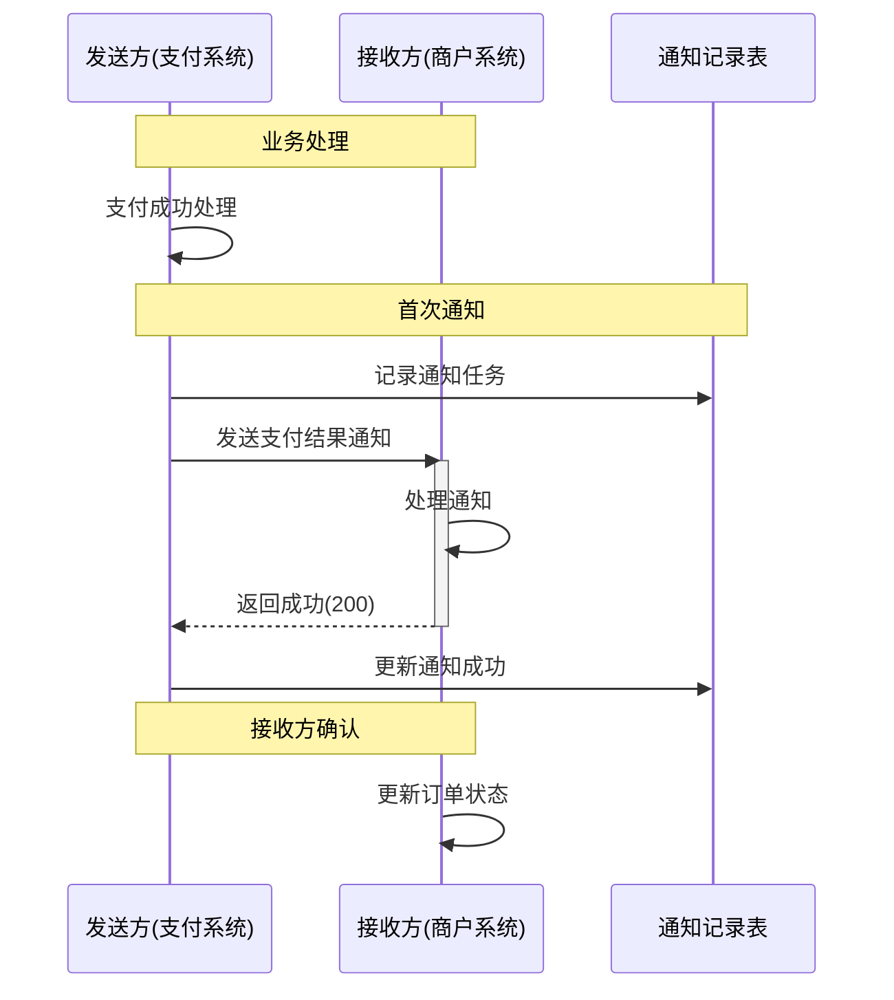
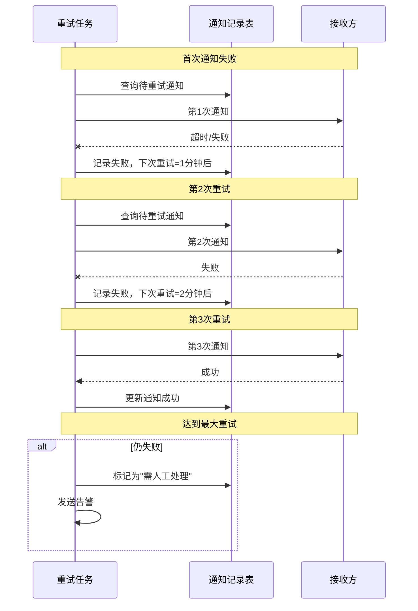
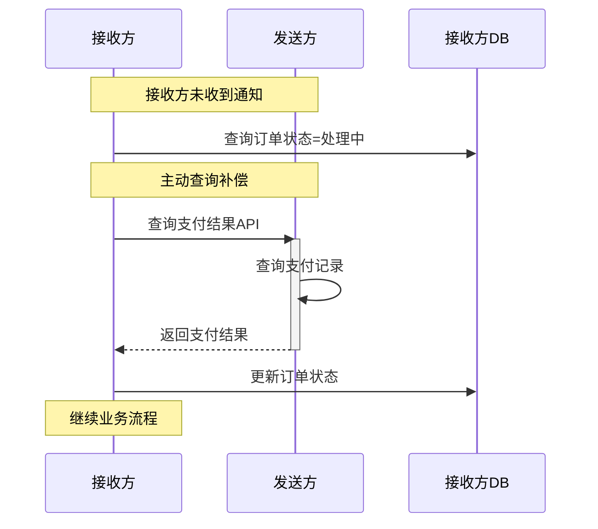

# 最大努力通知

**文档版本**：v1.0
**创建时间**：2026年
**最后更新**：2026年
**状态**：✅ 已完成

---

## 📋 执行摘要

最大努力通知是一种基于消息通知的弱一致性方案，适用于对一致性要求较低、可接受一定延迟和人工介入的场景。发送方通过多次重试尽力通知接收方，接收方通过主动查询和对账机制保证最终一致性。典型应用包括支付结果通知、物流状态变更等。

---

## 一、核心原理

### 1.1 设计思想

```
┌─────────────────────────────────────────────────────────────┐
│                     最大努力通知原理                         │
├─────────────────────────────────────────────────────────────┤
│                                                             │
│  发送方                           接收方                     │
│  ┌─────────────┐                ┌─────────────┐             │
│  │ 业务操作完成 │───► 发送通知 ──►│ 接收通知    │             │
│  └─────────────┘                └─────────────┘             │
│        │                              │                     │
│        │                              │                     │
│        ▼                              ▼                     │
│  ┌─────────────┐                ┌─────────────┐             │
│  │ 定时重试    │◄───────────────│ 主动查询    │             │
│  │ (N次后退)   │                │ (兜底机制)  │             │
│  └─────────────┘                └─────────────┘             │
│        │                                                     │
│        ▼                                                     │
│  ┌─────────────┐                                             │
│  │ 最终通知失败 │──► 人工介入/对账修复                          │
│  └─────────────┘                                             │
│                                                             │
│  特点：                                                       │
│  1. 不保证100%送达                                            │
│  2. 接收方需要主动对账                                         │
│  3. 最终一致性依赖人工或定时对账                                │
└─────────────────────────────────────────────────────────────┘
```

### 1.2 关键特性

| 特性 | 说明 |
|------|------|
| **尽力而为** | 发送方按策略重试，但不保证送达 |
| **接收方主动** | 接收方可主动查询补充 |
| **对账兜底** | 定时对账修复不一致 |
| **允许延迟** | 通知可能存在延迟 |

---

## 二、时序图

### 2.1 正常通知流程



### 2.2 重试与失败处理



### 2.3 接收方主动查询



---

## 三、Java实现示例

```java
/**
 * 通知任务实体
 */
@Data
@Table(name = "notify_task")
public class NotifyTask {
    @Id
    private Long id;
    private String taskId;           // 任务ID
    private String bizType;          // 业务类型:PAY/REFUND/SHIP
    private String bizId;            // 业务单号
    private String notifyUrl;        // 通知地址
    private String content;          // 通知内容
    private Integer status;          // 状态:0待通知 1通知中 2成功 3失败
    private Integer retryCount;      // 已重试次数
    private Integer maxRetry;        // 最大重试次数
    private String lastError;        // 上次错误
    private LocalDateTime nextRetryTime; // 下次重试时间
    private LocalDateTime createTime;
    private LocalDateTime successTime;
}

/**
 * 通知服务
 */
@Service
@Slf4j
public class BestEffortNotifyService {

    @Autowired
    private NotifyTaskDao notifyTaskDao;
    @Autowired
    private RestTemplate restTemplate;

    private static final int[] RETRY_INTERVALS = {1, 2, 5, 10, 30}; // 分钟

    /**
     * 创建通知任务
     */
    public void createNotifyTask(String bizType, String bizId,
                                  String notifyUrl, Object content) {
        NotifyTask task = new NotifyTask();
        task.setTaskId(generateTaskId());
        task.setBizType(bizType);
        task.setBizId(bizId);
        task.setNotifyUrl(notifyUrl);
        task.setContent(JSON.toJSONString(content));
        task.setStatus(0); // 待通知
        task.setRetryCount(0);
        task.setMaxRetry(RETRY_INTERVALS.length);
        task.setNextRetryTime(LocalDateTime.now());
        task.setCreateTime(LocalDateTime.now());

        notifyTaskDao.insert(task);

        // 立即尝试首次通知
        executeNotify(task);
    }

    /**
     * 定时重试任务
     */
    @Scheduled(fixedRate = 60000) // 每分钟执行
    public void retryNotifyTask() {
        List<NotifyTask> tasks = notifyTaskDao.selectRetryTasks(
            LocalDateTime.now(),
            100
        );

        for (NotifyTask task : tasks) {
            try {
                executeNotify(task);
            } catch (Exception e) {
                log.error("通知执行失败: taskId={}", task.getTaskId(), e);
            }
        }
    }

    /**
     * 执行通知
     */
    @Transactional
    protected void executeNotify(NotifyTask task) {
        // 乐观锁防止并发
        int updated = notifyTaskDao.updateStatusToProcessing(
            task.getId(),
            task.getRetryCount()
        );
        if (updated == 0) {
            return;
        }

        try {
            // 发送HTTP通知
            HttpHeaders headers = new HttpHeaders();
            headers.setContentType(MediaType.APPLICATION_JSON);
            HttpEntity<String> entity = new HttpEntity<>(task.getContent(), headers);

            ResponseEntity<String> response = restTemplate.exchange(
                task.getNotifyUrl(),
                HttpMethod.POST,
                entity,
                String.class
            );

            if (response.getStatusCode() == HttpStatus.OK) {
                // 通知成功
                notifyTaskDao.updateStatusToSuccess(task.getId());
                log.info("通知成功: taskId={}", task.getTaskId());
            } else {
                // 通知失败，安排重试
                scheduleRetry(task, "HTTP " + response.getStatusCode());
            }

        } catch (Exception e) {
            scheduleRetry(task, e.getMessage());
        }
    }

    /**
     * 安排重试
     */
    private void scheduleRetry(NotifyTask task, String errorMsg) {
        int nextRetry = task.getRetryCount() + 1;

        if (nextRetry >= task.getMaxRetry()) {
            // 超过最大重试次数
            notifyTaskDao.updateStatusToFailed(task.getId(), errorMsg);

            // 发送告警
            sendAlert(task, "通知失败超过最大重试次数");
        } else {
            // 计算下次重试时间
            int intervalMinutes = RETRY_INTERVALS[nextRetry - 1];
            LocalDateTime nextRetryTime = LocalDateTime.now()
                .plusMinutes(intervalMinutes);

            notifyTaskDao.updateForRetry(
                task.getId(),
                nextRetry,
                nextRetryTime,
                errorMsg
            );

            log.warn("通知失败，安排重试: taskId={}, retryCount={}, nextRetryTime={}",
                task.getTaskId(), nextRetry, nextRetryTime);
        }
    }

    /**
     * 接收方查询接口
     */
    public NotifyResult queryNotifyResult(String bizType, String bizId) {
        NotifyTask task = notifyTaskDao.selectByBizId(bizType, bizId);

        if (task == null) {
            return NotifyResult.notFound();
        }

        return NotifyResult.builder()
            .bizType(task.getBizType())
            .bizId(task.getBizId())
            .status(task.getStatus())
            .content(task.getContent())
            .build();
    }
}

/**
 * 接收方实现示例
 */
@RestController
@RequestMapping("/notify")
public class NotifyReceiverController {

    @Autowired
    private OrderService orderService;
    @Autowired
    private IdempotencyService idempotencyService;

    /**
     * 接收支付通知
     */
    @PostMapping("/pay")
    public ResponseEntity<String> receivePayNotify(@RequestBody PayNotifyRequest request) {
        String idempotencyKey = "pay_notify_" + request.getOrderId();

        // 幂等性检查
        if (idempotencyService.isProcessed(idempotencyKey)) {
            return ResponseEntity.ok("SUCCESS");
        }

        try {
            // 处理支付结果
            orderService.handlePayResult(
                request.getOrderId(),
                request.getPayStatus(),
                request.getTradeNo()
            );

            // 标记已处理
            idempotencyService.markProcessed(idempotencyKey);

            return ResponseEntity.ok("SUCCESS");
        } catch (Exception e) {
            log.error("处理支付通知失败: orderId={}", request.getOrderId(), e);
            return ResponseEntity.status(HttpStatus.INTERNAL_SERVER_ERROR).body("FAIL");
        }
    }

    /**
     * 主动查询支付结果（兜底）
     */
    @GetMapping("/query")
    public ResponseEntity<OrderStatus> queryOrderStatus(@RequestParam String orderId) {
        // 查询本地订单状态
        OrderStatus status = orderService.getStatus(orderId);

        // 如果仍是处理中，主动查询支付系统
        if (status == OrderStatus.PROCESSING) {
            PayResult payResult = queryFromPaySystem(orderId);
            if (payResult != null) {
                orderService.handlePayResult(orderId, payResult.getStatus(),
                                              payResult.getTradeNo());
                status = orderService.getStatus(orderId);
            }
        }

        return ResponseEntity.ok(status);
    }
}
```

---

## 四、对账机制

```java
/**
 * 对账服务
 */
@Service
public class ReconciliationService {

    @Autowired
    private NotifyTaskDao notifyTaskDao;
    @Autowired
    private OrderDao orderDao;

    /**
     * 定时对账
     */
    @Scheduled(cron = "0 0 2 * * ?") // 每天凌晨2点
    public void dailyReconciliation() {
        LocalDateTime yesterday = LocalDateTime.now().minusDays(1);

        // 1. 查询昨日通知失败的任务
        List<NotifyTask> failedTasks = notifyTaskDao.selectFailedTasks(yesterday);

        // 2. 查询接收方状态
        for (NotifyTask task : failedTasks) {
            try {
                OrderStatus receiverStatus = queryReceiverStatus(task.getBizId());

                if (receiverStatus == OrderStatus.PAID) {
                    // 接收方已处理，更新通知状态
                    notifyTaskDao.updateStatusToSuccess(task.getId());
                } else {
                    // 不一致，需要人工介入
                    createReconciliationTicket(task);
                }
            } catch (Exception e) {
                log.error("对账查询失败: taskId={}", task.getTaskId(), e);
            }
        }
    }
}
```

---

## 五、适用场景

| 场景 | 适用性 | 原因 |
|------|--------|------|
| 支付结果通知 | ⭐⭐⭐⭐⭐ | 商户需知道支付结果，可接受延迟 |
| 物流状态变更 | ⭐⭐⭐⭐⭐ | 非实时要求，可主动查询 |
| 短信/邮件通知 | ⭐⭐⭐⭐ | 非关键业务，允许丢失 |
| 库存同步 | ⭐⭐⭐ | 最终一致即可，但有延迟风险 |
| 金融账务 | ⭐⭐ | 需要更高可靠性保障 |

---

**维护者**：项目团队
**最后更新**：2026-04-03
