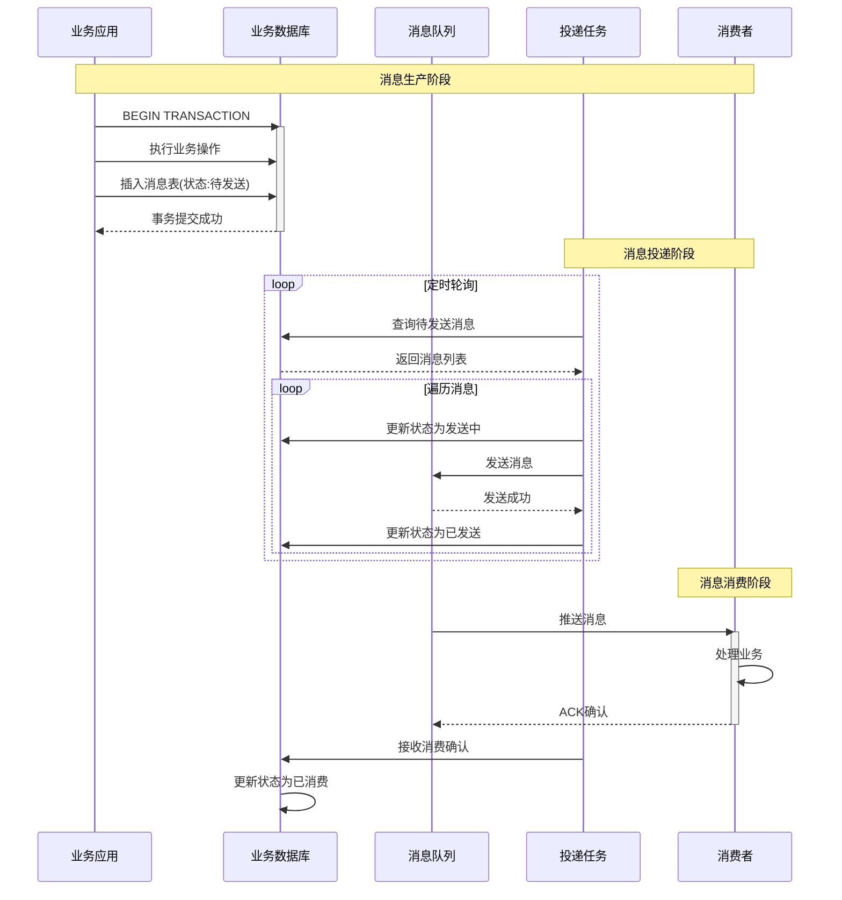
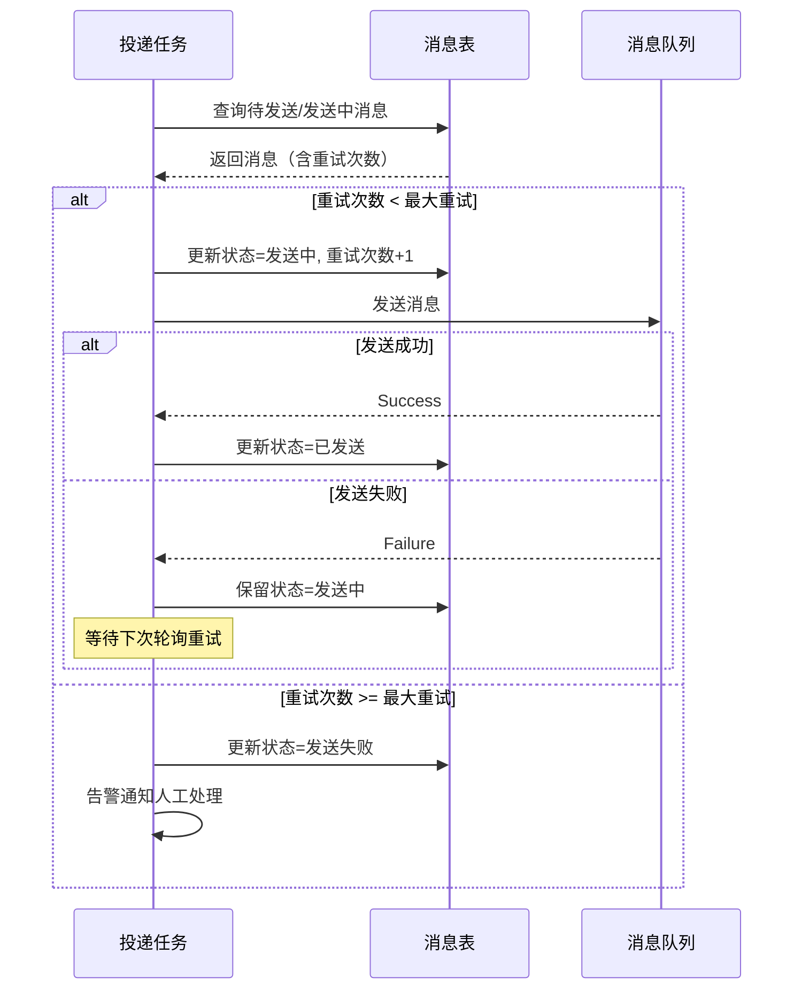

# 本地消息表

**文档版本**：v1.0
**创建时间**：2026年
**最后更新**：2026年
**状态**：✅ 已完成

---

## 📋 执行摘要

本地消息表是一种实现最终一致性的分布式事务方案，通过在业务数据库中维护消息表，将业务操作和消息记录放在同一个本地事务中，确保业务数据变更和消息发送的原子性。消息表由独立的后台任务轮询投递，保证消息最终被消费。

---

## 一、核心原理

### 1.1 设计思想

```
┌─────────────────────────────────────────────────────────┐
│                    本地消息表原理                        │
├─────────────────────────────────────────────────────────┤
│                                                         │
│  传统方式（不一致风险）：                                  │
│  1. 扣减库存 ────────► 2. 发送消息                       │
│     [成功]              [失败]                          │
│  → 库存已扣，消息未发，数据不一致                          │
│                                                         │
│  本地消息表（保证一致）：                                  │
│  ┌─────────────────────────────────────┐               │
│  │  本地事务                           │               │
│  │  1. 扣减库存                        │               │
│  │  2. 插入消息表（待发送）             │               │
│  └─────────────────────────────────────┘               │
│            │                                            │
│            ▼                                            │
│  后台任务轮询投递消息                                     │
│            │                                            │
│            ▼                                            │
│  更新消息状态为「已发送」                                  │
│                                                         │
└─────────────────────────────────────────────────────────┘
```

### 1.2 消息状态流转

```
待发送 → 发送中 → 已发送 → 已消费
  │        │        │        │
  ▼        ▼        ▼        ▼
可重试   定时重试   等待ACK   完成
```

---

## 二、时序图

### 2.1 消息生产流程



### 2.2 失败重试流程



---

## 三、Java实现示例

```java
/**
 * 消息实体
 */
@Data
@Table(name = "local_message")
public class LocalMessage {
    @Id
    private Long id;
    private String messageId;        // 消息唯一ID
    private String topic;            // 消息主题
    private String body;             // 消息内容
    private Integer status;          // 状态:0待发送 1发送中 2已发送 3已消费 4发送失败
    private Integer retryCount;      // 重试次数
    private String errorMsg;         // 错误信息
    private LocalDateTime createTime;
    private LocalDateTime updateTime;
    private LocalDateTime nextRetryTime; // 下次重试时间
}

/**
 * 消息服务
 */
@Service
public class LocalMessageService {

    @Autowired
    private LocalMessageDao messageDao;
    @Autowired
    private RabbitTemplate rabbitTemplate;

    /**
     * 发送消息（业务代码调用）
     */
    @Transactional
    public void sendMessage(String topic, Object payload) {
        String messageId = generateMessageId();
        String body = JSON.toJSONString(payload);

        LocalMessage message = new LocalMessage();
        message.setMessageId(messageId);
        message.setTopic(topic);
        message.setBody(body);
        message.setStatus(0); // 待发送
        message.setRetryCount(0);
        message.setCreateTime(LocalDateTime.now());
        message.setNextRetryTime(LocalDateTime.now());

        messageDao.insert(message);
    }

    /**
     * 消息投递任务
     */
    @Scheduled(fixedRate = 5000) // 每5秒执行
    public void deliverMessages() {
        // 查询待发送或需要重试的消息
        List<LocalMessage> messages = messageDao.selectByStatusAndRetryTime(
            Arrays.asList(0, 1), // 待发送或发送中
            LocalDateTime.now(),
            100 // 每次最多100条
        );

        for (LocalMessage msg : messages) {
            try {
                deliverSingleMessage(msg);
            } catch (Exception e) {
                handleDeliveryFailure(msg, e);
            }
        }
    }

    /**
     * 投递单条消息
     */
    @Transactional
    protected void deliverSingleMessage(LocalMessage msg) {
        // 1. 更新状态为发送中
        int updated = messageDao.updateStatus(
            msg.getId(),
            1, // 发送中
            msg.getStatus(), // 预期当前状态
            msg.getRetryCount() + 1
        );

        if (updated == 0) {
            return; // 状态已被其他线程更新
        }

        // 2. 发送消息到MQ
        CorrelationData correlation = new CorrelationData(msg.getMessageId());
        rabbitTemplate.convertAndSend(
            msg.getTopic(),
            "",
            msg.getBody(),
            correlation
        );

        // 3. 更新状态为已发送
        messageDao.updateStatusToSent(msg.getId());
    }

    /**
     * 处理投递失败
     */
    private void handleDeliveryFailure(LocalMessage msg, Exception e) {
        int maxRetry = 5;

        if (msg.getRetryCount() >= maxRetry) {
            // 超过最大重试次数，标记为失败
            messageDao.updateStatusToFailed(msg.getId(), e.getMessage());

            // 发送告警
            sendAlert(msg, "消息投递失败超过最大重试次数");
        } else {
            // 计算下次重试时间（指数退避）
            long backoffSeconds = (long) Math.pow(2, msg.getRetryCount());
            LocalDateTime nextRetry = LocalDateTime.now().plusSeconds(backoffSeconds);

            messageDao.updateNextRetryTime(msg.getId(), nextRetry);
        }
    }

    /**
     * 消费确认回调
     */
    public void confirmConsumption(String messageId) {
        messageDao.updateStatusToConsumed(messageId);
    }
}

/**
 * 订单服务（使用本地消息表）
 */
@Service
public class OrderService {

    @Autowired
    private OrderDao orderDao;
    @Autowired
    private LocalMessageService messageService;

    /**
     * 创建订单（带库存扣减消息）
     */
    @Transactional
    public Order createOrder(CreateOrderRequest request) {
        // 1. 创建订单
        Order order = new Order();
        order.setOrderId(generateOrderId());
        order.setUserId(request.getUserId());
        order.setSkuId(request.getSkuId());
        order.setCount(request.getCount());
        order.setStatus(OrderStatus.CREATED);
        orderDao.insert(order);

        // 2. 发送扣减库存消息（同一事务）
        InventoryDeductMessage message = new InventoryDeductMessage();
        message.setOrderId(order.getOrderId());
        message.setSkuId(request.getSkuId());
        message.setCount(request.getCount());

        messageService.sendMessage("inventory.deduct", message);

        return order;
    }
}

/**
 * 消费者幂等处理
 */
@Component
@RabbitListener(queues = "inventory.deduct")
public class InventoryConsumer {

    @Autowired
    private InventoryService inventoryService;
    @Autowired
    private IdempotencyKeyDao idempotencyDao;

    @RabbitHandler
    public void handle(InventoryDeductMessage message, Channel channel,
                       @Header(AmqpHeaders.DELIVERY_TAG) long tag) throws IOException {

        String idempotencyKey = "inventory_deduct_" + message.getOrderId();

        try {
            // 幂等性检查
            if (idempotencyDao.exists(idempotencyKey)) {
                channel.basicAck(tag, false);
                return;
            }

            // 扣减库存
            inventoryService.deduct(message.getSkuId(), message.getCount());

            // 记录幂等键
            idempotencyDao.insert(idempotencyKey);

            channel.basicAck(tag, false);
        } catch (Exception e) {
            // 消费失败，重新入队（或根据策略处理）
            channel.basicNack(tag, false, true);
        }
    }
}
```

---

## 四、数据库设计

```sql
-- 本地消息表
CREATE TABLE local_message (
    id BIGINT PRIMARY KEY AUTO_INCREMENT,
    message_id VARCHAR(64) NOT NULL COMMENT '消息唯一ID',
    topic VARCHAR(128) NOT NULL COMMENT '消息主题/队列',
    body TEXT NOT NULL COMMENT '消息内容(JSON)',
    status TINYINT NOT NULL DEFAULT 0 COMMENT '状态:0待发送 1发送中 2已发送 3已消费 4失败',
    retry_count TINYINT NOT NULL DEFAULT 0 COMMENT '重试次数',
    error_msg VARCHAR(500) COMMENT '错误信息',
    create_time DATETIME NOT NULL DEFAULT CURRENT_TIMESTAMP,
    update_time DATETIME NOT NULL DEFAULT CURRENT_TIMESTAMP ON UPDATE CURRENT_TIMESTAMP,
    next_retry_time DATETIME NOT NULL COMMENT '下次重试时间',

    UNIQUE KEY uk_message_id (message_id),
    INDEX idx_status_retry (status, next_retry_time),
    INDEX idx_create_time (create_time)
) COMMENT='本地消息表';

-- 幂等性控制表（消费者端）
CREATE TABLE idempotency_key (
    id BIGINT PRIMARY KEY AUTO_INCREMENT,
    key_value VARCHAR(128) NOT NULL COMMENT '幂等键',
    create_time DATETIME NOT NULL DEFAULT CURRENT_TIMESTAMP,

    UNIQUE KEY uk_key (key_value),
    INDEX idx_create_time (create_time)
) COMMENT='幂等性控制表';
```

---

## 五、优缺点分析

| 优点 | 缺点 |
|------|------|
| 实现简单，无需外部框架 | 业务侵入性（需维护消息表） |
| 保证最终一致性 | 有延迟，非实时 |
| 性能好，本地事务开销小 | 需要处理消息重复 |
| 可靠性高，消息持久化 | 需要定时任务轮询 |

---

**维护者**：项目团队
**最后更新**：2026-04-03
