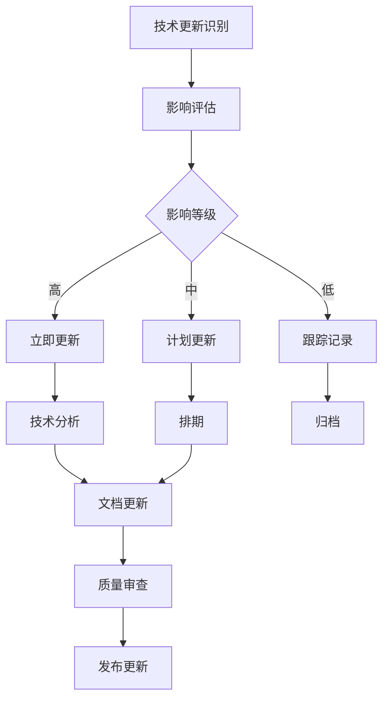

# 2025年可持续推进计划

**文档版本**：v1.0  
**创建时间**：2025年1月  
**状态**：✅ **执行中**

---

## 📋 计划概述

本计划基于2025年最新技术趋势对齐与批判性分析，制定项目的可持续推进方案，确保项目内容始终保持最新、准确和实用。

---

## 一、总体目标

### 1.1 核心目标

1. **技术时效性**：确保所有技术分析基于最新版本和特性
2. **内容完整性**：覆盖所有重要技术趋势和应用场景
3. **质量保证**：维持高质量的技术分析和文档
4. **社区参与**：建立活跃的社区参与机制

### 1.2 成功指标

| 指标 | 目标值 | 当前值 | 差距 |
|------|--------|--------|------|
| **技术版本更新及时性** | 新版本发布后1个月内 | 3-6个月 | 需改进 |
| **内容完整性** | 95% | 90% | 需改进 |
| **文档质量评分** | ≥4.5/5.0 | 4.2/5.0 | 需改进 |
| **社区贡献数** | 每月≥5 | 0-2 | 需改进 |

---

## 二、技术跟踪与更新机制

### 2.1 技术跟踪清单

#### 2.1.1 核心技术跟踪

**跟踪频率**：每月更新

| 技术 | 跟踪内容 | 更新频率 | 负责人 | 状态 |
|------|---------|---------|--------|------|
| **Temporal** | 版本、新功能、社区动态 | 每月 | 技术团队 | 🔄 进行中 |
| **Airflow** | 版本、新特性、最佳实践 | 每季度 | 技术团队 | 🔄 进行中 |
| **PostgreSQL** | 版本、性能改进、新特性 | 每季度 | 技术团队 | 🔄 进行中 |
| **Flink** | 版本、新特性 | 每季度 | 技术团队 | 🔄 进行中 |
| **Spark** | 版本、新特性 | 每季度 | 技术团队 | 🔄 进行中 |
| **Ray** | 版本、新特性 | 每季度 | 技术团队 | 🔄 进行中 |

#### 2.1.2 新兴技术跟踪

**跟踪频率**：每季度评估

| 技术领域 | 跟踪内容 | 评估标准 | 优先级 |
|---------|---------|---------|--------|
| **AI/ML集成** | LLM辅助验证、AI Agent工作流 | 成熟度、采用率 | P0 |
| **边缘计算** | 边缘工作流编排 | 成熟度、采用率 | P2 |
| **Serverless** | Serverless工作流 | 成熟度、采用率 | P2 |
| **区块链** | 去中心化工作流 | 成熟度、采用率 | P3 |

---

### 2.2 版本更新流程

#### 2.2.1 更新触发条件

**自动触发**：
- ✅ 主要版本发布（Major Version）
- ✅ 重大功能更新（Significant Features）
- ✅ 安全漏洞修复（Security Patches）

**手动触发**：
- ✅ 社区反馈（Community Feedback）
- ✅ 企业案例更新（Enterprise Cases）
- ✅ 学术研究突破（Research Breakthroughs）

#### 2.2.2 更新流程

**更新步骤**：
1. **识别**：识别技术更新
2. **评估**：评估影响等级
3. **分析**：进行技术分析
4. **更新**：更新相关文档
5. **审查**：质量审查
6. **发布**：发布更新

---

### 2.3 内容更新计划

#### 2.3.1 2025年Q1更新计划

**时间**：2025年1月-3月

**P0优先级更新**：

| 更新内容 | 预计时间 | 负责人 | 状态 |
|---------|---------|--------|------|
| Airflow 3.0专项分析 | 2周 | 技术团队 | 🔄 计划中 |
| AI/ML工作流集成分析 | 3周 | 技术团队 | 🔄 计划中 |
| PostgreSQL 18性能基准测试 | 2周 | 技术团队 | 🔄 计划中 |
| Temporal 2025新功能分析 | 2周 | 技术团队 | 🔄 计划中 |

**P1优先级更新**：

| 更新内容 | 预计时间 | 负责人 | 状态 |
|---------|---------|--------|------|
| 用户培训与采用指南 | 2周 | 文档团队 | 🔄 计划中 |
| 工具化开发核心功能 | 4周 | 开发团队 | 🔄 计划中 |

#### 2.3.2 2025年Q2更新计划

**时间**：2025年4月-6月

**计划内容**：
- [ ] 边缘计算工作流分析
- [ ] Serverless工作流分析
- [ ] 持续内容优化
- [ ] 社区反馈处理

#### 2.3.3 2025年Q3-Q4更新计划

**时间**：2025年7月-12月

**计划内容**：
- [ ] 年度技术趋势总结
- [ ] 企业案例年度更新
- [ ] 性能基准测试年度更新
- [ ] 工具化开发扩展功能

---

## 三、质量保证机制

### 3.1 内容质量标准

#### 3.1.1 技术准确性标准

**要求**：
- ✅ 所有技术信息基于官方文档和权威来源
- ✅ 性能数据基于实际测试或可靠来源
- ✅ 代码示例经过验证
- ✅ 数学公式和理论正确

**检查清单**：
- [ ] 技术版本信息准确
- [ ] 功能描述准确
- [ ] 性能数据来源可靠
- [ ] 代码示例可运行
- [ ] 理论推导正确

#### 3.1.2 内容完整性标准

**要求**：
- ✅ 覆盖所有重要主题
- ✅ 提供足够的细节和示例
- ✅ 包含相关链接和参考
- ✅ 保持文档结构清晰

**检查清单**：
- [ ] 主题覆盖完整
- [ ] 细节足够详细
- [ ] 示例充分
- [ ] 链接有效
- [ ] 结构清晰

#### 3.1.3 可读性标准

**要求**：
- ✅ 语言清晰易懂
- ✅ 结构逻辑清晰
- ✅ 格式统一规范
- ✅ 图表清晰有效

**检查清单**：
- [ ] 语言清晰
- [ ] 逻辑清晰
- [ ] 格式统一
- [ ] 图表有效

---

### 3.2 审查机制

#### 3.2.1 技术审查

**审查频率**：每季度

**审查内容**：
- ✅ 技术准确性
- ✅ 版本信息
- ✅ 性能数据
- ✅ 代码示例

**审查流程**：
1. **自检**：作者自检
2. **同行评审**：技术同行评审
3. **专家审查**：领域专家审查
4. **最终审查**：项目负责人审查

#### 3.2.2 内容审查

**审查频率**：每季度

**审查内容**：
- ✅ 内容完整性
- ✅ 结构逻辑性
- ✅ 可读性
- ✅ 时效性

---

### 3.3 质量改进机制

#### 3.3.1 反馈收集

**反馈渠道**：
- ✅ GitHub Issues
- ✅ 社区论坛
- ✅ 用户调查
- ✅ 专家咨询

#### 3.3.2 持续改进

**改进流程**：
1. **收集反馈**：收集用户和专家反馈
2. **分析问题**：分析反馈中的问题
3. **制定方案**：制定改进方案
4. **实施改进**：实施改进措施
5. **验证效果**：验证改进效果

---

## 四、社区参与机制

### 4.1 贡献方式

#### 4.1.1 代码贡献

**贡献类型**：
- ✅ Bug修复
- ✅ 功能增强
- ✅ 工具开发
- ✅ 测试用例

**贡献流程**：
1. Fork项目
2. 创建功能分支
3. 提交更改
4. 创建Pull Request
5. 代码审查
6. 合并代码

#### 4.1.2 文档贡献

**贡献类型**：
- ✅ 文档改进
- ✅ 翻译
- ✅ 示例补充
- ✅ 案例分享

**贡献流程**：
1. 识别改进点
2. 提交改进建议
3. 创建Pull Request
4. 文档审查
5. 合并文档

#### 4.1.3 案例贡献

**贡献类型**：
- ✅ 企业实践案例
- ✅ 最佳实践分享
- ✅ 问题解决方案
- ✅ 经验总结

**贡献流程**：
1. 准备案例材料
2. 提交案例
3. 案例审查
4. 添加到文档

---

### 4.2 社区激励

#### 4.2.1 贡献者认可

**认可方式**：
- ✅ 贡献者名单
- ✅ 贡献统计
- ✅ 特别感谢
- ✅ 社区徽章

#### 4.2.2 知识分享

**分享方式**：
- ✅ 技术博客
- ✅ 会议演讲
- ✅ 在线研讨会
- ✅ 教程视频

---

### 4.3 社区管理

#### 4.3.1 沟通渠道

**渠道**：
- ✅ GitHub Discussions
- ✅ 社区论坛
- ✅ 邮件列表
- ✅ 社交媒体

#### 4.3.2 响应机制

**响应时间**：
- 🔴 **紧急问题**：24小时内
- 🟡 **一般问题**：3个工作日内
- 🟢 **建议反馈**：1周内

---

## 五、资源分配

### 5.1 人力资源

#### 5.1.1 团队结构

**核心团队**：
- **技术负责人**：1人，负责技术跟踪和分析
- **文档负责人**：1人，负责文档维护和更新
- **开发负责人**：1人，负责工具化开发
- **社区负责人**：1人，负责社区管理

**扩展团队**：
- **技术贡献者**：3-5人，负责技术分析
- **文档贡献者**：2-3人，负责文档改进
- **开发贡献者**：2-3人，负责工具开发

#### 5.1.2 时间分配

**时间分配比例**：
- **技术跟踪**：30%
- **内容更新**：30%
- **工具开发**：20%
- **社区管理**：20%

---

### 5.2 技术资源

#### 5.2.1 测试环境

**环境需求**：
- ✅ Temporal测试集群
- ✅ PostgreSQL测试环境
- ✅ Airflow测试环境
- ✅ 性能测试工具

#### 5.2.2 工具资源

**工具需求**：
- ✅ 版本控制（Git）
- ✅ 文档平台（GitHub Pages）
- ✅ 协作工具（GitHub Projects）
- ✅ 监控工具（Analytics）

---

## 六、风险管控

### 6.1 技术风险

#### 6.1.1 版本更新风险

**风险**：技术快速演进导致内容过时

**应对策略**：
- ✅ 建立定期更新机制
- ✅ 设置技术跟踪清单
- ✅ 建立版本更新流程
- ✅ 自动化部分更新流程

#### 6.1.2 技术选择风险

**风险**：技术选择可能不适合

**应对策略**：
- ✅ 深入技术分析
- ✅ 多方案对比
- ✅ 实际测试验证
- ✅ 社区反馈收集

---

### 6.2 资源风险

#### 6.2.1 人力资源风险

**风险**：缺乏足够人力资源

**应对策略**：
- ✅ 建立社区贡献机制
- ✅ 优先处理高影响更新
- ✅ 自动化部分流程
- ✅ 外包部分工作

#### 6.2.2 技术资源风险

**风险**：缺乏测试环境

**应对策略**：
- ✅ 使用云服务
- ✅ 社区资源共享
- ✅ 合作伙伴支持

---

### 6.3 质量风险

#### 6.3.1 内容质量风险

**风险**：快速更新可能影响质量

**应对策略**：
- ✅ 建立审查机制
- ✅ 设置质量检查清单
- ✅ 进行同行评审
- ✅ 用户反馈验证

---

## 七、成功标准与评估

### 7.1 成功标准

#### 7.1.1 技术时效性标准

**标准**：
- ✅ 主要版本更新后1个月内完成分析
- ✅ 重大功能更新后2周内完成分析
- ✅ 安全漏洞修复后1周内完成更新

#### 7.1.2 内容质量标准

**标准**：
- ✅ 技术准确性≥95%
- ✅ 内容完整性≥95%
- ✅ 文档质量评分≥4.5/5.0

#### 7.1.3 社区参与标准

**标准**：
- ✅ 每月社区贡献≥5次
- ✅ 问题响应时间≤3个工作日
- ✅ 社区活跃度持续增长

---

### 7.2 评估机制

#### 7.2.1 季度评估

**评估内容**：
- ✅ 技术跟踪完成情况
- ✅ 内容更新完成情况
- ✅ 质量指标达成情况
- ✅ 社区参与情况

#### 7.2.2 年度评估

**评估内容**：
- ✅ 年度目标达成情况
- ✅ 项目影响力评估
- ✅ 社区成长评估
- ✅ 下年度计划制定

---

## 八、下一步行动

### 8.1 立即行动（本周）

1. **启动Airflow 3.0专项分析**
   - 创建分析文档
   - 收集最新信息
   - 开始技术分析

2. **启动AI/ML工作流集成分析**
   - 创建分析文档
   - 收集相关案例
   - 开始技术分析

3. **启动PostgreSQL 18性能基准测试**
   - 搭建测试环境
   - 准备测试用例
   - 开始性能测试

### 8.2 近期行动（本月）

1. **建立技术跟踪机制**
   - 设置跟踪清单
   - 建立更新流程
   - 分配负责人

2. **建立质量保证机制**
   - 制定质量标准
   - 建立审查流程
   - 设置检查清单

3. **建立社区参与机制**
   - 设置沟通渠道
   - 建立贡献流程
   - 启动社区活动

---

## 九、相关文档

- [2025年最新技术趋势对齐与批判性分析](../06-ANALYSIS/2025年最新技术趋势对齐与批判性分析.md)
- [后续推进计划与方案](后续推进计划与方案.md)
- [综合评估报告](../06-ANALYSIS/综合评估报告.md)
- [技术堆栈对比分析](../03-TECHNOLOGY/技术堆栈对比分析.md)

---

**维护者**：项目团队  
**最后更新**：2025年1月  
**下次审查**：2025年2月
