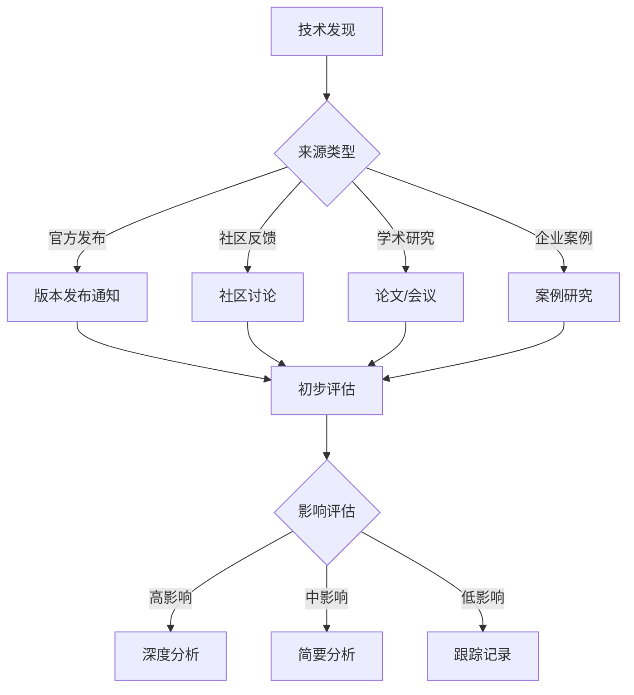

# 技术更新流程详细文档

**文档版本**：v1.0  
**创建时间**：2025年1月  
**状态**：✅ **已完成**

---

## 📋 概述

本文档定义完整的技术跟踪和更新流程，确保项目技术内容始终保持最新。

---

## 一、技术跟踪周期

### 1.1 跟踪频率

| 技术类型 | 跟踪频率 | 评估频率 | 更新频率 |
|---------|---------|---------|---------|
| **核心框架**（Temporal、Airflow等） | 每月 | 每季度 | 每季度 |
| **存储技术**（PostgreSQL等） | 每月 | 每季度 | 每季度 |
| **形式化验证工具** | 每季度 | 每半年 | 每半年 |
| **新兴技术** | 每月 | 每季度 | 按需 |

### 1.2 跟踪触发条件

**自动触发**：
- ✅ 主要版本发布（Major Version）
- ✅ 重大功能更新（Significant Features）
- ✅ 安全漏洞修复（Security Patches）

**手动触发**：
- ✅ 社区反馈（Community Feedback）
- ✅ 企业案例更新（Enterprise Cases）
- ✅ 学术研究突破（Research Breakthroughs）

---

## 二、技术评估标准

### 2.1 成熟度评估标准

| 等级 | 说明 | 评分 |
|------|------|------|
| **生产级** | 已在生产环境大规模使用 | 5分 |
| **稳定版** | 稳定版本，适合生产使用 | 4分 |
| **测试版** | 测试版本，适合测试环境 | 3分 |
| **预览版** | 预览版本，仅用于评估 | 2分 |
| **实验性** | 实验性技术，不推荐使用 | 1分 |

### 2.2 适用性评估标准

| 维度 | 评估标准 | 权重 |
|------|---------|------|
| **场景匹配度** | 与项目场景的匹配程度 | 30% |
| **技术栈兼容性** | 与现有技术栈的兼容性 | 25% |
| **学习曲线** | 团队学习成本 | 20% |
| **生态系统** | 工具和库的丰富程度 | 25% |

### 2.3 风险评估标准

| 风险类型 | 评估维度 | 评分标准 |
|---------|---------|---------|
| **技术风险** | 稳定性、可靠性 | 1-5分 |
| **迁移风险** | 迁移成本、复杂度 | 1-5分 |
| **维护风险** | 维护成本、社区支持 | 1-5分 |

---

## 三、技术更新流程

### 3.1 技术发现流程



### 3.2 技术评估流程

**评估步骤**：
1. **收集信息**：收集技术文档、案例、性能数据
2. **初步评估**：使用评估框架进行初步评估
3. **深度分析**：对高影响技术进行深度分析
4. **对比分析**：与现有技术进行对比
5. **决策制定**：制定采用或跟踪决策

### 3.3 技术更新流程

**更新步骤**：
1. **文档更新**：更新相关技术文档
2. **对比更新**：更新技术对比分析
3. **案例更新**：更新企业实践案例
4. **知识图谱更新**：更新知识图谱
5. **通知发布**：发布更新通知

### 3.4 技术淘汰流程

**淘汰标准**：
- ❌ 技术已停止维护
- ❌ 有更好的替代方案
- ❌ 安全漏洞无法修复
- ❌ 性能无法满足需求

**淘汰步骤**：
1. **评估影响**：评估淘汰对项目的影响
2. **制定迁移计划**：制定迁移到新技术的计划
3. **执行迁移**：执行迁移计划
4. **归档文档**：将旧技术文档归档

---

## 四、技术更新文档模板

### 4.1 技术跟踪报告模板

```markdown
# 技术跟踪报告：[技术名称]

**跟踪日期**：YYYY-MM-DD
**技术版本**：vX.X.X
**跟踪人员**：XXX

## 一、技术概述
- 技术名称
- 最新版本
- 发布日期
- 主要更新

## 二、影响评估
- 对项目的影响
- 影响等级（高/中/低）
- 影响范围

## 三、评估结果
- 成熟度评分
- 适用性评分
- 风险评分
- 综合评分

## 四、建议
- 采用建议
- 跟踪建议
- 更新建议
```

### 4.2 技术评估报告模板

```markdown
# 技术评估报告：[技术名称]

**评估日期**：YYYY-MM-DD
**评估人员**：XXX

## 一、技术分析
- 技术特性
- 性能指标
- 成本分析

## 二、对比分析
- 与现有技术对比
- 优势分析
- 劣势分析

## 三、适用性分析
- 场景匹配度
- 技术栈兼容性
- 学习曲线

## 四、风险评估
- 技术风险
- 迁移风险
- 维护风险

## 五、决策建议
- 采用/跟踪/淘汰
- 理由说明
- 实施计划
```

---

## 五、执行检查清单

### 5.1 每月检查清单

- [ ] 检查核心框架版本更新
- [ ] 检查存储技术版本更新
- [ ] 收集社区反馈
- [ ] 更新技术跟踪清单

### 5.2 每季度检查清单

- [ ] 执行技术评估
- [ ] 更新技术文档
- [ ] 更新技术对比分析
- [ ] 生成技术趋势报告

### 5.3 每半年检查清单

- [ ] 全面技术审查
- [ ] 更新技术选型建议
- [ ] 评估技术淘汰
- [ ] 制定技术路线图

---

## 六、相关文档

- [2025年最新技术趋势对齐与批判性分析](../../06-ANALYSIS/2025年最新技术趋势对齐与批判性分析.md)
- [2025年可持续推进计划](../2025年可持续推进计划.md)
- [P5-新兴技术跟踪清单](P5-新兴技术跟踪清单.md)

---

**维护者**：项目团队  
**最后更新**：2025年1月  
**下次审查**：2025年2月
