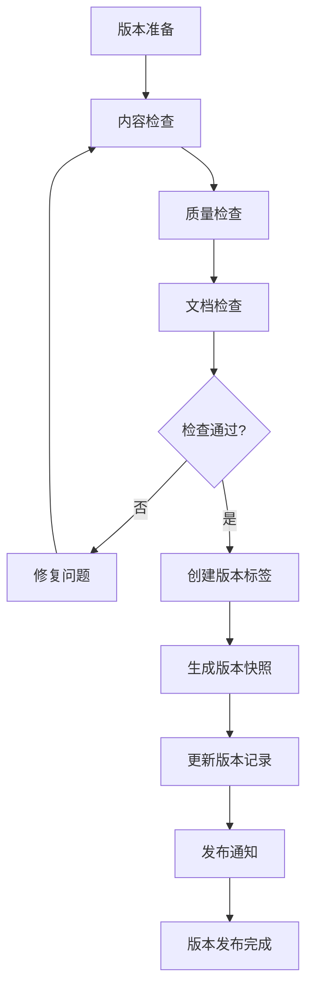
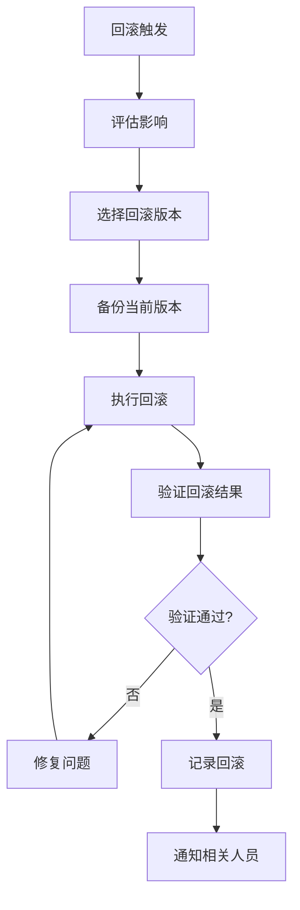

# 知识图谱版本管理流程详细文档

**文档版本**：v1.0  
**创建时间**：2025年1月  
**状态**：✅ **已完成**

---

## 📋 概述

本文档定义知识图谱的版本管理流程，包括版本号规则、发布流程和回滚机制。

---

## 一、版本号规则

### 1.1 语义化版本号

**格式**：`MAJOR.MINOR.PATCH`

| 版本类型 | 说明 | 示例 | 触发条件 |
|---------|------|------|---------|
| **MAJOR** | 重大变更 | 2.0.0 | 知识结构重大调整 |
| **MINOR** | 功能增加 | 1.5.0 | 新增概念或关系 |
| **PATCH** | 修复更新 | 1.4.3 | 修正错误或优化 |

### 1.2 版本号变更规则

**MAJOR版本变更**：
- 知识结构重大调整
- 核心概念重新定义
- 关系模型重大变更

**MINOR版本变更**：
- 新增概念（10+个）
- 新增关系（20+个）
- 新增属性或元数据

**PATCH版本变更**：
- 修正概念错误
- 修正关系错误
- 优化可视化
- 性能优化

---

## 二、版本发布流程

### 2.1 发布前检查清单

**内容检查**：
- [ ] 所有概念节点完整
- [ ] 所有关系正确
- [ ] 所有属性完整
- [ ] 可视化清晰

**质量检查**：
- [ ] 数据一致性验证通过
- [ ] 完整性检查通过
- [ ] 准确性检查通过
- [ ] 时效性检查通过

**文档检查**：
- [ ] 更新日志完整
- [ ] 发布说明完整
- [ ] 变更影响分析完整

### 2.2 发布流程

### 2.3 发布通知机制

**通知内容**：
- 版本号
- 主要变更
- 影响分析
- 使用建议

**通知渠道**：
- GitHub Release
- 项目文档更新
- 邮件通知（如适用）

---

## 三、版本回滚机制

### 3.1 回滚触发条件

**自动回滚**：
- ❌ 数据一致性错误
- ❌ 严重性能问题
- ❌ 安全漏洞

**手动回滚**：
- ⚠️ 用户反馈严重问题
- ⚠️ 发现重大错误
- ⚠️ 业务需求变更

### 3.2 回滚流程

### 3.3 回滚记录

**记录内容**：
- 回滚原因
- 回滚版本
- 回滚时间
- 影响分析
- 后续计划

---

## 四、版本比较

### 4.1 比较维度

| 维度 | 说明 | 工具 |
|------|------|------|
| **概念变更** | 新增/删除/修改的概念 | 版本比较工具 |
| **关系变更** | 新增/删除/修改的关系 | 版本比较工具 |
| **属性变更** | 新增/删除/修改的属性 | 版本比较工具 |
| **可视化变更** | 可视化布局和样式变更 | 可视化比较 |

### 4.2 变更统计

**统计指标**：
- 新增概念数
- 删除概念数
- 修改概念数
- 新增关系数
- 删除关系数
- 修改关系数

---

## 五、相关文档

- [知识图谱质量评估流程](知识图谱质量评估流程详细文档.md)
- [知识图谱持续更新机制](P5-知识图谱持续更新机制.md)
- [项目知识图谱](../../07-KNOWLEDGE/项目知识图谱.md)

---

**维护者**：项目团队  
**最后更新**：2025年1月  
**下次审查**：2025年2月
