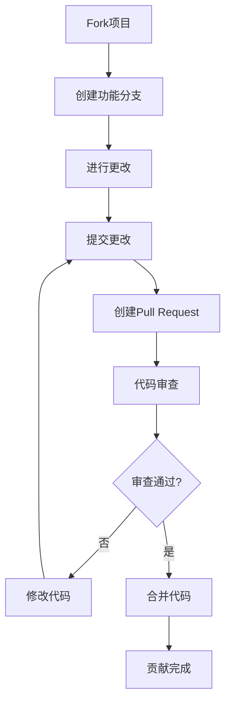

# 社区建设与推广指南

**文档版本**：v1.0  
**创建时间**：2025年1月  
**状态**：✅ **已完成**

---

## 📋 执行摘要

本文档提供完整的社区建设和项目推广指南，帮助建立活跃的社区并提升项目影响力。

---

## 一、社区建设

### 1.1 GitHub社区建设

#### 1.1.1 仓库设置

**仓库结构**：
```
DistributedComputing-WorkFlow/
├── README.md                    # 项目主README
├── CONTRIBUTING.md              # 贡献指南
├── CODE_OF_CONDUCT.md           # 行为准则
├── LICENSE                      # 许可证
├── .github/
│   ├── ISSUE_TEMPLATE/          # Issue模板
│   │   ├── bug_report.md
│   │   ├── feature_request.md
│   │   └── question.md
│   ├── PULL_REQUEST_TEMPLATE.md # PR模板
│   └── workflows/               # GitHub Actions
├── docs/                        # 文档目录
└── tools/                       # 工具目录
```

**仓库设置**：
- ✅ 启用Issues
- ✅ 启用Discussions
- ✅ 启用Projects
- ✅ 启用Wiki（可选）
- ✅ 设置分支保护规则

#### 1.1.2 Issue模板

**Bug报告模板**：
```markdown
## Bug描述
[清晰描述bug]

## 复现步骤
1. 
2. 
3. 

## 预期行为
[描述预期行为]

## 实际行为
[描述实际行为]

## 环境信息
- 操作系统：
- 浏览器：
- 版本：

## 附加信息
[其他相关信息]
```

**功能请求模板**：
```markdown
## 功能描述
[清晰描述功能需求]

## 使用场景
[描述使用场景]

## 预期效果
[描述预期效果]

## 替代方案
[描述替代方案]

## 附加信息
[其他相关信息]
```

#### 1.1.3 Pull Request模板

```markdown
## 变更类型
- [ ] Bug修复
- [ ] 新功能
- [ ] 文档更新
- [ ] 代码重构
- [ ] 性能优化

## 变更描述
[描述变更内容]

## 相关Issue
[关联的Issue编号]

## 检查清单
- [ ] 代码已测试
- [ ] 文档已更新
- [ ] 代码符合规范
- [ ] 无破坏性变更

## 附加信息
[其他相关信息]
```

### 1.2 讨论论坛建设

#### 1.2.1 论坛平台选择

| 平台 | 优势 | 劣势 | 推荐度 |
|------|------|------|--------|
| **GitHub Discussions** | 与代码集成，免费 | 功能相对简单 | ⭐⭐⭐⭐⭐ |
| **Discord** | 实时交流，活跃 | 需要管理 | ⭐⭐⭐⭐ |
| **Discourse** | 功能强大，专业 | 需要服务器 | ⭐⭐⭐ |

**推荐**：GitHub Discussions（与代码仓库集成）

#### 1.2.2 论坛结构

**分类设置**：
- 📢 **公告**：项目公告和重要更新
- 💬 **讨论**：技术讨论和问题解答
- 💡 **想法**：功能建议和想法分享
- ❓ **问答**：常见问题解答
- 📚 **资源**：学习资源和链接分享

### 1.3 贡献指南

#### 1.3.1 贡献方式

**代码贡献**：
- Bug修复
- 新功能开发
- 代码优化
- 测试用例

**文档贡献**：
- 文档改进
- 翻译
- 示例补充
- 案例分享

**其他贡献**：
- 问题报告
- 功能建议
- 代码审查
- 社区帮助

#### 1.3.2 贡献流程



#### 1.3.3 代码规范

**代码风格**：
- 遵循项目代码风格
- 添加必要的注释
- 编写单元测试
- 更新相关文档

**提交规范**：
```
<type>(<scope>): <subject>

<body>

<footer>
```

**类型**：
- `feat`: 新功能
- `fix`: Bug修复
- `docs`: 文档更新
- `style`: 代码格式
- `refactor`: 代码重构
- `test`: 测试相关
- `chore`: 构建/工具

---

## 二、项目推广

### 2.1 技术博客

#### 2.1.1 博客主题

**核心主题**：
1. **技术选型深度分析**：为什么选择Temporal
2. **性能优化实践**：PostgreSQL优化案例
3. **形式化验证应用**：TLA+在实际项目中的应用
4. **企业实践案例**：Coinbase、Uber等案例深度分析
5. **AI/ML工作流集成**：Temporal与OpenAI Agent集成

#### 2.1.2 发布平台

| 平台 | 优势 | 推荐度 |
|------|------|--------|
| **Medium** | 技术社区活跃 | ⭐⭐⭐⭐ |
| **Dev.to** | 开发者社区 | ⭐⭐⭐⭐⭐ |
| **个人博客** | 完全控制 | ⭐⭐⭐ |
| **技术社区** | 专业受众 | ⭐⭐⭐⭐ |

#### 2.1.3 发布计划

**发布频率**：每季度2-3篇

**2025年Q1计划**：
- Airflow 3.0 vs Temporal深度对比
- PostgreSQL 18性能提升分析
- Temporal 2025新功能实践

### 2.2 技术会议

#### 2.2.1 相关会议

**国际会议**：
- OSDI/SOSP（系统会议）
- ICSE（软件工程）
- SIGMOD（数据库）

**国内会议**：
- 中国系统软件大会
- 中国数据库大会
- 分布式系统会议

#### 2.2.2 演讲主题

**推荐主题**：
1. **工作流编排的形式化验证**：理论与实践
2. **Temporal在生产环境的实践**：案例与经验
3. **PostgreSQL在分布式系统中的应用**：性能与成本

### 2.3 社交媒体推广

#### 2.3.1 平台选择

| 平台 | 用途 | 频率 |
|------|------|------|
| **Twitter/X** | 技术动态、项目更新 | 每周2-3次 |
| **LinkedIn** | 专业网络、案例分享 | 每周1-2次 |
| **Reddit** | 技术讨论、问题解答 | 按需 |
| **Hacker News** | 重要更新、深度文章 | 按需 |

#### 2.3.2 内容策略

**内容类型**：
- 项目更新
- 技术洞察
- 案例分享
- 问题解答
- 资源分享

---

## 三、社区管理

### 3.1 社区规则

#### 3.1.1 行为准则

**基本原则**：
- ✅ 尊重他人
- ✅ 建设性讨论
- ✅ 专业态度
- ✅ 开放包容

**禁止行为**：
- ❌ 恶意攻击
- ❌ 垃圾信息
- ❌ 不当内容
- ❌ 商业广告

#### 3.1.2 版主团队

**版主职责**：
- 维护社区秩序
- 回答问题
- 审查内容
- 组织活动

**版主要求**：
- 熟悉项目内容
- 活跃参与
- 专业态度
- 时间投入

### 3.2 社区活动

#### 3.2.1 定期活动

**月度活动**：
- 技术分享会
- 问题解答会
- 案例分享会

**季度活动**：
- 项目更新发布会
- 技术趋势讨论
- 社区贡献者表彰

#### 3.2.2 特殊活动

**年度活动**：
- 项目年度总结
- 技术趋势预测
- 社区贡献者大会

---

## 四、推广策略

### 4.1 内容营销

#### 4.1.1 内容类型

**教育性内容**：
- 技术教程
- 最佳实践
- 案例分析
- 问题解答

**新闻性内容**：
- 项目更新
- 技术趋势
- 行业动态
- 会议报道

**互动性内容**：
- 技术讨论
- 问答活动
- 投票调查
- 社区挑战

#### 4.1.2 内容计划

**月度内容计划**：
- Week 1：技术教程
- Week 2：案例分析
- Week 3：问题解答
- Week 4：项目更新

### 4.2 合作伙伴

#### 4.2.1 潜在合作伙伴

**技术社区**：
- Temporal社区
- PostgreSQL社区
- 形式化验证社区

**学术机构**：
- 相关大学研究组
- 学术会议组织
- 研究机构

**企业**：
- Temporal Technologies
- 使用Temporal的企业
- 技术咨询公司

---

## 五、成功指标

### 5.1 社区指标

| 指标 | 目标 | 当前 | 差距 |
|------|------|------|------|
| **GitHub Stars** | 500+ | 0 | 500 |
| **Contributors** | 20+ | 0 | 20 |
| **Issues** | 50+ | 0 | 50 |
| **Discussions** | 100+ | 0 | 100 |

### 5.2 推广指标

| 指标 | 目标 | 当前 | 差距 |
|------|------|------|------|
| **技术博客阅读量** | 10,000+/篇 | 0 | 10,000 |
| **社交媒体关注** | 1,000+ | 0 | 1,000 |
| **会议演讲** | 2-3次/年 | 0 | 2-3 |

---

## 六、实施计划

### 6.1 第一阶段（Month 1-2）

**目标**：建立基础社区

- [ ] 设置GitHub仓库
- [ ] 创建贡献指南
- [ ] 设置Issue和PR模板
- [ ] 发布第一篇技术博客

### 6.2 第二阶段（Month 3-4）

**目标**：扩大社区影响

- [ ] 建立Discussions论坛
- [ ] 发布3-5篇技术博客
- [ ] 开始社交媒体推广
- [ ] 组织第一次社区活动

### 6.3 第三阶段（Month 5-6）

**目标**：建立活跃社区

- [ ] 招募版主团队
- [ ] 建立合作伙伴关系
- [ ] 参加技术会议
- [ ] 持续内容发布

---

## 七、相关文档

- [用户培训与采用指南](../../05-GUIDES/用户培训与采用指南.md)
- [2025年可持续推进计划](2025年可持续推进计划.md)
- [CONTRIBUTING.md](../../../CONTRIBUTING.md)

---

**维护者**：项目团队  
**最后更新**：2025年1月  
**下次审查**：2025年2月
