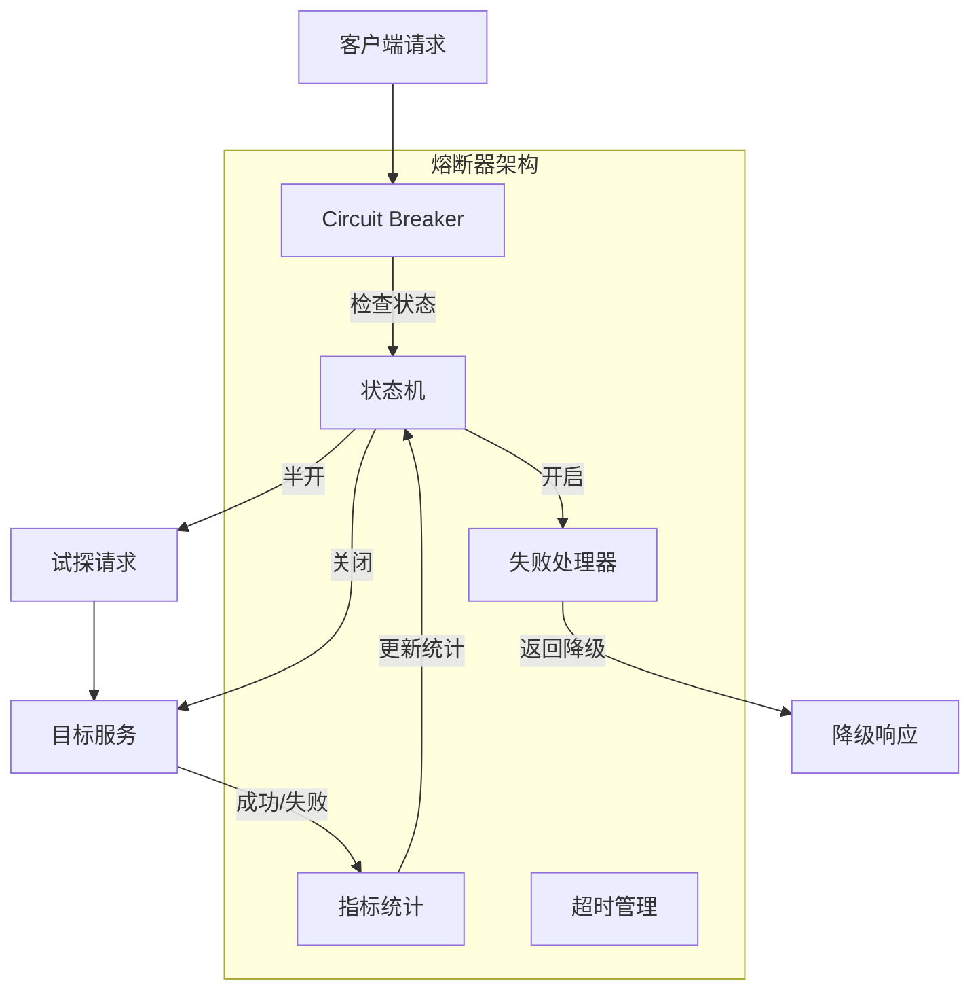

# 熔断器模式 专题文档

**文档版本**：v1.0
**创建时间**：2026年4月
**最后更新**：2026年4月
**状态**：✅ 已完成

---

## 📋 执行摘要

熔断器模式（Circuit Breaker）是一种防止级联故障的容错设计模式，通过监控服务调用失败率，在故障发生时快速失败，避免资源耗尽，同时提供自动恢复机制，是现代微服务架构的核心稳定性保障手段。

---

## 一、核心概念

### 1.1 定义与原理

**熔断器模式**源自电路工程概念，用于保护分布式系统免受远程服务故障的级联影响。其核心原理是：**当错误率达到阈值时，自动切断对故障服务的调用**，防止请求堆积和资源耗尽。

熔断器三种核心状态：

| 状态 | 说明 | 行为 |
|------|------|------|
| **关闭** (Closed) | 正常状态 | 请求正常通过，同时统计失败率 |
| **开启** (Open) | 熔断状态 | 请求立即失败，返回降级响应 |
| **半开** (Half-Open) | 试探状态 | 允许少量请求通过，测试服务恢复 |

状态转换流程：

```
关闭状态 --[失败率>阈值]--> 开启状态 --[超时后]--> 半开状态
    ↑                                              |
    └──────────[成功]──────────────────────────────┘
```

### 1.2 关键特性

- **快速失败**：熔断时立即返回，不阻塞等待
- **自动恢复**：超时后自动尝试恢复服务调用
- **状态隔离**：不同服务可配置独立的熔断器
- **指标统计**：实时统计成功率、延迟等指标
- **降级策略**：熔断时可执行预设降级逻辑

### 1.3 适用场景

| 场景 | 适用性 | 说明 |
|------|--------|------|
| 微服务调用 | ⭐⭐⭐⭐⭐ | 防止服务间级联故障 |
| 第三方API调用 | ⭐⭐⭐⭐⭐ | 保护系统免受外部服务影响 |
| 数据库访问 | ⭐⭐⭐⭐ | 防止DB连接池耗尽 |
| 缓存访问 | ⭐⭐⭐ | 缓存故障通常可快速恢复 |
| 内部本地调用 | ⭐ | 本地调用无需熔断保护 |

---

## 二、技术细节

### 2.1 架构设计



### 2.2 算法原理

#### 失败率计算算法

**输入**：请求总数 N，失败数 F，时间窗口 W
**输出**：是否熔断

```
失败率 = F / N
IF 失败率 > 阈值 AND N >= 最小调用次数 THEN
    状态切换为 OPEN
    记录熔断时间
END IF
```

#### 状态转换算法

```python
class CircuitBreaker:
    def __init__(self, failure_threshold=0.5, recovery_timeout=30):
        self.failure_threshold = failure_threshold
        self.recovery_timeout = recovery_timeout
        self.state = State.CLOSED
        self.failure_count = 0
        self.success_count = 0
        self.last_failure_time = None

    def call(self, func):
        if self.state == State.OPEN:
            if self.should_attempt_reset():
                self.state = State.HALF_OPEN
            else:
                raise CircuitBreakerOpenException()

        try:
            result = func()
            self.on_success()
            return result
        except Exception as e:
            self.on_failure()
            raise e

    def on_failure(self):
        self.failure_count += 1
        self.last_failure_time = time.time()

        total = self.failure_count + self.success_count
        if total >= 10:  # 最小调用次数
            failure_rate = self.failure_count / total
            if failure_rate > self.failure_threshold:
                self.state = State.OPEN

    def on_success(self):
        if self.state == State.HALF_OPEN:
            self.state = State.CLOSED
            self.reset_counts()
        self.success_count += 1

    def should_attempt_reset(self):
        return time.time() - self.last_failure_time >= self.recovery_timeout
```

### 2.3 滑动窗口实现

```java
public class SlidingWindowCircuitBreaker {
    private final Queue<Long> failures = new LinkedList<>();
    private final Queue<Long> successes = new LinkedList<>();
    private final long windowSizeMs = 60000; // 1分钟窗口
    private final double threshold = 0.5;

    public synchronized boolean allowRequest() {
        cleanOldEntries();
        double failureRate = calculateFailureRate();
        return failureRate < threshold;
    }

    private void cleanOldEntries() {
        long cutoff = System.currentTimeMillis() - windowSizeMs;
        while (!failures.isEmpty() && failures.peek() < cutoff) {
            failures.poll();
        }
        while (!successes.isEmpty() && successes.peek() < cutoff) {
            successes.poll();
        }
    }

    private double calculateFailureRate() {
        int total = failures.size() + successes.size();
        if (total == 0) return 0.0;
        return (double) failures.size() / total;
    }
}
```

---

## 三、系统对比

### 3.1 主流熔断器实现对比

| 维度 | Hystrix | Resilience4j | Sentinel |
|------|---------|--------------|----------|
| 开发方 | Netflix | 社区 | Alibaba |
| 维护状态 | 停止维护 | 活跃 | 活跃 |
| 实现方式 | 线程隔离 | 信号量/线程 | 信号量 |
| 滑动窗口 | 支持 | 支持 | 支持 |
| 半开状态 | 支持 | 支持 | 支持 |
| 编程模型 | 注解/HystrixCommand | 函数式 | 注解/API |

### 3.2 选型决策树

```
技术栈分析
├── Spring Cloud?
│   ├── 需要线程隔离 → Resilience4j
│   └── 简单场景 → Sentinel
├── Dubbo/Alibaba生态?
│   └── Sentinel (集成更好)
├── 纯Java应用?
│   └── Resilience4j (轻量)
└── 遗留Hystrix项目?
    └── 建议迁移至Resilience4j
```

---

## 四、实践指南

### 4.1 Resilience4j配置

```yaml
resilience4j:
  circuitbreaker:
    configs:
      default:
        slidingWindowSize: 100
        minimumNumberOfCalls: 10
        failureRateThreshold: 50
        waitDurationInOpenState: 30s
        permittedNumberOfCallsInHalfOpenState: 5
        automaticTransitionFromOpenToHalfOpenEnabled: true
    instances:
      userService:
        baseConfig: default
        failureRateThreshold: 60
```

```java
@Service
public class UserService {
    @CircuitBreaker(name = "userService", fallbackMethod = "getUserFallback")
    public User getUser(String id) {
        return userClient.getUser(id);
    }

    private User getUserFallback(String id, Exception ex) {
        return UserCache.getCachedUser(id);
    }
}
```

### 4.2 最佳实践

1. **合理设置阈值**：失败率阈值建议50%-70%，避免过于敏感
2. **配置降级策略**：熔断时返回缓存数据或默认值
3. **监控告警**：实时关注熔断器状态变化
4. **区分错误类型**：只熔断业务错误，不重试网络超时
5. **渐进恢复**：半开状态只放行少量请求测试

### 4.3 常见问题

**Q1: 熔断器与重试如何配合使用？**
A: 建议先重试再熔断。配置有限重试次数（如2-3次），重试失败后再触发熔断判断。

**Q2: 如何避免误判导致频繁熔断？**
A: 设置合理的`minimumNumberOfCalls`，确保有足够样本量；使用滑动窗口而非计数窗口。

---

## 五、形式化分析

### 5.1 状态机模型

```tla+
MODULE CircuitBreaker

VARIABLES state, failureCount, lastFailureTime

Init ==
    /\ state = "CLOSED"
    /\ failureCount = 0
    /\ lastFailureTime = 0

Request ==
    /\ state = "CLOSED"
    /\ IF failureCount > threshold
       THEN state' = "OPEN"
       ELSE UNCHANGED state
    /\ UNCHANGED <<failureCount, lastFailureTime>>

Timeout ==
    /\ state = "OPEN"
    /\ now - lastFailureTime > recoveryTimeout
    /\ state' = "HALF_OPEN"
    /\ UNCHANGED <<failureCount, lastFailureTime>>

Next == Request \/ Timeout

Spec == Init /\ [][Next]_vars
```

---

## 六、与其他主题的关联

### 6.1 上游依赖

- [故障检测器](./01-fault-detector.md)
- [健康检查](./10-health-check.md)

### 6.2 下游应用

- [降级策略](./07-degradation.md)
- [重试与退避](./08-retry-backoff.md)

---

## 七、参考资源

### 7.1 学术论文

1. [Circuit Breaker Pattern](https://martinfowler.com/bliki/CircuitBreaker.html) - Martin Fowler

### 7.2 开源项目

1. [Resilience4j](https://github.com/resilience4j/resilience4j) - 轻量级容错库
2. [Sentinel](https://github.com/alibaba/Sentinel) - 阿里巴巴流量控制组件

---

**维护者**：项目团队
**最后更新**：2026年4月
