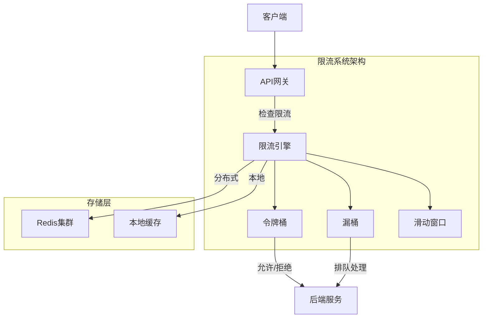

# 限流算法 专题文档

**文档版本**：v1.0
**创建时间**：2026年4月
**最后更新**：2026年4月
**状态**：✅ 已完成

---

## 📋 执行摘要

限流算法（Rate Limiting）是保护系统免受过载的关键技术，通过控制请求处理速率，确保系统在高流量下仍能保持稳定响应。令牌桶和漏桶是最主流的两种限流算法，各有特点，适用于不同场景。

---

## 一、核心概念

### 1.1 定义与原理

**限流算法**用于控制单位时间内系统处理的请求数量，防止突发流量压垮服务。核心目标是：**在保护系统的同时，尽可能提供优质服务**。

两种经典算法：

| 算法 | 核心思想 | 特点 |
|------|----------|------|
| **令牌桶** (Token Bucket) | 以固定速率生成令牌，请求需获取令牌 | 允许突发流量，平滑限流 |
| **漏桶** (Leaky Bucket) | 请求进入桶中，以固定速率流出处理 | 强制平滑，无突发 |

### 1.2 关键特性

- **流量整形**：将突发流量转换为平稳流量
- **拒绝策略**：超出限流阈值时的处理策略
- **分级限流**：按用户/IP/API等不同维度限流
- **分布式支持**：多节点环境下的协同限流
- **动态调整**：根据负载实时调整限流阈值

### 1.3 适用场景

| 场景 | 适用性 | 推荐算法 |
|------|--------|----------|
| API网关限流 | ⭐⭐⭐⭐⭐ | 令牌桶 |
| 用户级别限流 | ⭐⭐⭐⭐⭐ | 令牌桶 |
| 消息队列消费 | ⭐⭐⭐⭐ | 漏桶 |
| 数据库连接池 | ⭐⭐⭐⭐ | 漏桶 |
| DDOS防护 | ⭐⭐⭐⭐ | 滑动窗口 |
| 突发流量场景 | ⭐⭐⭐⭐⭐ | 令牌桶 |

---

## 二、技术细节

### 2.1 架构设计



### 2.2 令牌桶算法

#### 算法原理

**参数**：

- 桶容量 (capacity)：最多存储的令牌数
- 生成速率 (rate)：每秒生成的令牌数

**算法描述**：

```python
class TokenBucket:
    def __init__(self, capacity: int, rate: float):
        self.capacity = capacity      # 桶容量
        self.rate = rate              # 令牌生成速率
        self.tokens = capacity        # 当前令牌数
        self.last_update = time.time() # 上次更新时间

    def allow_request(self, tokens: int = 1) -> bool:
        now = time.time()
        # 计算新增的令牌
        elapsed = now - self.last_update
        self.tokens = min(
            self.capacity,
            self.tokens + elapsed * self.rate
        )
        self.last_update = now

        # 判断是否有足够令牌
        if self.tokens >= tokens:
            self.tokens -= tokens
            return True
        return False
```

**复杂度分析**：

- 时间复杂度：O(1)
- 空间复杂度：O(1)
- 支持突发流量：是

### 2.3 漏桶算法

#### 算法原理

**参数**：

- 桶容量 (capacity)：队列最大长度
- 流出速率 (rate)：固定处理速率

```python
class LeakyBucket:
    def __init__(self, capacity: int, rate: float):
        self.capacity = capacity
        self.rate = rate              # 请求/秒
        self.water = 0                # 当前水量
        self.last_leak = time.time()  # 上次漏水时间
        self.queue = Queue()

    def add_request(self, request) -> bool:
        self.leak()

        if self.water < self.capacity:
            self.queue.put(request)
            self.water += 1
            return True
        return False  # 桶满，拒绝请求

    def leak(self):
        now = time.time()
        elapsed = now - self.last_leak
        leaked = int(elapsed * self.rate)

        for _ in range(min(leaked, self.water)):
            if not self.queue.empty():
                request = self.queue.get()
                self.process(request)
                self.water -= 1

        self.last_leak = now
```

### 2.4 滑动窗口算法

```python
class SlidingWindow:
    def __init__(self, window_size: int, max_requests: int):
        self.window_size = window_size  # 窗口大小（秒）
        self.max_requests = max_requests
        self.requests = deque()

    def allow_request(self) -> bool:
        now = time.time()
        cutoff = now - self.window_size

        # 移除窗口外的请求记录
        while self.requests and self.requests[0] < cutoff:
            self.requests.popleft()

        if len(self.requests) < self.max_requests:
            self.requests.append(now)
            return True
        return False
```

---

## 三、系统对比

### 3.1 算法对比矩阵

| 维度 | 令牌桶 | 漏桶 | 滑动窗口 |
|------|--------|------|----------|
| 突发流量 | 允许 | 不允许 | 不允许 |
| 平滑性 | 较好 | 最好 | 一般 |
| 实现复杂度 | 简单 | 中等 | 中等 |
| 内存占用 | 低 | 中等 | 较高 |
| 精准度 | 高 | 高 | 高 |
| 分布式实现 | 容易 | 复杂 | 复杂 |

### 3.2 选型决策树

```
场景分析
├── 需要允许突发流量?
│   └── 是 → 令牌桶
├── 需要严格平滑输出?
│   └── 是 → 漏桶
├── 需要精确计数?
│   └── 是 → 滑动窗口
└── 综合场景 → 令牌桶 + 滑动窗口组合
```

---

## 四、实践指南

### 4.1 分布式限流实现

```python
import redis
import time

class DistributedTokenBucket:
    def __init__(self, redis_client, key: str, capacity: int, rate: float):
        self.redis = redis_client
        self.key = key
        self.capacity = capacity
        self.rate = rate

    def allow_request(self, tokens: int = 1) -> bool:
        lua_script = """
        local key = KEYS[1]
        local capacity = tonumber(ARGV[1])
        local rate = tonumber(ARGV[2])
        local requested = tonumber(ARGV[3])
        local now = tonumber(ARGV[4])

        local bucket = redis.call('HMGET', key, 'tokens', 'last_update')
        local current_tokens = tonumber(bucket[1]) or capacity
        local last_update = tonumber(bucket[2]) or now

        local elapsed = now - last_update
        local new_tokens = math.min(capacity, current_tokens + elapsed * rate)

        if new_tokens >= requested then
            new_tokens = new_tokens - requested
            redis.call('HMSET', key, 'tokens', new_tokens, 'last_update', now)
            redis.call('EXPIRE', key, 60)
            return 1
        else
            redis.call('HSET', key, 'last_update', now)
            return 0
        end
        """

        now = time.time()
        result = self.redis.eval(
            lua_script, 1, self.key,
            self.capacity, self.rate, tokens, now
        )
        return result == 1
```

### 4.2 Spring Cloud Gateway配置

```yaml
spring:
  cloud:
    gateway:
      routes:
        - id: user-service
          uri: lb://user-service
          predicates:
            - Path=/api/users/**
          filters:
            - name: RequestRateLimiter
              args:
                redis-rate-limiter.replenishRate: 10
                redis-rate-limiter.burstCapacity: 20
                key-resolver: "#{@userKeyResolver}"

# Java配置
@Bean
public KeyResolver userKeyResolver() {
    return exchange -> Mono.just(
        exchange.getRequest().getHeaders().getFirst("X-User-Id")
    );
}
```

### 4.3 最佳实践

1. **多层限流**：网关层粗限流 + 服务层细限流
2. **分级策略**：不同用户等级设置不同阈值
3. **优雅降级**：限流时返回缓存或简化版本
4. **监控告警**：实时监控限流触发频率
5. **动态调整**：根据系统负载自动调整阈值

### 4.4 常见问题

**Q1: 令牌桶和漏桶如何选择？**
A: 需要允许突发流量选令牌桶，需要严格平滑输出选漏桶。API限流通常用令牌桶，消息队列消费用漏桶。

**Q2: 分布式环境下如何保证精准？**
A: 使用Redis + Lua原子操作，或者采用近似算法（如Guava RateLimiter的分布式版本）。

---

## 五、形式化分析

### 5.1 令牌桶数学模型

设：

- $C$ = 桶容量
- $r$ = 令牌生成速率
- $B(t)$ = t时刻桶中令牌数

$$B(t) = \min\left(C, B(t_0) + r \cdot (t - t_0)\right)$$

请求被允许的条件：
$$B(t) \geq tokens_{requested}$$

---

## 六、与其他主题的关联

### 6.1 上游依赖

- [熔断器模式](./05-circuit-breaker.md)

### 6.2 下游应用

- [降级策略](./07-degradation.md)

---

## 七、参考资源

### 7.1 开源项目

1. [Guava RateLimiter](https://github.com/google/guava) - Google限流实现
2. [Bucket4j](https://github.com/vladimir-bukhtoyarov/bucket4j) - Java令牌桶库

---

**维护者**：项目团队
**最后更新**：2026年4月
