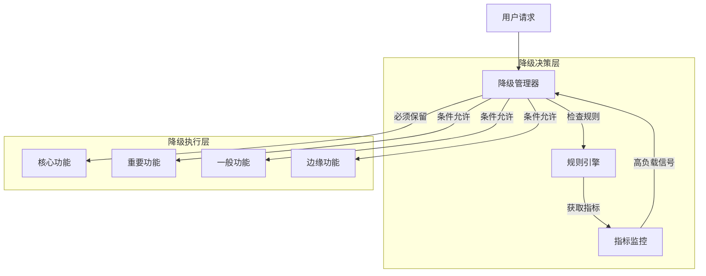

# 降级策略 专题文档

**文档版本**：v1.0
**创建时间**：2026年4月
**最后更新**：2026年4月
**状态**：✅ 已完成

---

## 📋 执行摘要

服务降级（Service Degradation）是系统在面临高负载或部分故障时，主动牺牲非核心功能以保证核心功能可用性的策略。通过优雅降级，系统可以在极端情况下维持基本服务，避免完全不可用。

---

## 一、核心概念

### 1.1 定义与原理

**服务降级**是指在系统资源不足或依赖服务故障时，**主动关闭或简化非核心功能**，将有限资源集中保障核心业务可用性的策略。

降级触发条件：

| 触发类型 | 说明 | 示例 |
|----------|------|------|
| **流量高峰** | QPS超过阈值 | 双11大促 |
| **依赖故障** | 下游服务不可用 | 支付服务超时 |
| **资源不足** | CPU/内存/连接池耗尽 | 数据库连接池满 |
| **超时触发** | 响应时间超过阈值 | P99延迟 > 2s |

降级核心原则：

```
核心业务 > 重要业务 > 一般业务 > 边缘业务
核心功能必须可用，边缘功能可暂时关闭
```

### 1.2 关键特性

- **可分级配置**：支持多级降级，从部分到全面
- **自动触发**：基于指标自动判断触发降级
- **手动干预**：支持人工介入强制降级
- **逐步恢复**：服务恢复时渐进式恢复功能
- **用户体验**：降级时提供友好提示

### 1.3 适用场景

| 场景 | 适用性 | 说明 |
|------|--------|------|
| 电商大促 | ⭐⭐⭐⭐⭐ | 关闭推荐、评价等非核心功能 |
| 金融交易 | ⭐⭐⭐⭐⭐ | 优先保障支付，暂停查询 |
| 社交平台 | ⭐⭐⭐⭐ | 简化feed流，关闭实时功能 |
| 视频直播 | ⭐⭐⭐⭐ | 降低清晰度，关闭弹幕 |
| 企业内部系统 | ⭐⭐⭐ | 暂停报表生成，保留审批 |

---

## 二、技术细节

### 2.1 架构设计



### 2.2 降级策略分类

#### 1. 功能降级

```java
@Service
public class OrderService {

    @Autowired
    private DegradeConfig degradeConfig;

    public OrderResult createOrder(OrderRequest request) {
        // 核心功能：下单
        Order order = processCoreOrder(request);

        // 重要功能：库存检查（降级时跳过严格检查）
        if (!degradeConfig.isInventoryCheckDegraded()) {
            checkInventory(order);
        } else {
            log.warn("库存检查已降级");
        }

        // 一般功能：优惠券计算（降级时跳过）
        if (!degradeConfig.isCouponDegraded()) {
            applyCoupons(order);
        }

        // 边缘功能：积分计算（降级时跳过）
        if (!degradeConfig.isPointsDegraded()) {
            calculatePoints(order);
        }

        return OrderResult.success(order);
    }
}
```

#### 2. 数据降级

```python
class DataDegradation:
    """数据降级策略"""

    @staticmethod
    def get_user_profile(user_id: str, degraded: bool = False) -> dict:
        if degraded:
            # 降级：只返回缓存的基础信息
            return Cache.get(f"user:basic:{user_id}") or {
                "user_id": user_id,
                "nickname": "用户" + user_id[-4:],
                "avatar": "/default-avatar.png"
            }

        # 正常：查询完整信息
        return UserService.get_full_profile(user_id)

    @staticmethod
    def get_product_list(category: str, degraded: bool = False) -> list:
        if degraded:
            # 降级：返回热门商品，不个性化
            return Cache.get("products:hot")

        # 正常：个性化推荐
        return RecommendationEngine.recommend(category)
```

#### 3. 页面降级

```javascript
// 前端降级策略
const DegradationManager = {
    config: {
        disableRecommendations: false,
        disableReviews: false,
        disableRealTimeUpdates: false,
        useStaticPages: false
    },

    async loadProductPage(productId) {
        // 核心信息必须加载
        const product = await this.fetchCoreData(productId);

        // 推荐模块（可降级）
        if (!this.config.disableRecommendations) {
            this.loadRecommendations(product.category);
        } else {
            this.showPlaceholder('recommendations');
        }

        // 评价模块（可降级）
        if (!this.config.disableReviews) {
            this.loadReviews(productId);
        }

        // 实时价格（可降级为静态）
        if (!this.config.disableRealTimeUpdates) {
            this.startPriceUpdates(productId);
        }
    }
};
```

### 2.3 自动降级决策

```python
class AutoDegradationController:
    def __init__(self):
        self.rules = [
            DegradeRule(
                metric="cpu_usage",
                threshold=80,
                actions=["disable_recommendations"]
            ),
            DegradeRule(
                metric="response_time_p99",
                threshold=2000,  # ms
                actions=["disable_coupons", "simplify_page"]
            ),
            DegradeRule(
                metric="error_rate",
                threshold=0.1,  # 10%
                actions=["full_readonly_mode"]
            )
        ]

    def evaluate(self, metrics: dict) -> list:
        actions = []
        for rule in self.rules:
            if metrics.get(rule.metric, 0) > rule.threshold:
                actions.extend(rule.actions)
        return list(set(actions))

    def execute_degradation(self, actions: list):
        for action in actions:
            handler = getattr(self, f"handle_{action}", None)
            if handler:
                handler()
```

---

## 三、系统对比

### 3.1 降级与熔断对比

| 维度 | 服务降级 | 熔断器 |
|------|----------|--------|
| 触发原因 | 系统整体负载高 | 下游服务故障 |
| 作用范围 | 主动关闭功能 | 阻断故障传播 |
| 恢复方式 | 负载降低后恢复 | 超时后探测恢复 |
| 用户体验 | 功能简化可用 | 快速失败 |
| 实施层级 | 业务逻辑层 | 调用链路层 |

---

## 四、实践指南

### 4.1 Sentinel降级配置

```java
@Configuration
public class DegradeConfig {

    @PostConstruct
    public void initRules() {
        List<DegradeRule> rules = new ArrayList<>();

        // RT降级规则：平均RT超过100ms，进入降级
        DegradeRule rtRule = new DegradeRule("orderService")
            .setGrade(CircuitBreakerStrategy.SLOW_REQUEST_RATIO)
            .setCount(100)  // RT阈值(ms)
            .setTimeWindow(30)  // 降级持续时间(s)
            .setMinRequestAmount(10)
            .setSlowRatioThreshold(0.5);  // 慢调用比例阈值
        rules.add(rtRule);

        // 异常比例降级
        DegradeRule exceptionRule = new DegradeRule("paymentService")
            .setGrade(CircuitBreakerStrategy.ERROR_RATIO)
            .setCount(0.5)  // 异常比例阈值
            .setTimeWindow(60);
        rules.add(exceptionRule);

        DegradeRuleManager.loadRules(rules);
    }
}
```

### 4.2 最佳实践

1. **业务分级**：明确核心业务与非核心业务边界
2. **渐进降级**：设计多级降级策略，避免一刀切
3. **降级预案**：提前准备降级开关和回滚方案
4. **监控告警**：实时监控降级触发情况
5. **用户感知**：降级时给用户友好提示
6. **定期演练**：定期压测验证降级效果

### 4.3 常见问题

**Q1: 降级和熔断有什么区别？**
A: 降级是主动关闭功能以保核心业务，熔断是阻断故障传播。两者经常配合使用。

**Q2: 如何确定降级优先级？**
A: 基于业务价值评估，核心交易链路 > 用户体验优化 > 数据分析 > 运营活动。

---

## 五、形式化分析

### 5.1 降级决策模型

```
设系统功能集合 F = {f₁, f₂, ..., fₙ}
每个功能有权重 w(fᵢ) ∈ [0,1]，表示业务重要性
当前资源容量 C，各功能资源需求 r(fᵢ)

降级目标：
Maximize Σ w(fᵢ)  (保留高价值功能)
Subject to Σ r(fᵢ) ≤ C  (资源约束)

这是一个0-1背包问题的变种。
```

---

## 六、与其他主题的关联

### 6.1 上游依赖

- [熔断器模式](./05-circuit-breaker.md)
- [限流算法](./06-rate-limiting.md)

### 6.2 下游应用

- [故障恢复机制](./02-fault-recovery.md)

---

## 七、参考资源

### 7.1 学习资料

1. [阿里双十一技术](https://developer.aliyun.com/) - 大促降级实践

---

**维护者**：项目团队
**最后更新**：2026年4月
