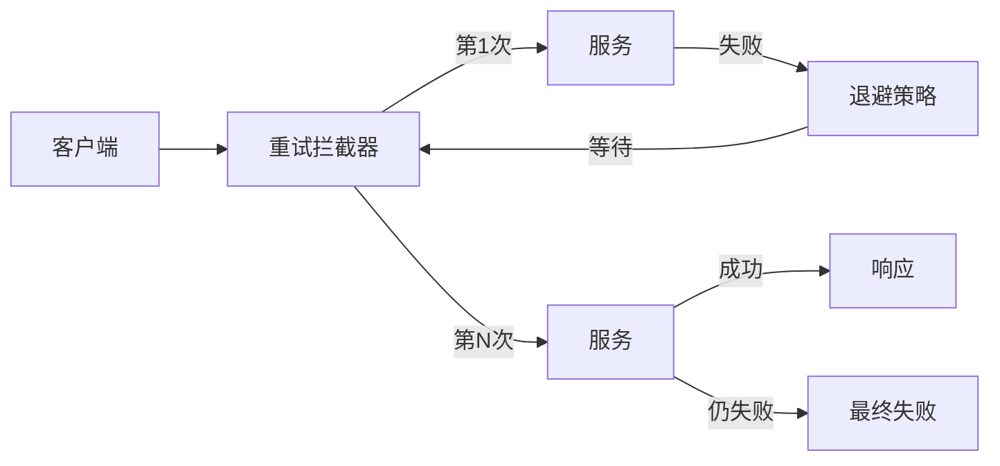

# 重试与退避 专题文档

**文档版本**：v1.0
**创建时间**：2026年4月
**最后更新**：2026年4月
**状态**：✅ 已完成

---

## 📋 执行摘要

重试与退避（Retry and Backoff）是分布式系统中处理瞬时故障的基础机制。通过指数退避、抖动等技术，在避免系统过载的同时提高请求成功率，是构建弹性系统的核心手段。

---

## 一、核心概念

### 1.1 定义与原理

**重试机制**在请求失败时自动重新发起请求，应对网络抖动、瞬时过载等**可恢复故障**。**退避策略**控制重试间隔，避免重试风暴压垮系统。

重试适用场景分类：

| 故障类型 | 是否可重试 | 示例 |
|----------|------------|------|
| 网络超时 | ✅ | 连接超时、读取超时 |
| 服务瞬时过载 | ✅ | 503 Service Unavailable |
| 限流触发 | ✅ | 429 Too Many Requests |
| 业务逻辑错误 | ❌ | 400 Bad Request |
| 认证失败 | ❌ | 401 Unauthorized |
| 资源不存在 | ❌ | 404 Not Found |

### 1.2 关键特性

- **最大重试次数**：防止无限重试
- **退避策略**：控制重试间隔增长
- **抖动机制**：分散重试时间点
- **幂等性保证**：确保重试安全
- **超时控制**：单请求超时与总超时

### 1.3 适用场景

| 场景 | 适用性 | 说明 |
|------|--------|------|
| 微服务调用 | ⭐⭐⭐⭐⭐ | 网络波动常见 |
| 数据库访问 | ⭐⭐⭐⭐ | 连接池暂时耗尽 |
| 消息队列 | ⭐⭐⭐⭐ | 消费者临时不可用 |
| 第三方API | ⭐⭐⭐⭐⭐ | 外部服务不稳定 |
| 长连接推送 | ⭐⭐⭐ | 断线后重连 |

---

## 二、技术细节

### 2.1 架构设计



### 2.2 退避策略

#### 1. 固定间隔退避

```python
def fixed_backoff(attempt: int, base_delay: float) -> float:
    """固定间隔：每次等待相同时间"""
    return base_delay

# 示例：base_delay=1s
# 重试1：等待1s
# 重试2：等待1s
# 重试3：等待1s
```

#### 2. 线性退避

```python
def linear_backoff(attempt: int, base_delay: float) -> float:
    """线性增长：等待时间 = 尝试次数 × 基础延迟"""
    return attempt * base_delay

# 示例：base_delay=1s
# 重试1：等待1s
# 重试2：等待2s
# 重试3：等待3s
```

#### 3. 指数退避（推荐）

```python
def exponential_backoff(attempt: int, base_delay: float,
                        max_delay: float = 60) -> float:
    """指数增长：等待时间 = min(2^attempt × base_delay, max_delay)"""
    delay = (2 ** attempt) * base_delay
    return min(delay, max_delay)

# 示例：base_delay=1s, max_delay=60s
# 重试0：立即
# 重试1：等待2s
# 重试2：等待4s
# 重试3：等待8s
# ...
# 重试N：最多60s
```

#### 4. 带抖动的指数退避

```python
import random

def exponential_backoff_with_jitter(attempt: int, base_delay: float,
                                    max_delay: float = 60) -> float:
    """全抖动：随机选择 [0, delay] 之间的值"""
    delay = min((2 ** attempt) * base_delay, max_delay)
    return random.uniform(0, delay)

def equal_jitter(attempt: int, base_delay: float,
                 max_delay: float = 60) -> float:
    """等抖动：delay/2 + random(0, delay/2)"""
    delay = min((2 ** attempt) * base_delay, max_delay)
    return delay / 2 + random.uniform(0, delay / 2)

def decorrelated_jitter(attempt: int, base_delay: float,
                        max_delay: float = 60,
                        prev_delay: float = 0) -> float:
    """ decorrelated抖动：随机范围随尝试增加"""
    delay = min(max(base_delay, prev_delay * 3 + random.uniform(0, base_delay)), max_delay)
    return delay
```

### 2.3 完整重试实现

```python
import time
import random
from typing import Callable, TypeVar, Tuple
from functools import wraps

T = TypeVar('T')

class RetryConfig:
    def __init__(self,
                 max_attempts: int = 3,
                 base_delay: float = 1.0,
                 max_delay: float = 60.0,
                 exponential_base: float = 2.0,
                 jitter: bool = True,
                 retryable_exceptions: Tuple[type, ...] = (Exception,)):
        self.max_attempts = max_attempts
        self.base_delay = base_delay
        self.max_delay = max_delay
        self.exponential_base = exponential_base
        self.jitter = jitter
        self.retryable_exceptions = retryable_exceptions

class RetryExecutor:
    def __init__(self, config: RetryConfig = None):
        self.config = config or RetryConfig()

    def execute(self, func: Callable[..., T], *args, **kwargs) -> T:
        last_exception = None

        for attempt in range(self.config.max_attempts):
            try:
                return func(*args, **kwargs)
            except self.config.retryable_exceptions as e:
                last_exception = e

                if attempt == self.config.max_attempts - 1:
                    break

                # 计算退避时间
                delay = self._calculate_delay(attempt)
                print(f"Attempt {attempt + 1} failed: {e}. "
                      f"Retrying in {delay:.2f}s...")
                time.sleep(delay)

        raise last_exception

    def _calculate_delay(self, attempt: int) -> float:
        delay = (self.config.exponential_base ** attempt) * self.config.base_delay
        delay = min(delay, self.config.max_delay)

        if self.config.jitter:
            # 等抖动策略
            delay = delay / 2 + random.uniform(0, delay / 2)

        return delay

# 使用装饰器
def retry(config: RetryConfig = None):
    executor = RetryExecutor(config)
    def decorator(func):
        @wraps(func)
        def wrapper(*args, **kwargs):
            return executor.execute(func, *args, **kwargs)
        return wrapper
    return decorator

# 使用示例
@retry(RetryConfig(
    max_attempts=5,
    base_delay=0.5,
    retryable_exceptions=(TimeoutError, ConnectionError)
))
def call_external_api(url: str) -> dict:
    import requests
    response = requests.get(url, timeout=5)
    response.raise_for_status()
    return response.json()
```

---

## 三、系统对比

### 3.1 退避策略对比

| 策略 | 优点 | 缺点 | 适用场景 |
|------|------|------|----------|
| 固定间隔 | 简单可预测 | 容易造成重试风暴 | 低频调用 |
| 线性 | 增长平缓 | 恢复慢 | 一般场景 |
| 指数 | 快速退避 | 后期等待长 | 高并发场景 |
| 指数+抖动 | 避免共振 | 实现稍复杂 | **推荐默认** |

### 3.2 各云厂商实现

| 厂商 | SDK | 默认策略 |
|------|-----|----------|
| AWS | boto3 | 指数退避 + 抖动 |
| Azure | Azure SDK | 指数退避 |
| GCP | Google Cloud SDK | 指数退避 + 抖动 |
| 阿里云 | Alibaba Cloud SDK | 指数退避 |

---

## 四、实践指南

### 4.1 Resilience4j重试配置

```java
@Configuration
public class RetryConfig {

    @Bean
    public RetryRegistry retryRegistry() {
        RetryConfig config = RetryConfig.custom()
            .maxAttempts(5)
            .waitDuration(Duration.ofMillis(500))
            .exponentialBackoffMultiplier(2.0)
            .retryExceptions(TimeoutException.class,
                           IOException.class)
            .ignoreExceptions(IllegalArgumentException.class)
            .build();

        return RetryRegistry.of(config);
    }

    @Bean
    public RetryService retryService(RetryRegistry registry) {
        Retry retry = registry.retry("paymentService");
        return Retry.decorateSupplier(retry, this::callPaymentApi);
    }
}

@Service
public class OrderService {

    @Retry(name = "paymentService", fallbackMethod = "paymentFallback")
    public PaymentResult processPayment(PaymentRequest request) {
        return paymentClient.charge(request);
    }

    private PaymentResult paymentFallback(PaymentRequest request,
                                         Exception ex) {
        return PaymentResult.failed("Payment temporarily unavailable");
    }
}
```

### 4.2 幂等性保证

```python
class IdempotentRetry:
    """带幂等性保证的重试"""

    def __init__(self):
        self.processed_ids = set()

    def execute_with_idempotency(self, request_id: str,
                                  func: Callable) -> Any:
        # 检查是否已处理
        if request_id in self.processed_ids:
            return self.get_cached_result(request_id)

        result = func()

        # 记录已处理
        self.processed_ids.add(request_id)
        self.cache_result(request_id, result)

        return result
```

### 4.3 最佳实践

1. **限制重试次数**：通常3-5次，避免无限重试
2. **使用抖动**：防止重试共振（Thundering Herd）
3. **区分可重试错误**：4xx错误不重试，5xx/超时重试
4. **设置总超时**：即使重试也要保证整体响应时间
5. **幂等性设计**：确保重试不会导致副作用
6. **熔断结合**：重试失败后触发熔断

### 4.4 常见问题

**Q1: 为什么需要抖动？**
A: 防止多个客户端在同一时间点重试，造成服务器瞬时压力（重试风暴）。

**Q2: 指数退避的base值如何选择？**
A: 根据业务SLA选择，通常100ms-1s。太快可能服务器还没恢复，太慢影响用户体验。

---

## 五、形式化分析

### 5.1 重试成功率模型

设单次请求成功率为 $p$，最大重试次数为 $n$，则最终成功概率：

$$P_{success} = 1 - (1-p)^n$$

例如：$p=0.7$，$n=3$ 时，$P_{success} = 1 - 0.3^3 = 0.973$

---

## 六、与其他主题的关联

### 6.1 上游依赖

- [熔断器模式](./05-circuit-breaker.md)

### 6.2 下游应用

- [故障恢复机制](./02-fault-recovery.md)

---

## 七、参考资源

### 7.1 学习资料

1. [AWS Exponential Backoff](https://docs.aws.amazon.com/general/latest/gr/api-retries.html)
2. [Google API Design Guide - Retry](https://cloud.google.com/apis/design/design_patterns)

---

**维护者**：项目团队
**最后更新**：2026年4月
