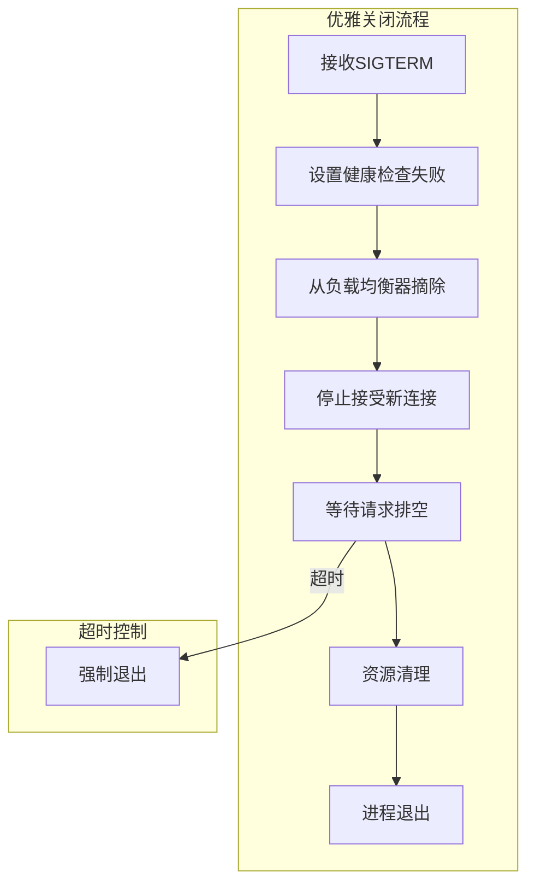

# 优雅关闭 专题文档

**文档版本**：v1.0
**创建时间**：2026年4月
**最后更新**：2026年4月
**状态**：✅ 已完成

---

## 📋 执行摘要

优雅关闭（Graceful Shutdown）是确保应用在部署更新、缩容或维护时零停机的关键技术。通过正确处理正在进行的请求、释放资源和有序退出，保障用户体验和数据完整性。

---

## 一、核心概念

### 1.1 定义与原理

**优雅关闭**是指在应用终止前，**先停止接收新请求，等待处理中的请求完成，然后安全释放资源**，最后退出进程的过程。

```
优雅关闭流程：
1. 接收终止信号 (SIGTERM)
2. 停止接收新请求
3. 等待活跃请求完成（或超时）
4. 关闭连接池、线程池
5. 刷新缓存、持久化数据
6. 退出进程
```

与暴力关闭的对比：

| 维度 | 优雅关闭 | 暴力关闭 (SIGKILL) |
|------|----------|-------------------|
| 用户体验 | 无感知 | 请求失败 |
| 数据一致性 | 保证 | 可能损坏 |
| 资源释放 | 完整 | 可能泄漏 |
| 关闭时间 | 可控 | 立即 |

### 1.2 关键特性

- **信号处理**：捕获操作系统终止信号
- **请求排空**：等待活跃请求完成
- **超时控制**：防止无限等待
- **资源清理**：释放连接、线程等资源
- **健康检查配合**：从负载均衡器摘除

### 1.3 适用场景

| 场景 | 适用性 | 说明 |
|------|--------|------|
| 滚动部署 | ⭐⭐⭐⭐⭐ | Kubernetes滚动更新 |
| 蓝绿部署 | ⭐⭐⭐⭐⭐ | 切换前优雅退出 |
| 自动缩容 | ⭐⭐⭐⭐⭐ | 减少实例时零停机 |
| 配置热更新 | ⭐⭐⭐⭐ | 部分场景需要重启 |
| 定时维护 | ⭐⭐⭐⭐ | 计划内停机 |

---

## 二、技术细节

### 2.1 架构设计



### 2.2 实现机制

#### Java Spring Boot实现

```java
@Component
public class GracefulShutdown implements ApplicationListener<ContextClosedEvent> {

    private static final Logger log = LoggerFactory.getLogger(GracefulShutdown.class);
    private static final int SHUTDOWN_TIMEOUT_SECONDS = 30;

    @Autowired
    private ExecutorService executorService;

    @Autowired
    private DataSource dataSource;

    @PreDestroy
    public void onShutdown() {
        log.info("开始优雅关闭流程...");

        // 1. 设置健康检查为不健康，从LB摘除
        HealthCheck.setHealthy(false);
        log.info("健康检查已标记为不健康");

        // 2. 等待LB摘除（给予负载均衡器检测时间）
        sleep(5);

        // 3. 停止接受新请求
        RequestAcceptor.stopAccepting();
        log.info("已停止接受新请求");

        // 4. 等待活跃请求完成
        waitForActiveRequests(SHUTDOWN_TIMEOUT_SECONDS);

        // 5. 关闭线程池
        shutdownExecutor(executorService, 10);

        // 6. 关闭数据库连接池
        closeDataSource(dataSource);

        // 7. 刷新缓存
        CacheManager.flushAll();

        log.info("优雅关闭完成");
    }

    private void waitForActiveRequests(int timeoutSeconds) {
        long deadline = System.currentTimeMillis() + timeoutSeconds * 1000;

        while (System.currentTimeMillis() < deadline) {
            int activeCount = RequestTracker.getActiveRequestCount();
            if (activeCount == 0) {
                log.info("所有请求已处理完成");
                return;
            }
            log.info("等待 {} 个活跃请求完成...", activeCount);
            sleep(1);
        }

        log.warn("请求排空超时，强制继续关闭");
    }

    private void shutdownExecutor(ExecutorService executor, int timeoutSeconds) {
        executor.shutdown();
        try {
            if (!executor.awaitTermination(timeoutSeconds, TimeUnit.SECONDS)) {
                executor.shutdownNow();
            }
        } catch (InterruptedException e) {
            executor.shutdownNow();
            Thread.currentThread().interrupt();
        }
    }

    private void closeDataSource(DataSource ds) {
        if (ds instanceof HikariDataSource) {
            ((HikariDataSource) ds).close();
        }
    }

    private void sleep(int seconds) {
        try {
            Thread.sleep(seconds * 1000L);
        } catch (InterruptedException e) {
            Thread.currentThread().interrupt();
        }
    }
}
```

#### Go实现

```go
package main

import (
    "context"
    "net/http"
    "os"
    "os/signal"
    "syscall"
    "time"
    "log"
)

type Server struct {
    httpServer *http.Server
    router     *http.ServeMux
}

func (s *Server) Start() {
    // 启动HTTP服务
    go func() {
        if err := s.httpServer.ListenAndServe(); err != nil && err != http.ErrServerClosed {
            log.Fatalf("HTTP server error: %v", err)
        }
    }()

    // 等待终止信号
    quit := make(chan os.Signal, 1)
    signal.Notify(quit, syscall.SIGINT, syscall.SIGTERM)
    <-quit

    log.Println("接收到关闭信号，开始优雅关闭...")

    // 优雅关闭
    ctx, cancel := context.WithTimeout(context.Background(), 30*time.Second)
    defer cancel()

    // 关闭HTTP服务器
    if err := s.httpServer.Shutdown(ctx); err != nil {
        log.Printf("HTTP server forced to shutdown: %v", err)
    }

    // 清理其他资源
    s.cleanup()

    log.Println("Server exited gracefully")
}

func (s *Server) cleanup() {
    // 关闭数据库连接
    if db != nil {
        db.Close()
    }

    // 关闭Redis连接
    if redisClient != nil {
        redisClient.Close()
    }

    // 刷新缓存
    cache.Flush()
}

func main() {
    router := http.NewServeMux()
    router.HandleFunc("/health", healthHandler)
    router.HandleFunc("/api/", apiHandler)

    server := &Server{
        httpServer: &http.Server{
            Addr:    ":8080",
            Handler: router,
        },
        router: router,
    }

    server.Start()
}
```

#### Python实现

```python
import signal
import sys
import time
import threading
from contextlib import contextmanager

class GracefulShutdownManager:
    def __init__(self, timeout: int = 30):
        self.timeout = timeout
        self.shutdown_event = threading.Event()
        self.active_requests = 0
        self.lock = threading.Lock()
        self._setup_signal_handlers()

    def _setup_signal_handlers(self):
        signal.signal(signal.SIGTERM, self._handle_signal)
        signal.signal(signal.SIGINT, self._handle_signal)

    def _handle_signal(self, signum, frame):
        print(f"\n接收到信号 {signum}，开始优雅关闭...")
        self.shutdown()

    def shutdown(self):
        # 1. 标记不接受新请求
        self.shutdown_event.set()

        # 2. 等待活跃请求完成
        print("等待活跃请求完成...")
        deadline = time.time() + self.timeout

        while time.time() < deadline:
            with self.lock:
                if self.active_requests == 0:
                    break
            time.sleep(0.5)

        # 3. 清理资源
        self._cleanup()

        print("优雅关闭完成")
        sys.exit(0)

    @contextmanager
    def request_context(self):
        with self.lock:
            self.active_requests += 1

        try:
            yield
        finally:
            with self.lock:
                self.active_requests -= 1

    def _cleanup(self):
        # 关闭数据库连接池
        if hasattr(self, 'db_pool'):
            self.db_pool.close()

        # 关闭Redis连接
        if hasattr(self, 'redis_client'):
            self.redis_client.close()

# 使用示例
shutdown_manager = GracefulShutdownManager(timeout=30)

def handle_request():
    with shutdown_manager.request_context():
        # 处理请求
        time.sleep(2)
        return "OK"
```

### 2.3 Kubernetes配合

```yaml
apiVersion: apps/v1
kind: Deployment
metadata:
  name: my-app
spec:
  template:
    spec:
      containers:
        - name: app
          image: my-app:latest
          lifecycle:
            preStop:
              exec:
                command: ["/bin/sh", "-c", "sleep 10"]
          resources:
            requests:
              memory: "512Mi"
              cpu: "500m"
      terminationGracePeriodSeconds: 60
```

---

## 三、系统对比

### 3.1 不同平台实现对比

| 平台 | 实现方式 | 配置要点 |
|------|----------|----------|
| Kubernetes | preStop钩子 + terminationGracePeriod | preStop等待LB摘除 |
| Docker | docker stop发送SIGTERM | 配置stop-timeout |
| AWS ECS | stopTimeout | 配置任务定义 |
| 裸机/Systemd | ExecStop | 配置service单元 |

---

## 四、实践指南

### 4.1 最佳实践

1. **设置合理的超时**：通常30-60秒
2. **健康检查配合**：关闭前先标记不健康
3. **preStop等待**：K8s中设置preStop钩子
4. **幂等性设计**：确保重复关闭安全
5. **资源清理顺序**：先业务资源，后系统资源
6. **日志记录**：详细记录关闭过程

### 4.2 常见问题

**Q1: 优雅关闭和滚动更新如何配合？**
A: K8s先启动新Pod，待新Pod就绪后发送SIGTERM给旧Pod，旧Pod开始优雅关闭。

**Q2: 长时间请求如何处理？**
A: 设置合理的超时时间，超时后强制关闭，同时在客户端设计重试机制。

---

## 五、形式化分析

### 5.1 状态机模型

```
状态：Running -> Draining -> Cleaning -> Exited

转换：
- Running -(SIGTERM)-> Draining
- Draining -(requests=0 OR timeout)-> Cleaning
- Cleaning -(cleanup done)-> Exited
```

---

## 六、与其他主题的关联

### 6.1 下游应用

- [零停机部署](./09-graceful-shutdown.md)
- [故障恢复机制](./02-fault-recovery.md)

---

## 七、参考资源

### 7.1 学习资料

1. [Kubernetes Pod Lifecycle](https://kubernetes.io/docs/concepts/workloads/pods/pod-lifecycle/)

---

**维护者**：项目团队
**最后更新**：2026年4月
