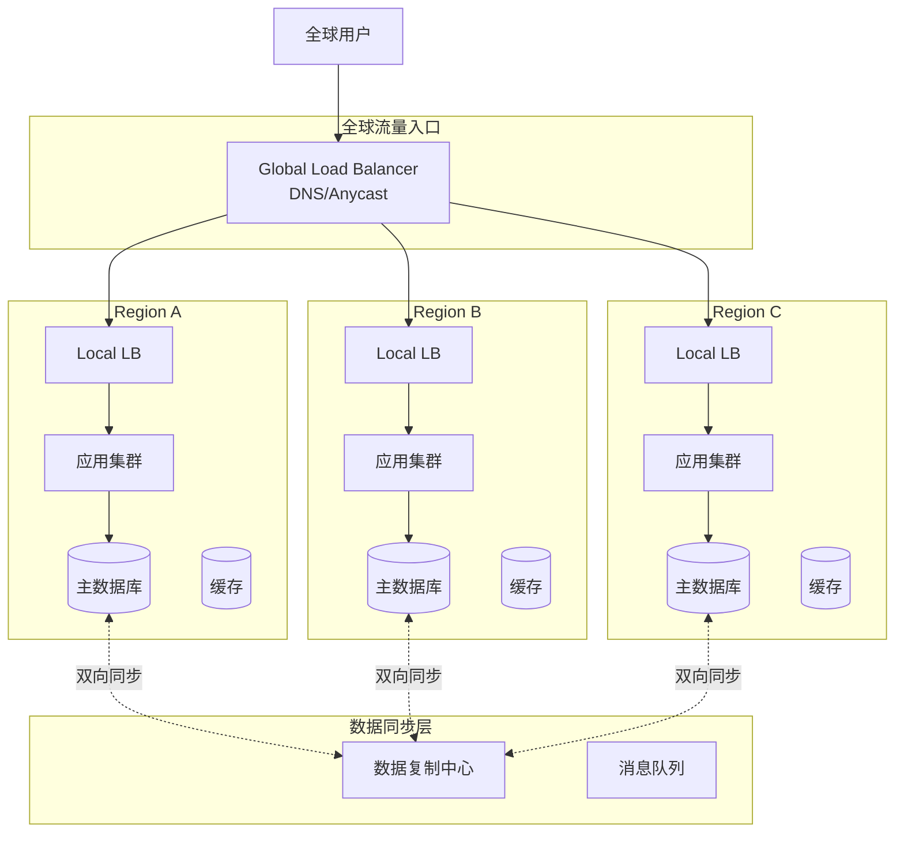

# 多活架构 专题文档

**文档版本**：v1.0
**创建时间**：2026年4月
**最后更新**：2026年4月
**状态**：✅ 已完成

---

## 📋 执行摘要

多活架构（Multi-Active Architecture）是最高等级的可用性架构，通过在多个地域部署同时对外提供服务的单元，实现任意地域故障时业务无感知切换，达到接近100%的可用性。

---

## 一、核心概念

### 1.1 定义与原理

**多活架构**是指在多个地理区域部署**完全对等的业务单元**，所有单元同时处理生产流量，任一单元故障时流量自动切换到其他单元。

架构演进对比：

| 架构 | RTO | RPO | 成本 | 复杂度 |
|------|-----|-----|------|--------|
| 单活 | 小时级 | 小时级 | 低 | 低 |
| 主备 | 分钟级 | 分钟级 | 中 | 中 |
| 冷备 | 小时级 | 小时级 | 低 | 低 |
| **多活** | **秒级** | **接近0** | **高** | **高** |

多活核心挑战：

```
1. 数据同步：跨地域数据一致性问题
2. 流量调度：智能路由到最优单元
3. 冲突解决：多单元同时写入的冲突
4. 故障隔离：防止故障跨单元扩散
```

### 1.2 关键特性

- **同城双活**：同一城市两个数据中心
- **异地多活**：不同城市多个数据中心
- **单元化架构**：业务数据按维度分片到不同单元
- **就近路由**：用户请求路由到最近/最优单元
- **全局负载均衡**：跨地域的流量调度

### 1.3 适用场景

| 场景 | 适用性 | 说明 |
|------|--------|------|
| 金融核心系统 | ⭐⭐⭐⭐⭐ | 必须99.999%可用 |
| 电商大促 | ⭐⭐⭐⭐⭐ | 需要弹性扩容 |
| 全球化应用 | ⭐⭐⭐⭐⭐ | 就近服务全球用户 |
| 政务系统 | ⭐⭐⭐⭐ | 高可用要求 |
| 中小企业 | ⭐ | 成本过高 |

---

## 二、技术细节

### 2.1 架构设计



### 2.2 单元化设计

```python
class UnitRouter:
    """单元化路由器 - 按用户ID分片到不同单元"""

    UNITS = {
        "unit-a": {"regions": ["cn-beijing", "cn-shanghai"], "weight": 40},
        "unit-b": {"regions": ["cn-shenzhen", "cn-hangzhou"], "weight": 35},
        "unit-c": {"regions": ["cn-chengdu", "cn-wuhan"], "weight": 25}
    }

    @staticmethod
    def get_unit_by_user(user_id: str) -> str:
        """根据用户ID确定所属单元"""
        # 使用一致性哈希
        hash_val = hash(user_id) % 100

        cumulative = 0
        for unit, config in UnitRouter.UNITS.items():
            cumulative += config["weight"]
            if hash_val < cumulative:
                return unit
        return "unit-a"

    @staticmethod
    def route_request(user_id: str, request) -> str:
        """路由请求到对应单元"""
        unit = UnitRouter.get_unit_by_user(user_id)

        # 检查单元健康状态
        if not HealthChecker.is_unit_healthy(unit):
            # 降级到备用单元
            unit = UnitRouter.get_failover_unit(unit)

        return f"https://{unit}.api.example.com{request.path}"

# 单元数据隔离保证
class UnitDataValidator:
    """确保数据只在所属单元写入"""

    @staticmethod
    def validate_write_access(user_id: str, unit_id: str) -> bool:
        expected_unit = UnitRouter.get_unit_by_user(user_id)
        if expected_unit != unit_id:
            raise CrossUnitWriteException(
                f"User {user_id} belongs to {expected_unit}, "
                f"but write to {unit_id} is rejected"
            )
        return True
```

### 2.3 数据同步方案

```python
class DataReplicationManager:
    """跨单元数据复制管理"""

    def __init__(self):
        self.replication_lag_threshold = 1000  # ms

    def replicate_write(self, operation: WriteOperation):
        """复制写入操作到其他单元"""
        # 1. 本地提交
        local_result = self.local_db.execute(operation)

        # 2. 异步复制到其他单元
        for unit in self.get_peer_units():
            self.send_to_unit(unit, operation)

        return local_result

    def handle_conflict(self, op1: WriteOperation, op2: WriteOperation):
        """处理写入冲突 - 使用向量时钟"""
        # 向量时钟比较
        vc1 = op1.vector_clock
        vc2 = op2.vector_clock

        if self.vector_clock_compare(vc1, vc2) == 1:
            return op1  # op1更新
        elif self.vector_clock_compare(vc1, vc2) == -1:
            return op2  # op2更新
        else:
            # 并发冲突，需要业务层解决
            return self.resolve_business_conflict(op1, op2)

    def vector_clock_compare(self, vc1: dict, vc2: dict) -> int:
        """比较向量时钟，返回: 1 if vc1 > vc2, -1 if vc1 < vc2, 0 if concurrent"""
        gt = False
        lt = False

        all_nodes = set(vc1.keys()) | set(vc2.keys())

        for node in all_nodes:
            t1 = vc1.get(node, 0)
            t2 = vc2.get(node, 0)

            if t1 > t2:
                gt = True
            elif t1 < t2:
                lt = True

        if gt and not lt:
            return 1
        elif lt and not gt:
            return -1
        else:
            return 0
```

### 2.4 流量调度算法

```python
class TrafficScheduler:
    """多活流量调度器"""

    def __init__(self):
        self.units = {}
        self.health_checker = HealthChecker()

    def schedule(self, user_request) -> str:
        """智能调度请求到最优单元"""

        # 1. 根据用户归属确定首选单元
        primary_unit = self.get_user_unit(user_request.user_id)

        # 2. 检查首选单元健康状态
        if self.health_checker.is_healthy(primary_unit):
            # 3. 检查负载
            if self.get_unit_load(primary_unit) < 80:
                return primary_unit

        # 4. 选择次优单元
        backup_units = self.get_backup_units(primary_unit)
        for unit in backup_units:
            if self.health_checker.is_healthy(unit):
                return unit

        # 5. 所有单元都不健康，触发降级
        return self.get_degraded_route(user_request)

    def get_unit_load(self, unit_id: str) -> float:
        """获取单元当前负载百分比"""
        metrics = self.get_unit_metrics(unit_id)
        cpu_usage = metrics["cpu_percent"]
        memory_usage = metrics["memory_percent"]
        qps_ratio = metrics["current_qps"] / metrics["max_qps"]

        # 加权计算综合负载
        return 0.4 * cpu_usage + 0.3 * memory_usage + 0.3 * qps_ratio
```

---

## 三、系统对比

### 3.1 多活方案对比

| 方案 | 数据一致性 | 复杂度 | 成本 | 适用 |
|------|------------|--------|------|------|
| 同城双活 | 强一致 | 中 | 中 | 同城容灾 |
| 异地双活 | 最终一致 | 高 | 高 | 异地容灾 |
| 异地三活 | 最终一致 | 很高 | 很高 | 金融级 |
| 单元化 | 分区一致 | 很高 | 高 | 大规模 |

---

## 四、实践指南

### 4.1 最佳实践

1. **单元化设计**：按用户/租户分片，避免跨单元访问
2. **最终一致性**：接受短暂不一致，优先保证可用性
3. **冲突解决策略**：预先定义业务冲突解决方案
4. **监控滞后**：实时监控复制延迟
5. **演练验证**：定期进行容灾演练

### 4.2 常见问题

**Q1: 多活架构的数据一致性如何保证？**
A: 采用最终一致性模型，关键业务使用分布式事务，普通业务接受异步复制延迟。

**Q2: 跨单元事务如何处理？**
A: 尽量避免跨单元事务，必要时使用Saga模式或TCC分布式事务。

---

## 五、形式化分析

### 5.1 可用性计算

假设单单元可用性为 A，共 n 个单元，则系统整体可用性：

A_system = 1 - (1 - A)^n

例如：单单元99.9%可用，3单元多活：
A_system = 1 - (0.001)^3 = 1 - 10^-9 ≈ 99.9999999%

---

## 六、与其他主题的关联

### 6.1 上游依赖

- 故障恢复机制
- 故障检测器

### 6.2 下游应用

- 灾难恢复策略

---

## 七、参考资源

### 7.1 学习资料

1. 阿里单元化架构 - 大规模多活实践

---

**维护者**：项目团队
**最后更新**：2026年4月
