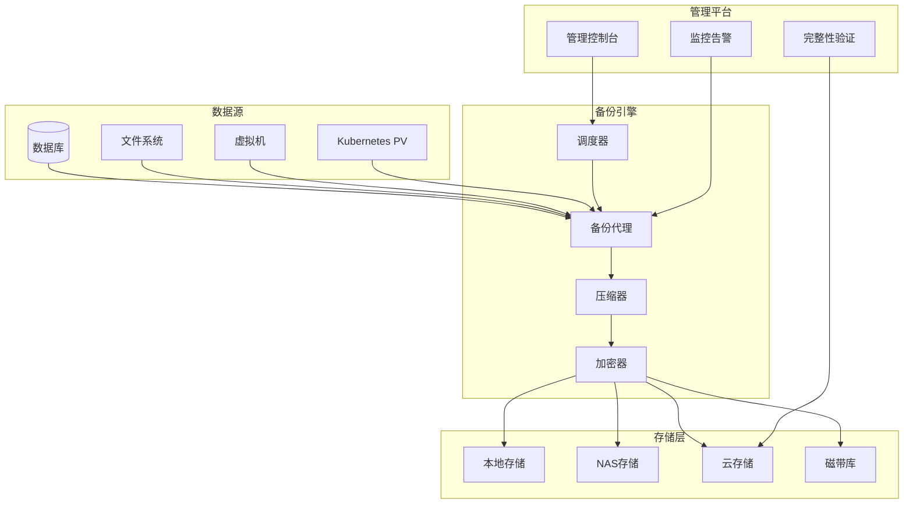

# 备份与恢复 专题文档

**文档版本**：v1.0
**创建时间**：2026年4月
**最后更新**：2026年4月
**状态**：✅ 已完成

---

## 📋 执行摘要

备份与恢复（Backup and Recovery）是数据保护的最后一道防线。通过制定科学的备份策略、选择适当的备份类型、建立高效的恢复流程，确保在数据丢失、损坏或灾难发生时能够快速恢复业务运行。

---

## 一、核心概念

### 1.1 定义与原理

**数据备份**是将生产数据复制到独立存储介质的过程，**数据恢复**是在数据丢失或损坏时将备份数据还原到生产环境的过程。

备份类型对比：

| 备份类型 | 说明 | 优点 | 缺点 |
|----------|------|------|------|
| **全量备份** | 备份所有数据 | 恢复简单快速 | 占用空间大，时间长 |
| **增量备份** | 只备份变化数据 | 速度快，空间小 | 恢复复杂，依赖链长 |
| **差异备份** | 备份自全量后的变化 | 平衡方案 | 随时间增大 |
| **快照备份** | 时间点一致性拷贝 | 瞬时完成 | 依赖存储层 |

### 1.2 关键特性

- **备份策略**：3-2-1原则（3份副本，2种介质，1份异地）
- **加密保护**：备份数据加密存储
- **完整性校验**：定期验证备份可恢复性
- **保留策略**：自动化生命周期管理
- **Point-in-Time恢复**：精确时间点恢复

### 1.3 适用场景

| 场景 | 适用性 | 说明 |
|------|--------|------|
| 数据库保护 | ⭐⭐⭐⭐⭐ | 核心业务数据 |
| 文件系统 | ⭐⭐⭐⭐ | 应用配置、日志 |
| 虚拟机镜像 | ⭐⭐⭐⭐⭐ | 快速整机恢复 |
| 对象存储 | ⭐⭐⭐⭐ | 海量非结构化数据 |
| 容器持久卷 | ⭐⭐⭐⭐ | 有状态应用 |

---

## 二、技术细节

### 2.1 架构设计



### 2.2 备份策略设计

```python
class BackupStrategy:
    """备份策略管理器"""

    def __init__(self):
        self.policies = {}

    def create_policy(self, name: str, config: dict):
        """
        创建备份策略

        示例配置：
        {
            'full_backup': {'frequency': 'weekly', 'day': 'Sunday', 'time': '02:00'},
            'incremental': {'frequency': 'daily', 'time': '02:00'},
            'retention': {'daily': 7, 'weekly': 4, 'monthly': 12},
            'encryption': True,
            'compression': 'gzip',
            'verify': True
        }
        """
        self.policies[name] = config
        return self

    def schedule_backups(self):
        """调度备份任务"""
        for name, policy in self.policies.items():
            if self.should_run_full(policy):
                self.schedule_task(f"{name}_full", self.run_full_backup, policy)
            elif self.should_run_incremental(policy):
                self.schedule_task(f"{name}_incr", self.run_incremental_backup, policy)

    def run_full_backup(self, target, destination):
        """执行全量备份"""
        print(f"开始全量备份: {target}")

        # 1. 创建一致性快照
        snapshot = self.create_snapshot(target)

        # 2. 备份数据
        backup_file = f"{destination}/full_{datetime.now():%Y%m%d_%H%M%S}.bak"
        self.copy_data(snapshot, backup_file)

        # 3. 压缩
        compressed = self.compress(backup_file)

        # 4. 加密
        encrypted = self.encrypt(compressed)

        # 5. 完整性校验
        checksum = self.calculate_checksum(encrypted)
        self.store_metadata(backup_file, checksum)

        print(f"全量备份完成: {encrypted}")
        return encrypted

    def run_incremental_backup(self, target, destination, base_backup):
        """执行增量备份"""
        print(f"开始增量备份: {target}")

        # 计算差异
        diff = self.calculate_diff(target, base_backup)

        backup_file = f"{destination}/incr_{datetime.now():%Y%m%d_%H%M%S}.bak"
        self.copy_data(diff, backup_file)

        return backup_file

    def verify_backup(self, backup_file: str) -> bool:
        """验证备份完整性"""
        # 读取校验和
        stored_checksum = self.get_metadata(backup_file)['checksum']

        # 计算当前校验和
        current_checksum = self.calculate_checksum(backup_file)

        return stored_checksum == current_checksum
```

### 2.3 数据库备份实现

```python
import subprocess
from datetime import datetime

class DatabaseBackupManager:
    """数据库备份管理器"""

    def backup_mysql(self, host: str, database: str, user: str, password: str):
        """MySQL逻辑备份"""
        timestamp = datetime.now().strftime("%Y%m%d_%H%M%S")
        filename = f"mysql_{database}_{timestamp}.sql.gz"

        cmd = [
            'mysqldump',
            f'--host={host}',
            f'--user={user}',
            f'--password={password}',
            '--single-transaction',  # 保证一致性
            '--routines',
            '--triggers',
            database
        ]

        with open(filename, 'wb') as f:
            dump_proc = subprocess.Popen(cmd, stdout=subprocess.PIPE)
            gzip_proc = subprocess.Popen(
                ['gzip'],
                stdin=dump_proc.stdout,
                stdout=f
            )
            gzip_proc.communicate()

        return filename

    def backup_postgres(self, host: str, database: str, user: str):
        """PostgreSQL物理备份 (pg_basebackup)"""
        timestamp = datetime.now().strftime("%Y%m%d_%H%M%S")
        backup_dir = f"pg_basebackup_{database}_{timestamp}"

        cmd = [
            'pg_basebackup',
            f'--host={host}',
            f'--username={user}',
            f'--pgdata={backup_dir}',
            '--format=tar',
            '--gzip',
            '--progress',
            '--verbose'
        ]

        subprocess.run(cmd, check=True)
        return backup_dir

    def restore_mysql(self, backup_file: str, host: str, database: str,
                      user: str, password: str):
        """恢复MySQL备份"""
        # 先解压
        decompress_cmd = f"gunzip -c {backup_file}"

        # 恢复
        restore_cmd = [
            'mysql',
            f'--host={host}',
            f'--user={user}',
            f'--password={password}',
            database
        ]

        decompress_proc = subprocess.Popen(
            decompress_cmd.split(),
            stdout=subprocess.PIPE
        )
        subprocess.run(restore_cmd, stdin=decompress_proc.stdout)
```

### 2.4 云原生备份

```yaml
# Velero备份配置示例
apiVersion: velero.io/v1
kind: Backup
metadata:
  name: daily-backup
  namespace: velero
spec:
  includedNamespaces:
    - production
  includedResources:
    - deployments
    - services
    - persistentvolumeclaims
  excludedResources:
    - events
  labelSelector:
    matchLabels:
      backup: "true"
  snapshotVolumes: true
  storageLocation: default
  volumeSnapshotLocations:
    - aws-default
  ttl: 720h0m0s  # 30天保留期
---
# 定时备份Schedule
apiVersion: velero.io/v1
kind: Schedule
metadata:
  name: daily-backup-schedule
  namespace: velero
spec:
  schedule: "0 2 * * *"  # 每天凌晨2点
  template:
    includedNamespaces:
      - production
    snapshotVolumes: true
    ttl: 720h0m0s
```

---

## 三、系统对比

### 3.1 备份工具对比

| 工具 | 类型 | 适用场景 | 特点 |
|------|------|----------|------|
| Velero | K8s备份 | 容器平台 | 云原生支持 |
| Restic | 文件备份 | 通用文件 | 去重加密 |
| Bacula | 企业备份 | 传统企业 | 功能全面 |
| Veeam | 虚拟化备份 | VMware/Hyper-V | 商用方案 |
| pg_dump | 数据库 | PostgreSQL | 官方工具 |

---

## 四、实践指南

### 4.1 最佳实践

1. **3-2-1原则**：3份副本，2种介质，1份异地
2. **定期验证**：每月至少一次恢复演练
3. **加密存储**：备份数据必须加密
4. **访问控制**：严格限制备份访问权限
5. **监控告警**：备份失败立即通知
6. **版本管理**：保留多版本，防止数据损坏蔓延

### 4.2 RPO/RTO设计

```python
class RecoveryObjective:
    """恢复目标设计"""

    TIERS = {
        'critical': {
            'rpo_minutes': 15,    # 最多丢失15分钟数据
            'rto_minutes': 30,    # 30分钟内恢复
            'backup_frequency': '15min',
            'replication': 'synchronous'
        },
        'high': {
            'rpo_minutes': 60,
            'rto_minutes': 120,
            'backup_frequency': 'hourly',
            'replication': 'async'
        },
        'medium': {
            'rpo_minutes': 240,
            'rto_minutes': 480,
            'backup_frequency': 'daily',
            'replication': 'async'
        },
        'low': {
            'rpo_minutes': 1440,
            'rto_minutes': 2880,
            'backup_frequency': 'weekly',
            'replication': 'none'
        }
    }
```

### 4.3 常见问题

**Q1: 全量备份和增量备份如何选择？**
A: 建议组合使用：每周全量 + 每日增量。恢复时先恢复最近全量，再依次应用增量。

**Q2: 如何验证备份可用性？**
A: 定期进行恢复演练，在生产环境的隔离区域验证备份可恢复性。

---

## 五、形式化分析

### 5.1 备份存储计算

```
设：
- D = 数据量 (GB)
- G = 日增长率 (%)
- F = 全量备份频率 (天)
- R = 保留周期 (天)

存储需求 = D × (R/F) + D × G × R
```

---

## 六、与其他主题的关联

### 6.1 上游依赖

- [灾难恢复策略](./03-disaster-recovery.md)

### 6.2 下游应用

- [故障恢复机制](./02-fault-recovery.md)

---

## 七、参考资源

### 7.1 开源项目

1. [Velero](https://velero.io/) - Kubernetes备份工具
2. [Restic](https://restic.net/) - 现代备份程序
3. [Bacula](https://www.bacula.org/) - 企业级备份

---

**维护者**：项目团队
**最后更新**：2026年4月
