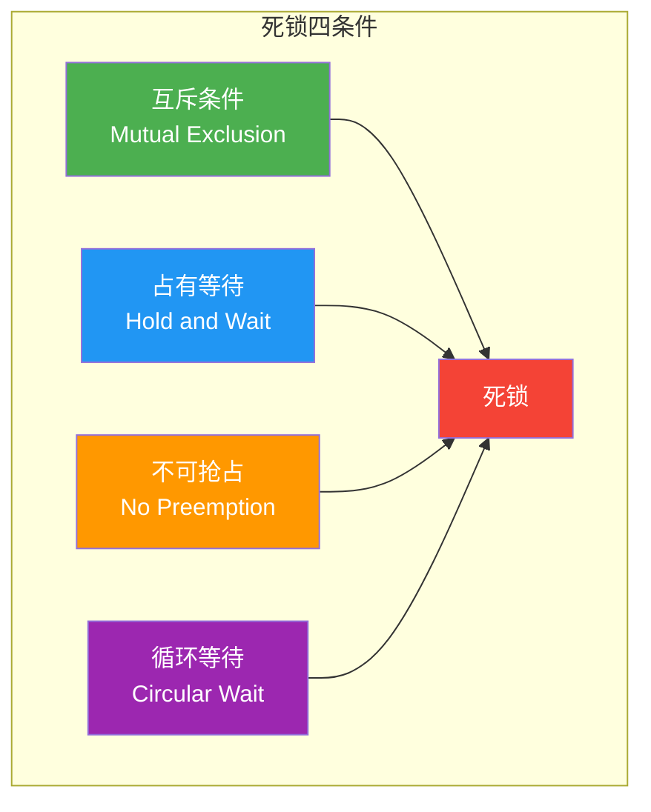
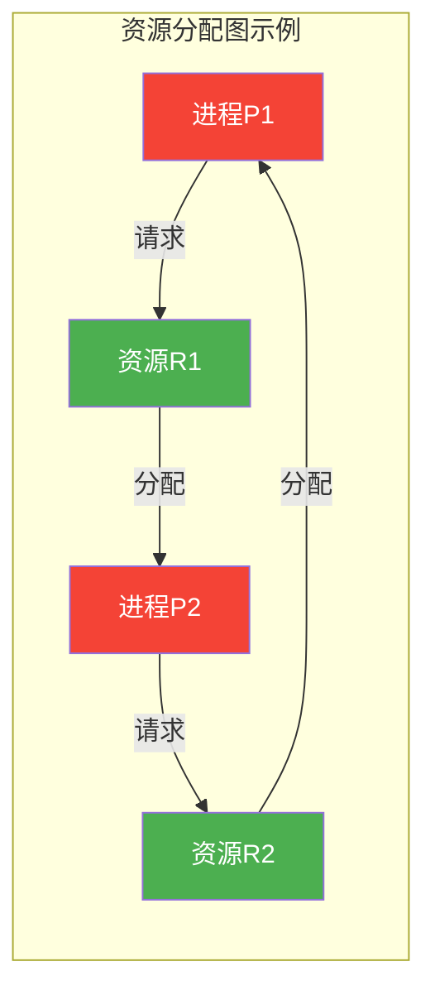
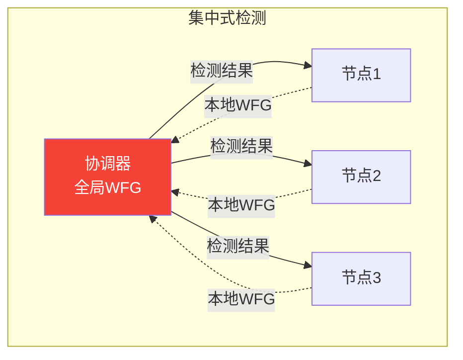
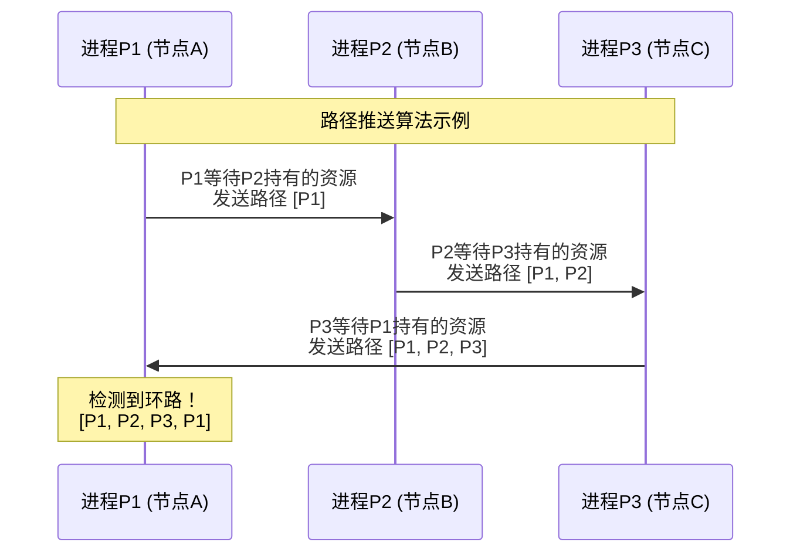
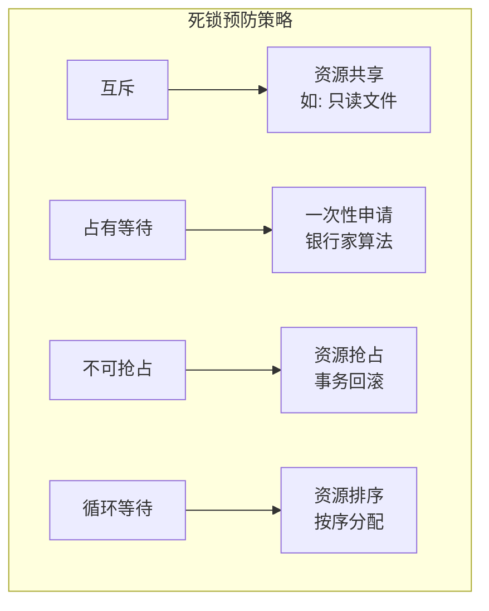
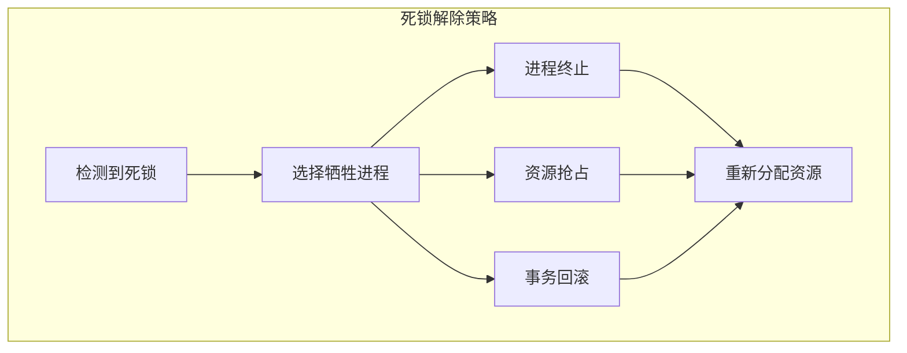
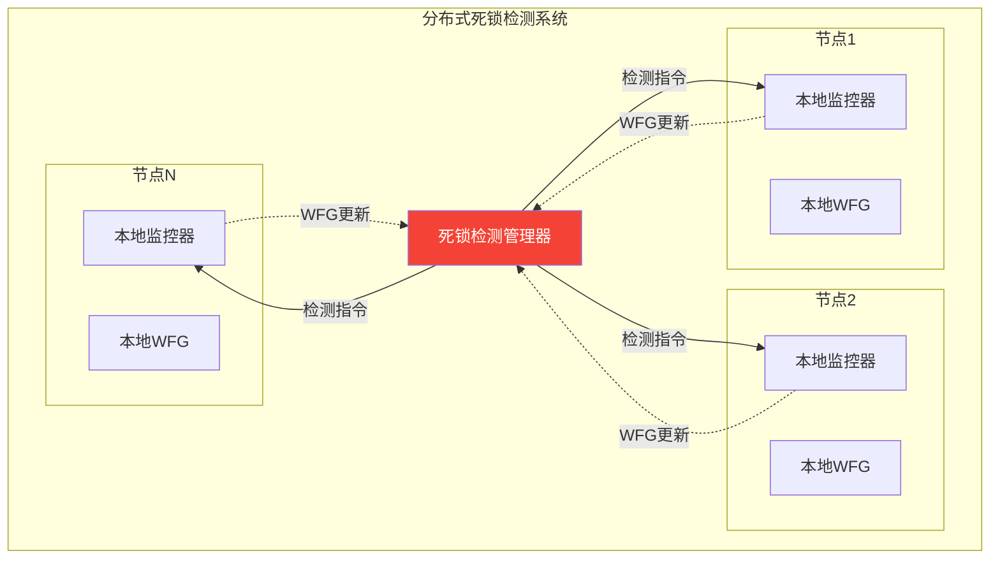

# 分布式死锁检测

> 分布式系统中资源竞争导致的循环等待检测与解除机制

---

## 📋 目录

- [1. 死锁基础理论](#1-死锁基础理论)
- [2. 死锁检测方法](#2-死锁检测方法)
- [3. 分布式死锁检测算法](#3-分布式死锁检测算法)
- [4. 死锁预防策略](#4-死锁预防策略)
- [5. 死锁解除机制](#5-死锁解除机制)
- [6. 实践案例](#6-实践案例)

---

## 1. 死锁基础理论

### 1.1 死锁的定义

死锁（Deadlock）是指在一组进程中，每个进程都持有至少一个资源，并等待获取被组内其他进程持有的资源，从而导致所有进程都无法继续执行的状态。

### 1.2 死锁的四个必要条件

死锁的发生必须同时满足以下四个条件：



| 条件 | 形式化定义 | 说明 |
|:---|:---|:---|
| **互斥** | $\forall r \in R, |P(r)| \leq 1$ | 资源一次只能被一个进程占用 |
| **占有等待** | $\exists p: Holds(p) \neq \emptyset \land Waits(p) \neq \emptyset$ | 进程持有资源同时等待其他资源 |
| **不可抢占** | $\neg Preemptable(r)$ | 已分配的资源不能被强制剥夺 |
| **循环等待** | $\exists p_1, ..., p_n: p_1 \to p_2 \to ... \to p_n \to p_1$ | 形成进程-资源等待环 |

**形式化定义**：

设系统有进程集合 $P = \{p_1, p_2, ..., p_n\}$，资源集合 $R = \{r_1, r_2, ..., r_m\}$

- 等待关系：$p_i \to p_j$ 表示 $p_i$ 等待 $p_j$ 持有的资源
- 死锁状态：$\exists C \subseteq P: \forall p_i \in C, p_i$ 等待 $C$ 中另一进程持有的资源

### 1.3 资源分配图



---

## 2. 死锁检测方法

### 2.1 集中式死锁检测

集中式方法将所有等待信息发送到中央协调器，由协调器构建全局等待图（WFG）并检测环路。



**全局等待图构建**：

```python
class CentralizedDeadlockDetector:
    """集中式死锁检测器"""

    def __init__(self):
        self.global_wfg = {}  # 全局等待图: {进程: [等待的进程]}

    def update_wfg(self, node_id, local_wfg):
        """接收节点更新的本地等待图"""
        # 合并本地等待图到全局等待图
        for process, waits in local_wfg.items():
            global_process = f"{node_id}:{process}"
            self.global_wfg[global_process] = [
                f"{node_id}:{w}" if ':' not in w else w
                for w in waits
            ]

    def detect_deadlock(self):
        """使用DFS检测环路"""
        visited = set()
        rec_stack = set()

        def dfs(node, path):
            visited.add(node)
            rec_stack.add(node)
            path.append(node)

            for neighbor in self.global_wfg.get(node, []):
                if neighbor not in visited:
                    cycle = dfs(neighbor, path)
                    if cycle:
                        return cycle
                elif neighbor in rec_stack:
                    # 发现环路
                    cycle_start = path.index(neighbor)
                    return path[cycle_start:] + [neighbor]

            path.pop()
            rec_stack.remove(node)
            return None

        # 检查所有未访问节点
        for node in self.global_wfg:
            if node not in visited:
                cycle = dfs(node, [])
                if cycle:
                    return {
                        'deadlock': True,
                        'cycle': cycle,
                        'involved_processes': list(set(cycle))
                    }

        return {'deadlock': False}
```

### 2.2 分布式死锁检测的挑战

| 挑战 | 说明 | 影响 |
|:---|:---|:---|
| **信息分散** | 等待信息分布在不同节点 | 需要通信收集 |
| **消息延迟** | 网络延迟导致信息不一致 | 可能误检或漏检 |
| **假死锁** | 检测时环路已解除 | 错误终止进程 |
| **性能开销** | 频繁检测消耗资源 | 影响系统性能 |

---

## 3. 分布式死锁检测算法

### 3.1 路径推送算法（Path-Pushing）

路径推送算法中，每个节点维护部分全局等待图，当检测到潜在环路时，将路径信息推送给相关节点。



```python
class PathPushingDetector:
    """路径推送死锁检测算法"""

    def __init__(self, node_id):
        self.node_id = node_id
        self.local_wfg = {}  # 本地等待图
        self.known_paths = []  # 已知等待路径

    def handle_wait(self, process, waits_for, remote_node=None):
        """处理进程等待关系"""
        self.local_wfg[process] = waits_for

        # 构建并推送新路径
        new_path = [process, waits_for]
        self.push_path(new_path, remote_node)

    def push_path(self, path, from_node=None):
        """推送等待路径到下一节点"""
        current = path[-1]

        # 检查是否形成环路
        if current in path[:-1]:
            cycle_start = path.index(current)
            cycle = path[cycle_start:]
            self.report_deadlock(cycle)
            return

        # 查找current等待的进程
        if current in self.local_wfg:
            next_process = self.local_wfg[current]
            extended_path = path + [next_process]

            # 确定下一跳的节点
            next_node = self.get_node_for_process(next_process)
            if next_node == self.node_id:
                # 本地继续检测
                self.push_path(extended_path, from_node)
            else:
                # 推送到远程节点
                self.send_path_to_node(next_node, extended_path)

    def receive_path(self, path, from_node):
        """接收远程节点推送的路径"""
        self.push_path(path, from_node)

    def report_deadlock(self, cycle):
        """报告检测到的死锁"""
        print(f"节点 {self.node_id} 检测到死锁环: {' -> '.join(cycle)}")
        # 触发死锁解除...
```

### 3.2 边追踪算法（Edge-Chasing）

边追踪算法通过沿等待边发送探测消息来检测环路。当探测消息回到发起者时，表明存在死锁。

```mermaid
graph LR
    subgraph "边追踪算法"
        P1[进程P1<br/>发起探测] -->|probe(P1)| P2[进程P2]
        P2 -->|probe(P1)| P3[进程P3]
        P3 -->|probe(P1)| P4[进程P4]
        P4 -->|probe(P1)| P1
    end

    style P1 fill:#f44336,color:#fff
```

```python
class EdgeChasingDetector:
    """边追踪死锁检测算法（Chandy-Misra-Haas）"""

    def __init__(self, process_id):
        self.process_id = process_id
        self.depends_on = None  # 当前依赖的进程
        self.probe_list = set()  # 已处理的探测消息

    def request_resource(self, holder_id):
        """请求资源，开始边追踪"""
        self.depends_on = holder_id

        # 发送探测消息
        probe = {
            'type': 'PROBE',
            'initiator': self.process_id,
            'sender': self.process_id,
            'receiver': holder_id
        }
        self.send_message(holder_id, probe)

    def receive_probe(self, probe):
        """接收探测消息"""
        initiator = probe['initiator']
        sender = probe['sender']

        # 避免重复处理
        probe_key = (initiator, sender)
        if probe_key in self.probe_list:
            return
        self.probe_list.add(probe_key)

        # 检查是否是发起者
        if initiator == self.process_id:
            # 探测回到发起者，检测到死锁
            self.handle_deadlock_detection()
            return

        # 如果当前进程也在等待资源，继续转发探测
        if self.depends_on is not None:
            new_probe = {
                'type': 'PROBE',
                'initiator': initiator,
                'sender': self.process_id,
                'receiver': self.depends_on
            }
            self.send_message(self.depends_on, new_probe)

    def release_resource(self):
        """释放资源，清除等待状态"""
        self.depends_on = None
        # 可以通知等待的进程

    def handle_deadlock_detection(self):
        """处理检测到的死锁"""
        print(f"进程 {self.process_id} 检测到死锁！")
        # 发起死锁解除...

# Go语言实现示例
edge_chasing_go = '''
package deadlock

import (
    "fmt"
    "sync"
)

// ProbeMessage 探测消息
type ProbeMessage struct {
    Initiator string
    Sender    string
}

// EdgeChasingProcess 边追踪进程
type EdgeChasingProcess struct {
    ID          string
    dependsOn   *EdgeChasingProcess
    probes      map[string]bool // 记录已处理的探测
    mu          sync.Mutex
}

// NewEdgeChasingProcess 创建新进程
func NewEdgeChasingProcess(id string) *EdgeChasingProcess {
    return &EdgeChasingProcess{
        ID:     id,
        probes: make(map[string]bool),
    }
}

// RequestResource 请求资源
func (p *EdgeChasingProcess) RequestResource(holder *EdgeChasingProcess) {
    p.mu.Lock()
    defer p.mu.Unlock()

    p.dependsOn = holder

    // 发送探测消息
    probe := ProbeMessage{
        Initiator: p.ID,
        Sender:    p.ID,
    }
    holder.ReceiveProbe(probe)
}

// ReceiveProbe 接收探测消息
func (p *EdgeChasingProcess) ReceiveProbe(probe ProbeMessage) {
    p.mu.Lock()
    defer p.mu.Unlock()

    probeKey := probe.Initiator + "-" + probe.Sender
    if p.probes[probeKey] {
        return // 已处理过
    }
    p.probes[probeKey] = true

    // 检查是否回到发起者
    if probe.Initiator == p.ID {
        fmt.Printf("进程 %s 检测到死锁！\\n", p.ID)
        p.handleDeadlock()
        return
    }

    // 继续转发探测
    if p.dependsOn != nil {
        newProbe := ProbeMessage{
            Initiator: probe.Initiator,
            Sender:    p.ID,
        }
        p.dependsOn.ReceiveProbe(newProbe)
    }
}

// ReleaseResource 释放资源
func (p *EdgeChasingProcess) ReleaseResource() {
    p.mu.Lock()
    defer p.mu.Unlock()
    p.dependsOn = nil
}

func (p *EdgeChasingProcess) handleDeadlock() {
    // 实现死锁解除逻辑
}
'''
```

### 3.3 全局状态算法

基于分布式快照（Chandy-Lamport）的全局状态检测方法。

```python
class GlobalStateDetector:
    """基于全局状态的死锁检测"""

    def __init__(self, node_id):
        self.node_id = node_id
        self.local_state = {
            'processes': {},
            'resources': {}
        }
        self.global_snapshot = {}

    def initiate_snapshot(self):
        """发起分布式快照"""
        marker_id = f"{self.node_id}-{time.time()}"

        # 记录本地状态
        self.global_snapshot[self.node_id] = self.local_state.copy()

        # 向所有邻居发送marker
        for neighbor in self.get_neighbors():
            self.send_marker(neighbor, marker_id)

    def receive_marker(self, from_node, marker_id):
        """接收marker消息"""
        if from_node not in self.global_snapshot:
            # 首次收到marker，记录状态并转发
            self.global_snapshot[self.node_id] = self.local_state.copy()
            for neighbor in self.get_neighbors():
                if neighbor != from_node:
                    self.send_marker(neighbor, marker_id)

        # 记录来自该通道的状态为空（通道快照）
        self.global_snapshot[f"channel_{from_node}_{self.node_id}"] = []

    def check_global_deadlock(self):
        """基于全局快照检测死锁"""
        # 合并所有节点的WFG
        merged_wfg = {}
        for node_state in self.global_snapshot.values():
            if isinstance(node_state, dict) and 'processes' in node_state:
                merged_wfg.update(node_state['processes'])

        # 检测环路
        return self.find_cycles(merged_wfg)
```

---

## 4. 死锁预防策略

### 4.1 破坏死锁条件



### 4.2 银行家算法

银行家算法（Banker's Algorithm）由Dijkstra提出，用于避免死锁。

**安全状态定义**：

系统处于安全状态当且仅当存在一个安全序列 $<p_1, p_2, ..., p_n>$，使得对于每个 $p_i$，其资源需求可以被当前可用资源加上所有 $p_j$（$j < i$）持有的资源满足。

```python
class BankersAlgorithm:
    """银行家算法实现"""

    def __init__(self, n_processes, n_resources, available):
        """
        初始化银行家算法
        :param n_processes: 进程数量
        :param n_resources: 资源类型数量
        :param available: 可用资源向量
        """
        self.n = n_processes
        self.m = n_resources
        self.available = available[:]  # 可用资源
        self.allocation = [[0] * n_resources for _ in range(n_processes)]
        self.max_demand = [[0] * n_resources for _ in range(n_processes)]
        self.need = [[0] * n_resources for _ in range(n_processes)]

    def set_max_demand(self, process_id, max_resources):
        """设置进程的最大需求"""
        self.max_demand[process_id] = max_resources[:]
        for j in range(self.m):
            self.need[process_id][j] = max_resources[j] - self.allocation[process_id][j]

    def request_resources(self, process_id, request):
        """
        处理资源请求
        :return: (granted, message)
        """
        # 检查请求是否超过声明的最大需求
        for j in range(self.m):
            if request[j] > self.need[process_id][j]:
                return False, "请求超过最大需求"

        # 检查是否有足够可用资源
        for j in range(self.m):
            if request[j] > self.available[j]:
                return False, "资源不足，进程需等待"

        # 试分配
        old_available = self.available[:]
        old_allocation = [row[:] for row in self.allocation]
        old_need = [row[:] for row in self.need]

        for j in range(self.m):
            self.available[j] -= request[j]
            self.allocation[process_id][j] += request[j]
            self.need[process_id][j] -= request[j]

        # 检查安全性
        if self.is_safe():
            return True, "请求批准"
        else:
            # 回滚
            self.available = old_available
            self.allocation = old_allocation
            self.need = old_need
            return False, "请求会导致不安全状态，已拒绝"

    def is_safe(self):
        """检查系统是否处于安全状态"""
        work = self.available[:]
        finish = [False] * self.n
        safe_sequence = []

        while len(safe_sequence) < self.n:
            found = False
            for i in range(self.n):
                if not finish[i]:
                    # 检查need[i] <= work
                    if all(self.need[i][j] <= work[j] for j in range(self.m)):
                        # 进程可以完成
                        for j in range(self.m):
                            work[j] += self.allocation[i][j]
                        finish[i] = True
                        safe_sequence.append(i)
                        found = True
                        break

            if not found:
                # 找不到可以完成的进程
                return False

        return True

    def release_resources(self, process_id, release):
        """释放资源"""
        for j in range(self.m):
            self.allocation[process_id][j] -= release[j]
            self.available[j] += release[j]
            self.need[process_id][j] += release[j]


# 使用示例
def demo_bankers_algorithm():
    # 3个进程，3种资源
    available = [3, 3, 2]
    banker = BankersAlgorithm(3, 3, available)

    # 设置最大需求
    banker.set_max_demand(0, [7, 5, 3])
    banker.set_max_demand(1, [3, 2, 2])
    banker.set_max_demand(2, [9, 0, 2])

    # 设置初始分配
    banker.allocation[0] = [0, 1, 0]
    banker.allocation[1] = [2, 0, 0]
    banker.allocation[2] = [3, 0, 2]

    # 更新need
    for i in range(3):
        for j in range(3):
            banker.need[i][j] = banker.max_demand[i][j] - banker.allocation[i][j]

    # 更新available
    for j in range(3):
        banker.available[j] = available[j] - sum(banker.allocation[i][j] for i in range(3))

    # 测试请求
    print("初始状态安全?", banker.is_safe())

    granted, msg = banker.request_resources(1, [1, 0, 2])
    print(f"P1请求(1,0,2): {msg}")

    granted, msg = banker.request_resources(0, [7, 4, 3])
    print(f"P0请求(7,4,3): {msg}")
```

### 4.3 分布式银行家算法

```python
class DistributedBankersAlgorithm:
    """分布式银行家算法"""

    def __init__(self, site_id, coordinator_id):
        self.site_id = site_id
        self.coordinator_id = coordinator_id
        self.local_processes = {}
        self.pending_requests = []

    def request_resource(self, process_id, resources):
        """进程请求资源"""
        request = {
            'site_id': self.site_id,
            'process_id': process_id,
            'resources': resources,
            'timestamp': time.time()
        }

        # 向协调者发送请求
        self.send_to_coordinator({
            'type': 'RESOURCE_REQUEST',
            'data': request
        })

    def handle_request(self, request):
        """协调者处理请求"""
        # 收集所有站点的状态
        global_state = self.collect_global_state()

        # 执行银行家算法
        if self.check_global_safety(global_state, request):
            # 批准请求
            self.grant_request(request)
        else:
            # 拒绝或延迟请求
            self.defer_request(request)

    def collect_global_state(self):
        """收集全局状态"""
        state = {
            'available': {},
            'allocation': {},
            'max_demand': {}
        }

        # 向所有站点请求状态
        for site_id in self.get_all_sites():
            self.send_to_site(site_id, {'type': 'STATE_REQUEST'})

        # 等待响应（带超时）
        # ...

        return state
```

---

## 5. 死锁解除机制

### 5.1 解除策略



| 策略 | 优点 | 缺点 |
|:---|:---|:---|
| **进程终止** | 简单直接 | 工作丢失，可能需要重算 |
| **资源抢占** | 影响范围小 | 实现复杂，需处理状态恢复 |
| **事务回滚** | 支持ACID | 仅适用于事务系统 |

### 5.2 牺牲进程选择

```python
class DeadlockResolver:
    """死锁解除器"""

    def __init__(self):
        self.process_info = {}  # 进程信息

    def select_victim(self, deadlock_cycle, strategy='minimum_cost'):
        """
        选择牺牲进程
        :param strategy: 选择策略
        """
        if strategy == 'minimum_cost':
            return self._select_by_cost(deadlock_cycle)
        elif strategy == 'youngest':
            return self._select_youngest(deadlock_cycle)
        elif strategy == 'minimum_resources':
            return self._select_by_resources(deadlock_cycle)
        else:
            return deadlock_cycle[0]  # 默认选第一个

    def _select_by_cost(self, cycle):
        """选择终止成本最低的进程"""
        min_cost = float('inf')
        victim = None

        for process in cycle:
            cost = self.calculate_termination_cost(process)
            if cost < min_cost:
                min_cost = cost
                victim = process

        return victim

    def calculate_termination_cost(self, process):
        """计算进程终止成本"""
        info = self.process_info.get(process, {})

        cost = 0
        # 已执行时间（沉没成本）
        cost += info.get('cpu_time', 0) * 0.5
        # 剩余工作量
        cost += info.get('remaining_work', 0) * 1.0
        # 优先级权重
        cost /= info.get('priority', 1)
        # 资源持有量
        cost += len(info.get('resources', [])) * 10

        return cost

    def resolve_deadlock(self, cycle):
        """解除死锁"""
        victim = self.select_victim(cycle)

        print(f"选择牺牲进程: {victim}")

        # 终止进程
        self.terminate_process(victim)

        # 释放资源
        released = self.release_resources(victim)

        # 重新分配资源
        self.reallocate_resources(released)

    def terminate_process(self, process):
        """终止进程"""
        print(f"终止进程 {process}")
        # 实际实现...

    def release_resources(self, process):
        """释放进程持有的资源"""
        info = self.process_info.get(process, {})
        resources = info.get('resources', [])
        print(f"释放资源: {resources}")
        return resources

    def reallocate_resources(self, resources):
        """重新分配释放的资源"""
        for resource in resources:
            # 分配给等待队列中的进程
            waiting_process = self.find_waiting_process(resource)
            if waiting_process:
                self.allocate_resource(waiting_process, resource)
```

---

## 6. 实践案例

### 6.1 分布式数据库死锁检测

```python
class DistributedDatabaseDeadlockDetector:
    """分布式数据库死锁检测器"""

    def __init__(self, db_nodes):
        self.nodes = db_nodes
        self.global_wfg = nx.DiGraph()
        self.lock_manager = {}

    def acquire_lock(self, transaction_id, resource_id, lock_type):
        """获取锁，可能触发死锁检测"""
        resource_node = self.get_resource_node(resource_id)

        # 检查是否有冲突
        holders = self.get_lock_holders(resource_id)
        if holders:
            # 存在冲突，构建等待边
            for holder in holders:
                if not self.are_compatible(lock_type, holder['lock_type']):
                    # 添加等待边
                    self.add_wait_edge(transaction_id, holder['transaction_id'])

        # 定期或按需触发死锁检测
        if self.should_check_deadlock():
            deadlock_info = self.detect_deadlock()
            if deadlock_info['deadlock']:
                self.handle_deadlock(deadlock_info)

    def detect_deadlock(self):
        """检测死锁"""
        # 收集所有节点的WFG
        for node in self.nodes:
            local_wfg = node.get_local_wfg()
            self.merge_wfg(local_wfg)

        # 检测环路
        try:
            cycle = nx.find_cycle(self.global_wfg)
            return {
                'deadlock': True,
                'cycle': cycle,
                'transactions': [edge[0] for edge in cycle]
            }
        except nx.NetworkXNoCycle:
            return {'deadlock': False}

    def handle_deadlock(self, info):
        """处理死锁"""
        victim = self.select_victim(info['transactions'])

        # 中止牺牲事务
        self.abort_transaction(victim)

        # 通知相关节点
        for node in self.nodes:
            node.notify_abort(victim)
```

### 6.2 死锁检测系统架构



---

## 总结

| 方法 | 适用场景 | 优点 | 缺点 |
|:---|:---|:---|:---|
| **集中式检测** | 小规模系统 | 实现简单，一致性好 | 单点瓶颈 |
| **路径推送** | 中等规模 | 检测及时 | 消息开销大 |
| **边追踪** | 大规模系统 | 分布式，无单点 | 可能产生假死锁 |
| **全局状态** | 需要精确快照 | 精确性高 | 实现复杂 |
| **银行家算法** | 资源预留场景 | 预防死锁 | 资源利用率低 |

---

## 参考资料

1. Knapp, E. (1987). "Deadlock detection in distributed databases". ACM Computing Surveys.
2. Chandy, K. M., Misra, J., & Haas, L. M. (1983). "Distributed deadlock detection". ACM Transactions on Computer Systems.
3. Dijkstra, E. W. (1965). "Cooperating sequential processes". Programming Languages.

## 相关主题

- [分布式锁实现](../08-transactions/分布式锁实现.md) - 分布式锁的死锁避免
- [事务隔离级别详解](../08-transactions/theory/事务隔离级别详解.md) - 数据库死锁与隔离级别
- [故障检测器](./故障检测器.md) - 分布式故障检测机制

---

**文档版本**：v1.0
**最后更新**：2026-04-04
**作者**：分布式计算知识库团队
