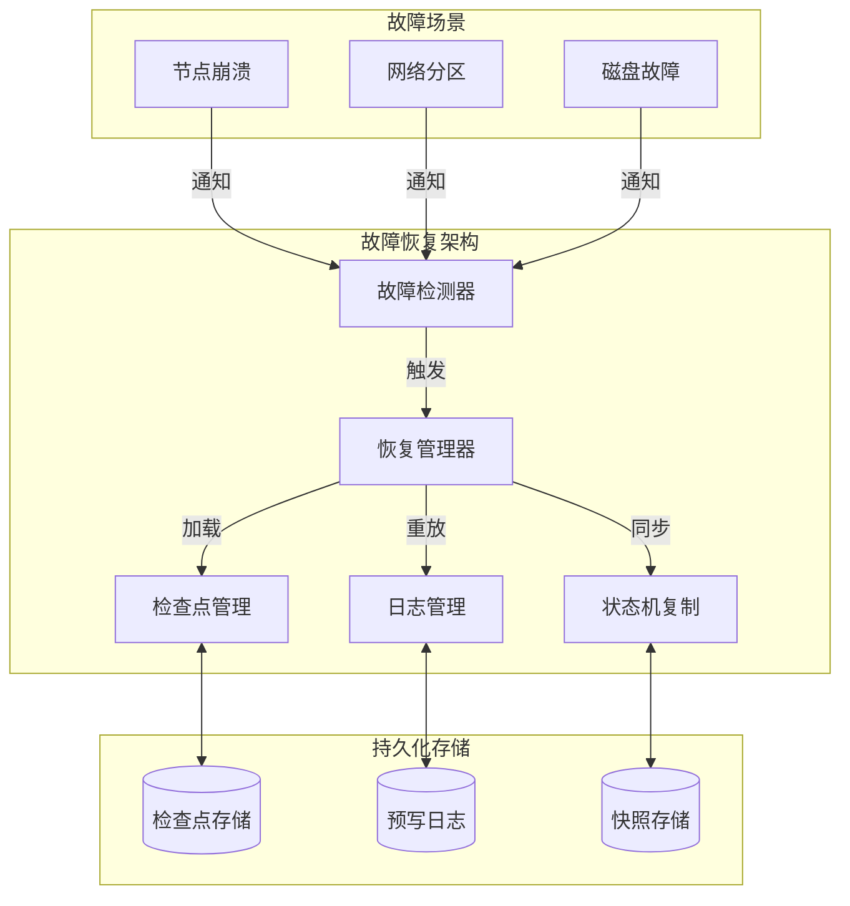
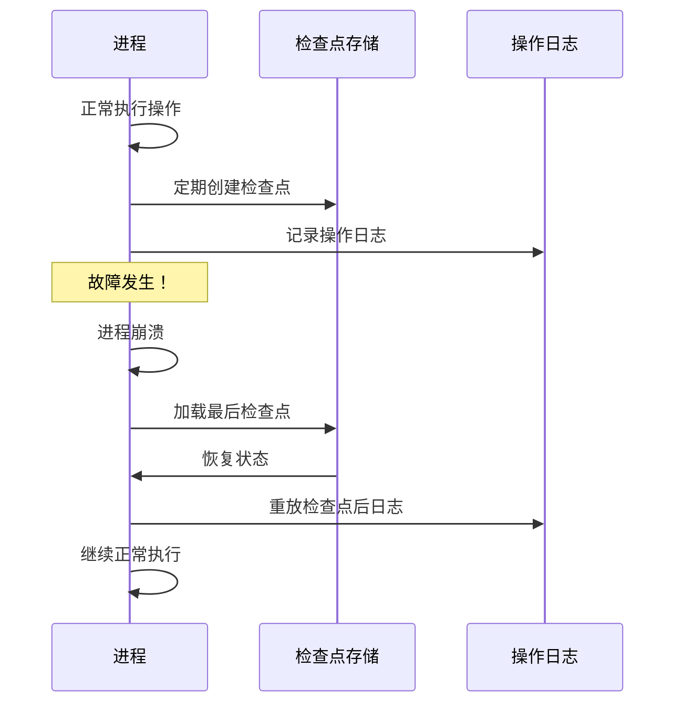
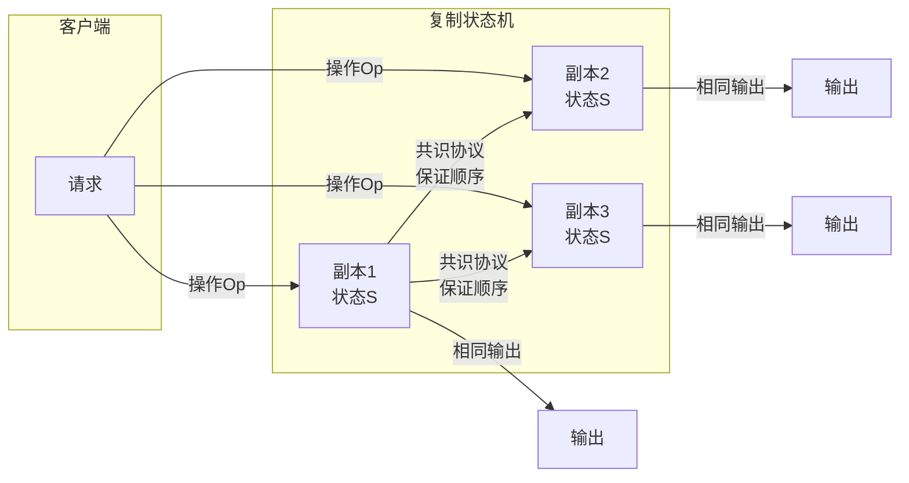

# 故障恢复机制 专题文档

**文档版本**：v1.0
**创建时间**：2026年4月
**最后更新**：2026年4月
**状态**：✅ 已完成

---

## 📋 执行摘要

故障恢复机制是分布式系统在发生故障后恢复正常运行的能力保障，涵盖检查点回滚、日志重做、主备切换和状态机复制等核心技术，确保系统在部分组件失效时仍能持续提供服务。

---

## 一、核心概念

### 1.1 定义与原理

**故障恢复**（Failure Recovery）指系统在检测到故障后，通过一系列技术手段将系统状态恢复到正确状态的过程。其核心原理基于**状态持久化**和**确定性重放**：

- **故障类型**：
  - 崩溃故障（Crash）：进程意外终止
  - 拜占庭故障（Byzantine）：任意错误行为
  - 网络分区（Partition）：通信中断

- **恢复目标**：
  - **一致性**（Consistency）：恢复后状态正确
  - **可用性**（Availability）：恢复期间服务不中断
  - **持久性**（Durability）：已提交数据不丢失

- **恢复模型**：
  - 后向恢复（Backward Recovery）：回滚到之前状态
  - 前向恢复（Forward Recovery）：从当前状态继续

### 1.2 关键特性

- **自动故障检测**：快速识别故障节点或进程
- **快速故障转移**：最小化服务中断时间
- **状态一致性保证**：确保恢复后数据正确
- **幂等性处理**：重复操作不会导致错误
- **分级恢复策略**：根据故障严重程度选择不同策略

### 1.3 适用场景

| 场景 | 适用性 | 说明 |
|------|--------|------|
| 分布式数据库 | ⭐⭐⭐⭐⭐ | MySQL、PostgreSQL主备切换 |
| 分布式消息队列 | ⭐⭐⭐⭐⭐ | Kafka副本恢复 |
| 分布式协调服务 | ⭐⭐⭐⭐⭐ | ZooKeeper Leader选举恢复 |
| 微服务架构 | ⭐⭐⭐⭐ | 服务实例故障转移 |
| 容器编排 | ⭐⭐⭐⭐ | Kubernetes Pod重启 |
| 批处理系统 | ⭐⭐⭐ | 作业重试与恢复 |

---

## 二、技术细节

### 2.1 架构设计



### 2.2 检查点与回滚

#### 检查点技术

**检查点**（Checkpoint）是系统在特定时刻状态的一致性快照，用于故障后的快速恢复。

**检查点类型**：

| 类型 | 描述 | 优点 | 缺点 |
|------|------|------|------|
| 全量检查点 | 完整状态快照 | 恢复简单 | 开销大、耗时长 |
| 增量检查点 | 只保存变化部分 | 快速 | 恢复需合并 |
| 差异检查点 | 与上次全量对比 | 平衡 | 实现复杂 |

**协调检查点算法**：

```
Chandy-Lamport算法
------------------
1. 检查点发起者：
   - 保存本地状态
   - 发送标记（Marker）到所有出通道

2. 进程收到标记：
   - 首次收到：保存状态，转发标记到其他通道
   - 非首次：记录通道状态（消息队列）

3. 终止条件：所有进程收到所有通道的标记
```

**无协调检查点（Uncoordinated Checkpoint）**：

```python
class UncoordinatedCheckpoint:
    def __init__(self):
        self.checkpoints = []
        self.dependency_graph = {}  # 进程依赖图

    def take_checkpoint(self, process_id: str, state: State):
        """独立创建检查点"""
        checkpoint = {
            'process_id': process_id,
            'timestamp': time.time(),
            'state': state,
            'dependencies': self.dependency_graph.get(process_id, [])
        }
        self.checkpoints.append(checkpoint)
        return checkpoint

    def rollback(self, failed_process: str) -> List[str]:
        """回滚到一致状态，返回需要回滚的进程集合"""
        # 找到依赖故障进程的所有进程（多米诺效应）
        affected = set([failed_process])
        queue = [failed_process]

        while queue:
            current = queue.pop(0)
            for process, deps in self.dependency_graph.items():
                if current in deps and process not in affected:
                    affected.add(process)
                    queue.append(process)

        return list(affected)
```

#### 回滚恢复

**后向恢复（Backward Recovery）**：



**日志修剪策略**：

- **同步修剪**：检查点完成后立即删除旧日志
- **延迟修剪**：保留多个检查点的日志，防检查点损坏
- **增量合并**：将旧检查点与增量日志合并

### 2.3 日志与重做

#### 预写日志（WAL）

**WAL原则**：先写日志，再写数据。

```
WAL记录格式
-----------
| 事务ID | 操作类型 | 表/键 | 旧值 | 新值 | 时间戳 | CRC |
```

**恢复过程**：

```python
class WALRecovery:
    def __init__(self, wal_path: str):
        self.wal_path = wal_path
        self.redo_queue = []
        self.undo_queue = []

    def analyze_phase(self):
        """分析阶段：确定需要重做/撤销的事务"""
        for record in self.read_wal():
            if record.type == 'BEGIN':
                self.active_transactions.add(record.tx_id)
            elif record.type == 'COMMIT':
                self.active_transactions.discard(record.tx_id)
                self.committed_transactions.add(record.tx_id)
            elif record.type == 'ABORT':
                self.active_transactions.discard(record.tx_id)

        # 已提交但未持久化的事务需要重做
        self.redo_queue = list(self.committed_transactions)
        # 活跃但未提交的事务需要撤销
        self.undo_queue = list(self.active_transactions)

    def redo_phase(self):
        """重做阶段：重新应用已提交事务"""
        for record in self.read_wal():
            if record.tx_id in self.redo_queue:
                if record.type == 'UPDATE':
                    self.apply_change(record.table, record.key, record.new_value)
                    logging.info(f"REDO: {record.tx_id}")

    def undo_phase(self):
        """撤销阶段：回滚未提交事务"""
        # 从日志末尾反向扫描
        for record in reversed(self.read_wal()):
            if record.tx_id in self.undo_queue:
                if record.type == 'UPDATE':
                    self.apply_change(record.table, record.key, record.old_value)
                    logging.info(f"UNDO: {record.tx_id}")
                elif record.type == 'BEGIN':
                    self.undo_queue.remove(record.tx_id)
                    if not self.undo_queue:
                        break
```

**ARIES算法**（IBM提出的恢复算法）：


1. **分析阶段**：扫描日志，确定脏页集合和活跃事务
2. **Redo阶段**：从Redo点（检查点）开始正向扫描，重做所有更新
3. **Undo阶段**：反向撤销活跃事务，生成补偿日志记录（CLR）

### 2.4 主备切换

#### 主备架构模式

| 模式 | 描述 | RTO | RPO | 适用场景 |
|------|------|-----|-----|----------|
| 冷备 | 备用节点不运行 | 分钟级 | 高 | 非关键系统 |
| 温备 | 备用节点运行但不服务 | 秒级 | 中 | 一般业务 |
| 热备 | 备用节点实时同步 | 毫秒级 | 低 | 关键系统 |
| 双活 | 多节点同时服务 | 0 | 0 | 金融核心 |

**切换决策矩阵**：

```
故障检测 → 确认故障 → 选举新主 → 流量切换 → 旧主恢复
    │           │          │          │          │
    ▼           ▼          ▼          ▼          ▼
  心跳超时   多次确认   多数派投票   DNS/配置   作为从库
  探针失败   隔离检查   优先级比较   代理切换   重新同步
```

#### 自动故障转移实现

```python
class FailoverManager:
    def __init__(self, nodes: List[Node], quorum: int):
        self.nodes = nodes
        self.quorum = quorum
        self.current_master = self._elect_initial_master()
        self.health_checker = HealthChecker()

    def monitor_and_failover(self):
        """监控并执行故障转移"""
        while True:
            # 检查主节点健康
            if not self.health_checker.check(self.current_master):
                logging.warning(f"Master {self.current_master.id} is unhealthy")

                # 确认不是网络抖动
                if self._confirm_failure(self.current_master):
                    self._perform_failover()

            time.sleep(self.check_interval)

    def _confirm_failure(self, node: Node, retries: int = 3) -> bool:
        """多次确认故障，避免误判"""
        for _ in range(retries):
            if self.health_checker.check(node):
                return False
            time.sleep(1)
        return True

    def _perform_failover(self):
        """执行故障转移"""
        # 1. 确定候选节点（数据最新、延迟最低）
        candidates = [n for n in self.nodes
                     if n != self.current_master and n.is_healthy()]

        if len(candidates) < self.quorum - 1:
            raise FailoverError("Insufficient healthy nodes for quorum")

        # 2. 选择最佳备节点
        new_master = self._select_best_slave(candidates)

        # 3. 晋升为主节点
        with self.failover_lock:
            old_master = self.current_master
            self.current_master = new_master
            new_master.promote_to_master()

            # 4. 通知其他节点
            for node in self.nodes:
                if node != new_master:
                    node.update_master(new_master)

            # 5. 更新客户端路由
            self._update_client_routing(new_master)

            logging.info(f"Failover complete: {old_master.id} -> {new_master.id}")

    def _select_best_slave(self, candidates: List[Node]) -> Node:
        """选择最佳备节点"""
        # 优先级：复制延迟 > 事务ID > 节点权重
        return max(candidates,
                  key=lambda n: (n.replication_lag,
                                n.last_transaction_id,
                                n.priority))
```

#### 脑裂预防

**裂脑（Split-Brain）**：网络分区导致多个节点认为自己是主节点。

**预防措施**：

1. **多数派原则**（Quorum）：只有获得多数节点认可的才能成为主
2. **fencing/STONITH**：强制关闭旧主节点
3. **租约机制**（Lease）：主节点持有时间租约，到期自动降级

```python
class LeaseManager:
    def __init__(self, ttl_seconds: int = 10):
        self.ttl = ttl_seconds
        self.lease_holder = None
        self.lease_expiry = 0

    def acquire_lease(self, node_id: str) -> bool:
        """获取租约"""
        now = time.time()
        if now > self.lease_expiry or self.lease_holder == node_id:
            self.lease_holder = node_id
            self.lease_expiry = now + self.ttl
            return True
        return False

    def renew_lease(self, node_id: str) -> bool:
        """续租（必须由当前持有者调用）"""
        if self.lease_holder == node_id:
            self.lease_expiry = time.time() + self.ttl
            return True
        return False

    def is_lease_valid(self, node_id: str) -> bool:
        """检查租约是否有效"""
        return (self.lease_holder == node_id and
                time.time() < self.lease_expiry)
```

### 2.5 状态机复制

#### 复制状态机原理

**复制状态机**（Replicated State Machine）是分布式系统实现容错的核心技术：

```
所有副本从相同初始状态开始，按相同顺序执行相同操作，
最终达到相同状态。
```



**复制日志（Replicated Log）**：

| 索引 | 任期 | 操作 | 已提交 |
|------|------|------|--------|
| 1 | 1 | x=1 | ✓ |
| 2 | 1 | y=2 | ✓ |
| 3 | 2 | x=3 | ✓ |
| 4 | 2 | y=4 | ✗ |

**Raft状态机复制**：

```python
class ReplicatedStateMachine:
    def __init__(self, node_id: str, peers: List[str]):
        self.node_id = node_id
        self.peers = peers

        # 持久化状态
        self.current_term = 0
        self.voted_for = None
        self.log = []

        # 易失状态
        self.commit_index = 0
        self.last_applied = 0

        # Leader状态
        self.next_index = {p: 1 for p in peers}
        self.match_index = {p: 0 for p in peers}

    def apply_command(self, command: Command) -> Result:
        """应用命令到状态机"""
        # 1. 追加到本地日志
        entry = LogEntry(
            index=len(self.log) + 1,
            term=self.current_term,
            command=command
        )
        self.log.append(entry)
        self.persist()

        # 2. 复制到多数节点（Leader）
        if self.is_leader():
            self.replicate_log()

        # 3. 等待提交
        return self.wait_for_commit(entry.index)

    def commit_entries(self):
        """提交已复制到多数节点的日志"""
        for index in range(self.commit_index + 1, len(self.log) + 1):
            # 检查是否已复制到多数
            replicated = sum(1 for p in self.peers
                           if self.match_index[p] >= index)
            if replicated >= len(self.peers) // 2:
                self.commit_index = index
                self.apply_to_state_machine(index)

    def apply_to_state_machine(self, index: int):
        """应用日志到状态机"""
        while self.last_applied < self.commit_index:
            self.last_applied += 1
            entry = self.log[self.last_applied - 1]
            result = self.state_machine.execute(entry.command)
            logging.info(f"Applied entry {self.last_applied}: {result}")
```

### 2.6 优雅降级

#### 降级策略

当系统部分组件故障时，通过降低服务质量保证核心功能可用：

| 降级级别 | 策略 | 用户体验 |
|----------|------|----------|
| 功能降级 | 关闭非核心功能 | 功能受限 |
| 性能降级 | 降低响应速度/精度 | 体验下降 |
| 数据降级 | 读取缓存/旧数据 | 数据延迟 |
| 容量降级 | 限制并发/流量 | 需要排队 |

**降级决策树**：

```
故障检测
├── 依赖服务故障？
│   ├── 是 → 使用熔断器隔离，返回默认值
│   └── 否 → 继续检查
├── 数据库延迟高？
│   ├── 是 → 启用缓存，读取旧数据
│   └── 否 → 继续检查
├── 资源不足？
│   ├── 是 → 限流，关闭非核心功能
│   └── 否 → 正常运行
└── 网络分区？
    ├── 是 → 本地模式运行，异步同步
    └── 否 → 正常运行
```

**熔断器模式实现**：

```python
from enum import Enum

class CircuitState(Enum):
    CLOSED = "closed"       # 正常
    OPEN = "open"          # 熔断
    HALF_OPEN = "half_open"  # 半开测试

class CircuitBreaker:
    def __init__(self,
                 failure_threshold: int = 5,
                 timeout_seconds: int = 30,
                 half_open_requests: int = 3):
        self.failure_threshold = failure_threshold
        self.timeout = timeout_seconds
        self.half_open_requests = half_open_requests

        self.state = CircuitState.CLOSED
        self.failure_count = 0
        self.last_failure_time = 0
        self.success_count = 0

    def call(self, func, *args, **kwargs):
        """执行被保护的调用"""
        if self.state == CircuitState.OPEN:
            if time.time() - self.last_failure_time > self.timeout:
                self.state = CircuitState.HALF_OPEN
                self.success_count = 0
            else:
                raise CircuitBreakerOpen("Service temporarily unavailable")

        try:
            result = func(*args, **kwargs)
            self._on_success()
            return result
        except Exception as e:
            self._on_failure()
            raise

    def _on_success(self):
        self.failure_count = 0

        if self.state == CircuitState.HALF_OPEN:
            self.success_count += 1
            if self.success_count >= self.half_open_requests:
                self.state = CircuitState.CLOSED

    def _on_failure(self):
        self.failure_count += 1
        self.last_failure_time = time.time()

        if self.failure_count >= self.failure_threshold:
            self.state = CircuitState.OPEN
```

---

## 三、系统对比

### 3.1 主流系统恢复机制对比矩阵

| 维度 | MySQL MGR | PostgreSQL流复制 | Redis Sentinel | Kafka |
|------|-----------|------------------|----------------|-------|
| 复制模式 | 状态机复制 | 物理复制 | 异步复制 | ISR复制 |
| 一致性 | 强一致 | 最终一致 | 最终一致 | 可配置 |
| RTO | 秒级 | 秒级 | 秒级 | 秒级 |
| RPO | 0 | 可配置 | 可能丢数据 | 可配置 |
| 自动切换 | 是 | 需外部工具 | 是 | 是 |
| 脑裂保护 | 多数派 | 需额外配置 | 需配置 | 是 |

### 3.2 选型决策树

```
一致性要求
├── 强一致性（RPO=0）？
│   ├── 是 → 选择MySQL MGR / PostgreSQL同步复制
│   └── 否 → 继续评估
│
├── 高吞吐优先？
│   ├── 是 → Kafka / Redis Cluster
│   └── 否 → 继续评估
│
├── 自动故障转移？
│   ├── 是 → MySQL MGR / Redis Sentinel
│   └── 否 → 手动切换方案
│
└── 地理分布？
    ├── 是 → 考虑CockroachDB / TiDB
    └── 否 → 单地域高可用方案
```

### 3.3 性能基准

| 指标 | MySQL MGR | PostgreSQL | Redis Sentinel | Kafka |
|------|-----------|------------|----------------|-------|
| 复制延迟（P99） | <10ms | <5ms | <1ms | <100ms |
| 故障检测时间 | 5s | 可配置 | 5s | 10s |
| 故障转移时间 | <5s | <10s | <3s | <3s |
| 数据丢失风险 | 无 | 低 | 中 | 可配置 |
| 吞吐影响 | 10-20% | 5-10% | <5% | 可扩展 |

---

## 四、实践指南

### 4.1 部署配置

**MySQL Group Replication配置**：

```ini
# my.cnf
[mysqld]
# Group Replication配置
group_replication_group_name = "aaaaaaaa-bbbb-cccc-dddd-eeeeeeeeeeee"
group_replication_start_on_boot = OFF
group_replication_local_address = "node1:33061"
group_replication_group_seeds = "node1:33061,node2:33061,node3:33061"
group_replication_bootstrap_group = OFF

# 单主模式
group_replication_single_primary_mode = ON
group_replication_enforce_update_everywhere_checks = OFF

# 自动切换
group_replication_autorejoin_tries = 3
group_replication_exit_state_action = READ_ONLY
```

**Redis Sentinel配置**：

```conf
# sentinel.conf
sentinel monitor mymaster 127.0.0.1 6379 2
sentinel down-after-milliseconds mymaster 5000
sentinel parallel-syncs mymaster 1
sentinel failover-timeout mymaster 10000

# 脑裂保护
sentinel deny-scripts-reconfig yes
min-replicas-to-write 1
min-replicas-max-lag 10
```

**自定义故障恢复管理器**：

```python
RECOVERY_CONFIG = {
    "checkpoint_interval_sec": 300,      # 检查点间隔
    "wal_retention_hours": 24,           # WAL保留时间
    "failover_timeout_sec": 30,          # 故障转移超时
    "health_check_interval_sec": 5,      # 健康检查间隔
    "max_failover_retries": 3,           # 最大重试次数
    "quorum_size": 3,                    # 最小法定人数
    "circuit_breaker_threshold": 5,      # 熔断阈值
    "circuit_breaker_timeout_sec": 30,   # 熔断超时
    "graceful_degradation_enabled": True, # 启用优雅降级
}
```

### 4.2 最佳实践

1. **检查点策略**
   - 全量检查点：低峰期执行，避免影响业务
   - 增量检查点：高频执行，减少恢复时间
   - 多版本保留：保留至少2个检查点，防损坏

2. **日志管理**
   - 使用专用磁盘存储WAL，避免IO争用
   - 配置日志压缩，减少存储空间
   - 异地备份关键日志，防止灾难性故障

3. **故障转移**
   - 配置合理的超时参数，平衡检测速度与误判
   - 实施多数派确认，避免脑裂
   - 故障转移后验证数据一致性

4. **监控告警**
   - 监控复制延迟，超过阈值告警
   - 监控故障转移事件，分析原因
   - 定期检查点成功率，确保可恢复

### 4.3 常见问题

**Q1: 故障转移后数据不一致如何处理？**
A:

- 检查复制延迟，确认是否异步复制导致
- 使用pt-table-checksum等工具检查一致性
- 必要时执行数据修复或重新同步
- 考虑改用同步复制（影响性能）

**Q2: 检查点创建影响业务性能怎么办？**
A:

- 调整检查点频率（降低）
- 使用增量检查点而非全量
- 在低峰期创建检查点
- 使用独立IO通道或磁盘

**Q3: 如何避免脑裂？**
A:

- 使用ZooKeeper/etcd作为协调服务
- 配置正确的quorum数量
- 启用fencing/STONITH机制
- 使用租约（Lease）机制

**Q4: 日志文件过大如何处理？**
A:

- 配置日志自动归档和清理
- 创建检查点后清理旧日志
- 使用日志压缩（如LZ4）
- 分布式日志存储（如BookKeeper）

---

## 五、形式化分析

### 5.1 理论模型

**恢复正确性模型（TLA+片段）**：

```tla
MODULE Recovery

CONSTANTS Processes, MaxFailures

VARIABLES state,       \* 各进程状态
checkpoint,   \* 检查点集合
crashed       \* 崩溃标记

TypeInvariant ==
  /\ state \in [Processes -> StateDomain]
  /\ checkpoint \in SUBSET (Processes \X StateDomain \X Nat)
  /\ crashed \in [Processes -> BOOLEAN]

\* 恢复正确性：恢复后状态一致性
RecoveryCorrectness ==
  \A p \in Processes :
    crashed[p] /\ recover(p)
    => state'[p] = CorrectStateAfterRecovery(p)

\* 检查点一致性：检查点必须来自有效状态
CheckpointValidity ==
  \A <<p, s, t>> \in checkpoint :
    \E t0 \in 0..t : state[t0][p] = s

\* 可恢复性：崩溃后可从检查点恢复
Recoverability ==
  \A p \in Processes :
    crashed[p] ~> <>(~crashed[p] /\ state[p] \in ValidStates)
```

### 5.2 正确性证明

**定理**：使用复制日志的状态机满足一致性。

**证明概要**：

1. 所有副本从相同初始状态S₀开始
2. 通过共识协议，所有副本以相同顺序执行相同操作序列
3. 每个操作Oᵢ是确定性的：Sᵢ = apply(Sᵢ₋₁, Oᵢ)
4. 归纳证明：
   - 基础：S₀在所有副本上相同
   - 归纳：若Sᵢ₋₁相同，则Sᵢ = apply(Sᵢ₋₁, Oᵢ)也相同
5. 因此，所有副本状态始终一致 ∎

### 5.3 复杂度分析

**检查点创建**：

- 全量检查点：O(S)，S为状态大小
- 增量检查点：O(Δ)，Δ为变化量
- 空间复杂度：O(C × S)，C为检查点数量

**恢复过程**：

- 时间复杂度：O(S + L)，L为重做日志大小
- 空间复杂度：O(S)
- 消息复杂度：取决于复制协议

**故障转移**：

- 检测时间：O(T_detection)
- 选举时间：O(T_election)
- 同步时间：O(Replication_Lag)

---

## 六、与其他主题的关联

### 6.1 上游依赖

- [故障检测器](./故障检测器.md)
- [Raft算法](../02-consensus/Raft算法.md)
- [分布式事务](../03-coordination/分布式事务.md)

### 6.2 下游应用

- [灾难恢复](./灾难恢复.md)
- [服务网格](../05-microservices/服务网格.md)
- [容器编排](../07-deployment/容器编排.md)

### 6.3 相关概念

| 概念 | 关系 | 说明 |
|------|------|------|
| 备份与恢复 | 基础 | 故障恢复的数据基础 |
| 负载均衡 | 协同 | 故障转移时的流量调度 |
| 混沌工程 | 验证 | 主动注入故障测试恢复能力 |
| 监控告警 | 支持 | 及时发现故障触发恢复 |

---

## 七、参考资源

### 7.1 学术论文

1. [Aries: A Transaction Recovery Method](https://doi.org/10.1145/128765.128770) - C. Mohan et al., 1992
2. [Chandy-Lamport Distributed Snapshots](https://doi.org/10.1145/214451.214456) - K. Mani Chandy, Leslie Lamport, 1985
3. [The Design of a Practical System for Fault-Tolerant Virtual Machines](https://doi.org/10.1145/2043556.2043557) - Daniel J. Scales et al., 2011
4. [PacificA: Replication in Log-Based Distributed Storage Systems](https://www.microsoft.com/en-us/research/publication/pacifica-replication-in-log-based-distributed-storage-systems/) - Wei Lin et al., 2008

### 7.2 开源项目

1. [MySQL Group Replication](https://github.com/mysql/mysql-server) - MySQL官方高可用方案
2. [Patroni](https://github.com/zalando/patroni) - PostgreSQL HA模板
3. [Redis Sentinel](https://github.com/redis/redis) - Redis高可用方案
4. [etcd](https://github.com/etcd-io/etcd) - 分布式协调服务

### 7.3 学习资料

1. [Database Internals](https://www.databass.dev/) - Alex Petrov, 数据库内部原理
2. [Designing Data-Intensive Applications](https://dataintensive.net/) - Martin Kleppmann
3. [CMU 15-721](https://15721.courses.cs.cmu.edu/) - 高级数据库课程

### 7.4 相关文档

- [故障检测器](./故障检测器.md)
- [灾难恢复](./灾难恢复.md)
- [自稳定算法](./自稳定算法.md)

---

**维护者**：项目团队
**最后更新**：2026年4月
