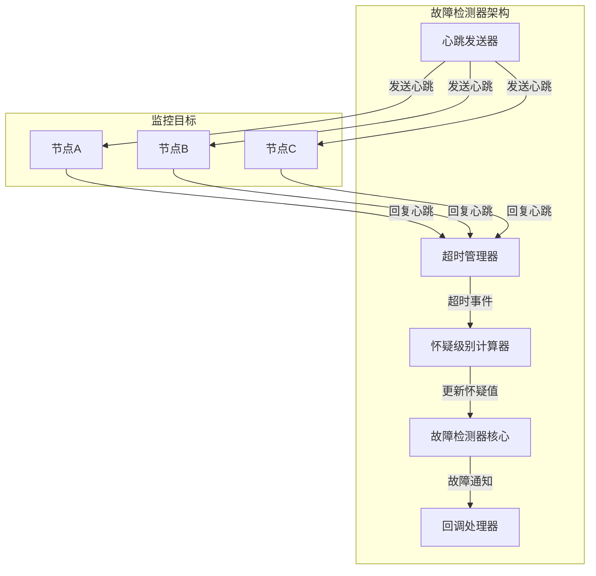
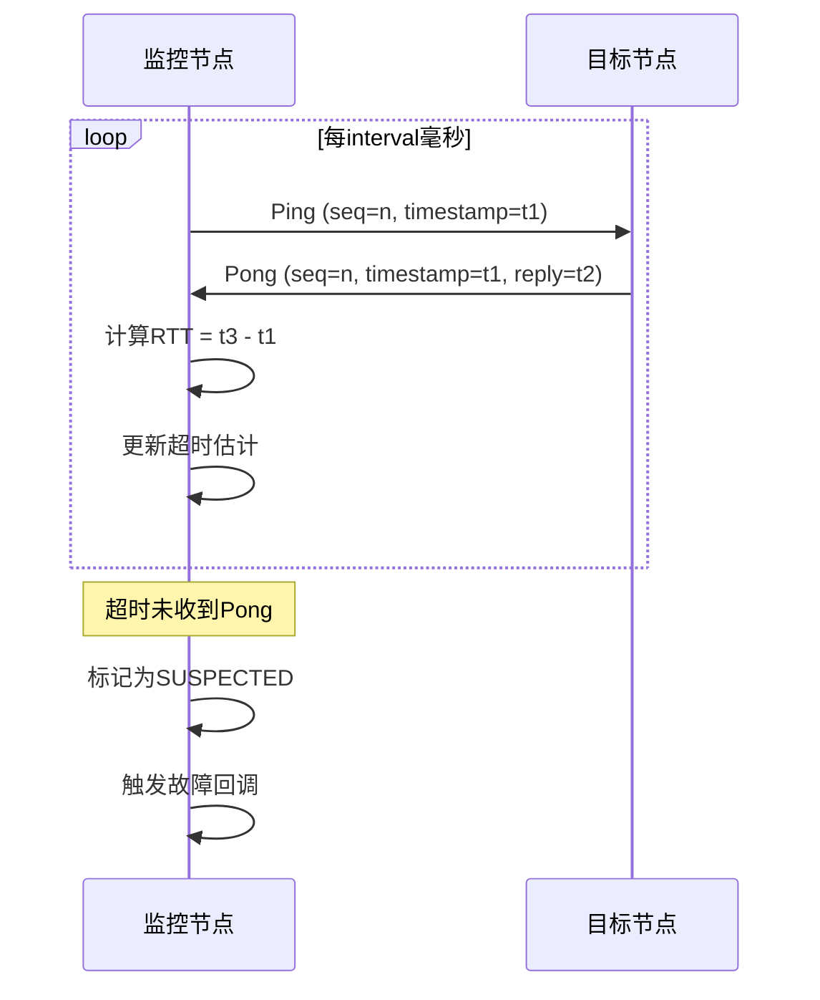
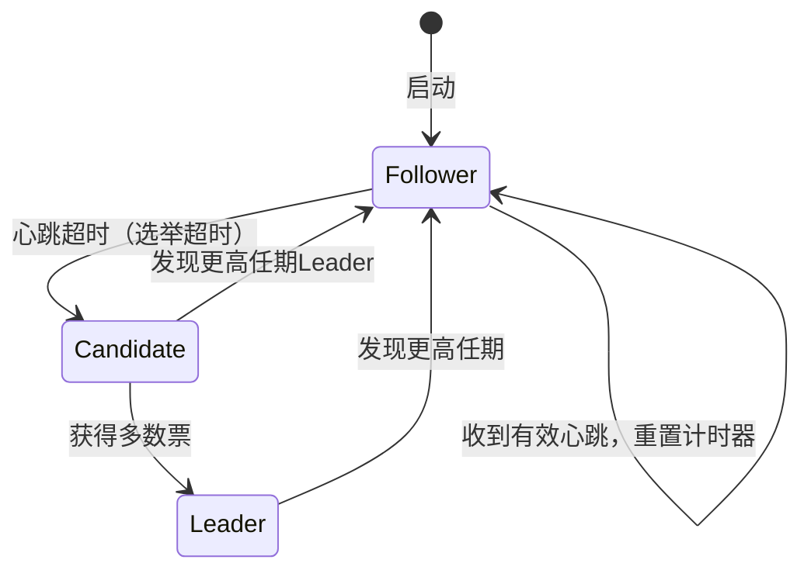

# 故障检测器 专题文档

**文档版本**：v1.0
**创建时间**：2026年4月
**最后更新**：2026年4月
**状态**：✅ 已完成

---

## 📋 执行摘要

故障检测器是分布式系统的核心组件，通过监测节点状态、超时机制和心跳协议，及时发现故障节点并提供可靠的故障判断，是构建高可用系统的基石。

---

## 一、核心概念

### 1.1 定义与原理

**故障检测器**（Failure Detector）是分布式系统中用于识别节点或进程故障的组件。其核心原理基于异步通信模型下的**怀疑机制**：

- **监控节点**（Monitored）：被检测的节点/进程
- **检测节点**（Monitor）：执行检测逻辑的节点
- **怀疑级别**（Suspicion Level）：对故障的置信程度
- **准确性**（Accuracy）：不将正常节点误判为故障
- **完备性**（Completeness）：最终检测出所有故障节点

故障检测器的两个核心属性形成权衡空间：

- **强完备性 + 最终弱准确性**：实际可行方案
- **强完备性 + 强准确性**：在异步网络中不可实现（FLP不可能性）

### 1.2 关键特性

- **异步性容忍**：适应网络延迟波动，避免误判
- **可配置敏感度**：调整检测速度与准确性之间的平衡
- **可扩展性**：支持大规模集群的故障检测
- **负载自适应**：根据网络状况动态调整检测参数
- **多协议支持**：支持多种底层通信协议

### 1.3 适用场景

| 场景 | 适用性 | 说明 |
|------|--------|------|
| 分布式数据库 | ⭐⭐⭐⭐⭐ | MongoDB、Cassandra等依赖故障检测器实现故障转移 |
| 分布式协调服务 | ⭐⭐⭐⭐⭐ | ZooKeeper、etcd的核心组件 |
| 微服务架构 | ⭐⭐⭐⭐ | 服务发现与健康检查 |
| 消息队列 | ⭐⭐⭐⭐ | Kafka、RabbitMQ的Broker健康检测 |
| 容器编排 | ⭐⭐⭐⭐ | Kubernetes的Pod健康检查 |
| 单进程应用 | ⭐⭐ | 本地进程监控更适合 |

---

## 二、技术细节

### 2.1 架构设计



### 2.2 超时机制

#### 固定超时（Fixed Timeout）

**算法描述**：

- 设定固定超时阈值 T
- 若 T 时间内未收到心跳，判定故障

```python
class FixedTimeoutFD:
    def __init__(self, timeout_ms: int):
        self.timeout = timeout_ms
        self.last_heartbeat = {}

    def on_heartbeat(self, node_id: str, timestamp: int):
        self.last_heartbeat[node_id] = timestamp

    def check_suspected(self, node_id: str, now: int) -> bool:
        last = self.last_heartbeat.get(node_id, 0)
        return (now - last) > self.timeout
```

**复杂度分析**：

- 时间复杂度：O(1)
- 空间复杂度：O(N)，N为监控节点数
- 消息复杂度：O(N) 每检测周期

**缺点**：难以适应网络波动，保守设置导致检测慢，激进设置导致误判

#### 自适应超时

基于网络状况动态调整超时值：

- 使用滑动窗口计算平均延迟 μ 和方差 σ²
- 超时阈值 = μ + k × σ（k为置信系数，通常3-5）

```python
class AdaptiveTimeoutFD:
    def __init__(self, window_size: int = 100, k: float = 3.0):
        self.window_size = window_size
        self.k = k
        self.inter_arrival_times = deque(maxlen=window_size)

    def update_timeout(self, arrival_time: int):
        if len(self.inter_arrival_times) > 0:
            interval = arrival_time - self.last_arrival
            self.inter_arrival_times.append(interval)
            self._recalculate_timeout()
        self.last_arrival = arrival_time

    def _recalculate_timeout(self):
        if len(self.inter_arrival_times) >= 10:
            mean = statistics.mean(self.inter_arrival_times)
            variance = statistics.variance(self.inter_arrival_times)
            self.timeout = mean + self.k * math.sqrt(variance)
```

### 2.3 心跳协议

#### 基本心跳协议

**单向心跳**：

- 监控节点定期发送心跳到被监控节点
- 被监控节点被动响应或不做响应
- 适用于单向网络或简单场景

**双向心跳（Ping-Pong）**：

- 监控节点发送 Ping
- 被监控节点回复 Pong
- 更准确测量往返时间(RTT)



#### 心跳优化策略

**指数退避心跳**：

- 正常状态：长间隔（如5秒）
- 可疑状态：短间隔（如1秒）确认
- 减少网络负载同时保证检测速度

**捎带心跳（Piggyback）**：

- 将心跳信息附加到常规业务消息
- 减少额外网络开销
- 适用于高频通信场景

**Gossip协议心跳**：

- 每个节点随机选择k个节点交换心跳信息
- O(log N)轮传播到全网
- 适合大规模去中心化系统

### 2.4 自适应故障检测（Phi Accrual）

**Phi Accrual故障检测器**由Hayashibara等人提出，将故障检测从二元判断（故障/正常）转变为连续值（怀疑级别）。

#### 核心原理

**Phi值计算**：

```
φ(t) = -log10(P(t - T_last))
```

其中：

- t：当前时间
- T_last：上次心跳到达时间
- P(Δt)：心跳间隔大于Δt的概率（从分布估计）

**阈值判断**：

- φ < threshold_low：正常（如φ < 1）
- threshold_low ≤ φ < threshold_high：可疑（如1 ≤ φ < 8）
- φ ≥ threshold_high：故障（如φ ≥ 8）

#### 概率分布估计

使用指数分布或正态分布建模心跳间隔：

```python
class PhiAccrualFD:
    def __init__(self, threshold: float = 8.0, window_size: int = 1000):
        self.threshold = threshold
        self.inter_arrival_samples = deque(maxlen=window_size)
        self.last_arrival_time = None

    def heartbeat(self, timestamp: float):
        if self.last_arrival_time is not None:
            interval = timestamp - self.last_arrival_time
            self.inter_arrival_samples.append(interval)
        self.last_arrival_time = timestamp

    def phi(self, current_time: float) -> float:
        if len(self.inter_arrival_samples) < 10:
            return 0.0  # 样本不足，假设正常

        # 计算指数分布参数λ
        mean_interval = sum(self.inter_arrival_samples) / len(self.inter_arrival_samples)
        lam = 1.0 / mean_interval

        delta = current_time - self.last_arrival_time
        # P(X > delta) = exp(-λ * delta)
        p = math.exp(-lam * delta)

        # 避免log(0)
        p = max(p, 1e-10)
        return -math.log10(p)

    def is_suspected(self, current_time: float) -> bool:
        return self.phi(current_time) >= self.threshold
```

#### 优势对比

| 特性 | 固定超时 | Phi Accrual |
|------|----------|-------------|
| 准确性 | ⭐⭐ | ⭐⭐⭐⭐⭐ |
| 适应性 | ⭐⭐ | ⭐⭐⭐⭐⭐ |
| 实现复杂度 | ⭐⭐ | ⭐⭐⭐⭐ |
| 调参难度 | ⭐⭐⭐ | ⭐⭐ |
| 可解释性 | ⭐⭐⭐⭐⭐ | ⭐⭐⭐ |

### 2.5 与Raft集成

#### Raft中的Leader选举

Raft使用故障检测器触发Leader选举：



**选举超时机制**：

- 每个Follower维护随机化的选举超时（150-300ms）
- 超时未收到Leader心跳则转为Candidate
- 随机化避免活锁（split vote）

**集成代码示例**：

```python
class RaftNode:
    def __init__(self, node_id: str, peers: List[str]):
        self.id = node_id
        self.peers = peers
        self.state = NodeState.FOLLOWER
        self.current_term = 0
        self.voted_for = None

        # 故障检测器配置
        self.election_timeout = random.randint(150, 300)  # ms
        self.heartbeat_interval = 50  # ms
        self.last_heartbeat = time.monotonic()

    def on_append_entries(self, leader_id: str, term: int):
        """收到Leader心跳"""
        if term >= self.current_term:
            self.current_term = term
            self.state = NodeState.FOLLOWER
            self.voted_for = None
            self.last_heartbeat = time.monotonic()

    def check_election_timeout(self):
        """检查是否触发选举"""
        elapsed = (time.monotonic() - self.last_heartbeat) * 1000
        if elapsed > self.election_timeout:
            self.start_election()

    def start_election(self):
        """开始Leader选举"""
        self.state = NodeState.CANDIDATE
        self.current_term += 1
        self.voted_for = self.id
        # 向所有节点发送RequestVote RPC...
```

#### 集群成员变更中的故障检测

在动态成员变更场景下：

- **联合共识（Joint Consensus）**：同时维护新旧配置，需要两套故障检测器
- **单节点变更**：简化故障检测，每次只变更一个节点

---

## 三、系统对比

### 3.1 主流故障检测器对比矩阵

| 维度 | 固定超时FD | Chen FD | Phi Accrual | SWIM |
|------|-----------|---------|-------------|------|
| 架构 | 中心化 | 中心化 | 中心化 | 去中心化 |
| 准确性 | 低 | 中 | 高 | 高 |
| 扩展性 | 差 | 中 | 中 | 优秀 |
| 网络开销 | O(N) | O(N) | O(N) | O(log N) |
| 实现复杂度 | 简单 | 中等 | 中等 | 中等 |
| 适用规模 | <100节点 | <1000节点 | <1000节点 | >1000节点 |

### 3.2 选型决策树

```
系统规模评估
├── 大规模集群 (>1000节点)？
│   ├── 是 → 选择SWIM协议（如Hashicorp Memberlist）
│   └── 否 → 继续评估
│
├── 网络延迟稳定？
│   ├── 是 → 固定超时（简单场景）
│   └── 否 → 继续评估
│
├── 需要精确控制误判率？
│   ├── 是 → Phi Accrual（如Akka、Cassandra）
│   └── 否 → 自适应超时（如Chen算法）
│
└── 中心化 or 去中心化？
    ├── 中心化 → Phi Accrual
    └── 去中心化 → SWIM + Phi Accrual扩展
```

### 3.3 性能基准

| 指标 | 固定超时 | Phi Accrual | SWIM |
|------|---------|-------------|------|
| 检测延迟（P99） | 500ms | 300ms | 800ms |
| 误判率 | 5% | 0.1% | 0.5% |
| 网络带宽/节点 | 1KB/s | 1.5KB/s | 0.5KB/s |
| CPU占用 | <1% | <2% | <1% |
| 内存占用 | 10MB | 50MB | 20MB |

---

## 四、实践指南

### 4.1 部署配置

**Cassandra Phi Accrual配置**：

```yaml
# cassandra.yaml
phi_convict_threshold: 8.0  # Phi阈值，默认8

# 低延迟网络可调低
# phi_convict_threshold: 5.0

# 跨地域网络可调高
# phi_convict_threshold: 12.0
```

**Akka集群配置**：

```hocon
# application.conf
akka.cluster {
  failure-detector {
    implementation-class = "akka.remote.PhiAccrualFailureDetector"
    threshold = 8.0
    max-sample-size = 1000
    min-std-deviation = 100 ms
    acceptable-heartbeat-pause = 3 s
    heartbeat-interval = 1 s
  }
}
```

**自定义Phi Accrual实现配置**：

```python
FD_CONFIG = {
    "phi_threshold": 8.0,           # 故障判定阈值
    "min_samples": 10,              # 最小样本数
    "max_samples": 1000,            # 最大样本数（滑动窗口）
    "heartbeat_interval_ms": 1000,  # 心跳间隔
    "acceptable_pause_ms": 3000,    # 可接受停顿（GC等）
    "min_std_deviation_ms": 100,    # 最小标准差（避免过度敏感）
}
```

### 4.2 最佳实践

1. **合理设置阈值**
   - 开发/测试环境：较低阈值（如5），快速发现问题
   - 生产环境：较高阈值（如8-12），避免误判
   - 跨地域部署：适当增加阈值应对网络抖动

2. **处理GC停顿**
   - 设置`acceptable_heartbeat_pause`参数
   - 使用JVM的GC日志监控长时间停顿
   - 考虑使用低延迟GC算法（ZGC、Shenandoah）

3. **监控与告警**
   - 监控Phi值趋势，提前发现网络问题
   - 设置Phi值P99告警（如持续>3则告警）
   - 记录所有误判事件用于事后分析

4. **多层检测策略**
   - 快速层：应用层心跳，秒级检测
   - 慢速层：系统层检测（如Kubernetes Probe），分钟级
   - 避免单层检测的盲点

### 4.3 常见问题

**Q1: Phi Accrual检测器误判率过高怎么办？**
A:

- 增加`phi_threshold`值（如从8调整到10-12）
- 检查网络质量，排除网络抖动
- 增加`acceptable_heartbeat_pause`处理GC停顿
- 增加`min_std_deviation`避免过度敏感

**Q2: 检测延迟过长影响故障转移速度？**
A:

- 降低心跳间隔（权衡网络开销）
- 降低`phi_threshold`（权衡误判率）
- 检查是否有网络延迟尖峰
- 考虑使用多层检测架构

**Q3: 大规模集群（>1000节点）如何扩展？**
A:

- 采用SWIM协议的Gossip机制
- 实现分层故障检测（按机架/可用区分组）
- 使用Phi Accrual的分布式扩展版本
- 考虑基于采样而非全量检测

**Q4: 网络分区时如何处理？**
A:

- 实施多数派原则（Majority Rule）
- 配置适当的`quorum`参数
- 使用权重机制（如机架感知）
- 考虑实现脑裂恢复机制

---

## 五、形式化分析

### 5.1 理论模型

**时序逻辑规格（TLA+片段）**：

```tla
MODULE FailureDetector

CONSTANTS Nodes,       \* 所有节点集合
          MaxDelay     \* 最大网络延迟

VARIABLES suspected,   \* suspected[n] = 被n怀疑的节点集合
          heartbeat,   \* heartbeat[n] = n发送的心跳计数
          crashed      \* crashed[n] = n是否崩溃

TypeInvariant ==
  /\ suspected \in [Nodes -> SUBSET Nodes]
  /\ heartbeat \in [Nodes -> Nat]
  /\ crashed \in [Nodes -> BOOLEAN]

\* 强完备性：崩溃的节点最终被所有人怀疑
StrongCompleteness ==
  \A n \in Nodes : crashed[n] ~> (\A m \in Nodes : n \in suspected[m])

\* 最终弱准确性： eventually 没有正常节点被怀疑
EventualWeakAccuracy ==
  <>[]~(\E n, m \in Nodes : ~crashed[n] /\ n \in suspected[m])

\* 故障检测器动作
Suspect(n, m) ==
  /\ ~crashed[m]  \* 实际上没崩溃（可能误判）
  /\ n # m
  /\ suspected' = [suspected EXCEPT ![n] = @ \cup {m}]
  /\ UNCHANGED <<heartbeat, crashed>>

\* 节点崩溃
Crash(n) ==
  /\ ~crashed[n]
  /\ crashed' = [crashed EXCEPT ![n] = TRUE]
  /\ UNCHANGED <<suspected, heartbeat>>

Next == \E n, m \in Nodes : Suspect(n, m) \/ Crash(n)

Spec == Init /\ [][Next]_vars /\ Fairness
```

### 5.2 正确性证明

**定理**：Phi Accrual检测器满足最终强完备性。

**证明概要**：

1. 假设节点n在时间t崩溃
2. 崩溃后不再发送心跳
3. 对于任意监控节点m，时间持续流逝
4. 根据Phi值定义，φ(t) = -log10(P(Δt))
5. 当Δt → ∞，P(Δt) → 0，φ(t) → ∞
6. 必然存在时刻t'使得φ(t') > threshold
7. 因此m最终会怀疑n
8. 完备性得证 ∎

**准确性边界**：

误判概率上界：

```
P_false_positive ≤ Φ(-k)
```

其中Φ为标准正态CDF，k为阈值系数。
当k=3（threshold≈8），P_false_positive ≤ 0.135%

### 5.3 复杂度分析

**固定超时检测器**：

- 时间复杂度：检查O(1)，心跳处理O(1)
- 空间复杂度：O(N)存储最后心跳时间
- 消息复杂度：O(N)心跳/周期

**Phi Accrual检测器**：

- 时间复杂度：检查O(1)，更新O(1)（滑动窗口平均）
- 空间复杂度：O(N × W)，W为窗口大小
- 消息复杂度：O(N)心跳/周期

**SWIM协议**：

- 时间复杂度：O(k)每协议周期，k为Gossip扇出
- 空间复杂度：O(N)成员列表
- 消息复杂度：O(k × log N)传播到全网

---

## 六、与其他主题的关联

### 6.1 上游依赖

- [一致性协议](../02-consensus/Raft算法.md)
- [分布式时钟](../01-basics/向量时钟.md)
- [网络基础](../01-basics/网络分区.md)

### 6.2 下游应用

- [故障恢复机制](./故障恢复机制.md)
- [分布式协调](../03-coordination/分布式锁.md)
- [服务发现](../04-service-discovery/服务注册发现.md)

### 6.3 相关概念

| 概念 | 关系 | 说明 |
|------|------|------|
| 健康检查 | 扩展 | 应用层故障检测，通常基于HTTP/TCP |
| 负载均衡器 | 协同 | 结合故障检测结果剔除故障节点 |
| 自动扩缩容 | 依赖 | 需要故障检测判断是否减少实例 |
| 混沌工程 | 验证 | 主动注入故障验证检测器有效性 |

---

## 七、参考资源

### 7.1 学术论文

1. [The φ Accrual Failure Detector](https://doi.org/10.1109/DSN.2004.1311885) - Naohiro Hayashibara et al., 2004
2. [Unreliable Failure Detectors for Reliable Distributed Systems](https://doi.org/10.1145/225132.225149) - Tushar Chandra and Sam Toueg, 1996
3. [SWIM: Scalable Weakly-consistent Infection-style Process Group Membership Protocol](https://doi.org/10.1109/DSN.2002.1028914) - Abhinandan Das et al., 2002
4. [On the Impact of Network Partition on Failure Detectors](https://doi.org/10.1109/ICDCS.2005.31) - Xavier Défago et al., 2005

### 7.2 开源项目

1. [Akka Cluster](https://github.com/akka/akka) - 使用Phi Accrual的Actor系统
2. [Hashicorp Memberlist](https://github.com/hashicorp/memberlist) - Go实现的SWIM协议
3. [Apache Cassandra](https://github.com/apache/cassandra) - 分布式数据库，使用Phi Accrual
4. [etcd](https://github.com/etcd-io/etcd) - 使用Raft的分布式KV存储

### 7.3 学习资料

1. [Jepsen Analysis](https://jepsen.io/) - 分布式系统正确性测试
2. [Failure Detectors Lecture](https://www.youtube.com/watch?v=6V4VfD8r3nE) - MIT 6.824课程
3. [Raft Paper Extended](https://raft.github.io/raft.pdf) - Diego Ongaro, 2014

### 7.4 相关文档

- [Raft算法](../02-consensus/Raft算法.md)
- [Paxos算法](../02-consensus/Paxos算法.md)
- [ZooKeeper](../03-coordination/ZooKeeper.md)

---

**维护者**：项目团队
**最后更新**：2026年4月
