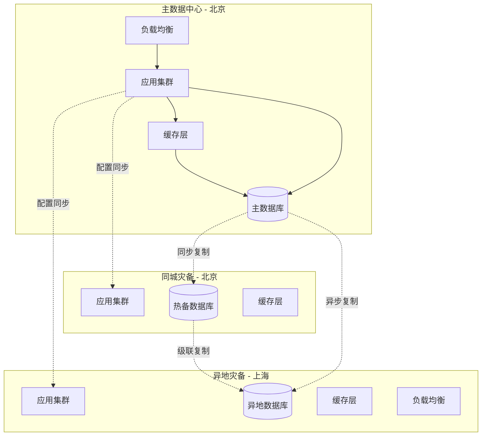
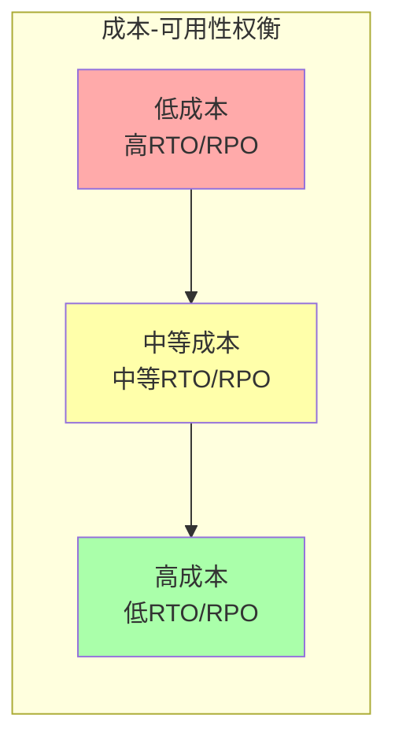

# 灾难恢复 专题文档

**文档版本**：v1.0
**创建时间**：2026年4月
**最后更新**：2026年4月
**状态**：✅ 已完成

---

## 📋 执行摘要

灾难恢复是分布式系统应对大规模故障（如自然灾害、数据中心故障）的关键能力，通过合理的RPO/RTO指标定义、备份策略选择和异地多活架构设计，确保业务连续性和数据安全。

---

## 一、核心概念

### 1.1 定义与原理

**灾难恢复**（Disaster Recovery, DR）是指在发生灾难性事件后，将IT系统恢复到可接受运行状态的过程。核心指标：

- **RPO**（Recovery Point Objective）：恢复点目标，允许丢失的最大数据量（时间维度）
- **RTO**（Recovery Time Objective）：恢复时间目标，允许的最大停机时间
- **RLO**（Recovery Level Objective）：恢复级别目标，需要恢复的服务和数据范围

**灾难恢复等级**：

| 等级 | 描述 | RTO | RPO | 成本 |
|------|------|-----|-----|------|
| 1 | 磁带备份，异地存储 | 数天 | 数周 | 低 |
| 2 | 备用硬件，软件安装 | 数小时 | 数天 | 中低 |
| 3 | 数据电子传输 | 数小时 | 数小时 | 中 |
| 4 | 主动-被动集群 | 分钟级 | 分钟级 | 中高 |
| 5 | 双活数据中心 | 接近0 | 接近0 | 高 |

### 1.2 关键特性

- **地理分散**：跨地域部署降低单点风险
- **数据一致性**：多数据中心间数据同步
- **自动切换**：故障时自动流量切换
- **可测试性**：定期演练验证恢复能力
- **成本优化**：平衡可用性与成本

### 1.3 适用场景

| 场景 | 适用性 | 说明 |
|------|--------|------|
| 金融交易系统 | ⭐⭐⭐⭐⭐ | 要求RPO≈0, RTO<分钟级 |
| 电商平台 | ⭐⭐⭐⭐⭐ | 高峰期可用性要求极高 |
| 医疗健康系统 | ⭐⭐⭐⭐⭐ | 法规要求数据持久性 |
| 内容分发网络 | ⭐⭐⭐⭐ | 地理分布是天然优势 |
| 企业ERP系统 | ⭐⭐⭐⭐ | 核心业务连续性要求 |
| 开发测试环境 | ⭐⭐ | 可接受较长恢复时间 |

---

## 二、技术细节

### 2.1 架构设计



### 2.2 RPO/RTO定义

#### 指标计算

**RPO计算**：

```
RPO = 上次备份时间 - 故障发生时间
    = 数据复制延迟 + 复制缓冲区大小 / 写入速率
```

**RTO计算**：

```
RTO = 故障检测时间 + 决策时间 + 切换时间 + 预热时间 + 验证时间
```

#### 目标矩阵

| 业务等级 | RPO要求 | RTO要求 | 典型实现 |
|----------|---------|---------|----------|
| 核心交易 | <1分钟 | <5分钟 | 同步双活 |
| 重要业务 | <1小时 | <30分钟 | 异步复制+自动切换 |
| 一般业务 | <24小时 | <4小时 | 定时备份+手动切换 |
| 归档数据 | <1周 | <1天 | 冷备份 |

#### 成本权衡



**99.9%可用性成本 ≈ 3× 99%可用性成本**

**99.99%可用性成本 ≈ 10× 99.9%可用性成本**

### 2.3 备份策略

#### 全量备份（Full Backup）

```
特点：
- 备份所有数据
- 恢复最简单（只需一个备份集）
- 备份时间长、存储空间大

适用：
- 小型数据库
- 周期间隔较长的备份（如每周）
```

#### 增量备份（Incremental Backup）

```
特点：
- 只备份自上次备份（任意类型）后变化的数据
- 备份时间短、存储空间小
- 恢复需要依赖链（全备+所有增量）

计算：
备份数据量 = 变化数据量
恢复时间 = 全备恢复 + Σ(增量恢复)
```

#### 差异备份（Differential Backup）

```
特点：
- 备份自上次全量备份后变化的数据
- 备份时间随时间增加
- 恢复只需全备+最新差异

计算：
备份数据量 = 自全备以来的变化量
恢复时间 = 全备恢复 + 差异恢复
```

#### 备份策略对比

| 策略 | 备份时间 | 恢复时间 | 存储空间 | 复杂度 |
|------|----------|----------|----------|--------|
| 全量 | 长 | 短 | 大 | 低 |
| 增量 | 短 | 长 | 小 | 高 |
| 差异 | 中 | 中 | 中 | 中 |

**推荐组合策略**：

```
周日：全量备份
周一~周六：差异备份或增量备份
实时监控：连续日志备份
```

#### 实现示例

```python
class BackupManager:
    def __init__(self, config: BackupConfig):
        self.config = config
        self.backup_history = []

    def perform_full_backup(self, target: str) -> BackupResult:
        """执行全量备份"""
        start_time = time.time()

        # 创建一致性快照
        snapshot = self.create_snapshot(target)

        # 压缩并传输到备份存储
        backup_id = self.compress_and_transfer(
            snapshot,
            destination=self.config.backup_storage,
            compression=self.config.compression_level
        )

        result = BackupResult(
            id=backup_id,
            type='FULL',
            size=self.get_backup_size(backup_id),
            duration=time.time() - start_time,
            timestamp=start_time
        )

        self.backup_history.append(result)
        return result

    def perform_incremental_backup(self, target: str, base_backup: str) -> BackupResult:
        """执行增量备份"""
        # 获取自base_backup以来的变化块
        changed_blocks = self.get_changed_blocks(target, base_backup)

        backup_id = self.transfer_blocks(
            changed_blocks,
            destination=self.config.backup_storage
        )

        return BackupResult(
            id=backup_id,
            type='INCREMENTAL',
            base=base_backup,
            size=sum(b.size for b in changed_blocks)
        )

    def restore(self, target: str, point_in_time: datetime) -> RestoreResult:
        """恢复到指定时间点"""
        # 1. 找到最近的全量备份
        full_backup = self.find_latest_full_backup(before=point_in_time)

        # 2. 恢复全量备份
        self.restore_full(full_backup, target)

        # 3. 应用增量/差异备份
        for backup in self.find_incrementals(full_backup, point_in_time):
            self.apply_incremental(backup, target)

        # 4. 应用日志到指定时间点
        self.apply_logs(target, full_backup.timestamp, point_in_time)

        return RestoreResult(
            target=target,
            point_in_time=point_in_time,
            actual_rpo=datetime.now() - point_in_time
        )
```

### 2.4 异地多活

#### 多活架构模式

**主备模式**（Active-Standby）：

```
主中心：处理所有读写
备中心：只同步数据，不服务
切换：故障时备中心提升为主

RPO：取决于复制延迟（同步=0，异步>0）
RTO：分钟级（需要启动服务）
```

**热备模式**（Active-Hot Standby）：

```
主中心：处理所有读写
备中心：数据热备，服务就绪但不接受流量
切换：快速切换（预启动）

RPO：低（通常<秒级）
RTO：秒级（预配置）
```

**双活模式**（Active-Active）：

```
两个中心：同时处理读写
数据同步：双向复制+冲突解决
切换：自动（无需切换，负载均衡调整）

RPO：0（同步复制）
RTO：0（持续服务）
```

#### 数据同步策略

**同步复制**：

```python
class SynchronousReplication:
    def write(self, key: str, value: bytes) -> WriteResult:
        # 1. 本地写入
        local_result = self.local_store.write(key, value)

        # 2. 同步到所有副本
        acks = 1  # 本地已确认
        for replica in self.remote_replicas:
            try:
                replica.sync_write(key, value)
                acks += 1
            except ReplicationTimeout:
                # 同步失败，根据策略处理
                if self.sync_mode == 'SYNC_STRICT':
                    raise WriteException("Sync replication failed")
                else:
                    # SYNC_RELAXED: 标记为异步待同步
                    self.deferred_sync_queue.put((key, value, replica))

        # 3. 等待多数确认（可选）
        if acks < self.quorum_size:
            raise QuorumNotReached()

        return WriteResult(success=True, replicas=acks)
```

**异步复制**：

```python
class AsynchronousReplication:
    def __init__(self):
        self.replication_queue = Queue()
        self.replication_thread = Thread(target=self._replication_worker)
        self.replication_thread.start()

    def write(self, key: str, value: bytes) -> WriteResult:
        # 1. 本地写入立即返回
        local_result = self.local_store.write(key, value)

        # 2. 异步复制
        self.replication_queue.put(ReplicationTask(key, value))

        return WriteResult(success=True, async_pending=True)

    def _replication_worker(self):
        while True:
            task = self.replication_queue.get()
            for replica in self.remote_replicas:
                try:
                    replica.write(task.key, task.value)
                except Exception as e:
                    # 重试或记录
                    self.handle_replication_failure(task, replica, e)
```

**半同步复制**（MySQL Semi-Sync）：

```
至少一个从库确认收到数据后，主库才返回成功
平衡了同步（延迟）和异步（丢数据）的缺点
```

#### 冲突解决

**双活写入冲突场景**：

```
时间线：
T1: 北京 DC1 写入 x=1
T2: 上海 DC2 写入 x=2
T3: 复制同步，发现冲突
```

**解决策略**：

| 策略 | 描述 | 适用场景 |
|------|------|----------|
| 最后写入获胜 | 时间戳最大的保留 | 幂等操作 |
| 向量时钟 | 检测并发冲突 | 需要人工介入 |
| CRDT | 自动合并冲突 | 支持的数据类型 |
| 业务规则 | 自定义合并逻辑 | 特定业务场景 |

```python
class ConflictResolver:
    def resolve(self, local_version: Version, remote_version: Version) -> Resolution:
        # 向量时钟比较
        comparison = local_version.vector_clock.compare(remote_version.vector_clock)

        if comparison == BEFORE:
            # 本地版本旧，接受远程
            return Resolution(keep=remote_version, discard=local_version)
        elif comparison == AFTER:
            # 本地版本新，保留本地
            return Resolution(keep=local_version, discard=remote_version)
        elif comparison == CONCURRENT:
            # 并发冲突，使用业务规则合并
            return self.merge_versions(local_version, remote_version)
        else:
            # 相等，无冲突
            return Resolution(keep=local_version, discard=None)

    def merge_versions(self, v1: Version, v2: Version) -> Resolution:
        """业务逻辑合并"""
        merged_value = self.business_merge(v1.data, v2.data)
        merged_version = Version(
            data=merged_value,
            vector_clock=v1.vector_clock.merge(v2.vector_clock)
        )
        return Resolution(keep=merged_version, discard=[v1, v2], merged=True)
```

### 2.5 数据同步

#### 复制拓扑

**链式复制**：

```
Master -> Slave1 -> Slave2 -> Slave3
优点：减少Master负载
缺点：级联延迟
```

**星形复制**：

```
      Master
    /   |   \
  S1    S2   S3
优点：并行复制，延迟低
缺点：Master网络压力大
```

**环形复制**：

```
A -> B -> C -> A（双活场景）
优点：高可用
缺点：冲突检测复杂
```

#### 复制延迟监控

```python
class ReplicationLagMonitor:
    def __init__(self, primary: Database, replicas: List[Database]):
        self.primary = primary
        self.replicas = replicas
        self.lag_threshold_ms = 1000

    def check_lag(self) -> Dict[str, int]:
        """检查各副本延迟"""
        # 获取主库当前位置
        primary_pos = self.primary.get_current_position()

        lags = {}
        for replica in self.replicas:
            # 获取副本当前位置
            replica_pos = replica.get_replication_position()

            # 计算延迟（基于时间戳或位置差异）
            lag_ms = self.calculate_lag(primary_pos, replica_pos)
            lags[replica.id] = lag_ms

            # 告警
            if lag_ms > self.lag_threshold_ms:
                self.alert_high_lag(replica, lag_ms)

        return lags

    def calculate_lag(self, primary_pos: Position, replica_pos: Position) -> int:
        # 基于GTID或binlog位置计算
        if primary_pos.gtid_set and replica_pos.gtid_set:
            return self.calculate_gtid_lag(primary_pos.gtid_set, replica_pos.gtid_set)
        else:
            return self.calculate_binlog_lag(primary_pos, replica_pos)
```

---

## 三、系统对比

### 3.1 主流云厂商DR方案对比

| 维度 | AWS | Azure | GCP | 阿里云 |
|------|-----|-------|-----|--------|
| 跨区域复制 | RDS Cross-Region | Geo-Replication | Cross-Region Replica | DTS |
| RPO | 秒级（同步）~分钟级 | 秒级~小时级 | 秒级~分钟级 | 秒级~分钟级 |
| RTO | 分钟级 | 分钟级 | 分钟级 | 分钟级 |
| 自动切换 | Aurora Global | Failover Groups | 需配置 | 高可用版 |
| 成本模式 | 存储+流量 | 存储+流量 | 存储+流量 | 存储+流量 |

### 3.2 数据库DR方案对比

| 数据库 | 方案 | RPO | RTO | 特点 |
|--------|------|-----|-----|------|
| MySQL | MGR + 异步从库 | 0~秒级 | 秒级 | 自动选主 |
| PostgreSQL | Patroni + 流复制 | 0~秒级 | 秒级 | 需外部协调 |
| MongoDB | Replica Set | 0~秒级 | 秒级 | 自动故障转移 |
| Redis | Sentinel/Cluster | 可能丢数据 | 秒级 | 异步复制 |
| TiDB | 多中心部署 | 0 | 0 | 真正双活 |
| CockroachDB | Multi-Region | 0 | 0 | 全球数据库 |

### 3.3 性能基准

| 方案 | 复制延迟(P99) | 切换时间 | 成本倍数 |
|------|--------------|----------|----------|
| 冷备 | N/A | 小时级 | 1.1x |
| 温备 | 秒级~分钟级 | 分钟级 | 1.5x |
| 热备 | <1秒 | 秒级 | 2x |
| 双活 | 0 | 0 | 2.5x~3x |

---

## 四、实践指南

### 4.1 部署配置

**MySQL跨城异地多活配置**：

```ini
# my.cnf - 主库配置
[mysqld]
# 开启GTID
gtid_mode = ON
enforce_gtid_consistency = ON

# 半同步复制
plugin_load = "rpl_semi_sync_master=semisync_master.so;rpl_semi_sync_slave=semisync_slave.so"
rpl_semi_sync_master_enabled = 1
rpl_semi_sync_slave_enabled = 1
rpl_semi_sync_master_timeout = 1000  # 1秒超时降级异步

# binlog配置
log_bin = mysql-bin
binlog_format = ROW
binlog_row_image = FULL
expire_logs_days = 7

# 并行复制
slave_parallel_type = LOGICAL_CLOCK
slave_parallel_workers = 8
```

**Redis跨地域配置**：

```conf
# redis.conf - 主库
# 开启AOF持久化
appendonly yes
appendfsync everysec

# 复制配置
repl-diskless-sync yes
repl-timeout 60
repl-backlog-size 100mb

# 跨地域优化（高延迟网络）
repl-disable-tcp-nodelay yes  # 减少小包传输
client-output-buffer-limit replica 0 0 0  # 无限制复制缓冲区
```

**灾难恢复编排配置**：

```yaml
disaster_recovery:
  # 站点配置
  sites:
    primary:
      name: "北京"
      region: "cn-north-1"
      priority: 1
    standby:
      name: "上海"
      region: "cn-east-1"
      priority: 2
    dr:
      name: "深圳"
      region: "cn-south-1"
      priority: 3

  # RPO/RTO目标
  objectives:
    rpo_minutes: 5
    rto_minutes: 15

  # 复制配置
  replication:
    primary_to_standby:
      mode: "semi_sync"  # semi_sync / async
      lag_threshold_sec: 5
    standby_to_dr:
      mode: "async"
      compression: true

  # 故障切换
  failover:
    auto_failover: true
    confirmation_timeout_sec: 30
    health_check_interval_sec: 5
    required_healthy_checks: 3

  # 备份策略
  backup:
    full_backup_schedule: "0 2 * * 0"  # 每周日2点
    incremental_schedule: "0 */6 * * *"  # 每6小时
    retention_days: 30
    cross_region_copy: true
```

### 4.2 最佳实践

1. **3-2-1备份原则**
   - 3份数据副本
   - 2种不同存储介质
   - 1份异地备份

2. **定期DR演练**
   - 每季度执行一次全量切换演练
   - 验证RPO/RTO目标达成
   - 更新恢复手册和流程

3. **监控与告警**
   - 实时监控复制延迟
   - 监控备份任务成功率
   - 监控存储空间使用率

4. **网络优化**
   - 跨地域使用专线或VPN
   - 启用压缩减少带宽消耗
   - 合理设置TCP参数优化高延迟网络

5. **文档与自动化**
   - 编写详细的恢复操作手册
   - 自动化恢复流程（基础设施即代码）
   - 定期更新联系人和升级路径

### 4.3 常见问题

**Q1: 复制延迟过大导致RPO超标怎么办？**
A:

- 升级为同步复制（影响性能）
- 优化网络带宽和延迟
- 增加复制线程并行度
- 考虑分片减少单库写入压力

**Q2: 切换后数据不一致如何处理？**
A:

- 切换前确保复制延迟为0
- 使用GTID确保无丢失事务
- 切换后验证数据一致性
- 必要时从备份恢复

**Q3: 如何降低双活架构的成本？**
A:

- 按业务分级，核心系统双活，一般系统主备
- 使用云厂商按需付费
- 备用中心承载只读流量
- 使用容器化提高资源利用率

**Q4: 如何应对跨区域网络故障？**
A:

- 配置网络自动切换（BGP Anycast）
- 备用网络链路（多运营商）
- 降级为单区域运行模式
- 网络恢复后自动重新同步

---

## 五、形式化分析

### 5.1 理论模型

**灾难恢复正确性模型**：

```tla
MODULE DisasterRecovery

CONSTANTS PrimaryDC, BackupDCs, MaxRPO, MaxRTO

VARIABLES data_state, replication_lag, active_dc, recovery_in_progress

TypeInvariant ==
  /\ data_state \in [DCs -> DataStates]
  /\ replication_lag \in [BackupDCs -> Nat]
  /\ active_dc \in DCs
  /\ recovery_in_progress \in BOOLEAN

\* RPO保证：复制延迟不超过MaxRPO
RPOInvariant ==
  \A dc \in BackupDCs : replication_lag[dc] <= MaxRPO

\* RTO保证：故障转移在MaxRTO内完成
RTOProperty ==
  []((active_dc' # active_dc) =>
     <>(~recovery_in_progress /\ active_dc \in BackupDCs))

\* 数据一致性：切换后数据与主库一致
DataConsistency ==
  \A dc \in BackupDCs :
    (active_dc = dc) => (data_state[dc] = data_state[PrimaryDC])

\* 灾难恢复规范
DRSpec ==
  /\ TypeInvariant
  /\ RPOInvariant
  /\ []RTOProperty
  /\ DataConsistency
```

### 5.2 成本模型

**TCO（总拥有成本）估算**：

```
年度DR成本 =
  基础设施成本 × 冗余系数 +
  网络带宽成本 × 复制流量 +
  运维人力成本 +
  演练测试成本

冗余系数参考：
- 冷备：1.1x
- 温备：1.5x
- 热备：2.0x
- 双活：2.5x
```

### 5.3 可用性计算

**串联可用性**：

```
A_total = A1 × A2 × ... × An

例：3个99.9%可用性组件串联
A_total = 0.999³ ≈ 0.997 = 99.7%
```

**并联可用性**：

```
A_total = 1 - (1 - A1) × (1 - A2)

例：2个数据中心并联，各99%
A_total = 1 - (1-0.99)² = 1 - 0.0001 = 99.99%
```

---

## 六、与其他主题的关联

### 6.1 上游依赖

- [故障检测器](./故障检测器.md)
- [故障恢复机制](./故障恢复机制.md)
- [备份存储](../08-storage/分布式存储.md)

### 6.2 下游应用

- [云原生架构](../07-deployment/云原生架构.md)
- [混沌工程](./混沌工程.md)
- [容量规划](../07-deployment/容量规划.md)

### 6.3 相关概念

| 概念 | 关系 | 说明 |
|------|------|------|
| 业务连续性 | 目标 | DR是BC的技术实现 |
| 高可用架构 | 手段 | 同城高可用是DR的基础 |
| 数据归档 | 补充 | 长期数据保留策略 |
| 合规审计 | 驱动 | 法规要求驱动DR建设 |

---

## 七、参考资源

### 7.1 学术论文

1. [Disaster Recovery as a Cloud Service: Economic Benefits and Deployment Challenges](https://doi.org/10.1109/TC.2012.160) - Toosi et al., 2014
2. [A Review and Taxonomy of Cloud Disaster Recovery](https://doi.org/10.1016/j.future.2018.03.034) - Zaw and Huyen, 2018
3. [Geo-replicated Storage with Asynchronous Replication](https://doi.org/10.1145/3183713.3196930) - Various
4. [CockroachDB: The Resilient Geo-Distributed SQL Database](https://doi.org/10.1145/3318464.3386134) - Cockroach Labs, 2020

### 7.2 开源项目

1. [Patroni](https://github.com/zalando/patroni) - PostgreSQL HA模板
2. [orchestrator](https://github.com/openark/orchestrator) - MySQL复制拓扑管理
3. [Vitess](https://vitess.io/) - MySQL水平扩展和DR
4. [CockroachDB](https://github.com/cockroachdb/cockroach) - 全球分布式SQL数据库

### 7.3 学习资料

1. [AWS Disaster Recovery Whitepaper](https://docs.aws.amazon.com/whitepapers/latest/disaster-recovery-workloads-on-aws/disaster-recovery-workloads-on-aws.html)
2. [Google Cloud DR Solutions](https://cloud.google.com/architecture/dr-scenarios-planning-guide)
3. [Azure Business Continuity](https://docs.microsoft.com/azure/cloud-adoption-framework/ready/landing-zone/design-area/management-business-continuity-disaster-recovery)

### 7.4 相关文档

- [故障检测器](./故障检测器.md)
- [故障恢复机制](./故障恢复机制.md)
- [自稳定算法](./自稳定算法.md)

---

**维护者**：项目团队
**最后更新**：2026年4月
