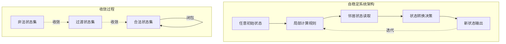
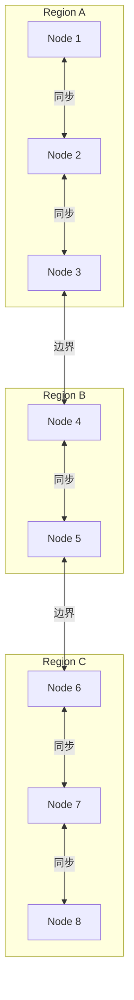
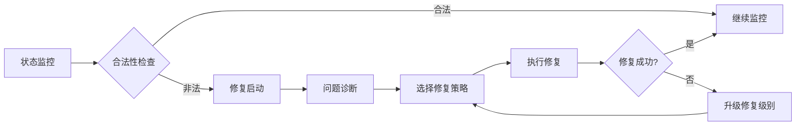

# 自稳定算法 专题文档

**文档版本**：v1.0
**创建时间**：2026年4月
**最后更新**：2026年4月
**状态**：✅ 已完成

---

## 📋 执行摘要

自稳定算法是分布式系统在面对任意初始状态和临时故障时，无需外部干预即可自动恢复到正确状态的能力，代表了容错技术的最高形态，为构建真正自治的分布式系统提供了理论基础。

---

## 一、核心概念

### 1.1 定义与原理

**自稳定**（Self-Stabilization）由Dijkstra于1974年提出，定义为：

> 无论系统从何种初始状态开始，也无论经历何种故障，系统都能在有限时间内自动收敛到正确状态，并保持正确状态。

**核心原理**：
- **收敛性**（Convergence）：从任意状态最终到达合法状态
- **闭包性**（Closure）：一旦进入合法状态，保持合法状态
- **无启动假设**：不需要初始化或启动过程

**故障模型**：
- **硬故障**：处理器崩溃、网络分区（需重启恢复）
- **软故障**：瞬态错误、内存损坏（自稳定可恢复）
- **拜占庭故障**：恶意行为（超出自稳定范围）

### 1.2 关键特性

- **任意初始状态**：系统可从任何状态启动
- **故障透明性**：对临时故障自动恢复
- **无需全局初始化**：局部规则保证全局正确
- **收敛保证**：有限时间内收敛到合法配置
- **容错复合性**：自稳定组件组合仍保持自稳定

### 1.3 适用场景

| 场景 | 适用性 | 说明 |
|------|--------|------|
| 网络路由协议 | ⭐⭐⭐⭐⭐ | 路由表自稳定更新（如BGP） |
| 分布式互斥 | ⭐⭐⭐⭐⭐ | 令牌环自稳定算法 |
| 领导者选举 | ⭐⭐⭐⭐ | 动态环境下的Leader选举 |
| 生成树构建 | ⭐⭐⭐⭐ | 自稳定最小生成树 |
| 节点着色 | ⭐⭐⭐ | 冲突解决与资源分配 |
| 传感器网络 | ⭐⭐⭐⭐ | 能量受限环境的自愈 |

---

## 二、技术细节

### 2.1 架构设计



### 2.2 自稳定概念详解

#### 形式化定义

**系统模型**：
- 系统由n个进程组成，每个进程有局部状态
- 进程通过通信链路交换信息
- 系统配置（Configuration）是所有进程状态的元组

**合法配置集合**（Legal Configurations）：
```
L ⊆ C，其中C是所有可能配置的集合
```

**自稳定性质**：
```
∀c ∈ C: c →* L  （从任意配置可达合法配置）
∀l ∈ L: l →* L  （合法配置保持合法性）
```

#### 收敛时间分析

**移动函数**（Move）：进程根据局部规则改变状态的一次操作。

**轮次**（Round）：每个进程至少有一次机会执行移动的最大时间间隔。

**收敛上界**：
- 同步模型：通常与网络直径D相关，O(D)或O(D²)
- 异步模型：通常与进程数n相关，O(n)或O(n²)

### 2.3 快照与恢复

#### 分布式快照

**Chandy-Lamport快照算法**的自稳定扩展：

```python
class SelfStabilizingSnapshot:
    def __init__(self, node_id: str, neighbors: List[str]):
        self.node_id = node_id
        self.neighbors = neighbors
        self.local_state = {}
        self.channel_states = {n: [] for n in neighbors}
        self.snapshot_marker_received = {n: False for n in neighbors}
        self.local_snapshot = None
    
    def initiate_snapshot(self):
        """发起快照（自稳定版本）"""
        # 记录本地状态
        self.local_snapshot = self.local_state.copy()
        
        # 向所有邻居发送标记
        for neighbor in self.neighbors:
            self.send_message(neighbor, {
                'type': 'SNAPSHOT_MARKER',
                'initiator': self.node_id,
                'timestamp': time.time()
            })
    
    def on_receive_message(self, from_node: str, message: dict):
        """接收消息处理"""
        if message['type'] == 'SNAPSHOT_MARKER':
            if not any(self.snapshot_marker_received.values()):
                # 首次收到标记，开始本地快照
                self.local_snapshot = self.local_state.copy()
                self.snapshot_marker_received[from_node] = True
                
                # 转发标记到其他邻居
                for neighbor in self.neighbors:
                    if neighbor != from_node:
                        self.send_message(neighbor, message)
            else:
                self.snapshot_marker_received[from_node] = True
        else:
            # 普通消息，若快照进行中则记录到通道状态
            if self.local_snapshot is not None:
                if not self.snapshot_marker_received[from_node]:
                    self.channel_states[from_node].append(message)
            
            # 处理消息内容
            self.process_message(message)
    
    def is_snapshot_complete(self) -> bool:
        """检查快照是否完成（自稳定检测）"""
        return all(self.snapshot_marker_received.values())
    
    def reset_if_needed(self):
        """自稳定清理：检测到不一致时重置"""
        if self.detect_inconsistency():
            # 重置快照状态，允许重新发起
            self.local_snapshot = None
            self.channel_states = {n: [] for n in self.neighbors}
            self.snapshot_marker_received = {n: False for n in self.neighbors}
```

#### 恢复协议

**分层恢复策略**：

```
Level 0: 数据一致性检查
  ├── 校验和验证
  ├── 版本号比较
  └── 状态机一致性检查

Level 1: 本地状态修复
  ├── 从持久存储恢复
  ├── 邻居状态同步
  └── 默认状态回退

Level 2: 全局协议重启
  ├── 协议状态重置
  ├── 协调者重新选举
  └── 全局快照恢复

Level 3: 系统完全重启
  └── 最后手段
```

### 2.4 故障隔离

#### 区域隔离

**自稳定区域划分**：



**边界协议**：
- 区域边界使用特殊协议处理跨区通信
- 故障限制在区域内传播
- 区域间通过标准化接口交互

```python
class RegionalSelfStabilization:
    def __init__(self, region_id: str, nodes: List[str], boundary_nodes: List[str]):
        self.region_id = region_id
        self.nodes = nodes
        self.boundary_nodes = boundary_nodes
        self.regional_state = {}
        self.boundary_protocol = BoundaryProtocol()
    
    def handle_internal_fault(self, node: str):
        """处理区域内故障"""
        # 隔离故障节点
        self.isolate_node(node)
        
        # 区域内自稳定恢复
        self.regional_stabilize()
        
        # 通知边界节点更新路由
        for bn in self.boundary_nodes:
            self.notify_boundary_change(bn)
    
    def handle_cross_region_message(self, message: dict, from_region: str):
        """处理跨区域消息"""
        # 边界协议验证
        if not self.boundary_protocol.validate(message):
            # 可能来自故障区域，启动隔离
            self.trigger_region_suspicion(from_region)
            return
        
        # 正常处理
        self.process_message(message)
```

#### 拜占庭边界

自稳定算法通常假设非拜占庭故障，但可以与拜占庭容错结合：

```
自稳定 + 拜占庭容错 = 自稳定拜占庭容错

关键思想：
1. 使用拜占庭容错共识确定合法配置
2. 自稳定算法确保从任意状态收敛
3. 组合后可容忍f < n/3拜占庭故障
```

### 2.5 自动修复

#### 修复触发机制



#### 修复策略库

```python
class SelfRepairManager:
    def __init__(self):
        self.repair_strategies = {
            'data_corruption': DataRepairStrategy(),
            'partition_desync': SyncRepairStrategy(),
            'leader_failure': LeaderElectionStrategy(),
            'network_partition': PartitionHealStrategy(),
            'configuration_drift': ConfigResetStrategy(),
        }
        self.repair_history = []
    
    def diagnose(self, current_state: dict) -> str:
        """诊断问题类型"""
        if self.check_data_checksums(current_state) == False:
            return 'data_corruption'
        elif self.check_partition_sync(current_state) == False:
            return 'partition_desync'
        elif self.check_leader_health(current_state) == False:
            return 'leader_failure'
        # ... 更多诊断规则
        return 'unknown'
    
    def repair(self, issue_type: str, context: dict) -> bool:
        """执行自动修复"""
        strategy = self.repair_strategies.get(issue_type)
        if not strategy:
            logging.error(f"Unknown issue type: {issue_type}")
            return False
        
        try:
            result = strategy.execute(context)
            self.repair_history.append({
                'type': issue_type,
                'timestamp': time.time(),
                'success': result
            })
            return result
        except Exception as e:
            logging.error(f"Repair failed: {e}")
            return False
    
    def verify_repair(self, validator: Callable) -> bool:
        """验证修复结果"""
        return validator()

class DataRepairStrategy:
    def execute(self, context: dict) -> bool:
        """数据修复策略"""
        corrupt_nodes = context.get('corrupt_nodes', [])
        
        for node in corrupt_nodes:
            # 1. 从副本恢复
            if self.repair_from_replica(node):
                continue
            
            # 2. 从日志重放
            if self.repair_from_log(node):
                continue
            
            # 3. 从备份恢复
            if self.repair_from_backup(node):
                continue
            
            # 4. 标记为不可恢复，触发数据迁移
            self.mark_unrecoverable(node)
        
        return True
```

#### 收敛加速技术

**指导收敛**（Guided Convergence）：

```python
class GuidedConvergence:
    """通过提示加速自稳定收敛"""
    
    def __init__(self, hint_provider: Callable):
        self.hint_provider = hint_provider
        self.convergence_hints = {}
    
    def compute_hints(self, current_config: dict) -> dict:
        """计算收敛提示"""
        # 分析当前配置与合法配置的差距
        distance = self.compute_distance_to_legal(current_config)
        
        hints = {}
        for node, state in current_config.items():
            # 为每个节点计算最优移动方向
            optimal_state = self.find_optimal_state(node, current_config)
            if optimal_state != state:
                hints[node] = optimal_state
        
        return hints
    
    def apply_hints(self, hints: dict, priority: bool = False):
        """应用收敛提示"""
        for node, target_state in hints.items():
            if priority:
                # 高优先级：立即执行
                self.force_state_change(node, target_state)
            else:
                # 低优先级：建议执行（可被局部规则覆盖）
                self.suggest_state_change(node, target_state)
```

---

## 三、算法实例

### 3.1 Dijkstra自稳定互斥

**问题**：n个进程排成环，共享一个令牌，只有持有令牌的进程能进入临界区。

**Dijkstra算法**（原始自稳定算法）：

```python
class DijkstraTokenRing:
    def __init__(self, n: int, node_id: int):
        self.n = n
        self.id = node_id
        self.state = random.randint(0, n-1)  # 任意初始状态
        self.has_token = False
    
    def read_neighbor(self, direction: str) -> int:
        """读取邻居状态"""
        # 在实际系统中通过消息传递实现
        pass
    
    def compute_privilege(self) -> bool:
        """计算是否拥有特权（令牌）"""
        left = self.read_neighbor('left')
        
        # 特权条件（节点0与其他节点不同）
        if self.id == 0:
            return self.state != left
        else:
            return self.state == left
    
    def move(self):
        """执行状态移动"""
        if not self.compute_privilege():
            return
        
        # 节点0的转移函数
        if self.id == 0:
            self.state = self.read_neighbor('left')
        else:
            # 其他节点转移到(state + 1) mod n
            self.state = (self.state + 1) % self.n
        
        # 标记有令牌
        self.has_token = True
        # 执行临界区操作...
        self.has_token = False
```

**收敛分析**：
- 最坏情况收敛时间：O(n²) 轮
- 合法配置数：n（恰好一个进程有特权）

### 3.2 自稳定生成树

**问题**：构建以某节点为根的最小深度生成树。

```python
class SelfStabilizingSpanningTree:
    def __init__(self, node_id: str, is_root: bool, neighbors: List[str]):
        self.id = node_id
        self.is_root = is_root
        self.neighbors = neighbors
        
        # 任意初始状态
        self.parent = random.choice(neighbors + [None])
        self.level = random.randint(0, 100)
    
    def get_neighbor_state(self, neighbor: str) -> dict:
        """获取邻居状态"""
        pass
    
    def local_predicate(self) -> bool:
        """检查局部谓词（合法性条件）"""
        if self.is_root:
            return self.parent is None and self.level == 0
        
        # 非根节点必须有父节点且level = parent.level + 1
        if self.parent is None:
            return False
        
        parent_state = self.get_neighbor_state(self.parent)
        return self.level == parent_state['level'] + 1
    
    def move(self):
        """执行状态移动"""
        if self.local_predicate():
            return  # 已合法，不移动
        
        if self.is_root:
            self.parent = None
            self.level = 0
            return
        
        # 选择最小level的邻居作为父节点
        best_parent = None
        best_level = float('inf')
        
        for neighbor in self.neighbors:
            state = self.get_neighbor_state(neighbor)
            if state['level'] < best_level:
                best_level = state['level']
                best_parent = neighbor
        
        if best_parent is not None:
            self.parent = best_parent
            self.level = best_level + 1
```

### 3.3 主流自稳定算法对比

| 算法 | 问题 | 收敛时间 | 空间复杂度 | 消息复杂度 |
|------|------|----------|-----------|-----------|
| Dijkstra互斥 | 令牌环 | O(n²) | O(1) | O(1) |
| Dolev算法 | 领导者选举 | O(D) | O(log n) | O(n) |
| Afek-Kutten算法 | 生成树 | O(n²) | O(log n) | O(m) |
| Ghosh算法 | 顶点着色 | O(n) | O(1) | O(Δ) |

### 3.2 选型决策树

```
问题类型
├── 互斥访问？
│   ├── 是 → Dijkstra算法（环）/ Raymond算法（树）
│   └── 否 → 继续评估
│
├── 需要Leader？
│   ├── 是 → Dolev算法 / Afek-Bremler算法
│   └── 否 → 继续评估
│
├── 需要特定拓扑？
│   ├── 是 → 自稳定生成树/匹配算法
│   └── 否 → 继续评估
│
└── 资源分配？
    ├── 是 → Ghosh着色算法 / 最大独立集算法
    └── 否 → 通用自稳定框架
```

---

## 四、实践指南

### 4.1 部署配置

**自稳定模块配置示例**：

```yaml
self_stabilization:
  enabled: true
  
  # 收敛监控
  convergence_monitor:
    check_interval_ms: 1000
    max_convergence_time_sec: 60
    alert_on_slow_convergence: true
  
  # 故障检测
  fault_detection:
    local_check_interval_ms: 500
    neighbor_probe_interval_ms: 2000
    suspicion_threshold: 3
  
  # 自动修复
  auto_repair:
    enabled: true
    max_repair_attempts: 3
    escalation_delay_sec: 10
    repair_strategies:
      - data_corruption
      - sync_failure
      - leader_election
  
  # 区域配置
  regions:
    enabled: true
    region_id: "region-1"
    boundary_nodes:
      - "node-1"
      - "node-2"
    max_region_size: 50
```

**状态验证器配置**：

```python
VALIDATION_RULES = {
    "leader_election": {
        "exactly_one_leader": True,
        "leader_connectivity_check": True,
    },
    "spanning_tree": {
        "no_cycles": True,
        "all_nodes_reachable": True,
        "depth_optimality_tolerance": 1.5,  # 允许1.5倍最优深度
    },
    "mutual_exclusion": {
        "at_most_one_token": True,
        "token_circulation_check": True,
    }
}
```

### 4.2 最佳实践

1. **收敛监控**
   - 实时监控收敛进度
   - 设置收敛超时告警
   - 记录收敛历史用于分析

2. **状态验证**
   - 实现高效的局部谓词检查
   - 定期进行全局一致性检查
   - 使用校验和验证数据完整性

3. **故障注入测试**
   - 随机注入状态损坏
   - 模拟网络分区恢复
   - 验证收敛时间和正确性

4. **渐进式部署**
   - 先在非关键模块试用
   - 逐步扩展到核心组件
   - 保留传统恢复作为后备

### 4.3 常见问题

**Q1: 自稳定算法收敛太慢怎么办？**
A:
- 使用指导收敛技术提供提示
- 优化局部规则减少收敛路径
- 增加并行移动机会
- 考虑使用随机化加速

**Q2: 如何验证自稳定算法的正确性？**
A:
- 形式化验证（TLA+、Coq）
- 穷举状态空间测试（小规模）
- 随机故障注入测试
- 长时间压力测试

**Q3: 自稳定算法与拜占庭容错能结合吗？**
A:
- 标准自稳定假设非拜占庭故障
- 有研究提出自稳定拜占庭容错算法
- 通常需要增加冗余（3f+1）
- 复杂度显著增加

**Q4: 自稳定算法的实际应用有哪些？**
A:
- 网络路由协议（BGP收敛）
- 传感器网络自愈
- 分布式互斥系统
- 动态领导者选举

---

## 五、形式化分析

### 5.1 理论模型

**自稳定系统形式化（TLA+）**：

```tla
MODULE SelfStabilization

CONSTANTS Processes, States, LegalStates

VARIABLES current_state

TypeInvariant ==
  current_state \in [Processes -> States]

\* 合法配置定义
IsLegal(cfg) == cfg \in LegalStates

\* 收敛性：最终总是到达合法状态
Convergence ==
  <>[]IsLegal(current_state)

\* 闭包性：合法状态保持合法
Closure ==
  [](IsLegal(current_state) => []IsLegal(current_state))

\* 自稳定定义
SelfStabilization ==
  Convergence /\ Closure

\* 移动规则
CanMove(p) ==
  \* 局部谓词决定是否可移动
  LocalPredicate(p, current_state)

Move(p) ==
  /\ CanMove(p)
  /\ current_state' = [current_state EXCEPT ![p] = NewState(p)]

Next ==
  \E p \in Processes : Move(p)

Spec ==
  /\ TypeInvariant
  /\ SelfStabilization
  /\ [][Next]_current_state
```

### 5.2 正确性证明

**定理**：Dijkstra令牌环算法是自稳定的。

**证明概要**：

1. **定义合法配置**：恰好一个进程有特权（令牌）

2. **证明闭包性**：
   - 假设当前配置合法，只有一个进程p有令牌
   - p执行移动后，令牌传递给下一个进程
   - 新配置仍然恰好一个进程有令牌
   - 闭包性得证

3. **证明收敛性**：
   - 定义势能函数：Φ = 所有state值之和对n取模
   - 证明每次移动Φ严格递减或保持不变且趋近合法
   - 有限状态空间保证最终收敛
   - 收敛性得证 ∎

### 5.3 复杂度分析

**时间复杂度**：
- 同步模型：O(D)到O(n²)轮
- 异步模型：O(n)到O(n³)轮

**空间复杂度**：
- 每个进程O(1)到O(log n)
- 不依赖系统规模

**消息复杂度**：
- 每轮O(m)条消息，m为边数
- 可优化到O(1)使用本地共享内存模型

---

## 六、与其他主题的关联

### 6.1 上游依赖

- [故障检测器](./故障检测器.md)
- [共识算法](../02-consensus/Paxos算法.md)
- [分布式图算法](../06-algorithms/分布式图算法.md)

### 6.2 下游应用

- [故障恢复机制](./故障恢复机制.md)
- [网络协议](../08-network/路由协议.md)
- [边缘计算](../10-edge/边缘计算.md)

### 6.3 相关概念

| 概念 | 关系 | 说明 |
|------|------|------|
| 容错计算 | 基础 | 自稳定是容错的高级形式 |
| 分布式快照 | 工具 | 用于状态捕获和验证 |
| 形式化验证 | 保障 | 证明自稳定属性 |
| 混沌工程 | 验证 | 测试自稳定能力 |

---

## 七、参考资源

### 7.1 学术论文

1. [Self-stabilizing Systems in Spite of Distributed Control](https://doi.org/10.1145/361179.361202) - Edsger W. Dijkstra, 1974
2. [Self-Stabilization](https://doi.org/10.1109/5.629683) - Shlomi Dolev, 2000
3. [A Survey of Self-Stabilizing Spanning-Tree Construction Algorithms](https://doi.org/10.1561/0400000022) - Felber and Mercier, 2011
4. [Self-Stabilizing Algorithms for Distributed Systems](https://doi.org/10.1145/146850.146851) - Flaviu Cristian, 1991

### 7.2 开源项目

1. [Chrumps/self-stabilizing](https://github.com/topics/self-stabilizing) - 自稳定算法实现集合
2. [NS-3 Network Simulator](https://www.nsnam.org/) - 包含自稳定路由协议实现
3. [OMNeT++](https://omnetpp.org/) - 网络仿真框架，支持自稳定协议

### 7.3 学习资料

1. [Self-Stabilization Book](https://www.cs.bgu.ac.il/~dolev/self-stabilization.html) - Shlomi Dolev
2. [Principles of Self-Stabilization](https://www.cs.cornell.edu/courses/cs6410/2018fa/slides/24-self-stabilization.pdf) - Cornell CS6410
3. [Distributed Algorithms](https://www.morganclaypool.com/doi/abs/10.2200/S00159ED1V01Y200808DCT002) - Wan Fokkink

### 7.4 相关文档

- [故障检测器](./故障检测器.md)
- [故障恢复机制](./故障恢复机制.md)
- [灾难恢复](./灾难恢复.md)

---

**维护者**：项目团队
**最后更新**：2026年4月
