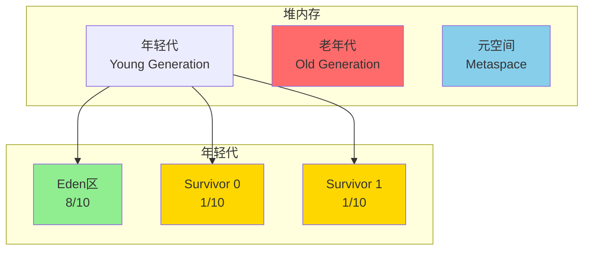

# JVM与GC调优

**文档版本**：v1.0  
**最后更新**：2026年

---

## 概述

JVM调优是Java应用性能优化的核心环节。理解JVM内存模型、选择合适的GC算法、分析GC日志、识别内存泄漏，对于保障应用稳定高效运行至关重要。

## 核心概念

### JVM内存结构



### 垃圾收集器对比

| 收集器 | 年轻代算法 | 老年代算法 | 停顿时间 | 适用场景 | JDK版本 |
|--------|-----------|-----------|---------|---------|---------|
| Serial | 复制 | 标记-整理 | 高 | 客户端/单核 | 所有 |
| Parallel | 复制 | 标记-整理 | 中 | 批处理/高吞吐 | 所有 |
| G1 | 复制 | 标记-整理 | 低(<200ms) | 大堆内存 | 7+ |
| ZGC | 复制 | 并发标记-整理 | 极低(<10ms) | 金融/低延迟 | 11+ |
| Shenandoah | 复制 | 并发标记-整理 | 极低(<10ms) | 金融/低延迟 | 12+ |

## 技术细节

### GC收集器选择决策树

```
JDK版本?
├── JDK 8
│   ├── 堆 < 4GB → Parallel GC
│   ├── 需要低延迟 → CMS (JDK14前)
│   └── 堆 > 4GB → G1
├── JDK 9-10
│   └── G1 (默认)
└── JDK 11+
    ├── 超低延迟(<10ms) → ZGC/Shenandoah
    ├── 大堆(>32GB) → ZGC
    └── 一般场景 → G1
```

### G1收集器配置

```bash
# G1收集器推荐配置
-XX:+UseG1GC
-XX:MaxGCPauseMillis=200
-XX:G1HeapRegionSize=16m
-XX:InitiatingHeapOccupancyPercent=45
-XX:+UseStringDeduplication
```

### ZGC收集器配置

```bash
# ZGC超低延迟配置（JDK11+）
-XX:+UseZGC
-XX:+ZGenerational    # JDK21+ 分代ZGC
-XX:ZCollectionInterval=5
-XX:ZAllocationSpikeTolerance=2
```

### 生产环境JVM参数模板

```bash
# ============================================
# 通用生产环境JVM参数模板（G1推荐）
# ============================================

# ----- 堆内存配置 -----
-Xms4g                          # 初始堆大小
-Xmx4g                          # 最大堆大小（与初始相同避免动态调整）
-XX:MetaspaceSize=256m          # 元空间初始
-XX:MaxMetaspaceSize=512m       # 元空间最大
-Xss512k                        # 线程栈大小

# ----- GC配置 -----
-XX:+UseG1GC                    # 使用G1收集器
-XX:MaxGCPauseMillis=200        # 目标最大停顿200ms
-XX:G1HeapRegionSize=16m        # Region大小
-XX:InitiatingHeapOccupancyPercent=45  # 触发并发标记阈值

# ----- GC日志（JDK9+）-----
-Xlog:gc*:file=/var/log/app/gc.log:time,uptime,level,tags:filecount=10,filesize=100m

# ----- OOM处理 -----
-XX:+HeapDumpOnOutOfMemoryError
-XX:HeapDumpPath=/var/log/app/heapdump.hprof
-XX:OnOutOfMemoryError="kill -9 %p"

# ----- 性能优化 -----
-XX:+UseStringDeduplication     # 字符串去重（G1）
-XX:+AlwaysPreTouch             # 启动时分配所有内存
-XX:+DisableExplicitGC          # 禁止System.gc()

# ----- 容器化配置 -----
-XX:+UseContainerSupport
-XX:InitialRAMPercentage=50.0
-XX:MaxRAMPercentage=75.0
```

### GC日志分析

```
示例日志：
[2026-01-15T10:23:45.123+0800][gc,start] GC(42) Pause Young (Normal)
[2026-01-15T10:23:45.145+0800][gc,heap] GC(42) Eden regions: 120->0(125)
[2026-01-15T10:23:45.145+0800][gc,heap] GC(42) Old regions: 200->205
[2026-01-15T10:23:45.145+0800][gc] GC(42) Pause Young 1024M->452M(4096M) 21.234ms

关键指标：
┌─────────────────┬──────────────────────────────────────────┐
│ 字段            │ 含义                                      │
├─────────────────┼──────────────────────────────────────────┤
│ GC(42)          │ 第42次GC                                 │
│ Eden 120->0     │ Eden区从120个Region清空                   │
│ Old 200->205    │ 老年代增加5个Region（晋升）               │
│ 1024M->452M     │ GC前堆使用1024M，GC后452M                 │
│ 21.234ms        │ STW暂停时间                               │
└─────────────────┴──────────────────────────────────────────┘
```

### 内存泄漏排查

```bash
# 1. 获取内存快照
jmap -dump:format=b,file=heap.hprof <pid>

# 2. 实时GC监控
jstat -gcutil <pid> 1000

# 3. 线程分析
jstack -l <pid> > thread_dump.txt

# 4. 火焰图生成
./async-profiler/profiler.sh -d 60 -f flame.html <pid>
```

## 实践指南

### GC调优参数详解

| 参数 | 默认值 | 说明 | 调优建议 |
|------|--------|------|----------|
| MaxGCPauseMillis | 200 | 目标最大停顿时间 | 根据SLA调整，不要<50ms |
| G1HeapRegionSize | 自动计算 | 每个Region大小 | 1-32MB，2的幂 |
| InitiatingHeapOccupancyPercent | 45 | 触发并发标记的堆占用率 | 降低可减少Full GC |
| G1ReservePercent | 10 | 保留内存百分比 | 防止晋升失败 |

### 常见问题处理

```bash
# 问题1: Full GC频繁
# 原因：老年代空间不足或晋升过快
# 解决：
-XX:G1HeapRegionSize=16m
-XX:InitiatingHeapOccupancyPercent=35
-Xmx适当增大

# 问题2: GC停顿时间过长
# 解决：
-XX:MaxGCPauseMillis=100
-XX:G1MixedGCCountTarget=16

# 问题3: 内存泄漏排查
# 配置：
-XX:+HeapDumpOnOutOfMemoryError
-XX:HeapDumpPath=/var/log/app/
```

### 最佳实践

1. **堆大小设置**
   - Xms = Xmx，避免运行时扩容
   - 堆大小不超过物理内存的70%
   - 容器环境考虑cgroup限制

2. **GC选择**
   - JDK8: 小堆Parallel，大堆G1
   - JDK11+: 默认G1，低延迟选ZGC
   - 避免使用已废弃的CMS

3. **监控告警**
   - GC频率和停顿时间
   - 堆内存使用趋势
   - Full GC次数（应接近0）

### 常见问题

**Q: 如何选择堆大小？**
根据活跃数据量估算，通常活跃数据的2-4倍。通过压测和监控调整。

**Q: G1目标停顿时间设置多少合适？**
根据业务SLA，一般100-300ms。设置过低会导致GC过于频繁，影响吞吐量。

**Q: 为什么设置了Xmx容器还是被OOMKill？**
JVM内存不仅包括堆，还有元空间、直接内存、线程栈等。需设置-XX:MaxRAMPercentage。

---

**相关文档**：
- [性能监控与调优](./性能监控与调优.md)
- [压力测试与基准测试](./压力测试与基准测试.md)
