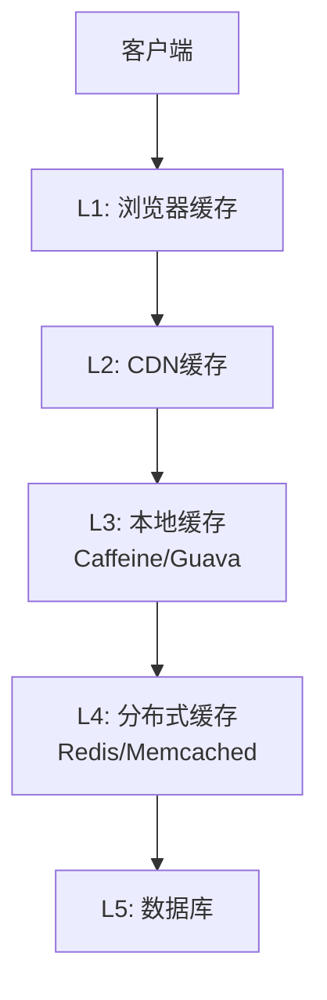
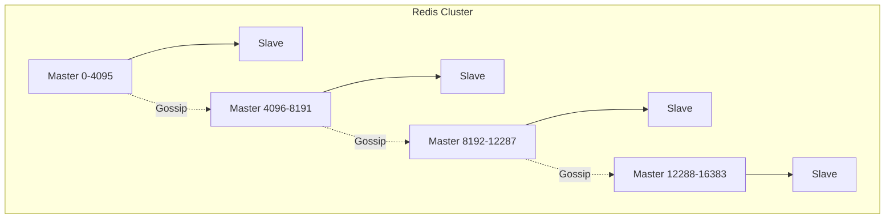

# 分布式缓存

**文档版本**：v1.0  
**最后更新**：2026年

---

## 概述

分布式缓存通过将热点数据存储在内存中，实现毫秒级响应和高并发支持，是降低数据库负载、提升系统性能的核心技术。

## 核心概念

### 缓存局部性原理

- **时间局部性**：最近访问的数据可能再次被访问
- **空间局部性**：相邻数据可能被一起访问
- **内存访问速度**：内存(~100ns)比磁盘(~10ms)快约10万倍

### 多级缓存架构



### 缓存一致性策略

| 策略 | 写入流程 | 优点 | 缺点 |
|------|----------|------|------|
| Cache Aside | 先写DB，再删缓存 | 简单直观 | 短暂不一致 |
| Read/Write Through | 通过缓存层读写 | 封装性好 | 延迟增加 |
| Write Behind | 异步批量写DB | 写性能极高 | 数据丢失风险 |

## 技术细节

### Redis集群架构



**核心特性**：
- 16384个哈希槽，数据均匀分布
- 节点间Gossip协议自动发现
- 主从复制 + 自动故障转移

### Spring Cache + Redis配置

```java
@Configuration
@EnableCaching
public class CacheConfig {
    
    @Bean
    public CacheManager cacheManager(RedisConnectionFactory factory) {
        RedisCacheConfiguration config = RedisCacheConfiguration.defaultCacheConfig()
            .entryTtl(Duration.ofMinutes(10))
            .serializeKeysWith(RedisSerializationContext.SerializationPair
                .fromSerializer(new StringRedisSerializer()))
            .serializeValuesWith(RedisSerializationContext.SerializationPair
                .fromSerializer(new GenericJackson2JsonRedisSerializer()));
        
        return RedisCacheManager.builder(factory)
            .cacheDefaults(config)
            .withCacheConfiguration("user", 
                config.entryTtl(Duration.ofMinutes(30)))
            .withCacheConfiguration("product", 
                config.entryTtl(Duration.ofHours(1)))
            .build();
    }
}

@Service
public class UserService {
    
    @Cacheable(value = "user", key = "#userId")
    public User getUser(Long userId) {
        return userRepository.findById(userId).orElse(null);
    }
    
    @CachePut(value = "user", key = "#user.id")
    public User updateUser(User user) {
        return userRepository.save(user);
    }
    
    @CacheEvict(value = "user", key = "#userId")
    public void deleteUser(Long userId) {
        userRepository.deleteById(userId);
    }
}
```

### 缓存问题解决方案

```java
@Service
public class CacheService {
    
    private static final String NULL_VALUE = "NULL";
    
    // 1. 缓存穿透防护（布隆过滤器+空值缓存）
    @Autowired
    private BloomFilter<String> bloomFilter;
    
    public Object getWithBloomFilter(String key) {
        // 布隆过滤器检查
        if (!bloomFilter.mightContain(key)) {
            return null;  // 数据一定不存在
        }
        
        Object value = redisTemplate.opsForValue().get(key);
        if (value != null) {
            return value.equals(NULL_VALUE) ? null : value;
        }
        
        value = db.get(key);
        if (value == null) {
            // 缓存空值，短过期时间
            redisTemplate.opsForValue().set(key, NULL_VALUE, 60, TimeUnit.SECONDS);
        } else {
            redisTemplate.opsForValue().set(key, value, 3600, TimeUnit.SECONDS);
        }
        return value;
    }
    
    // 2. 缓存击穿防护（互斥锁）
    public Object getWithLock(String key) {
        Object value = redisTemplate.opsForValue().get(key);
        if (value != null) return value;
        
        // 获取分布式锁
        Boolean locked = redisTemplate.opsForValue()
            .setIfAbsent(key + ":lock", "1", 10, TimeUnit.SECONDS);
        
        if (Boolean.TRUE.equals(locked)) {
            try {
                value = db.get(key);
                if (value != null) {
                    redisTemplate.opsForValue().set(key, value, 3600, TimeUnit.SECONDS);
                }
            } finally {
                redisTemplate.delete(key + ":lock");
            }
        } else {
            // 未获取锁，短暂等待后重试
            Thread.sleep(100);
            return getWithLock(key);
        }
        return value;
    }
    
    // 3. 缓存雪崩防护（随机过期时间）
    public void setWithRandomExpire(String key, Object value) {
        int baseExpire = 3600;
        int randomExpire = ThreadLocalRandom.current().nextInt(300);
        redisTemplate.opsForValue().set(key, value, 
            baseExpire + randomExpire, TimeUnit.SECONDS);
    }
}
```

### Redis集群配置

```yaml
spring:
  redis:
    cluster:
      nodes:
        - 192.168.1.101:6379
        - 192.168.1.102:6379
        - 192.168.1.103:6379
        - 192.168.1.104:6379
        - 192.168.1.105:6379
        - 192.168.1.106:6379
      max-redirects: 3
    password: ${REDIS_PASSWORD}
    timeout: 2000ms
    lettuce:
      pool:
        max-active: 100
        max-idle: 50
        min-idle: 10
```

## 实践指南

### Key设计规范

```
格式: {业务}:{模块}:{标识}
示例: 
  - user:profile:12345
  - order:detail:67890
  - product:inventory:sku_001
```

### 过期时间建议

| 数据类型 | 过期时间 | 说明 |
|----------|----------|------|
| 热点数据 | 30分钟-1小时 | 用户/商品信息 |
| 普通数据 | 5-10分钟 | 列表/配置 |
| 空值 | 1-5分钟 | 防穿透 |

### 系统对比

| 特性 | Caffeine | Redis | Memcached |
|------|----------|-------|-----------|
| 类型 | 本地 | 分布式 | 分布式 |
| 性能 | ~10M ops/s | ~100K ops/s | ~100K ops/s |
| 延迟 | ~1μs | ~1ms | ~1ms |
| 数据结构 | K-V | 丰富 | K-V |
| 持久化 | 无 | RDB/AOF | 无 |

### 常见问题

**Q: 大Key问题？**
- 拆分Hash/List
- 使用Snappy/LZ4压缩
- UNLINK异步删除

**Q: 热Key问题？**
- 本地缓存+多级架构
- Key打散（key_1, key_2）
- Redis 4.0+ hotkeys命令监控

---

**相关文档**：
- [数据局部性优化](./数据局部性优化.md)
- [性能监控与调优](./性能监控与调优.md)
