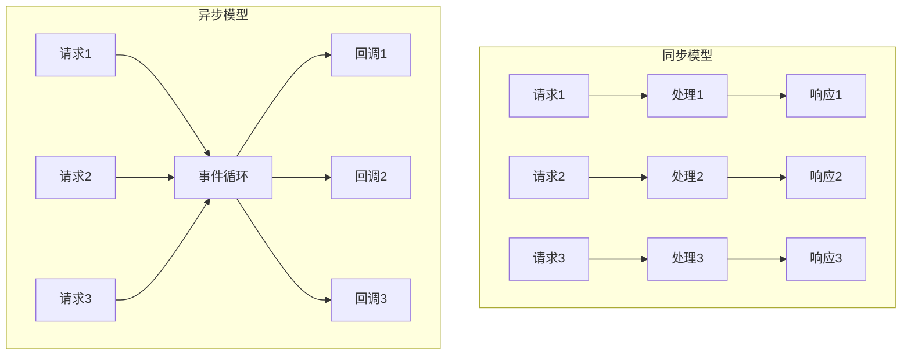
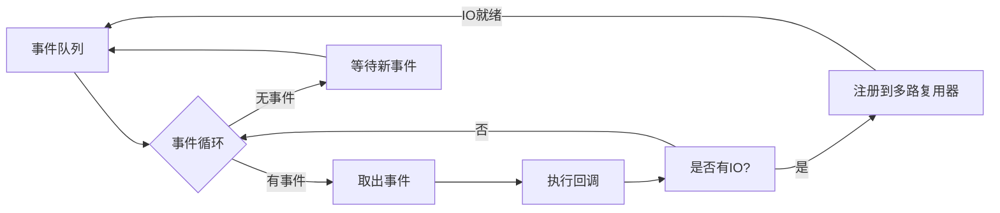
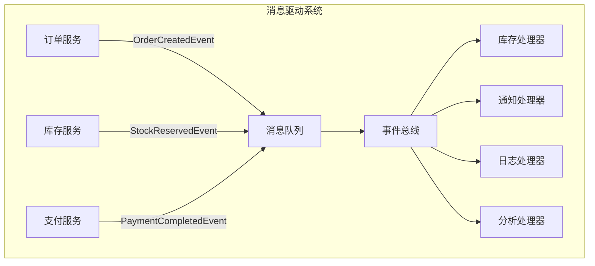
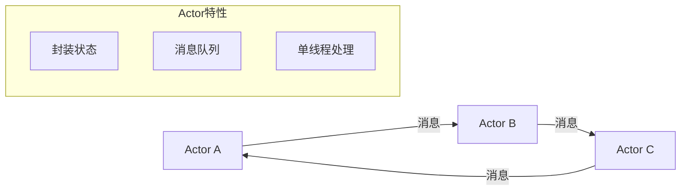
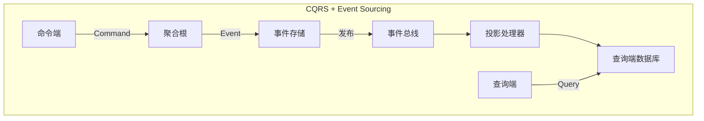

# 异步与事件驱动 专题文档

**文档版本**：v1.0
**创建时间**：2026年
**最后更新**：2026年
**状态**：🔄 编写中

---

## 📋 执行摘要

异步与事件驱动架构是现代高性能系统的核心设计模式，通过非阻塞IO、回调机制和事件循环，实现高并发、低延迟的系统响应能力。

---

## 一、核心概念

### 1.1 定义与原理

**异步编程**：程序发起操作后不等待结果立即返回，通过回调、Promise或异步等待机制在操作完成时处理结果。

**事件驱动架构**：系统通过事件的产生、检测和消费来驱动程序执行，核心组件包括事件生产者、事件总线和事件消费者。

```
┌─────────────────────────────────────────────────────────┐
│                  事件驱动架构模型                         │
├─────────────────────────────────────────────────────────┤
│  ┌─────────┐      ┌─────────┐      ┌─────────┐         │
│  │ Producer│─────→│  Event  │─────→│Consumer │         │
│  │ 生产者  │      │  Bus    │      │ 消费者  │         │
│  └─────────┘      └────┬────┘      └─────────┘         │
│                        │                                │
│  ┌─────────┐           │           ┌─────────┐         │
│  │ Producer│───────────┴──────────→│Consumer │         │
│  └─────────┘                       └─────────┘         │
└─────────────────────────────────────────────────────────┘
```

**核心优势**：

- **高并发**：单线程可处理数万连接
- **低延迟**：无阻塞等待，立即响应
- **资源高效**：减少线程上下文切换
- **可扩展性**：水平扩展事件消费者

### 1.2 关键特性

- **非阻塞IO**：IO操作不阻塞执行线程
- **事件循环**：持续监听和分发事件
- **回调机制**：异步操作完成后的处理逻辑
- **背压处理**：控制生产者速率防止消费者过载

### 1.3 适用场景

| 场景 | 适用性 | 说明 |
|------|--------|------|
| 高并发Web服务器 | ⭐⭐⭐⭐⭐ | Node.js/Nginx模式 |
| 实时消息系统 | ⭐⭐⭐⭐⭐ | WebSocket/推送服务 |
| 流处理 | ⭐⭐⭐⭐⭐ | 大数据实时处理 |
| 微服务通信 | ⭐⭐⭐⭐ | 异步RPC调用 |
| 复杂业务编排 | ⭐⭐⭐ | Saga分布式事务 |

---

## 二、技术细节

### 2.1 异步编程模型对比



| 模型 | 优点 | 缺点 | 代表语言/框架 |
|------|------|------|---------------|
| 回调函数 | 简单直接 | 回调地狱 | Node.js早期 |
| Promise/Future | 链式调用 | 理解门槛 | JavaScript/JS |
| Async/Await | 代码可读性好 | 需要语言支持 | Python 3.5+/C# |
| 响应式编程 | 功能强大 | 学习曲线陡 | RxJava/Reactor |

### 2.2 事件循环机制



#### JavaScript事件循环示例

```javascript
console.log('1. 同步代码开始');

setTimeout(() => {
    console.log('2. 宏任务 - setTimeout');
}, 0);

Promise.resolve().then(() => {
    console.log('3. 微任务 - Promise');
});

console.log('4. 同步代码结束');

// 输出顺序：1 → 4 → 3 → 2
```

#### Java CompletableFuture

```java
public class AsyncExample {

    private ExecutorService executor = Executors.newFixedThreadPool(10);

    public CompletableFuture<User> getUserAsync(String userId) {
        return CompletableFuture.supplyAsync(() -> {
            // 模拟数据库查询
            return userRepository.findById(userId);
        }, executor);
    }

    public CompletableFuture<Order> getOrderAsync(String orderId) {
        return CompletableFuture.supplyAsync(() -> {
            return orderRepository.findById(orderId);
        }, executor);
    }

    // 组合异步操作
    public CompletableFuture<String> composeAsync(String userId, String orderId) {
        return getUserAsync(userId)
            .thenCompose(user ->
                getOrderAsync(orderId)
                    .thenApply(order ->
                        String.format("用户:%s 订单:%s", user.getName(), order.getId())
                    )
            );
    }

    // 并行执行
    public CompletableFuture<Void> parallelAsync() {
        CompletableFuture<User> userFuture = getUserAsync("1");
        CompletableFuture<Order> orderFuture = getOrderAsync("2");

        return CompletableFuture.allOf(userFuture, orderFuture)
            .thenAccept(v -> {
                User user = userFuture.join();
                Order order = orderFuture.join();
                System.out.println("并行完成: " + user + ", " + order);
            });
    }
}
```

### 2.3 响应式编程（Project Reactor）

```java
@Service
public class ReactiveService {

    @Autowired
    private ReactiveUserRepository userRepository;

    // Mono - 0或1个元素
    public Mono<User> findUserById(String id) {
        return userRepository.findById(id)
            .doOnSubscribe(s -> log.info("开始查询用户"))
            .doOnSuccess(u -> log.info("查询成功"))
            .doOnError(e -> log.error("查询失败", e))
            .timeout(Duration.ofSeconds(3))  // 超时控制
            .retryWhen(Retry.backoff(3, Duration.ofMillis(100)));  // 重试
    }

    // Flux - 0到N个元素
    public Flux<User> findAllUsers() {
        return userRepository.findAll()
            .filter(user -> user.isActive())
            .map(user -> {
                user.setName(user.getName().toUpperCase());
                return user;
            })
            .take(100)  // 只取前100个
            .onErrorResume(e -> Flux.empty());  // 错误恢复
    }

    // 背压处理
    public Flux<DataChunk> processLargeStream() {
        return dataSource.getLargeStream()
            .onBackpressureBuffer(1000)  // 缓冲区
            .flatMap(chunk -> processChunk(chunk), 10)  // 并发度10
            .subscribeOn(Schedulers.boundedElastic());
    }
}
```

#### WebFlux控制器

```java
@RestController
@RequestMapping("/api/users")
public class UserController {

    @Autowired
    private ReactiveUserService userService;

    @GetMapping("/{id}")
    public Mono<ResponseEntity<User>> getUser(@PathVariable String id) {
        return userService.findById(id)
            .map(ResponseEntity::ok)
            .defaultIfEmpty(ResponseEntity.notFound().build());
    }

    @GetMapping
    public Flux<User> listUsers(
            @RequestParam(defaultValue = "0") int page,
            @RequestParam(defaultValue = "20") int size) {
        return userService.findAll()
            .skip((long) page * size)
            .take(size);
    }

    @PostMapping
    public Mono<User> createUser(@RequestBody Mono<User> userMono) {
        return userMono.flatMap(userService::save);
    }
}
```

### 2.4 消息驱动架构



#### Spring Cloud Stream配置

```yaml
spring:
  cloud:
    stream:
      bindings:
        # 生产者
        order-output:
          destination: order-topic
          content-type: application/json

        # 消费者
        order-input:
          destination: order-topic
          group: inventory-service
          consumer:
            max-attempts: 3
            back-off-initial-interval: 1000
            back-off-max-interval: 10000

        # 延迟处理
        delayed-input:
          destination: delayed-topic
          consumer:
            delayed-exchange: true

      kafka:
        binder:
          brokers: localhost:9092
          auto-create-topics: true
          configuration:
            acks: all
            retries: 3
            batch.size: 16384
```

```java
@EnableBinding(OrderProcessor.class)
public class OrderEventHandler {

    @StreamListener(OrderProcessor.INPUT)
    @SendTo(OrderProcessor.OUTPUT)
    public Message<OrderEvent> handleOrderCreated(
            @Payload OrderEvent event,
            @Header(AmqpHeaders.DELIVERY_TAG) long deliveryTag) {

        log.info("收到订单事件: {}", event.getOrderId());

        // 处理库存预留
        inventoryService.reserve(event);

        // 发送下一步事件
        OrderEvent nextEvent = OrderEvent.builder()
            .orderId(event.getOrderId())
            .status("INVENTORY_RESERVED")
            .timestamp(Instant.now())
            .build();

        return MessageBuilder
            .withPayload(nextEvent)
            .setHeader("X-Processing-Time", System.currentTimeMillis())
            .build();
    }

    // 死信队列处理
    @StreamListener("dlq-input")
    public void handleDeadLetter(Message<?> failedMessage) {
        log.error("处理失败的消息: {}", failedMessage);
        // 记录到数据库或发送告警
    }
}
```

### 2.5 Actor模型



#### Akka Actor示例（Scala/Java）

```java
public class OrderActor extends AbstractActor {

    private final LoggingAdapter log = Logging.getLogger(getContext().getSystem(), this);
    private OrderState state;

    public static Props props(String orderId) {
        return Props.create(OrderActor.class, () -> new OrderActor(orderId));
    }

    @Override
    public Receive createReceive() {
        return receiveBuilder()
            .match(CreateOrder.class, this::onCreateOrder)
            .match(ConfirmPayment.class, this::onConfirmPayment)
            .match(CancelOrder.class, this::onCancelOrder)
            .match(GetOrderStatus.class, this::onGetStatus)
            .matchAny(this::unhandled)
            .build();
    }

    private void onCreateOrder(CreateOrder cmd) {
        log.info("创建订单: {}", cmd.getOrderId());

        // 异步调用库存服务
        inventoryService.reserve(cmd.getItems())
            .thenAccept(result -> {
                // 通过self发送消息到当前actor
                self().tell(new InventoryReserved(result), self());
            });

        getContext().become(waitingForInventory());
    }

    private Receive waitingForInventory() {
        return receiveBuilder()
            .match(InventoryReserved.class, msg -> {
                state = OrderState.CREATED;
                // 持久化事件
                persist(new OrderCreatedEvent(state), this::applyEvent);
            })
            .build();
    }

    private void onConfirmPayment(ConfirmPayment cmd) {
        if (state == OrderState.CREATED) {
            state = OrderState.PAID;
            persist(new PaymentConfirmedEvent(cmd.getPaymentId()), this::applyEvent);
        }
    }
}

// Actor系统配置
ActorSystem system = ActorSystem.create("order-system");
ActorRef orderManager = system.actorOf(
    Props.create(OrderManagerActor.class),
    "order-manager"
);

// 发送消息（异步，非阻塞）
orderManager.tell(new CreateOrder(orderId, items), ActorRef.noSender());
```

---

## 三、系统对比

### 3.1 异步框架对比

| 特性 | CompletableFuture | Project Reactor | RxJava | Akka |
|------|-------------------|-----------------|--------|------|
| 学习曲线 | 平缓 | 中等 | 陡峭 | 陡峭 |
| 背压支持 | ❌ | ✅ | ✅ | ✅ |
| 错误处理 | 中等 | 优秀 | 优秀 | 优秀 |
| 调试难度 | 低 | 中等 | 高 | 高 |
| 适用场景 | 简单异步 | WebFlux | Android/UI | 分布式 |

### 3.2 消息队列对比

| 特性 | RabbitMQ | Kafka | RocketMQ | Pulsar |
|------|----------|-------|----------|--------|
| 吞吐量 | 中 | 极高 | 高 | 极高 |
| 延迟 | 低(ms) | 中(ms) | 低(ms) | 低(ms) |
| 持久化 | ✅ | ✅ | ✅ | ✅ |
| 事务消息 | ✅ | ❌ | ✅ | ✅ |
| 延时消息 | ✅(插件) | ❌ | ✅ | ✅ |
| 适用场景 | 企业集成 | 大数据流 | 金融交易 | 云原生 |

---

## 四、实践指南

### 4.1 异步系统架构模式



#### Saga分布式事务模式

```java
@Component
public class OrderSaga {

    @Autowired
    private CommandGateway commandGateway;

    @StartSaga
    @SagaEventHandler(associationProperty = "orderId")
    public void handle(OrderCreatedEvent event) {
        // 步骤1: 预留库存
        SagaLifecycle.associateWith("inventory", event.getOrderId());

        commandGateway.send(ReserveInventoryCommand.builder()
            .orderId(event.getOrderId())
            .items(event.getItems())
            .build());
    }

    @SagaEventHandler(associationProperty = "orderId")
    public void on(InventoryReservedEvent event) {
        // 步骤2: 创建支付
        SagaLifecycle.associateWith("payment", event.getOrderId());

        commandGateway.send(CreatePaymentCommand.builder()
            .orderId(event.getOrderId())
            .amount(event.getTotalAmount())
            .build());
    }

    @SagaEventHandler(associationProperty = "orderId")
    public void on(PaymentCompletedEvent event) {
        // 步骤3: 完成订单
        commandGateway.send(CompleteOrderCommand.builder()
            .orderId(event.getOrderId())
            .build());

        SagaLifecycle.end();
    }

    @SagaEventHandler(associationProperty = "orderId")
    public void on(InventoryReservationFailedEvent event) {
        // 补偿: 取消订单
        commandGateway.send(CancelOrderCommand.builder()
            .orderId(event.getOrderId())
            .reason("库存不足")
            .build());

        SagaLifecycle.end();
    }
}
```

### 4.2 最佳实践

1. **避免阻塞操作**：

   ```java
   // ❌ 错误: 在异步链中阻塞
   userMono.map(u -> blockingHttpClient.call(u.getId()));

   // ✅ 正确: 使用异步客户端
   userMono.flatMap(u -> asyncHttpClient.call(u.getId()));
   ```

2. **合理设置超时**：

   ```java
   return service.call()
       .timeout(Duration.ofSeconds(5))
       .retryWhen(Retry.backoff(3, Duration.ofMillis(100)))
       .onErrorResume(e -> Mono.just(defaultValue));
   ```

3. **线程池隔离**：

   ```java
   // 计算密集型任务
   .subscribeOn(Schedulers.parallel())

   // IO密集型任务
   .subscribeOn(Schedulers.boundedElastic())

   // 定时任务
   .delayElements(Duration.ofSeconds(1))
   ```

4. **监控与可观测性**：

   ```java
   // Micrometer指标
   meterRegistry.timer("order.processing")
       .record(() -> processOrder(order));

   // 分布式追踪
   return Mono.deferContextual(ctx -> {
       Span span = tracer.nextSpan()
           .name("process-payment")
           .start();
       return processPayment()
           .doFinally(s -> span.end());
   });
   ```

### 4.3 常见问题

**Q1: 如何处理异步操作中的异常？**

```java
// 全局异常处理
return operation()
    .onErrorResume(DataNotFoundException.class, e -> Mono.empty())
    .onErrorResume(TimeoutException.class, e -> Mono.error(new ServiceUnavailableException()))
    .onErrorResume(e -> {
        log.error("未预期的错误", e);
        return Mono.error(new InternalServerError());
    });
```

**Q2: 如何调试异步代码？**

```java
// 启用调试模式
Hooks.onOperatorDebug();

// 或使用checkpoint
return service.call()
    .checkpoint("after-service-call")
    .map(this::transform)
    .checkpoint("after-transform");
```

**Q3: 如何防止背压导致的内存溢出？**

```java
// 使用onBackpressure策略
return fastProducer
    .onBackpressureBuffer(1000)  // 缓冲1000个
    .onBackpressureDrop()         // 或直接丢弃
    .onBackpressureLatest()       // 或只保留最新
    .subscribeOn(Schedulers.boundedElastic())
    .flatMap(this::slowConsumer, 10);  // 限制并发度
```

---

## 五、形式化分析

### 5.1 并发模型对比

| 模型 | 线程数 | 上下文切换 | 编程复杂度 | 扩展性 |
|------|--------|------------|------------|--------|
| 同步阻塞 | N连接 | 高 | 低 | 差 |
| 同步非阻塞 | N连接 | 高 | 中 | 中 |
| 异步事件驱动 | 少量 | 低 | 高 | 优秀 |
| Actor模型 | 少量 | 低 | 高 | 优秀 |

### 5.2 延迟与吞吐量关系

```
吞吐量 = 并发连接数 / 平均响应时间

异步模型优势：
- 相同资源下，连接数可提升10-100倍
- 响应时间更稳定（无线程调度抖动）
```

---

## 六、与其他主题的关联

### 6.1 上游依赖

- [并发编程](../01-fundamentals/并发编程.md)
- [设计模式](../01-fundamentals/设计模式.md)

### 6.2 下游应用

- [微服务架构](../05-microservices/微服务设计模式.md)
- [事件驱动架构](../05-microservices/事件驱动架构.md)

### 6.3 相关概念

| 概念 | 关系 | 说明 |
|------|------|------|
| 消息队列 | 依赖 | 异步通信的基础设施 |
| 服务网格 | 协作 | 支持异步服务间通信 |
| 流处理 | 扩展 | 持续事件流处理 |

---

## 七、参考资源

### 7.1 学术论文

1. [The Reactive Manifesto](https://www.reactivemanifesto.org/) - 响应式宣言
2. [Actor Model](https://arxiv.org/abs/1004.1458) - Carl Hewitt

### 7.2 开源项目

1. [Project Reactor](https://github.com/reactor/reactor-core) - 响应式编程框架
2. [Akka](https://github.com/akka/akka) - Actor模型实现
3. [Vert.x](https://github.com/eclipse-vertx/vert.x) - 异步应用平台

### 7.3 学习资料

1. [Reactive Programming with Reactor](https://projectreactor.io/docs/core/release/reference/) - 官方文档
2. [Designing Event-Driven Systems](https://www.confluent.io/designing-event-driven-systems/) - Ben Stopford

### 7.4 相关文档

- [批处理与流处理优化](./批处理与流处理优化.md)
- [性能监控与调优](./性能监控与调优.md)

---

**维护者**：项目团队
**最后更新**：2026年
