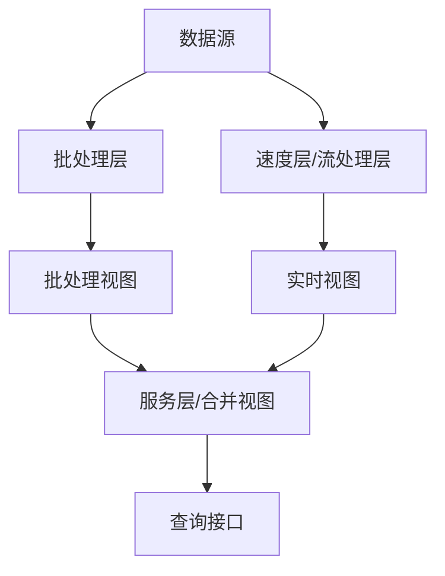
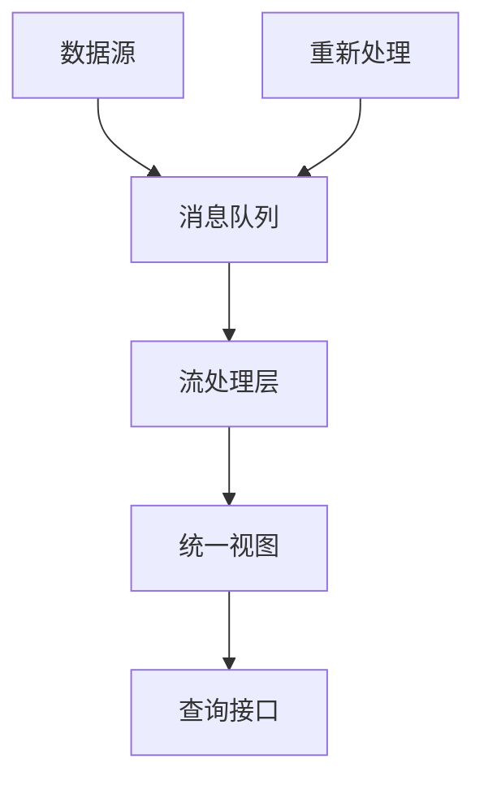
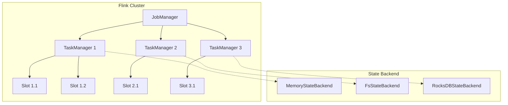
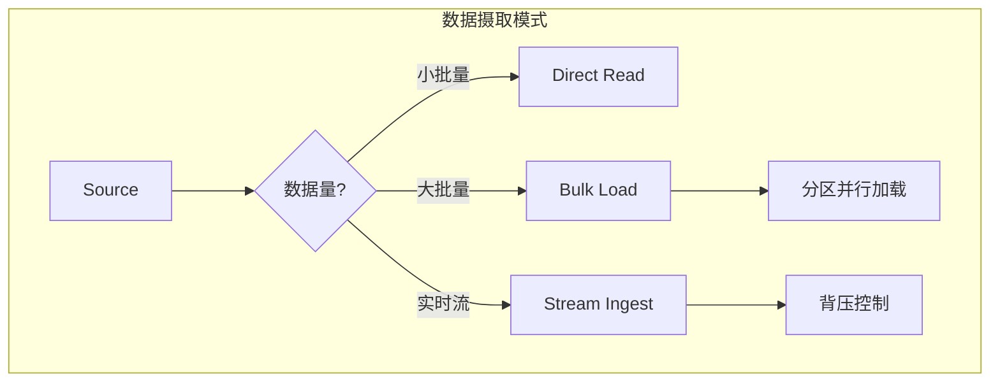

# 批处理与流处理优化 专题文档

**文档版本**：v1.0
**创建时间**：2026年
**最后更新**：2026年
**状态**：🔄 编写中

---

## 📋 执行摘要

批处理与流处理是大数据处理的两种核心模式。批处理适用于大规模离线数据分析，流处理适用于实时数据处理。本文档涵盖Spark、Flink等框架的性能优化策略，以及Lambda和Kappa架构的设计实践。

---

## 一、核心概念

### 1.1 定义与原理

**批处理（Batch Processing）**：对静态数据集进行批量计算，数据在计算前已完全可用。典型特点是高吞吐、延迟不敏感。

**流处理（Stream Processing）**：对实时到达的数据流进行持续计算，数据随到随处理。典型特点是低延迟、实时性要求高。

```
┌─────────────────────────────────────────────────────────┐
│              批处理 vs 流处理对比                         │
├─────────────────────────────────────────────────────────┤
│  维度      │  批处理              │  流处理              │
├────────────┼──────────────────────┼──────────────────────┤
│  数据      │  静态、有界          │  动态、无界          │
│  延迟      │  分钟~小时级         │  毫秒~秒级           │
│  吞吐      │  极高                │  高                  │
│  容错      │  重算整个批次        │  状态检查点          │
│  代表框架  │  MapReduce/Spark     │  Flink/Storm         │
└────────────┴──────────────────────┴──────────────────────┘
```

### 1.2 关键特性

- **容错机制**：检查点（Checkpoint）和状态恢复
- **状态管理**：有状态计算的状态存储和访问
- **窗口计算**：按时间或数量对数据进行分组处理
- **背压处理**：生产者和消费者速率不匹配时的处理

### 1.3 适用场景

| 场景 | 模式 | 说明 |
|------|------|------|
| 离线报表生成 | 批处理 | T+1日报、月报统计 |
| 实时风控 | 流处理 | 毫秒级欺诈检测 |
| 用户行为分析 | 混合 | 实时+离线补充 |
| ETL数据清洗 | 批处理 | 大规模数据转换 |
| 实时监控告警 | 流处理 | 系统指标异常检测 |

---

## 二、技术细节

### 2.1 统一处理架构

#### Lambda架构



**特点**：

- 批处理层：全量数据，准确但延迟高
- 速度层：增量数据，近似但实时
- 服务层：合并两者结果

#### Kappa架构



**特点**：

- 单一处理层：全部使用流处理
- 重新处理能力：可重放历史数据
- 架构简化：减少维护复杂度

### 2.2 Spark性能优化

#### 核心架构

```
┌─────────────────────────────────────────────────────────┐
│                  Spark Application                       │
├─────────────────────────────────────────────────────────┤
│  Driver Program                                         │
│   ├─ SparkContext                                       │
│   ├─ DAG Scheduler                                      │
│   └─ Task Scheduler                                     │
├─────────────────────────────────────────────────────────┤
│  Cluster Manager (YARN/Mesos/K8s)                       │
├─────────────────────────────────────────────────────────┤
│  Executor 1    Executor 2    ...    Executor N          │
│  ├─ Task       ├─ Task              ├─ Task             │
│  ├─ Cache      ├─ Cache             ├─ Cache            │
│  └─ BlockMgr   └─ BlockMgr          └─ BlockMgr         │
└─────────────────────────────────────────────────────────┘
```

#### 内存与序列化优化

```scala
// Spark配置优化
val conf = new SparkConf()
  // 序列化优化
  .set("spark.serializer", "org.apache.spark.serializer.KryoSerializer")
  .set("spark.kryo.registrationRequired", "true")

  // 内存配置
  .set("spark.executor.memory", "8g")
  .set("spark.executor.memoryOverhead", "2g")
  .set("spark.memory.fraction", "0.8")  // 执行内存占比
  .set("spark.memory.storageFraction", "0.3")  // 存储内存占比

  // 并行度配置
  .set("spark.default.parallelism", "200")
  .set("spark.sql.shuffle.partitions", "200")

  // 网络优化
  .set("spark.shuffle.compress", "true")
  .set("spark.shuffle.spill.compress", "true")
  .set("spark.io.compression.codec", "zstd")

val spark = SparkSession.builder()
  .config(conf)
  .appName("OptimizedJob")
  .getOrCreate()

// 注册自定义类
class MyRegistrator extends KryoRegistrator {
  override def registerClasses(kryo: Kryo): Unit = {
    kryo.register(classOf[User])
    kryo.register(classOf[Order])
  }
}
```

#### 数据倾斜处理

```scala
// 1. 加盐处理倾斜Key
val saltedDF = df.withColumn("salt_key",
  concat(col("user_id"), lit("_"), (rand() * 10).cast("int")))

// 2. 两阶段聚合
val partialAgg = df.groupBy("user_id", "salt")
  .agg(sum("amount").as("partial_sum"))

val finalAgg = partialAgg.groupBy("user_id")
  .agg(sum("partial_sum").as("total_amount"))

// 3. 自定义分区器
class SkewAwarePartitioner(partitions: Int) extends Partitioner {
  override def numPartitions: Int = partitions

  override def getPartition(key: Any): Int = {
    val k = key.asInstanceOf[String]
    if (isHotKey(k)) {
      // 热点key分散到多个分区
      (k.hashCode + Random.nextInt(10)) % partitions
    } else {
      k.hashCode % partitions
    }
  }
}
```

#### Spark SQL优化

```scala
// 启用自适应查询执行
spark.conf.set("spark.sql.adaptive.enabled", "true")
spark.conf.set("spark.sql.adaptive.coalescePartitions.enabled", "true")
spark.conf.set("spark.sql.adaptive.skewJoin.enabled", "true")

// 广播join阈值
spark.conf.set("spark.sql.autoBroadcastJoinThreshold", "100MB")

// 代码示例：优化Join
val optimizedDF = largeDF
  .join(broadcast(smallDF), Seq("key"))  // 广播小表
  .filter(col("status") === "active")     // 谓词下推
  .select("key", "value")                  // 列裁剪
  .groupBy("key")
  .agg(sum("value").as("total"))
  .orderBy(desc("total"))
  .limit(100)  // 限制结果数
```

### 2.3 Flink流处理优化

#### 核心架构



#### Flink配置优化

```java
StreamExecutionEnvironment env =
    StreamExecutionEnvironment.getExecutionEnvironment();

// 并行度设置
env.setParallelism(4);
env.setMaxParallelism(128);

// 检查点配置
env.enableCheckpointing(60000);  // 1分钟
env.getCheckpointConfig().setCheckpointingMode(
    CheckpointingMode.EXACTLY_ONCE);
env.getCheckpointConfig().setMinPauseBetweenCheckpoints(30000);
env.getCheckpointConfig().setCheckpointTimeout(600000);
env.getCheckpointConfig().setMaxConcurrentCheckpoints(1);
env.getCheckpointConfig().enableExternalizedCheckpoints(
    ExternalizedCheckpointCleanup.RETAIN_ON_CANCELLATION);

// 状态后端配置
env.setStateBackend(new RocksDBStateBackend("hdfs://checkpoints", true));
env.getCheckpointConfig().setCheckpointStorage("hdfs://checkpoints");

// 重启策略
env.setRestartStrategy(RestartStrategies.fixedDelayRestart(
    3,                    // 重启次数
    Time.of(10, TimeUnit.SECONDS)  // 间隔
));

// 网络缓冲
Configuration config = new Configuration();
config.setInteger("taskmanager.memory.network.fraction", 0.15);
config.setInteger("taskmanager.memory.network.min", "128mb");
config.setInteger("taskmanager.memory.network.max", "512mb");
```

#### 窗口优化

```java
// 增量聚合减少状态
DataStream<Result> aggregated = stream
    .keyBy(Event::getUserId)
    .window(TumblingEventTimeWindows.of(Time.minutes(5)))
    .aggregate(new AverageAggregate());  // 增量聚合

// 自定义触发器
public class EarlyFiringTrigger extends Trigger<Event, TimeWindow> {

    @Override
    public TriggerResult onElement(Event element, long timestamp,
            TimeWindow window, TriggerContext ctx) {
        if (window.maxTimestamp() <= ctx.getCurrentWatermark()) {
            return TriggerResult.FIRE;  // 立即触发
        }
        ctx.registerEventTimeTimer(window.maxTimestamp());

        // 每100条数据提前触发
        ReducingState<Long> count = ctx.getPartitionedState(
            new ReducingStateDescriptor<>("count",
                Long::sum, Types.LONG));
        count.add(1L);
        if (count.get() >= 100) {
            count.clear();
            return TriggerResult.FIRE;
        }
        return TriggerResult.CONTINUE;
    }

    // ... 其他方法
}

// 使用AllowedLateness处理迟到数据
stream
    .keyBy(Event::getUserId)
    .window(TumblingEventTimeWindows.of(Time.minutes(5)))
    .allowedLateness(Time.minutes(2))  // 允许2分钟延迟
    .sideOutputLateData(lateDataTag)   // 收集迟到数据
    .aggregate(new MyAggregate());
```

#### 状态优化

```java
// 使用State TTL
StateTtlConfig ttlConfig = StateTtlConfig
    .newBuilder(Time.hours(24))
    .setUpdateType(OnCreateAndWrite)
    .setStateVisibility(NeverReturnExpired)
    .cleanupIncrementally(10, true)  // 增量清理
    .build();

ValueStateDescriptor<MyState> descriptor =
    new ValueStateDescriptor<>("myState", MyState.class);
descriptor.enableTimeToLive(ttlConfig);

// 使用MapState代替ValueState<List>
MapState<String, UserEvent> mapState = getRuntimeContext()
    .getMapState(new MapStateDescriptor<>("events",
        Types.STRING, Types.POJO(UserEvent.class)));

// 状态访问优化 - 批量读写
@Override
public void processElement(Event event, Context ctx,
        Collector<Result> out) {
    // 缓存到内存，定期刷新
    buffer.add(event);
    if (buffer.size() >= BATCH_SIZE) {
        flushBuffer(out);
    }
}
```

### 2.4 连接器优化

#### Kafka Source优化

```java
// Flink Kafka Consumer优化
FlinkKafkaConsumer<Event> kafkaSource = new FlinkKafkaConsumer<>(
    "events",
    new EventDeserializationSchema(),
    properties
);

// 偏移量提交策略
kafkaSource.setCommitOffsetsOnCheckpoints(true);

// 配置参数
properties.setProperty("bootstrap.servers", "kafka:9092");
properties.setProperty("group.id", "flink-consumer");
properties.setProperty("auto.offset.reset", "earliest");

// 高级配置
properties.setProperty("fetch.min.bytes", "1048576");  // 1MB
properties.setProperty("fetch.max.wait.ms", "500");
properties.setProperty("max.poll.records", "5000");
```

#### Kafka Sink优化

```java
// 两阶段提交保证Exactly-Once
FlinkKafkaProducer<Event> kafkaSink = new FlinkKafkaProducer<>(
    "output-topic",
    new EventSerializer(),
    properties,
    FlinkKafkaProducer.Semantic.EXACTLY_ONCE
);

// 批量发送配置
properties.setProperty("batch.size", "16384");
properties.setProperty("linger.ms", "100");
properties.setProperty("compression.type", "lz4");
properties.setProperty("acks", "all");
properties.setProperty("retries", "3");
properties.setProperty("max.in.flight.requests.per.connection", "5");

// 缓冲配置
properties.setProperty("buffer.memory", "33554432");  // 32MB
```

---

## 三、系统对比

### 3.1 流处理框架对比

| 特性 | Apache Flink | Apache Spark Streaming | Kafka Streams | Apache Storm |
|------|--------------|------------------------|---------------|--------------|
| 处理语义 | Exactly-Once | Exactly-Once | Exactly-Once | At-Least-Once |
| 延迟 | 毫秒级 | 秒级(微批) | 毫秒级 | 毫秒级 |
| 状态管理 | 优秀 | 良好 | 良好 | 基础 |
| SQL支持 | Flink SQL | Spark SQL | KSQL | 有限 |
| 适用场景 | 复杂流处理 | 批流统一 | 轻量级处理 | 简单实时 |

### 3.2 状态后端对比

| 后端 | 存储位置 | 容量 | 性能 | 适用场景 |
|------|----------|------|------|----------|
| Memory | JVM Heap | 小 | 最高 | 测试/小状态 |
| FsStateBackend | 内存+文件 | 中 | 高 | 大状态，非增量 |
| RocksDB | 本地磁盘 | 大 | 中高 | 超大状态，增量 |

---

## 四、实践指南

### 4.1 数据处理模式



### 4.2 性能调优检查清单

```
□ Spark调优
  □ 启用Kryo序列化
  □ 调整executor内存和核心数
  □ 优化shuffle分区数
  □ 启用自适应查询执行(AQE)
  □ 处理数据倾斜

□ Flink调优
  □ 选择合适的State Backend
  □ 优化检查点间隔和超时
  □ 调整网络缓冲配置
  □ 使用增量聚合
  □ 配置合理的并行度

□ 通用优化
  □ 数据分区策略
  □ 压缩格式选择
  □ 资源监控和告警
```

### 4.3 最佳实践

1. **分区策略**：

   ```scala
   // Spark: 根据业务key分区
   df.repartition(col("user_id"))

   // Flink: 自定义分区器
   stream.partitionCustom(new HashPartitioner(), "user_id")
   ```

2. **数据倾斜检测**：

   ```scala
   // Spark: 查看各分区大小
   df.rdd.mapPartitionsWithIndex((idx, iter) =>
     Iterator((idx, iter.size))).collect()
   ```

3. **内存预估**：

   ```
   Flink TaskManager内存 =
     框架内存 + 托管内存 + 网络内存 + JVM开销 + 任务堆内存

   Spark Executor内存 =
     执行内存 + 存储内存 + 用户内存
   ```

### 4.4 常见问题

**Q1: 如何处理Flink检查点失败？**

```java
// 1. 增加超时时间
env.getCheckpointConfig().setCheckpointTimeout(1200000);

// 2. 使用增量检查点
env.setStateBackend(new RocksDBStateBackend(checkpointPath, true));

// 3. 异步检查点
RocksDBStateBackend backend = new RocksDBStateBackend(path);
backend.setPredefinedOptions(PredefinedOptions.SPINNING_DISK_OPTIMIZED_HIGH_MEM);
```

**Q2: Spark任务OOM如何处理？**

```scala
// 1. 增加executor内存
--executor-memory 16g
--executor-memoryOverhead 4g

// 2. 减少并行度
spark.conf.set("spark.sql.shuffle.partitions", "100")

// 3. 使用persist选择合适的存储级别
df.persist(StorageLevel.MEMORY_AND_DISK_SER)
```

**Q3: 如何监控流处理延迟？**

```java
// Flink延迟监控
stream.map(new RichMapFunction<Event, Event>() {
    private transient Histogram latencyHistogram;

    @Override
    public void open(Configuration parameters) {
        latencyHistogram = getRuntimeContext()
            .getMetricGroup()
            .histogram("eventLatency", new DropwizardHistogramWrapper(
                new com.codahale.metrics.Histogram(
                    new SlidingWindowReservoir(500))));
    }

    @Override
    public Event map(Event event) {
        long latency = System.currentTimeMillis() - event.getTimestamp();
        latencyHistogram.update(latency);
        return event;
    }
});
```

---

## 五、形式化分析

### 5.1 吞吐量计算

```
系统吞吐量 = min(源吞吐, 处理吞吐, 汇吞吐)

其中：
- 处理吞吐 = 并行度 × 单任务吞吐
- 单任务吞吐 = 批大小 / 处理延迟
```

### 5.2 延迟组成

```
端到端延迟 =
  摄取延迟 + 处理延迟 + 检查点延迟 + 网络传输延迟 + 序列化延迟

优化方向：
- 减少检查点频率
- 使用增量检查点
- 本地状态访问
- 高效序列化
```

---

## 六、与其他主题的关联

### 6.1 上游依赖

- [分布式存储](../04-storage/分布式存储.md)
- [消息队列](../06-messaging/消息队列.md)

### 6.2 下游应用

- [实时计算](../08-computing/实时计算.md)
- [数据仓库](../04-storage/数据仓库.md)

### 6.3 相关概念

| 概念 | 关系 | 说明 |
|------|------|------|
| 消息队列 | 依赖 | 流处理的数据源 |
| 调度框架 | 依赖 | 集群资源管理 |
| 监控系统 | 协作 | 性能指标采集 |

---

## 七、参考资源

### 7.1 学术论文

1. [Spark: Cluster Computing with Working Sets](https://www.usenix.org/legacy/event/hotcloud10/tech/full_papers/Zaharia.pdf) - Matei Zaharia
2. [Apache Flink: Stream and Batch Processing in a Single Engine](https://doi.org/10.14778/2824032.2824074) - IEEE Data Engineering Bulletin

### 7.2 开源项目

1. [Apache Spark](https://github.com/apache/spark) - 统一分析引擎
2. [Apache Flink](https://github.com/apache/flink) - 流处理框架
3. [Apache Kafka](https://github.com/apache/kafka) - 分布式流平台

### 7.3 学习资料

1. [Spark: The Definitive Guide](https://www.oreilly.com/library/view/spark-the-definitive/9781491912201/) - O'Reilly
2. [Stream Processing with Apache Flink](https://www.oreilly.com/library/view/stream-processing-with/9781491974285/) - O'Reilly

### 7.4 相关文档

- [异步与事件驱动](./异步与事件驱动.md)
- [资源调度框架](./资源调度框架.md)
- [性能监控与调优](./性能监控与调优.md)

---

**维护者**：项目团队
**最后更新**：2026年
