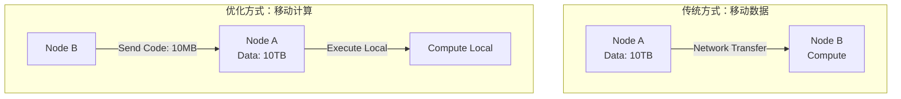
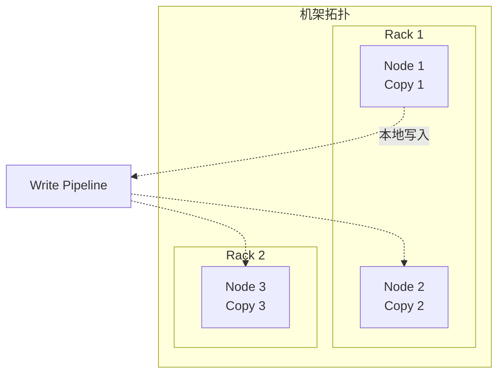

# 数据局部性优化

**文档版本**：v1.0  
**最后更新**：2026年

---

## 概述

数据局部性优化是分布式计算中提升性能的核心策略，通过"计算向数据移动"、数据分区亲和性、智能副本放置和数据预取等手段，大幅减少网络传输开销，提升系统吞吐量。

## 核心概念

### 局部性类型

| 类型 | 描述 | 性能影响 |
|------|------|----------|
| 节点局部性 | 计算与数据在同一节点 | 最优（本地磁盘/内存） |
| 机架局部性 | 计算与数据在同一机架 | 良好（机架内网络） |
| 数据中心局部性 | 计算与数据在同一数据中心 | 可接受 |
| 跨数据中心 | 计算与数据跨地域 | 最差（高延迟） |

### 移动计算 vs 移动数据



**核心原理**：移动计算代码（MB级）比移动数据（TB级）成本低数个数量级。

## 技术细节

### Hadoop MapReduce数据本地性调度

```java
public class DataLocalityScheduler {
    
    // 获取任务的首选位置（数据所在节点）
    public List<String> getPreferredLocations(Task task) {
        List<InputSplit> splits = task.getInputSplits();
        List<String> locations = new ArrayList<>();
        
        for (InputSplit split : splits) {
            // 返回数据块所在的DataNode
            locations.addAll(Arrays.asList(split.getLocations()));
        }
        return locations;
    }
    
    // 调度决策
    public Node selectNode(Task task, List<Node> availableNodes) {
        List<String> preferred = getPreferredLocations(task);
        
        // 优先级1：节点局部性
        for (Node node : availableNodes) {
            if (preferred.contains(node.getHost())) {
                return node;  // 数据就在这个节点
            }
        }
        
        // 优先级2：机架局部性
        for (Node node : availableNodes) {
            if (isSameRack(preferred, node)) {
                return node;  // 同一机架
            }
        }
        
        // 优先级3：任意节点（需拉取数据）
        return selectLeastLoaded(availableNodes);
    }
}
```

### Spark数据局部性配置

```scala
// Spark任务调度考虑数据位置
// 调度优先级：PROCESS_LOCAL > NODE_LOCAL > RACK_LOCAL > ANY

// 1. 增加等待时间以获取更好的局部性
spark.conf.set("spark.locality.wait", "10s")
spark.conf.set("spark.locality.wait.node", "5s")
spark.conf.set("spark.locality.wait.process", "3s")

// 2. 数据共置 - 确保关联表分区对齐
val df1 = spark.read.parquet("/data/users")
  .repartition(100, col("user_id"))
  .persist(StorageLevel.MEMORY_AND_DISK)

val df2 = spark.read.parquet("/data/orders")
  .repartition(100, col("user_id"))

// 此时JOIN可本地执行，无需Shuffle
val result = df1.join(df2, df1("user_id") === df2("user_id"))

// 3. 广播小表避免Shuffle
val smallDF = spark.read.parquet("/data/dim_table").broadcast()
val result2 = largeDF.join(smallDF, "key")
```

### 数据分区亲和性设计

```sql
-- 1. 分区键设计：相同用户数据在同一分区
CREATE TABLE orders (
    order_id BIGINT,
    user_id BIGINT,
    amount DECIMAL(10,2),
    PRIMARY KEY (order_id)
) PARTITION BY HASH(user_id) PARTITIONS 16;

-- 2. 共置组（Co-location Group）
-- 确保关联表使用相同分区键
CREATE TABLE payments (
    payment_id BIGINT,
    user_id BIGINT,  -- 与orders相同分区键
    amount DECIMAL(10,2),
    PRIMARY KEY (payment_id)
) PARTITION BY HASH(user_id) PARTITIONS 16;

-- 3. 外部分区对齐（Spark SQL）
-- 确保两表分区数相同且分区键对齐
CACHE TABLE users_partitioned;
CACHE TABLE orders_partitioned;

-- JOIN时可本地执行
SELECT u.name, o.amount
FROM users_partitioned u
JOIN orders_partitioned o ON u.id = o.user_id
WHERE u.id = 50;  -- 全部在同一分区处理
```

### HDFS副本放置策略



**策略**：本地1副本 + 同机架1副本 + 异机架1副本

### 数据预取实现

```java
// 1. HDFS顺序读取预取
public class PrefetchInputStream extends FSInputStream {
    private byte[] readAheadBuffer;
    private long readAheadLength = 4 * 1024 * 1024; // 4MB预取
    
    @Override
    public int read(byte[] b, int off, int len) throws IOException {
        if (buffer.remaining() < len) {
            triggerAsyncPrefetch(currentPos + readAheadLength);
        }
        return super.read(b, off, len);
    }
    
    private void triggerAsyncPrefetch(long pos) {
        CompletableFuture.runAsync(() -> {
            byte[] prefetchData = new byte[(int) readAheadLength];
            underlyingStream.read(pos, prefetchData, 0, prefetchData.length);
            fillBuffer(prefetchData);
        });
    }
}

// 2. 机器学习特征预取
public class MLFeaturePrefetcher {
    private LoadingCache<String, FeatureVector> cache;
    
    public FeatureVector getFeatures(String userId) {
        FeatureVector features = cache.get(userId);
        
        // 预取相关用户特征
        List<String> similarUsers = model.getSimilarUsers(userId);
        for (String similar : similarUsers) {
            cache.refresh(similar); // 异步刷新
        }
        return features;
    }
}
```

## 实践指南

### 调度器局部性优先级

| 系统 | 局部性级别 | 延迟调度 | 性能收益 |
|------|-----------|----------|----------|
| Hadoop MR | NODE > RACK > ANY | 等待3s | 3-5x |
| Spark | PROCESS > NODE > RACK > ANY | 可配置 | 2-4x |
| YARN | NODE > RACK > OFF_SWITCH | 可配置 | 2-3x |

### 性能对比（典型场景）

| 场景 | 无优化 | 节点局部性 | 机架局部性 |
|------|--------|-----------|-----------|
| 100GB WordCount | 25min | 8min (3.1x) | 12min (2.1x) |
| 1TB TeraSort | 45min | 15min (3x) | 22min (2x) |
| PageRank(10轮) | 120min | 35min (3.4x) | 55min (2.2x) |

### 最佳实践

1. **分区键选择**
   - 选择高基数列避免数据倾斜
   - 选择查询过滤条件常用列
   - 关联表使用相同分区键实现共置

2. **预取参数调优**
   ```
   HDFS: dfs.datanode.readahead.bytes = 4194304 (4MB)
   Spark: spark.sql.files.maxPartitionBytes = 134217728 (128MB)
   ```

3. **数据倾斜处理**
   - 加盐：随机前缀打散热点key
   - 两阶段聚合：先局部聚合再全局聚合
   - 自定义分区器

### 常见问题

**Q: 如何平衡局部性和负载均衡？**
- 动态调整延迟等待时间
- 节点健康度评分
- 任务抢占和重新调度

**Q: 副本放置如何适应异构环境？**
- 权重感知放置
- 存储类型分层（SSD/HDD）
- 网络带宽感知

---

**相关文档**：
- [资源调度框架](./资源调度框架.md)
- [分布式缓存](./分布式缓存.md)
