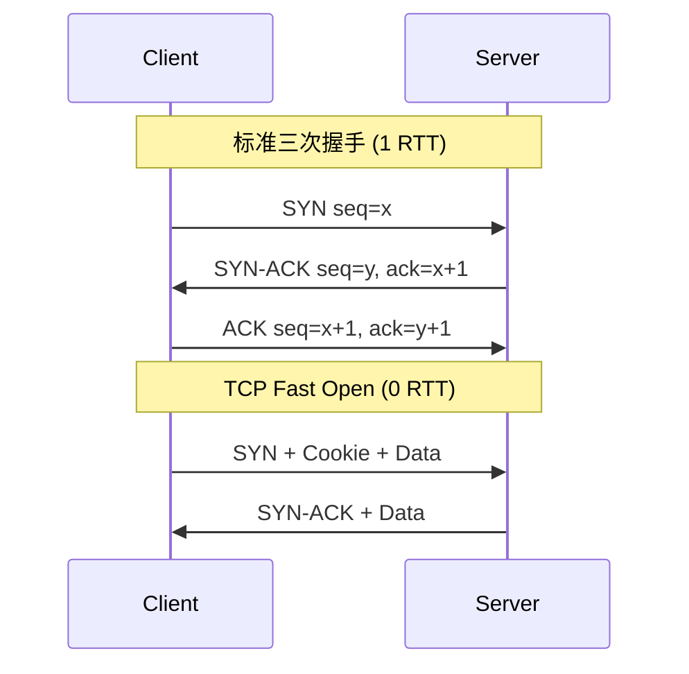
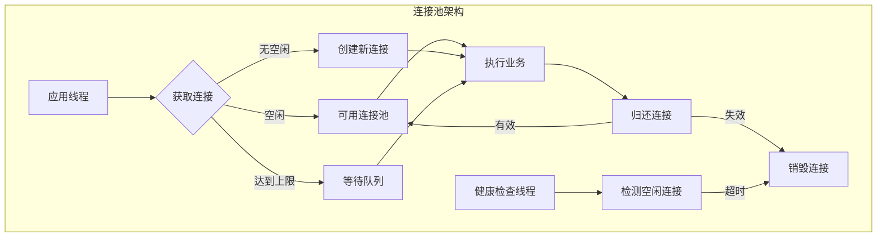
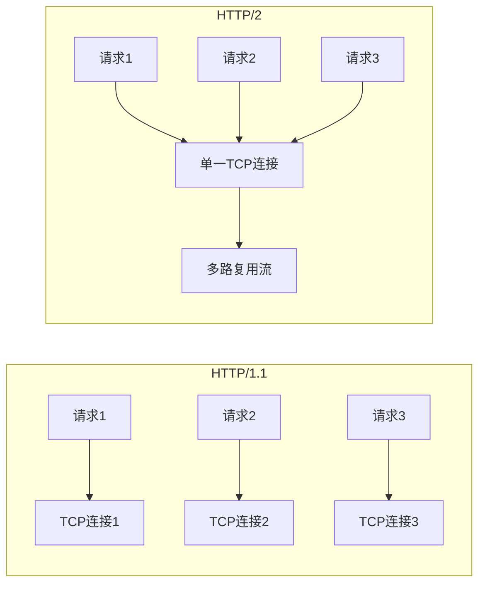

# 网络性能优化 专题文档

**文档版本**：v1.0
**创建时间**：2026年
**最后更新**：2026年
**状态**：🔄 编写中

---

## 📋 执行摘要

网络性能优化是分布式系统的关键瓶颈领域，通过TCP参数调优、连接池管理、IO模型选择和协议优化，可显著提升系统吞吐量和降低延迟。

---

## 一、核心概念

### 1.1 定义与原理

**网络性能优化**：通过调整操作系统参数、应用层配置和协议实现，最小化网络通信开销，最大化数据传输效率的技术集合。

**核心目标**：

- **降低延迟**：减少RTT和数据包处理时间
- **提高吞吐**：充分利用带宽资源
- **减少连接开销**：复用连接，避免频繁握手
- **优化资源使用**：合理配置缓冲区，减少内存占用

### 1.2 关键特性

- **分层优化**：从物理层到应用层的全栈优化
- **参数敏感**：TCP参数对性能影响显著
- **场景相关**：不同应用类型需要不同优化策略
- **可观测性**：需要配合监控进行调优

### 1.3 适用场景

| 场景 | 适用性 | 说明 |
|------|--------|------|
| 高并发API服务 | ⭐⭐⭐⭐⭐ | 大量短连接场景 |
| 微服务通信 | ⭐⭐⭐⭐⭐ | 服务间RPC调用优化 |
| 大文件传输 | ⭐⭐⭐⭐ | 带宽利用最大化 |
| 实时通信 | ⭐⭐⭐⭐ | 低延迟要求 |
| 跨地域访问 | ⭐⭐⭐ | 网络质量不稳定 |

---

## 二、技术细节

### 2.1 TCP核心优化参数

```
┌─────────────────────────────────────────────────────────┐
│                   TCP协议栈架构                          │
├─────────────────────────────────────────────────────────┤
│  应用层  │ HTTP/gRPC/自定义协议                          │
├─────────┼───────────────────────────────────────────────┤
│  传输层  │ TCP (拥塞控制/流量控制/重传机制)              │
├─────────┼───────────────────────────────────────────────┤
│  网络层  │ IP (路由/分片)                                │
├─────────┼───────────────────────────────────────────────┤
│  链路层  │ Ethernet/WiFi (帧传输)                        │
└─────────┴───────────────────────────────────────────────┘
```

#### 关键内核参数

```bash
# /etc/sysctl.conf - Linux TCP优化配置

# 连接建立优化
net.ipv4.tcp_tw_reuse = 1          # 复用TIME_WAIT连接
net.ipv4.tcp_tw_recycle = 0        # 禁用(内核4.12+已移除)
net.ipv4.tcp_fin_timeout = 30      # FIN_WAIT_2超时时间

# 缓冲区优化
net.core.rmem_max = 134217728      # 接收缓冲区最大值(128MB)
net.core.wmem_max = 134217728      # 发送缓冲区最大值(128MB)
net.ipv4.tcp_rmem = 4096 87380 134217728  # min default max
net.ipv4.tcp_wmem = 4096 65536 134217728

# 拥塞控制算法
net.ipv4.tcp_congestion_control = bbr  # 或 cubic/reno
net.ipv4.tcp_notsent_lowat = 16384     # 减少队列延迟

# 连接追踪优化
net.netfilter.nf_conntrack_max = 1000000
net.netfilter.nf_conntrack_tcp_timeout_established = 600
```

#### 参数生效

```bash
# 应用配置
sysctl -p

# 验证当前配置
sysctl net.ipv4.tcp_congestion_control
sysctl net.core.rmem_max
```

### 2.2 TCP三次握手优化



#### TCP Fast Open配置

```bash
# 服务端启用
net.ipv4.tcp_fastopen = 3  # 1=客户端, 2=服务端, 3=双向

# Nginx配置
server {
    listen 80 fastopen=512;  # 允许512个TFO队列
}
```

### 2.3 连接池设计



#### HikariCP配置示例（JDBC连接池）

```yaml
# application.yml
spring:
  datasource:
    hikari:
      # 基本配置
      jdbc-url: jdbc:mysql://localhost:3306/db
      username: user
      password: pass
      driver-class-name: com.mysql.cj.jdbc.Driver
      
      # 连接池大小 = (核心数 * 2) + 有效磁盘数
      maximum-pool-size: 20
      minimum-idle: 10
      
      # 连接超时
      connection-timeout: 30000      # 30秒
      idle-timeout: 600000           # 10分钟
      max-lifetime: 1800000          # 30分钟
      
      # 连接验证
      connection-test-query: SELECT 1
      validation-timeout: 5000
      
      # 性能优化
      leak-detection-threshold: 60000  # 连接泄漏检测
      data-source-properties:
        cachePrepStmts: true
        prepStmtCacheSize: 250
        prepStmtCacheSqlLimit: 2048
```

#### HTTP连接池配置（Apache HttpClient）

```java
@Configuration
public class HttpClientConfig {
    
    @Bean
    public CloseableHttpClient httpClient() {
        PoolingHttpClientConnectionManager cm = 
            new PoolingHttpClientConnectionManager();
        
        // 总连接数
        cm.setMaxTotal(200);
        // 每个路由的最大连接数
        cm.setDefaultMaxPerRoute(20);
        
        // 连接存活时间
        cm.setValidateAfterInactivity(30000);
        
        RequestConfig requestConfig = RequestConfig.custom()
            .setConnectTimeout(5000)      // 连接超时
            .setSocketTimeout(30000)      // 读取超时
            .setConnectionRequestTimeout(5000)  // 从连接池获取超时
            .build();
        
        return HttpClients.custom()
            .setConnectionManager(cm)
            .setDefaultRequestConfig(requestConfig)
            .evictExpiredConnections()     // 自动驱逐过期连接
            .evictIdleConnections(30, TimeUnit.SECONDS)
            .build();
    }
}
```

### 2.4 IO模型对比

| 模型 | 描述 | 优点 | 缺点 | 适用场景 |
|------|------|------|------|----------|
| 阻塞IO | 线程等待IO完成 | 简单直观 | 线程开销大 | 连接数少的场景 |
| 非阻塞IO | 轮询检查IO状态 | 不阻塞线程 | CPU空转 | 不推荐使用 |
| IO多路复用 | select/poll/epoll | 单线程处理多连接 | 编程复杂 | 高并发服务器 |
| 异步IO | 内核通知IO完成 | 极致性能 | 系统支持有限 | 特定高并发场景 |

#### NIO示例（Java）

```java
public class NioServer {
    
    public void start(int port) throws IOException {
        Selector selector = Selector.open();
        ServerSocketChannel serverChannel = ServerSocketChannel.open();
        serverChannel.bind(new InetSocketAddress(port));
        serverChannel.configureBlocking(false);
        serverChannel.register(selector, SelectionKey.OP_ACCEPT);
        
        while (true) {
            // 阻塞等待就绪事件
            selector.select();
            
            Iterator<SelectionKey> keys = selector.selectedKeys().iterator();
            while (keys.hasNext()) {
                SelectionKey key = keys.next();
                keys.remove();
                
                if (key.isAcceptable()) {
                    handleAccept(key);
                } else if (key.isReadable()) {
                    handleRead(key);
                }
            }
        }
    }
    
    private void handleAccept(SelectionKey key) throws IOException {
        ServerSocketChannel server = (ServerSocketChannel) key.channel();
        SocketChannel client = server.accept();
        client.configureBlocking(false);
        client.register(key.selector(), SelectionKey.OP_READ);
    }
}
```

### 2.5 协议优化

#### HTTP/2 vs HTTP/1.1



**HTTP/2核心特性**：

| 特性 | 说明 | 性能提升 |
|------|------|----------|
| 二进制分帧 | 更高效的解析 | 解析速度提升 |
| 多路复用 | 单连接并行请求 | 减少连接数 |
| 头部压缩 | HPACK算法 | 减少头部大小 |
| 服务器推送 | 主动推送资源 | 减少RTT |

#### gRPC性能优化

```protobuf
// 使用proto3，定义紧凑的消息格式
syntax = "proto3";

service OrderService {
    // 流式传输大列表
    rpc ListOrders(ListRequest) returns (stream Order);
    
    // 双向流式处理
    rpc ProcessOrders(stream OrderRequest) returns (stream OrderResponse);
}

message Order {
    int64 id = 1;
    string customer_id = 2;
    repeated OrderItem items = 3;
}
```

```java
// gRPC服务端优化配置
Server server = ServerBuilder.forPort(9090)
    .addService(new OrderServiceImpl())
    // 设置最大消息大小
    .maxInboundMessageSize(10 * 1024 * 1024)
    // 启用压缩
    .compressorRegistry(CompressorRegistry.getDefaultInstance())
    // 连接KeepAlive
    .keepAliveTime(30, TimeUnit.SECONDS)
    .keepAliveTimeout(10, TimeUnit.SECONDS)
    // 线程池配置
    .executor(Executors.newFixedThreadPool(100))
    .build();
```

---

## 三、系统对比

### 3.1 连接池实现对比

| 特性 | HikariCP | Druid | c3p0 | DBCP2 |
|------|----------|-------|------|-------|
| 性能 | ⭐⭐⭐⭐⭐ | ⭐⭐⭐⭐ | ⭐⭐⭐ | ⭐⭐⭐ |
| 监控 | 基础 | 丰富 | 基础 | 基础 |
| 功能 | 精简 | 全面 | 中等 | 中等 |
| 内存占用 | 低 | 中等 | 高 | 中等 |
| 适用场景 | 高性能 | 企业级 | 遗留系统 | 通用 |

### 3.2 序列化协议性能

| 协议 | 序列化大小 | 序列化速度 | 跨语言 | 可读性 |
|------|------------|------------|--------|--------|
| JSON | 大 | 慢 | 优秀 | 好 |
| XML | 很大 | 很慢 | 优秀 | 好 |
| Protobuf | 小 | 很快 | 优秀 | 差 |
| Kryo | 小 | 很快 | Java | 差 |
| MessagePack | 较小 | 快 | 良好 | 差 |

---

## 四、实践指南

### 4.1 网络优化检查清单

```
□ TCP参数调优
  □ 启用tcp_tw_reuse
  □ 调整缓冲区大小
  □ 选择合适的拥塞控制算法
  
□ 连接池配置
  □ 合理设置连接池大小
  □ 配置连接超时和存活时间
  □ 启用连接健康检查
  
□ 协议选择
  □ 内部服务使用gRPC/HTTP2
  □ 外部API使用REST/HTTP1.1
  □ 大数据传输使用二进制协议
  
□ 监控告警
  □ 连接数监控
  □ 重传率监控
  □ 延迟分布监控
```

### 4.2 最佳实践

1. **连接池大小公式**：
   ```
   连接数 = ((核心数 × 2) + 有效磁盘数) × 单节点连接数
   ```

2. **超时配置原则**：
   - 连接超时 < 5秒
   - 读取超时根据业务 SLA 设置
   - 总超时 = 连接超时 + 读取超时 + 缓冲

3. **TCP参数渐进调优**：
   - 先监控当前瓶颈
   - 小幅度调整单个参数
   - 验证性能变化
   - 记录配置变更

### 4.3 常见问题

**Q1: TIME_WAIT连接过多怎么办？**

```bash
# 查看TIME_WAIT数量
ss -tan | grep TIME_WAIT | wc -l

# 解决方案
net.ipv4.tcp_tw_reuse = 1        # 安全复用
net.ipv4.tcp_max_tw_buckets = 5000  # 限制总数
```

**Q2: 如何诊断网络延迟问题？**

```bash
# 1. 查看连接状态
ss -tan state established

# 2. TCP重传统计
cat /proc/net/snmp | grep Tcp

# 3. 使用tcpdump抓包
tcpdump -i eth0 port 8080 -w capture.pcap

# 4. 使用mtr检测路由
traceroute -I target_host
```

**Q3: 连接池耗尽如何处理？**

```java
// 配置等待队列和拒绝策略
HikariConfig config = new HikariConfig();
config.setMaximumPoolSize(20);
config.setConnectionTimeout(5000);  // 5秒后超时

// 监控指标
MeterRegistry registry = new PrometheusMeterRegistry(PrometheusConfig.DEFAULT);
config.setMetricRegistry(registry);
```

---

## 五、形式化分析

### 5.1 延迟组成分析

```
总延迟 = DNS解析 + TCP握手 + TLS握手 + 请求处理 + 数据传输

优化策略：
- DNS解析：使用DNS缓存、HTTPDNS
- TCP握手：启用TFO、连接池复用
- TLS握手：使用TLS 1.3、会话恢复
- 数据传输：启用压缩、使用CDN
```

### 5.2 吞吐量计算

```
最大吞吐量 = min(带宽, 窗口大小 / RTT)

其中窗口大小受限于：
- 接收方窗口 (rwnd)
- 拥塞窗口 (cwnd)
- 缓冲区大小
```

---

## 六、与其他主题的关联

### 6.1 上游依赖

- [网络基础](../02-network/网络协议.md)
- [Linux内核](../02-network/Linux网络.md)

### 6.2 下游应用

- [负载均衡](./负载均衡深度分析.md)
- [微服务通信](../05-microservices/服务网格.md)

### 6.3 相关概念

| 概念 | 关系 | 说明 |
|------|------|------|
| CDN | 协作 | CDN优化边缘网络传输 |
| 服务网格 | 依赖 | 基于优化的网络通信 |

---

## 七、参考资源

### 7.1 学术论文

1. [TCP Congestion Control](https://tools.ietf.org/html/rfc5681) - RFC 5681
2. [BBR: Congestion-Based Congestion Control](https://queue.acm.org/detail.cfm?id=3022184) - ACM Queue

### 7.2 开源项目

1. [HikariCP](https://github.com/brettwooldridge/HikariCP) - 高性能JDBC连接池
2. [Netty](https://github.com/netty/netty) - 异步事件驱动网络框架

### 7.3 学习资料

1. [High Performance Browser Networking](https://hpbn.co/) - Ilya Grigorik
2. [Linux性能优化实战](https://time.geekbang.org/column/intro/140) - 倪朋飞

### 7.4 相关文档

- [负载均衡深度分析](./负载均衡深度分析.md)
- [性能监控与调优](./性能监控与调优.md)

---

**维护者**：项目团队
**最后更新**：2026年
