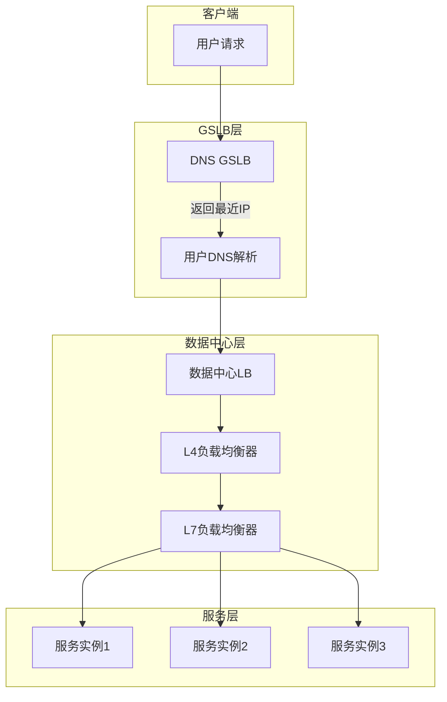
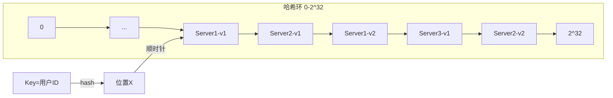
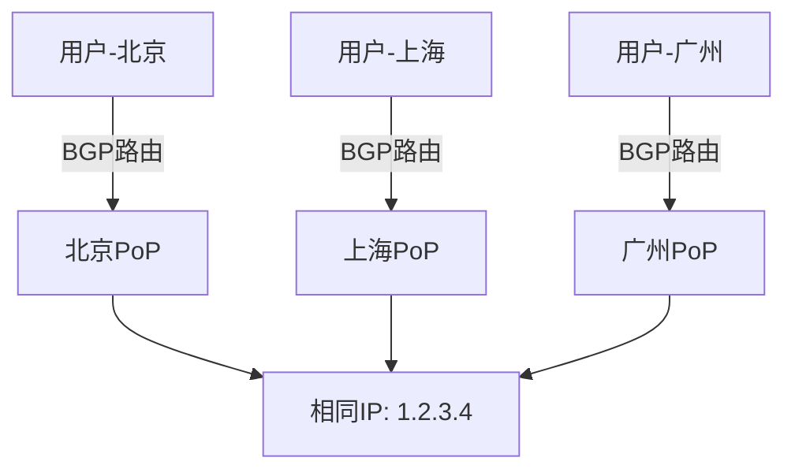
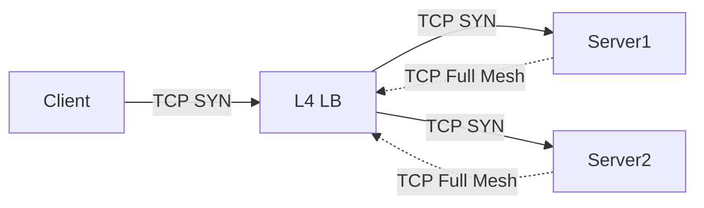
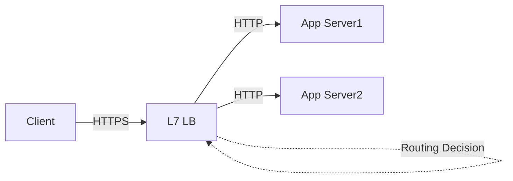
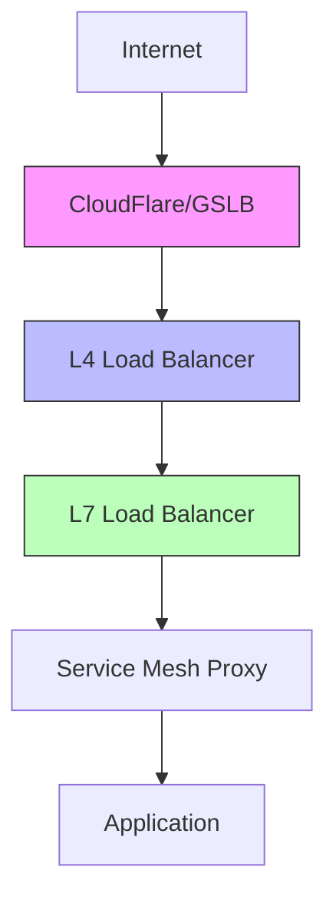

# 负载均衡深度分析 专题文档

**文档版本**：v1.0
**创建时间**：2026年
**最后更新**：2026年
**状态**：🔄 编写中

---

## 📋 执行摘要

负载均衡是将网络流量或计算任务分配到多个后端服务器的核心技术，通过合理调度算法、一致性哈希、全局负载均衡（GSLB）以及L4/L7分层策略，实现系统的高可用、高性能和弹性扩展。

---

## 一、核心概念

### 1.1 定义与原理

**负载均衡（Load Balancing）**：将传入的请求或工作负载分散到多个计算资源（服务器、容器、网络链路等），以优化资源使用、最大化吞吐量、最小化响应时间并避免任何单一资源过载的技术。

**核心目标**：

- **高可用**：单点故障时自动切换
- **高性能**：充分利用所有后端资源
- **弹性扩展**：动态适应流量变化
- **容错能力**：故障自动检测和隔离

### 1.2 关键特性

- **算法多样性**：轮询、随机、哈希、最少连接等多种策略
- **健康检查**：主动/被动检测后端状态
- **会话保持**：确保用户会话粘性
- **SSL终止**：卸载TLS加密计算
- **缓存加速**：静态内容缓存减少后端压力

### 1.3 适用场景

| 场景 | 适用性 | 说明 |
|------|--------|------|
| Web应用集群 | ⭐⭐⭐⭐⭐ | HTTP/HTTPS流量分发 |
| 数据库读写分离 | ⭐⭐⭐⭐⭐ | 读请求分发到从库 |
| 微服务网关 | ⭐⭐⭐⭐⭐ | 服务发现和路由 |
| CDN源站调度 | ⭐⭐⭐⭐ | 全球流量调度 |
| TCP长连接服务 | ⭐⭐⭐⭐ | 游戏/IM服务器 |
| 批处理任务队列 | ⭐⭐⭐ | 计算任务分发 |

---

## 二、技术细节

### 2.1 负载均衡架构



### 2.2 负载均衡算法

#### 轮询算法（Round Robin）

**原理**：按顺序将请求依次分配给后端服务器

```python
def round_robin(servers, request_id):
    """
    简单轮询
    时间复杂度: O(1)
    空间复杂度: O(1)
    """
    return servers[request_id % len(servers)]

# 带权轮询
def weighted_round_robin(servers, weights, current):
    """
    平滑加权轮询（Nginx实现）

    算法步骤：
    1. 每个服务器维护当前权重current_weight
    2. current_weight += effective_weight
    3. 选择current_weight最大的服务器
    4. 被选中的服务器current_weight -= total_weight
    """
    total_weight = sum(weights)
    best_index = -1
    max_weight = -1

    for i in range(len(servers)):
        current[i] += weights[i]
        if current[i] > max_weight:
            max_weight = current[i]
            best_index = i

    current[best_index] -= total_weight
    return servers[best_index], current
```

**优缺点**：

| 优点 | 缺点 |
|------|------|
| 实现简单 | 不考虑服务器性能差异 |
| 均匀分布 | 不考虑请求处理时间差异 |
| 无状态 | 不适用于有状态服务 |

#### 随机算法（Random）

**原理**：随机选择后端服务器

```python
import random

def random_select(servers, weights=None):
    """
    加权随机选择

    算法：
    1. 计算总权重
    2. 生成[0, total_weight)的随机数
    3. 按权重区间选择服务器
    """
    if weights is None:
        return random.choice(servers)

    total = sum(weights)
    point = random.uniform(0, total)

    cumulative = 0
    for server, weight in zip(servers, weights):
        cumulative += weight
        if point <= cumulative:
            return server
```

**适用场景**：后端服务器性能相近、请求处理时间相近的无状态服务。

#### 哈希算法（Hash）

**原理**：根据请求特征计算哈希值，映射到后端服务器

```python
def hash_select(servers, key):
    """
    简单哈希

    问题：服务器增减时缓存命中率下降
    """
    hash_value = hash(key)
    return servers[hash_value % len(servers)]

def consistent_hash_select(servers, virtual_nodes, key):
    """
    一致性哈希

    算法：
    1. 为每个服务器创建虚拟节点（解决分布不均）
    2. 将所有虚拟节点映射到哈希环
    3. 计算key的哈希，顺时针找到最近的虚拟节点

    复杂度：
    - 查找: O(log V)，V为虚拟节点数
    - 空间: O(V)
    """
    import bisect

    # 构建排序的哈希环
    ring = sorted(virtual_nodes.keys())

    # 计算key的哈希
    key_hash = hash(key)

    # 二分查找最近的虚拟节点
    idx = bisect.bisect_right(ring, key_hash)
    if idx == len(ring):
        idx = 0

    vnode_hash = ring[idx]
    return virtual_nodes[vnode_hash]
```

**一致性哈希详解**：



**虚拟节点作用**：

- 解决服务器少时的分布不均
- 每个物理服务器对应150个虚拟节点（Nginx默认值）
- 增减服务器只影响相邻节点

#### 最少连接（Least Connections）

**原理**：选择当前活动连接数最少的服务器

```python
import heapq

class LeastConnections:
    """
    最少连接算法

    使用最小堆维护连接数，支持动态权重

    时间复杂度：
    - 选择: O(log n)
    - 更新: O(log n)
    """

    def __init__(self, servers, weights=None):
        self.servers = {s: 0 for s in servers}  # 连接数
        self.weights = weights or {s: 1 for s in servers}
        self.heap = [(0, s) for s in servers]
        heapq.heapify(self.heap)

    def select(self):
        # 获取连接数最少的服务器
        conn, server = self.heap[0]
        # 考虑权重的有效连接数
        effective_conn = conn / self.weights[server]
        return server, effective_conn

    def increment(self, server):
        self.servers[server] += 1
        self._update_heap(server)

    def decrement(self, server):
        self.servers[server] -= 1
        self._update_heap(server)
```

**适用场景**：

- 长连接服务（WebSocket、TCP）
- 请求处理时间差异大
- 后端服务器性能不均

#### 算法对比总结

| 算法 | 时间复杂度 | 空间复杂度 | 会话保持 | 适用场景 |
|------|------------|------------|----------|----------|
| 轮询 | O(1) | O(1) | ❌ | 同构服务 |
| 加权轮询 | O(1) | O(n) | ❌ | 异构服务 |
| 随机 | O(1) | O(1) | ❌ | 简单场景 |
| 哈希 | O(1) | O(1) | ✅ | 缓存场景 |
| 一致性哈希 | O(log V) | O(V) | ✅ | 分布式缓存 |
| 最少连接 | O(log n) | O(n) | ❌ | 长连接服务 |
| 最快响应 | O(n) | O(n) | ❌ | 性能敏感 |

### 2.3 一致性哈希与虚拟节点

#### 算法实现细节

```python
import hashlib
import bisect

class ConsistentHashRing:
    """
    一致性哈希环实现

    特性：
    - 每个物理节点映射到多个虚拟节点
    - 添加/删除节点只影响相邻节点
    - 支持按权重分配虚拟节点数
    """

    def __init__(self, replicas=150):
        self.replicas = replicas  # 每个物理节点的虚拟节点数
        self.ring = {}  # 哈希值 -> 物理节点
        self.sorted_keys = []  # 排序的哈希值列表
        self.nodes = set()

    def _hash(self, key):
        """计算key的哈希值"""
        return int(hashlib.md5(key.encode()).hexdigest(), 16)

    def add_node(self, node, weight=1):
        """
        添加节点

        根据权重计算虚拟节点数：
        virtual_nodes = replicas * weight
        """
        self.nodes.add(node)
        num_replicas = int(self.replicas * weight)

        for i in range(num_replicas):
            # 虚拟节点命名: node#index
            virtual_key = f"{node}#{i}"
            hash_key = self._hash(virtual_key)
            self.ring[hash_key] = node

        self.sorted_keys = sorted(self.ring.keys())

    def remove_node(self, node):
        """删除节点"""
        self.nodes.discard(node)
        keys_to_remove = []

        for key, value in self.ring.items():
            if value == node:
                keys_to_remove.append(key)

        for key in keys_to_remove:
            del self.ring[key]

        self.sorted_keys = sorted(self.ring.keys())

    def get_node(self, key):
        """获取key对应的节点"""
        if not self.ring:
            return None

        hash_key = self._hash(key)

        # 二分查找第一个 >= hash_key的位置
        idx = bisect.bisect_right(self.sorted_keys, hash_key)

        # 环形回绕
        if idx == len(self.sorted_keys):
            idx = 0

        return self.ring[self.sorted_keys[idx]]

    def get_nodes(self, key, n=3):
        """获取key对应的n个节点（用于副本）"""
        if n > len(self.nodes):
            n = len(self.nodes)

        nodes = []
        hash_key = self._hash(key)
        idx = bisect.bisect_right(self.sorted_keys, hash_key)

        while len(nodes) < n:
            if idx >= len(self.sorted_keys):
                idx = 0
            node = self.ring[self.sorted_keys[idx]]
            if node not in nodes:
                nodes.append(node)
            idx += 1

        return nodes
```

#### 虚拟节点数量影响

| 虚拟节点/物理节点 | 标准差 | 适用场景 |
|-------------------|--------|----------|
| 50 | 15% | 节点数>100 |
| 150 | 8% | 通用场景（Nginx默认）|
| 300 | 5% | 节点数<10 |

**计算公式**：

```
负载均衡度 = 标准差(各节点虚拟节点数) / 平均值
目标: 负载均衡度 < 10%
```

### 2.4 全局负载均衡（GSLB）

#### DNS-based GSLB

**原理**：通过DNS响应不同的IP地址，将用户引导到最近/最健康的站点

```
用户查询 www.example.com
      ↓
Local DNS
      ↓
GSLB DNS服务器
      ↓
  ├─ 根据用户IP确定地理位置
  ├─ 检查各站点健康状态
  ├─ 计算各站点负载
  └─ 返回最优A记录
```

**调度策略**：

| 策略 | 描述 | 实现 |
|------|------|------|
| 地理位置 | 返回最近站点 | GeoIP数据库 |
| 延迟最小 | 基于探测延迟 | 主动探测 |
| 权重轮询 | 按比例分配 | 配置权重 |
| 故障转移 | 主备切换 | 健康检查 |
| 容量感知 | 基于实时负载 | 负载上报 |

**DNS记录TTL设置**：

| 场景 | TTL建议 | 说明 |
|------|---------|------|
| 正常状态 | 300-600s | 平衡性能和灵活性 |
| 故障切换 | 10-30s | 快速切换（可能受缓存影响）|
| CDN场景 | 86400s | 长期稳定 |

#### HTTP-based GSLB

**原理**：通过HTTP 302重定向实现更精确的调度

```http
用户请求: GET /resource HTTP/1.1
         Host: cdn.example.com

响应: HTTP/1.1 302 Found
     Location: http://edge-ny.example.com/resource
     X-Edge-Location: NewYork
```

**优缺点对比**：

| 特性 | DNS GSLB | HTTP GSLB |
|------|----------|-----------|
| 调度精度 | 低（IP级别） | 高（请求级别）|
| 额外延迟 | 无 | 1-RTT |
| 客户端支持 | 通用 | 需支持重定向 |
| 安全性 | 易受劫持 | 可使用HTTPS |

#### Anycast GSLB

**原理**：使用BGP Anycast，相同IP从多个位置广播



**特点**：

- 最优网络路径自动选择
- 故障自动收敛
- 需要自有AS号和IP段

### 2.5 L4 vs L7负载均衡

#### 四层负载均衡（L4）

**工作层次**：传输层（TCP/UDP）



**实现机制**：

- **NAT模式**：修改源/目的IP和端口
- **DR模式（直接路由）**：只修改目的MAC，响应 bypass LB
- **隧道模式**：IPIP/GRE封装

**特点**：

| 特性 | 说明 |
|------|------|
| 性能 | 极高（可达百万pps） |
| 延迟 | 低（仅转发） |
| 功能 | 有限（基于IP/端口） |
| SSL | 不支持终止 |
| 资源消耗 | 低 |

**典型实现**：LVS（Linux Virtual Server）、AWS NLB、Google Cloud Load Balancing

#### 七层负载均衡（L7）

**工作层次**：应用层（HTTP/HTTPS）



**功能特性**：

| 功能 | 描述 |
|------|------|
| URL路由 | /api/*→ api-servers, /static/* → cdn |
| Host路由 | api.example.com → v1, v2.example.com → v2 |
| SSL终止 | 卸载TLS计算，集中证书管理 |
| 会话保持 | Cookie插入、IP哈希 |
| 内容改写 | 请求/响应头修改 |
| 压缩 | Gzip/Brotli压缩 |
| 缓存 | 静态内容缓存 |
| WAF | Web应用防火墙 |

**路由配置示例（Nginx）**：

```nginx
upstream api_servers {
    least_conn;
    server 10.0.1.10:8080 weight=5;
    server 10.0.1.11:8080 weight=5;
    server 10.0.1.12:8080 backup;
}

upstream static_servers {
    server 10.0.2.10:80;
    server 10.0.2.11:80;
}

server {
    listen 80;
    server_name example.com;

    location /api/ {
        proxy_pass http://api_servers;
        proxy_set_header Host $host;
        proxy_set_header X-Real-IP $remote_addr;
    }

    location /static/ {
        proxy_pass http://static_servers;
        expires 30d;
    }
}
```

#### L4 vs L7 对比矩阵

| 维度 | L4负载均衡 | L7负载均衡 |
|------|------------|------------|
| 性能 | ⭐⭐⭐⭐⭐ | ⭐⭐⭐ |
| 功能丰富度 | ⭐⭐ | ⭐⭐⭐⭐⭐ |
| SSL终止 | ❌ | ✅ |
| 智能路由 | ❌ | ✅ |
| 延迟敏感度 | 极低延迟 | 可接受延迟 |
| 典型QPS | 100万+ | 10万+ |
| 资源消耗 | 低 | 高 |
| 价格 | 较低 | 较高 |

---

## 三、系统对比

### 3.1 开源负载均衡器对比

| 维度 | Nginx | HAProxy | Traefik | Envoy |
|------|-------|---------|---------|-------|
| L4支持 | ✅ | ✅ | ✅ | ✅ |
| L7支持 | ⭐⭐⭐⭐⭐ | ⭐⭐⭐⭐ | ⭐⭐⭐⭐ | ⭐⭐⭐⭐⭐ |
| 动态配置 | 需reload | 部分支持 | 自动发现 | 动态配置 |
| 服务发现 | 第三方 | 第三方 | 原生集成 | 原生集成 |
| 可观测性 | 中等 | 良好 | 良好 | 优秀 |
| 云原生 | 一般 | 一般 | 优秀 | 优秀 |
| 学习曲线 | 平缓 | 中等 | 平缓 | 陡峭 |

### 3.2 云厂商负载均衡对比

| 特性 | AWS ALB | Azure LB | GCP LB | 阿里云SLB |
|------|---------|----------|--------|-----------|
| L4/L7 | L7为主 | 两者 | 两者 | 两者 |
| 全球负载 | Global Accelerator | Front Door | GCLB | GTM |
| 自动扩展 | 优秀 | 良好 | 优秀 | 良好 |
| 与K8s集成 | EKS集成 | AKS集成 | GKE原生 | ACK集成 |
| 定价模式 | LCU+小时 | 小时+数据处理 | 数据处理 | 实例+流量 |

### 3.3 性能基准对比

| 负载均衡器 | RPS | 延迟P99 | CPU使用率 |
|------------|-----|---------|-----------|
| LVS-DR | 1M+ | <1ms | 低 |
| Nginx | 100K | 1-5ms | 中等 |
| HAProxy | 80K | 1-5ms | 中等 |
| Envoy | 50K | 2-8ms | 较高 |

---

## 四、实践指南

### 4.1 多层负载均衡架构



**各层职责**：

| 层级 | 职责 | 技术选型 |
|------|------|----------|
| GSLB | 地理位置路由、DDoS防护 | CloudFlare、Route53 |
| L4 | TCP连接分发、高吞吐 | LVS、AWS NLB |
| L7 | HTTP路由、SSL终止、WAF | Nginx、Envoy、ALB |
| Sidecar | 服务发现、熔断、重试 | Envoy、Linkerd-proxy |

### 4.2 健康检查配置

```yaml
# Nginx健康检查配置
upstream backend {
    server 10.0.1.10:8080;
    server 10.0.1.11:8080;

    # 主动健康检查（商业版/第三方模块）
    check interval=3000 rise=2 fall=3 timeout=1000
         type=http;
    check_http_send "GET /health HTTP/1.0\r\n\r\n";
    check_http_expect_alive http_2xx http_3xx;
}

# Envoy健康检查配置
health_checks:
  - timeout: 5s
    interval: 10s
    unhealthy_threshold: 3
    healthy_threshold: 2
    http_health_check:
      path: /health
      expected_statuses:
        start: 200
        end: 299
```

**健康检查最佳实践**：

- 检查间隔：5-10秒
- 超时时间：2-5秒
- 失败阈值：2-3次
- 成功阈值：1-2次
- 检查端点：专用轻量接口

### 4.3 最佳实践

1. **算法选择指南**：
   - 同构无状态服务：轮询/随机
   - 有状态服务（缓存）：一致性哈希
   - 长连接服务：最少连接
   - 异构服务器：加权算法

2. **会话保持策略**：
   - 首选：无状态设计
   - 次选：JWT Token
   - 备选：Sticky Session（Cookie/IP Hash）

3. **优雅停机**：
   - 先标记为unhealthy
   - 等待现有连接完成
   - 再停止服务

4. **监控指标**：

   ```
   - 后端健康状态
   - 请求分发均匀度
   - 平均/最大响应时间
   - 错误率（4xx/5xx）
   - 连接数/队列长度
   ```

### 4.4 常见问题

**Q1: 如何选择L4还是L7负载均衡？**
A:

- 需要SSL终止、智能路由、内容改写 → L7
- 极致性能要求、TCP协议 → L4
- 典型架构：L4作为入口，L7做应用路由

**Q2: 一致性哈希如何处理节点故障？**
A: 节点故障时，其负责的key顺时针转移到下一个节点。虚拟节点机制确保负载均匀转移。故障恢复时，缓存会逐渐重建。

**Q3: 负载均衡器本身成为单点故障怎么办？**
A:

- 负载均衡器主备部署（Keepalived VRRP）
- Anycast BGP多活
- DNS多A记录轮询

**Q4: 如何排查负载不均衡问题？**
A:

1. 检查算法配置
2. 验证健康检查（是否存在"假死"节点）
3. 分析请求特征（是否存在热点key）
4. 检查会话保持配置

---

## 五、形式化分析

### 5.1 负载均衡度量化

**均匀度指标**：

```
变异系数（CV）= 标准差 / 平均值

理想情况：CV → 0
可接受范围：CV < 0.2
```

**示例计算**：

```
服务器负载: [100, 110, 95, 105]
平均值: 102.5
标准差: 6.5
CV = 6.5 / 102.5 = 0.063 ✅
```

### 5.2 性能模型

**排队论模型（M/M/c）**：

```
系统利用率：ρ = λ / (c × μ)

其中：
- λ: 请求到达率
- c: 服务器数量
- μ: 单服务器服务率

平均响应时间：
E[T] = (C(c, ρ) / (c × μ - λ)) + 1/μ

其中C(c, ρ)为Erlang-C公式
```

---

## 六、与其他主题的关联

### 6.1 上游依赖

- [网络基础](../02-network/网络协议.md)
- [DNS原理](../02-network/DNS.md)
- [高可用架构](../03-architecture/高可用设计.md)

### 6.2 下游应用

- [微服务架构](../05-microservices/微服务设计模式.md)
- [服务网格](../05-microservices/服务网格.md)
- [CDN加速](../02-network/CDN.md)

### 6.3 相关概念

| 概念 | 关系 | 说明 |
|------|------|------|
| 服务发现 | 依赖 | 动态获取后端列表 |
| 熔断降级 | 协作 | LB层实现熔断 |
| 自动扩缩容 | 协同 | 根据负载动态调整后端 |

---

## 七、参考资源

### 7.1 学术论文

1. [Consistent Hashing and Random Trees](https://www.akamai.com/us/en/multimedia/documents/technical-publication/consistent-hashing-and-random-trees-distributed-caching-protocols-for-relieving-hot-spots-on-the-world-wide-web-technical-publication.pdf) - Karger et al., 1997
2. [Maglev: A Fast and Reliable Software Network Load Balancer](https://research.google/pubs/pub44824/) - Google, 2016
3. [The Power of Two Choices in Randomized Load Balancing](https://www.eecs.harvard.edu/~michaelm/postscripts/tpds2001.pdf) - Mitzenmacher

### 7.2 开源项目

1. [Nginx](https://nginx.org/) - 高性能Web服务器/负载均衡器
2. [HAProxy](http://www.haproxy.org/) - TCP/HTTP负载均衡器
3. [Envoy](https://www.envoyproxy.io/) - 云原生代理
4. [Traefik](https://traefik.io/) - 云原生边缘路由器
5. [LVS](http://www.linuxvirtualserver.org/) - Linux虚拟服务器

### 7.3 学习资料

1. [Load Balancing in Large-Scale Systems](https://www.nginx.com/resources/library/load-balancing/) - Nginx官方指南
2. [Designing Data-Intensive Applications](https://dataintensive.net/) - Martin Kleppmann（第6章）
3. [Site Reliability Engineering](https://sre.google/sre-book/table-of-contents/) - Google SRE Book

### 7.4 相关文档

- [微服务设计模式](../05-microservices/微服务设计模式.md)
- [服务网格](../05-microservices/服务网格.md)
- [高可用设计](../03-architecture/高可用设计.md)

---

**维护者**：项目团队
**最后更新**：2026年
