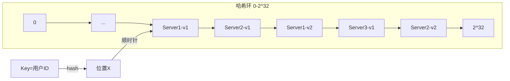

# 负载均衡深度分析

**文档版本**：v1.0  
**最后更新**：2026年

---

## 概述

负载均衡是将网络流量或计算任务分配到多个后端服务器的核心技术，通过合理调度算法实现系统的高可用、高性能和弹性扩展。

## 核心概念

### 负载均衡算法

| 算法 | 原理 | 适用场景 | 复杂度 |
|------|------|----------|--------|
| 轮询(Round Robin) | 按顺序分配 | 同构服务 | O(1) |
| 加权轮询 | 按权重比例分配 | 异构服务器 | O(1) |
| 一致性哈希 | 基于key哈希映射 | 分布式缓存 | O(log V) |
| 最少连接 | 选择连接数最少 | 长连接服务 | O(log n) |
| 最快响应 | 选择响应最快 | 性能敏感场景 | O(n) |

### 一致性哈希



**虚拟节点机制**：每个物理节点映射150个虚拟节点（Nginx默认），解决分布不均问题。

### L4 vs L7负载均衡

| 维度 | L4 (传输层) | L7 (应用层) |
|------|-------------|-------------|
| 性能 | 极高(百万pps) | 高(10万+ RPS) |
| 功能 | 基于IP/端口 | URL路由、SSL终止 |
| 延迟 | <1ms | 1-5ms |
| 典型实现 | LVS、AWS NLB | Nginx、Envoy |

## 技术细节

### Nginx配置示例

```nginx
upstream backend {
    least_conn;                    # 最少连接算法
    server 10.0.1.10:8080 weight=5;
    server 10.0.1.11:8080 weight=5;
    server 10.0.1.12:8080 backup;  # 备用节点
    keepalive 32;                  # 长连接数
}

server {
    listen 80;
    location /api/ {
        proxy_pass http://backend;
        proxy_set_header Host $host;
        proxy_connect_timeout 5s;
        proxy_read_timeout 30s;
    }
    
    location /static/ {
        proxy_pass http://static_servers;
        expires 30d;
    }
}
```

### Envoy配置示例

```yaml
static_resources:
  listeners:
  - name: http_listener
    address:
      socket_address: { address: 0.0.0.0, port_value: 8080 }
    filter_chains:
    - filters:
      - name: envoy.filters.network.http_connection_manager
        typed_config:
          "@type": type.googleapis.com/envoy.extensions.filters.network.http_connection_manager.v3.HttpConnectionManager
          stat_prefix: ingress_http
          route_config:
            name: local_route
            virtual_hosts:
            - name: backend
              domains: ["*"]
              routes:
              - match: { prefix: "/api" }
                route:
                  cluster: api_service
                  timeout: 30s
          http_filters:
          - name: envoy.filters.http.router

  clusters:
  - name: api_service
    connect_timeout: 5s
    type: STATIC
    lb_policy: LEAST_REQUEST  # 最少请求算法
    health_checks:
      - timeout: 5s
        interval: 10s
        unhealthy_threshold: 3
        healthy_threshold: 2
        http_health_check:
          path: /health
    load_assignment:
      cluster_name: api_service
      endpoints:
      - lb_endpoints:
        - endpoint:
            address:
              socket_address: { address: 10.0.1.10, port_value: 8080 }
          metadata:
            filter_metadata:
              envoy.lb:
                weight: 50
        - endpoint:
            address:
              socket_address: { address: 10.0.1.11, port_value: 8080 }
          metadata:
            filter_metadata:
              envoy.lb:
                weight: 50
```

### 一致性哈希算法实现

```python
import hashlib
import bisect

class ConsistentHashRing:
    def __init__(self, replicas=150):
        self.replicas = replicas
        self.ring = {}
        self.sorted_keys = []
    
    def _hash(self, key):
        return int(hashlib.md5(key.encode()).hexdigest(), 16)
    
    def add_node(self, node, weight=1):
        num_replicas = int(self.replicas * weight)
        for i in range(num_replicas):
            virtual_key = f"{node}#{i}"
            hash_key = self._hash(virtual_key)
            self.ring[hash_key] = node
        self.sorted_keys = sorted(self.ring.keys())
    
    def get_node(self, key):
        if not self.ring:
            return None
        hash_key = self._hash(key)
        idx = bisect.bisect_right(self.sorted_keys, hash_key)
        if idx == len(self.sorted_keys):
            idx = 0
        return self.ring[self.sorted_keys[idx]]
```

## 实践指南

### 健康检查配置

| 参数 | 推荐值 | 说明 |
|------|--------|------|
| 检查间隔 | 5-10s | 过于频繁增加负载 |
| 超时时间 | 2-5s | 避免误判 |
| 失败阈值 | 2-3次 | 防止抖动 |
| 成功阈值 | 1-2次 | 快速恢复 |

### 最佳实践

1. **算法选择**：
   - 无状态服务 → 轮询/随机
   - 有状态服务（缓存）→ 一致性哈希
   - 长连接服务 → 最少连接

2. **多层架构**：
   ```
   GSLB(DNS) → L4负载均衡 → L7负载均衡 → 服务网格Sidecar
   ```

3. **会话保持**：
   - 首选：无状态设计 + JWT
   - 次选：Sticky Session（Cookie/IP Hash）

### 常见问题

**Q: 负载不均衡如何处理？**
- 检查健康检查配置
- 验证虚拟节点数量
- 分析请求特征（热点key）

**Q: 负载均衡器单点故障？**
- 主备部署（Keepalived VRRP）
- Anycast BGP多活
- DNS多A记录轮询

---

**相关文档**：
- [网络性能优化](./网络性能优化.md)
- [分布式缓存](./分布式缓存.md)
