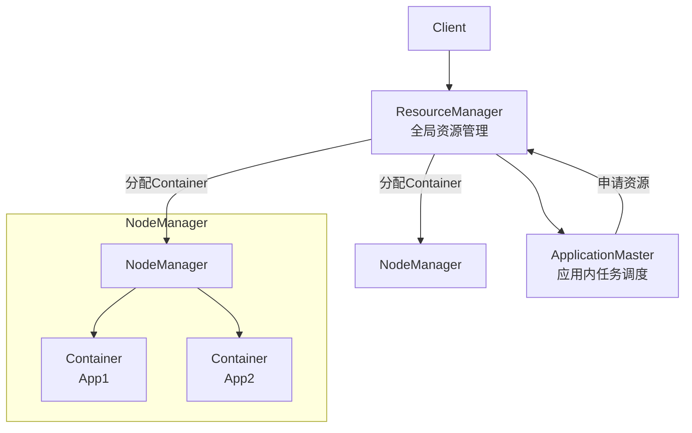
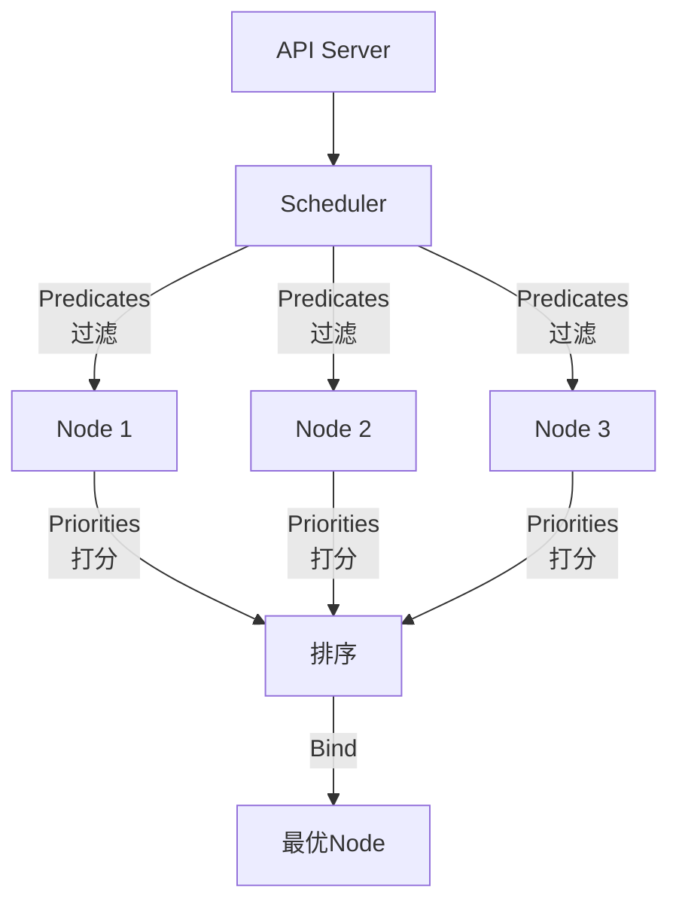

# 资源调度框架

**文档版本**：v1.0  
**最后更新**：2026年

---

## 概述

资源调度框架是分布式系统的核心基础设施，负责将计算任务高效地分配到集群资源上。本文档深入分析YARN、Kubernetes等主流调度架构的设计理念、实现机制和适用场景。

## 核心概念

### 调度模型对比

| 模型 | 代表 | 特点 | 适用规模 |
|------|------|------|----------|
| 单体调度 | Kubernetes | 中央调度器统一决策 | 5K节点 |
| 双层调度 | YARN/Mesos | 资源管理+应用调度分离 | 10K+节点 |
| 共享状态 | Omega | 多调度器并行+乐观并发 | 100K+节点 |

### 调度目标

- **资源利用率**：最大化集群资源使用效率
- **公平性**：多租户间资源合理分配
- **延迟敏感**：快速响应任务调度请求
- **数据局部性**：将计算调度到数据所在节点

## 技术细节

### YARN架构



**调度流程**：
1. Client提交Application → RM
2. RM分配第一个Container运行ApplicationMaster
3. AM向RM注册并请求资源
4. RM调度分配Container，NM启动Container
5. AM管理任务执行

### YARN Capacity调度器配置

```xml
<!-- yarn-site.xml -->
<configuration>
    <!-- 启用Capacity调度器 -->
    <property>
        <name>yarn.resourcemanager.scheduler.class</name>
        <value>org.apache.hadoop.yarn.server.resourcemanager.scheduler.capacity.CapacityScheduler</value>
    </property>
</configuration>

<!-- capacity-scheduler.xml -->
<configuration>
    <!-- 定义队列层级 -->
    <property>
        <name>yarn.scheduler.capacity.root.queues</name>
        <value>prod,dev,default</value>
    </property>
    
    <!-- 生产队列配置 -->
    <property>
        <name>yarn.scheduler.capacity.root.prod.capacity</name>
        <value>60</value>
    </property>
    <property>
        <name>yarn.scheduler.capacity.root.prod.maximum-capacity</name>
        <value>80</value>
    </property>
    
    <!-- 开发队列配置 -->
    <property>
        <name>yarn.scheduler.capacity.root.dev.capacity</name>
        <value>30</value>
    </property>
    
    <!-- 默认队列 -->
    <property>
        <name>yarn.scheduler.capacity.root.default.capacity</name>
        <value>10</value>
    </property>
    
    <!-- 资源抢占 -->
    <property>
        <name>yarn.scheduler.capacity.root.prod.preemption.enabled</name>
        <value>true</value>
    </property>
</configuration>
```

### Kubernetes调度



**调度流程**：
1. Predicates：过滤不满足条件的节点
2. Priorities：为候选节点打分排序
3. Bind：将Pod绑定到最优节点

### Kubernetes调度配置

```yaml
# Pod亲和性配置
apiVersion: v1
kind: Pod
metadata:
  name: web-server
spec:
  affinity:
    # Pod亲和性：与缓存Pod同节点
    podAffinity:
      preferredDuringSchedulingIgnoredDuringExecution:
      - weight: 100
        podAffinityTerm:
          labelSelector:
            matchExpressions:
            - key: app
              operator: In
              values: [cache]
          topologyKey: kubernetes.io/hostname
    
    # Pod反亲和性：Web Pod分散在不同节点
    podAntiAffinity:
      preferredDuringSchedulingIgnoredDuringExecution:
      - weight: 100
        podAffinityTerm:
          labelSelector:
            matchExpressions:
            - key: app
              operator: In
              values: [web]
          topologyKey: kubernetes.io/hostname
  
  # 节点选择器
  nodeSelector:
    workload-type: compute-intensive
  
  # 容忍污点
  tolerations:
  - key: "dedicated"
    operator: "Equal"
    value: "web"
    effect: "NoSchedule"
  
  containers:
  - name: app
    image: nginx
    resources:
      requests:
        memory: "512Mi"
        cpu: "500m"
      limits:
        memory: "1Gi"
        cpu: "1000m"
```

### 自定义调度器（Go实现）

```go
// 调度主流程
func (sched *Scheduler) scheduleOne(ctx context.Context) {
    // 1. 获取待调度Pod
    podInfo := sched.NextPod()
    
    // 2. 过滤阶段 (Predicates)
    feasibleNodes, err := sched.findNodesThatFitPod(ctx, podInfo.Pod)
    if len(feasibleNodes) == 0 {
        sched.recordSchedulingFailure(...)
        return
    }
    
    // 3. 打分阶段 (Priorities)
    priorityList, err := sched.prioritizeNodes(ctx, podInfo.Pod, feasibleNodes)
    
    // 4. 选择最优节点
    host := sched.selectHost(priorityList)
    
    // 5. 绑定
    err := sched.bind(ctx, podInfo.Pod, host)
}

// 关键Predicates（过滤条件）
var predicates = []string{
    "PodFitsResources",       // 资源充足
    "PodFitsHost",           // 节点名称匹配
    "MatchNodeSelector",     // 节点选择器匹配
    "PodToleratesNodeTaints", // 容忍污点
    "CheckNodeAffinity",     // 节点亲和性
}

// 关键Priorities（打分策略）
var priorities = []string{
    "LeastRequestedPriority",     // 优先选择空闲资源多的节点
    "BalancedResourceAllocation", // CPU/内存均衡
    "SelectorSpreadPriority",     // 分散Pod
    "NodeAffinityPriority",       // 节点亲和性
    "ImageLocalityPriority",      // 镜像本地性
}
```

## 实践指南

### 调度器性能对比

| 指标 | YARN | Kubernetes | Mesos |
|------|------|------------|-------|
| 调度延迟 | 50-100ms | 20-50ms | 30-80ms |
| 吞吐(调度/秒) | 1K | 3K | 5K |
| 最大集群规模 | 10K | 5K | 50K |

### 最佳实践

1. **资源预留与超售**
   ```yaml
   resources:
     requests:
       memory: "512Mi"  # 保证资源
       cpu: "500m"
     limits:
       memory: "1Gi"    # 上限资源
       cpu: "1000m"
   ```

2. **优先级与抢占**
   ```yaml
   apiVersion: scheduling.k8s.io/v1
   kind: PriorityClass
   metadata:
     name: high-priority
   value: 1000000
   preemptionPolicy: PreemptLowerPriority
   description: "关键业务应用"
   ```

3. **大数据与容器混合调度**
   - 使用YARN on Kubernetes（Spark 3.0+）
   - 虚拟Kubelet对接YARN
   - 统一资源视图和调度策略

### 常见问题

**Q: 调度器性能瓶颈如何优化？**
- 增加调度器副本（Kubernetes）
- 优化Predicates执行顺序
- 使用缓存减少etcd访问

**Q: 资源碎片化问题？**
- 使用Bin Packing策略
- 定期检查并重新调度
- 设置合理的资源请求/限制比例

---

**相关文档**：
- [数据局部性优化](./数据局部性优化.md)
- [性能监控与调优](./性能监控与调优.md)
