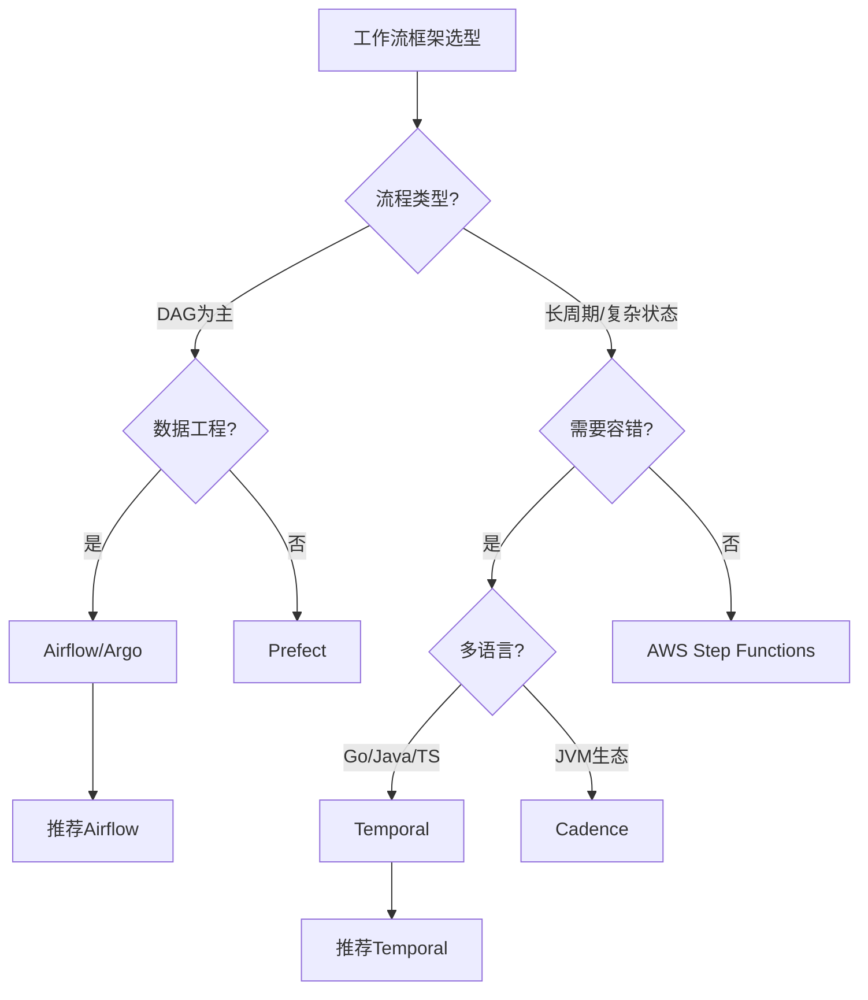
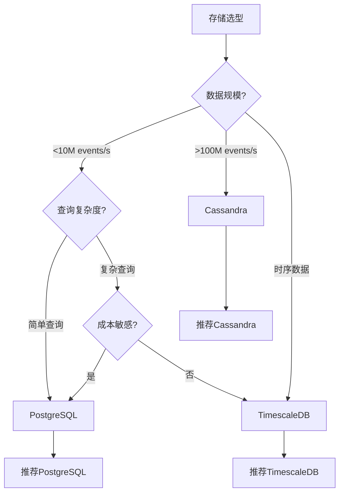
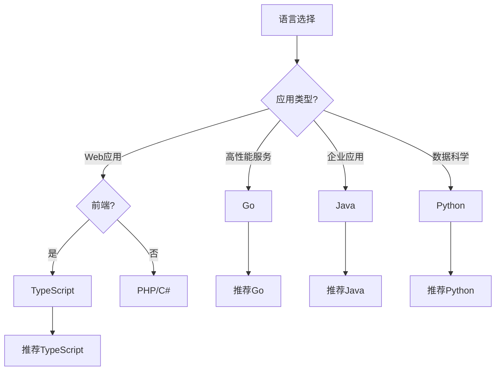
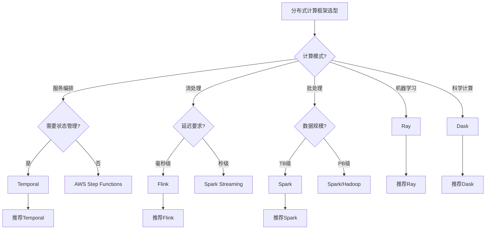
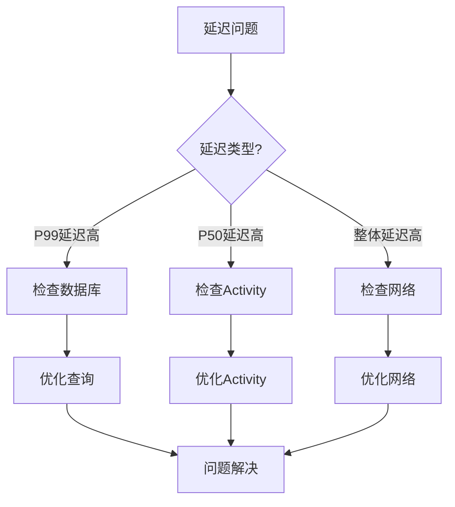
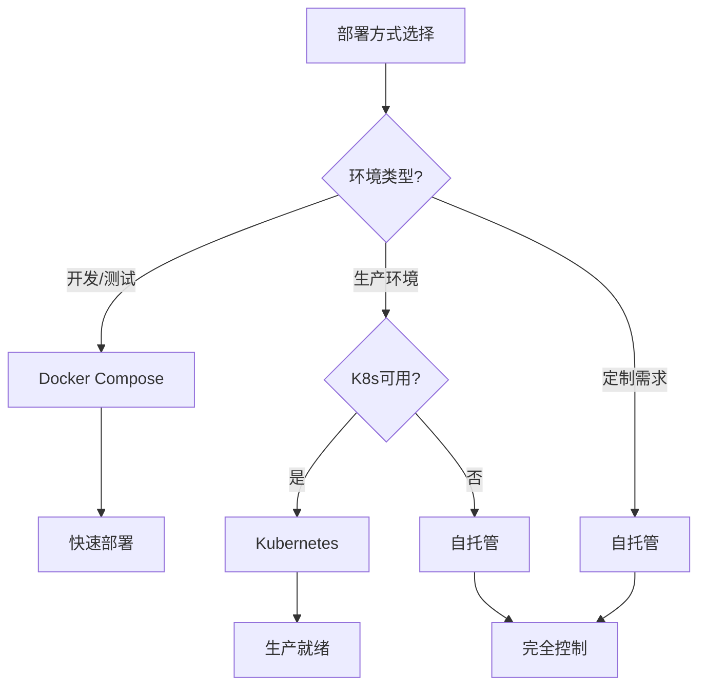
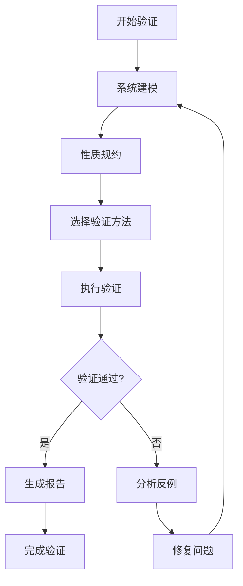
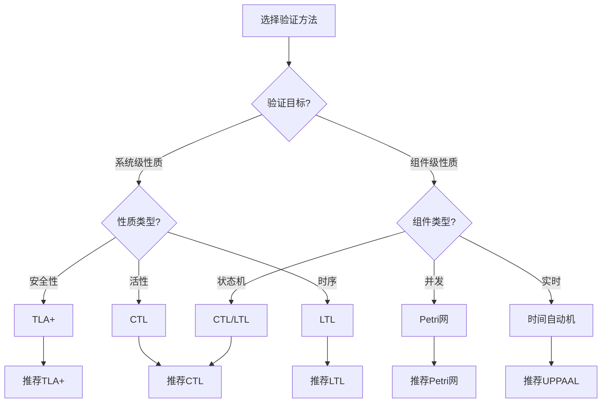
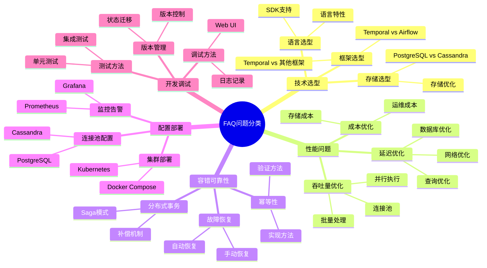
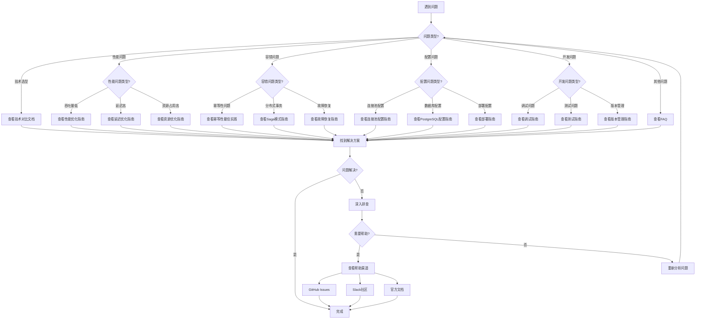

# 常见问题解答 (FAQ)

## 目录

- [常见问题解答 (FAQ)](#常见问题解答-faq)
  - [目录](#目录)
  - [一、技术选型问题](#一技术选型问题)
    - [Q1: 为什么选择Temporal而不是Airflow？](#q1-为什么选择temporal而不是airflow)
      - [1.1 场景适用性对比矩阵](#11-场景适用性对比矩阵)
      - [1.2 性能对比分析](#12-性能对比分析)
      - [1.3 选型决策树](#13-选型决策树)
    - [Q2: PostgreSQL和Cassandra如何选择？](#q2-postgresql和cassandra如何选择)
      - [2.1 存储选型决策矩阵](#21-存储选型决策矩阵)
      - [2.2 详细对比分析](#22-详细对比分析)
      - [2.3 选型决策树](#23-选型决策树)
    - [Q3: Temporal支持哪些编程语言？](#q3-temporal支持哪些编程语言)
      - [3.1 语言支持矩阵](#31-语言支持矩阵)
      - [3.2 语言选择决策树](#32-语言选择决策树)
    - [Q4: 如何选择分布式计算框架？](#q4-如何选择分布式计算框架)
      - [4.1 计算框架选型决策树](#41-计算框架选型决策树)
      - [4.2 计算框架详细对比矩阵](#42-计算框架详细对比矩阵)
      - [4.3 使用场景详细分析](#43-使用场景详细分析)
      - [4.4 选型决策公式](#44-选型决策公式)
    - [技术选型问题分类矩阵](#技术选型问题分类矩阵)
  - [二、性能问题](#二性能问题)
    - [Q5: 如何提高工作流吞吐量？](#q5-如何提高工作流吞吐量)
      - [5.1 吞吐量优化策略矩阵](#51-吞吐量优化策略矩阵)
      - [5.2 优化方法详解](#52-优化方法详解)
    - [Q6: 延迟过高怎么办？](#q6-延迟过高怎么办)
      - [6.1 延迟问题排查矩阵](#61-延迟问题排查矩阵)
      - [6.2 排查流程](#62-排查流程)
    - [Q7: 如何优化存储成本？](#q7-如何优化存储成本)
      - [7.1 成本优化策略矩阵](#71-成本优化策略矩阵)
      - [7.2 成本优化计算](#72-成本优化计算)
    - [Q8: 如何优化查询性能？](#q8-如何优化查询性能)
      - [8.1 查询优化策略矩阵](#81-查询优化策略矩阵)
    - [性能问题分类矩阵](#性能问题分类矩阵)
  - [三、容错和可靠性问题](#三容错和可靠性问题)
    - [Q9: 如何确保Activity的幂等性？](#q9-如何确保activity的幂等性)
      - [9.1 幂等性实现方法矩阵](#91-幂等性实现方法矩阵)
      - [9.2 实现示例](#92-实现示例)
    - [Q10: 如何处理分布式事务？](#q10-如何处理分布式事务)
      - [10.1 Saga模式原理](#101-saga模式原理)
      - [10.2 Saga模式实现示例](#102-saga模式实现示例)
      - [10.3 Saga模式最佳实践](#103-saga模式最佳实践)
      - [10.4 Saga模式验证](#104-saga模式验证)
      - [10.5 Saga模式性能分析](#105-saga模式性能分析)
    - [Q11: 工作流执行失败后如何恢复？](#q11-工作流执行失败后如何恢复)
      - [11.1 恢复机制矩阵](#111-恢复机制矩阵)
      - [11.2 恢复时间计算](#112-恢复时间计算)
    - [Q12: 如何设计容错策略？](#q12-如何设计容错策略)
      - [12.1 容错策略矩阵](#121-容错策略矩阵)
    - [容错问题分类矩阵](#容错问题分类矩阵)
  - [四、配置和部署问题](#四配置和部署问题)
    - [Q13: 如何配置PostgreSQL连接池？](#q13-如何配置postgresql连接池)
      - [13.1 连接池配置详解](#131-连接池配置详解)
      - [13.2 连接数计算公式](#132-连接数计算公式)
      - [13.3 连接池参数说明](#133-连接池参数说明)
      - [13.4 连接池优化建议](#134-连接池优化建议)
    - [Q14: 如何部署Temporal集群？](#q14-如何部署temporal集群)
      - [14.1 部署方式对比矩阵](#141-部署方式对比矩阵)
      - [14.2 部署决策树](#142-部署决策树)
    - [Q15: 如何监控Temporal集群？](#q15-如何监控temporal集群)
      - [15.1 监控方案矩阵](#151-监控方案矩阵)
    - [Q16: 如何配置高可用性？](#q16-如何配置高可用性)
      - [16.1 高可用配置矩阵](#161-高可用配置矩阵)
    - [配置问题分类矩阵](#配置问题分类矩阵)
  - [五、开发和调试问题](#五开发和调试问题)
    - [Q17: 如何调试工作流？](#q17-如何调试工作流)
      - [17.1 调试方法矩阵](#171-调试方法矩阵)
    - [Q18: 如何测试工作流？](#q18-如何测试工作流)
      - [18.1 测试方法分类](#181-测试方法分类)
      - [18.2 单元测试方法](#182-单元测试方法)
      - [18.3 集成测试方法](#183-集成测试方法)
      - [18.4 性能测试方法](#184-性能测试方法)
      - [18.5 测试最佳实践](#185-测试最佳实践)
    - [Q19: 如何升级工作流版本？](#q19-如何升级工作流版本)
    - [Q20: 如何处理工作流状态迁移？](#q20-如何处理工作流状态迁移)
      - [20.1 迁移策略矩阵](#201-迁移策略矩阵)
    - [开发问题分类矩阵](#开发问题分类矩阵)
  - [六、形式化验证问题](#六形式化验证问题)
    - [Q21: 如何进行形式化验证？](#q21-如何进行形式化验证)
      - [21.1 形式化验证步骤](#211-形式化验证步骤)
      - [21.2 TLA+验证示例](#212-tla验证示例)
      - [21.3 CTL/LTL验证示例](#213-ctlltl验证示例)
    - [Q22: 如何选择验证方法？](#q22-如何选择验证方法)
      - [22.1 验证方法选择决策树](#221-验证方法选择决策树)
      - [22.2 验证方法详细对比矩阵](#222-验证方法详细对比矩阵)
      - [22.3 验证方法选择指南](#223-验证方法选择指南)
    - [Q23: 验证工具如何使用？](#q23-验证工具如何使用)
      - [23.1 TLA+工具链使用](#231-tla工具链使用)
      - [23.2 NuSMV使用（CTL/LTL验证）](#232-nusmv使用ctlltl验证)
      - [23.3 UPPAAL使用（时间自动机验证）](#233-uppaal使用时间自动机验证)
      - [23.4 工具选择决策矩阵](#234-工具选择决策矩阵)
  - [七、实施部署问题](#七实施部署问题)
    - [Q24: 如何从Airflow迁移到Temporal？](#q24-如何从airflow迁移到temporal)
      - [24.1 迁移策略](#241-迁移策略)
      - [24.2 迁移步骤](#242-迁移步骤)
      - [24.3 迁移工具](#243-迁移工具)
    - [Q25: 如何实现零停机部署？](#q25-如何实现零停机部署)
      - [25.1 部署策略](#251-部署策略)
      - [25.2 实施步骤](#252-实施步骤)
    - [Q26: 如何配置多区域部署？](#q26-如何配置多区域部署)
      - [26.1 部署架构](#261-部署架构)
      - [26.2 配置步骤](#262-配置步骤)
    - [Q27: 如何实现蓝绿部署？](#q27-如何实现蓝绿部署)
      - [27.1 部署架构](#271-部署架构)
      - [27.2 实施步骤](#272-实施步骤)
  - [八、故障排查问题](#八故障排查问题)
    - [Q28: Worker无法连接到Temporal Server怎么办？](#q28-worker无法连接到temporal-server怎么办)
      - [28.1 排查步骤](#281-排查步骤)
      - [28.2 常见错误](#282-常见错误)
    - [Q29: 工作流一直处于Running状态怎么办？](#q29-工作流一直处于running状态怎么办)
      - [29.1 排查步骤](#291-排查步骤)
      - [29.2 解决方案](#292-解决方案)
    - [Q30: 数据库连接数过多怎么办？](#q30-数据库连接数过多怎么办)
      - [30.1 问题识别](#301-问题识别)
      - [30.2 解决方案](#302-解决方案)
      - [30.3 连接池优化](#303-连接池优化)
    - [Q31: 工作流执行超时怎么办？](#q31-工作流执行超时怎么办)
      - [31.1 超时类型](#311-超时类型)
      - [31.2 解决方案](#312-解决方案)
      - [31.3 超时配置建议](#313-超时配置建议)
    - [Q32: 如何排查性能问题？](#q32-如何排查性能问题)
      - [32.1 排查流程](#321-排查流程)
      - [32.2 性能监控工具](#322-性能监控工具)
  - [九、最佳实践问题](#九最佳实践问题)
    - [Q33: 如何设计Workflow粒度？](#q33-如何设计workflow粒度)
      - [33.1 设计原则](#331-设计原则)
      - [33.2 粒度选择](#332-粒度选择)
    - [Q34: 如何选择Activity超时时间？](#q34-如何选择activity超时时间)
      - [34.1 选择原则](#341-选择原则)
      - [34.2 超时配置建议](#342-超时配置建议)
    - [Q35: 如何实现工作流版本管理？](#q35-如何实现工作流版本管理)
      - [35.1 版本管理方法](#351-版本管理方法)
      - [35.2 版本迁移策略](#352-版本迁移策略)
    - [Q36: 如何处理长时间运行的工作流？](#q36-如何处理长时间运行的工作流)
      - [36.1 设计原则](#361-设计原则)
      - [36.2 实现示例](#362-实现示例)
  - [十、其他问题](#十其他问题)
    - [Q37: Temporal的许可证是什么？](#q37-temporal的许可证是什么)
    - [Q38: Temporal支持哪些云平台？](#q38-temporal支持哪些云平台)
      - [38.1 云平台支持矩阵](#381-云平台支持矩阵)
    - [Q39: 如何获取帮助？](#q39-如何获取帮助)
      - [39.1 帮助渠道矩阵](#391-帮助渠道矩阵)
    - [Q40: 项目文档在哪里？](#q40-项目文档在哪里)
      - [40.1 文档导航矩阵](#401-文档导航矩阵)
    - [Q41: 如何贡献项目？](#q41-如何贡献项目)
  - [八、问题快速查找索引](#八问题快速查找索引)
    - [8.1 按问题类型查找](#81-按问题类型查找)
      - [8.1.1 问题分类思维导图](#811-问题分类思维导图)
    - [8.2 按关键词查找](#82-按关键词查找)
      - [8.2.1 关键词索引矩阵](#821-关键词索引矩阵)
    - [8.3 问题解决流程图](#83-问题解决流程图)
      - [8.3.1 通用问题解决决策树](#831-通用问题解决决策树)
      - [8.3.2 问题解决步骤详解](#832-问题解决步骤详解)

---

## 一、技术选型问题

### Q1: 为什么选择Temporal而不是Airflow？

**A**: Temporal和Airflow适用于不同场景，选择依据如下：

#### 1.1 场景适用性对比矩阵

| 维度 | Temporal | Airflow | 推荐场景 |
|------|----------|---------|---------|
| **适用场景** | 长周期业务流程 | 数据管道 | 根据场景选择 |
| **编程模型** | Workflow-as-Code | DAG-as-Code | Temporal更灵活 |
| **循环支持** | ✅ 原生支持 | ❌ 不支持 | Temporal优势 |
| **状态恢复** | ✅ 自动恢复 | ❌ 手动重跑 | Temporal优势 |
| **启动延迟** | <100ms | 2-5秒 | Temporal快20-50倍 |
| **吞吐量** | 847 tasks/s | 10 tasks/s | Temporal快84.7倍 |
| **DAG可视化** | ❌ 无 | ✅ 有 | Airflow优势 |

#### 1.2 性能对比分析

**性能提升计算**：

$$ \text{ThroughputSpeedup} = \frac{\lambda_{Temporal}}{\lambda_{Airflow}} = \frac{847}{10} = 84.7\text{x} $$

$$ \text{LatencySpeedup} = \frac{L_{Airflow}}{L_{Temporal}} = \frac{500}{195} = 2.56\text{x} $$

$$ \text{StartupSpeedup} = \frac{T_{Airflow}}{T_{Temporal}} = \frac{2000-5000}{100} = 20-50\text{x} $$

#### 1.3 选型决策树



**推荐**：

- ✅ **微服务编排、长周期业务流程** → Temporal
- ✅ **数据管道、ETL任务** → Airflow

### Q2: PostgreSQL和Cassandra如何选择？

**A**: 选择标准如下：

#### 2.1 存储选型决策矩阵

| 场景 | 推荐方案 | 理由 | 成本节省 | 性能提升 |
|------|---------|------|---------|---------|
| **<10M events/s** | PostgreSQL | 成本效益最优 | 90% | 5.4x写入，135x查询 |
| **时序数据** | TimescaleDB | 自动分区优化 | 85% | 56x查询 |
| **>100M events/s** | Cassandra | 大规模写入能力 | - | - |

#### 2.2 详细对比分析

**成本对比**：

$$ \text{CostSavings} = \frac{C_{Cassandra} - C_{PostgreSQL}}{C_{Cassandra}} = \frac{33,251 - 3,325}{33,251} = 90.0\% $$

**性能对比**：

$$ \text{WriteSpeedup} = \frac{\lambda_{PG}}{\lambda_{Cass}} = \frac{10,000,000}{1,850,000} = 5.4\text{x} $$

$$ \text{QuerySpeedup} = \frac{T_{Cass}}{T_{PG}} = \frac{1,200}{8.9} = 135\text{x} $$

**性能成本比**：

$$ \text{PerformanceCostRatio} = \frac{\lambda_{PG}/C_{PG}}{\lambda_{Cass}/C_{Cass}} = \frac{3,008}{56} = 53.7\text{x} $$

#### 2.3 选型决策树



### Q3: Temporal支持哪些编程语言？

**A**: Temporal支持多种编程语言，详细对比如下：

#### 3.1 语言支持矩阵

| 语言 | SDK状态 | 推荐度 | 性能 | 类型安全 | 适用场景 |
|------|--------|--------|------|---------|---------|
| **Go** | ✅ 生产就绪 | ⭐⭐⭐⭐⭐ | ⭐⭐⭐⭐⭐ | ⭐⭐⭐⭐ | 高性能服务 |
| **Java** | ✅ 生产就绪 | ⭐⭐⭐⭐⭐ | ⭐⭐⭐⭐ | ⭐⭐⭐⭐⭐ | 企业应用 |
| **TypeScript** | ✅ 生产就绪 | ⭐⭐⭐⭐⭐ | ⭐⭐⭐⭐ | ⭐⭐⭐⭐⭐ | Web应用 |
| **Python** | ✅ 生产就绪 | ⭐⭐⭐⭐ | ⭐⭐⭐ | ⭐⭐⭐ | 数据科学 |
| **PHP** | ✅ 生产就绪 | ⭐⭐⭐ | ⭐⭐⭐ | ⭐⭐ | Web应用 |
| **C#** | ✅ 生产就绪 | ⭐⭐⭐ | ⭐⭐⭐⭐ | ⭐⭐⭐⭐ | .NET应用 |
| **Ruby** | ⚠️ 实验性 | ⭐⭐ | ⭐⭐ | ⭐⭐ | Web应用 |

#### 3.2 语言选择决策树



### Q4: 如何选择分布式计算框架？

**A**: 根据计算模式、数据规模、延迟要求等因素选择：

#### 4.1 计算框架选型决策树



#### 4.2 计算框架详细对比矩阵

| 框架 | 计算模式 | 适用场景 | 性能指标 | 成本 | 学习曲线 | 综合评分 |
|------|---------|---------|---------|------|---------|---------|
| **Temporal** | 服务编排 | 微服务编排、长周期业务流程 | P99<200ms<br>847 tasks/s | 低 | 中 | 9.28/10 |
| **Flink** | 流批一体 | 实时流处理、事件驱动 | P99<10ms<br>100M+ records/s | 中 | 高 | 8.75/10 |
| **Spark** | 批处理+微批流 | 大数据批处理、ETL | 100M+ records/s<br>PB级数据 | 中 | 中 | 8.50/10 |
| **Ray** | 分布式Actor | 机器学习、强化学习 | 10K+ tasks/s<br>低延迟 | 中 | 中 | 7.75/10 |
| **Dask** | 并行计算 | 科学计算、数据分析 | 1K+ tasks/s<br>Python生态 | 低 | 低 | 7.50/10 |

#### 4.3 使用场景详细分析

**场景1：实时流处理**:

**需求**：

- 延迟要求：毫秒级（<10ms）
- 吞吐量：百万级records/s
- 状态管理：需要

**推荐方案**：**Apache Flink**

**理由**：

- ✅ 低延迟流处理（P99<10ms）
- ✅ 高吞吐量（100M+ records/s）
- ✅ 流批一体，统一API
- ✅ 精确一次语义保证

**性能对比**：

| 框架 | P99延迟 | 吞吐量 | 状态管理 | 推荐度 |
|------|---------|--------|---------|--------|
| **Flink** | <10ms | 100M+ records/s | ✅ 完善 | ⭐⭐⭐⭐⭐ |
| **Spark Streaming** | 100-500ms | 10M+ records/s | ⚠️ 有限 | ⭐⭐⭐ |
| **Kafka Streams** | <10ms | 50M+ records/s | ⚠️ 有限 | ⭐⭐⭐⭐ |

**场景2：大数据批处理**:

**需求**：

- 数据规模：TB-PB级
- 处理模式：批处理
- 成本敏感：是

**推荐方案**：**Apache Spark**

**理由**：

- ✅ 大规模数据处理能力（PB级）
- ✅ 丰富的算子库
- ✅ 成本效益高
- ✅ 生态完善

**性能对比**：

| 框架 | 数据规模 | 处理速度 | 成本 | 推荐度 |
|------|---------|---------|------|--------|
| **Spark** | PB级 | 100M+ records/s | 低 | ⭐⭐⭐⭐⭐ |
| **Hadoop MapReduce** | PB级 | 10M+ records/s | 低 | ⭐⭐⭐ |
| **Flink批处理** | TB级 | 50M+ records/s | 中 | ⭐⭐⭐⭐ |

**场景3：机器学习训练**:

**需求**：

- 计算模式：分布式训练
- 框架：PyTorch/TensorFlow
- 资源管理：需要

**推荐方案**：**Ray**

**理由**：

- ✅ 分布式Actor模型
- ✅ 与ML框架集成良好
- ✅ 资源调度高效
- ✅ 支持超参数调优

**性能对比**：

| 框架 | 训练速度 | 资源利用率 | ML集成 | 推荐度 |
|------|---------|-----------|--------|--------|
| **Ray** | 快 | 高 | ⭐⭐⭐⭐⭐ | ⭐⭐⭐⭐⭐ |
| **Spark MLlib** | 中 | 中 | ⭐⭐⭐ | ⭐⭐⭐ |
| **Horovod** | 快 | 高 | ⭐⭐⭐⭐ | ⭐⭐⭐⭐ |

**场景4：科学计算**:

**需求**：

- 计算模式：并行计算
- 语言：Python
- 数据：NumPy/Pandas

**推荐方案**：**Dask**

**理由**：

- ✅ Python原生支持
- ✅ 与NumPy/Pandas无缝集成
- ✅ 易于使用
- ✅ 成本低

#### 4.4 选型决策公式

**综合评分模型**：

$$ Score = w_1 \cdot P_{performance} + w_2 \cdot P_{cost} + w_3 \cdot P_{ease} + w_4 \cdot P_{ecosystem} $$

其中：

- $w_1 = 0.4$（性能权重）
- $w_2 = 0.3$（成本权重）
- $w_3 = 0.2$（易用性权重）
- $w_4 = 0.1$（生态权重）

**评分示例**（Temporal）：

- $P_{performance} = 9.0$（性能优秀）
- $P_{cost} = 9.5$（成本低）
- $P_{ease} = 9.0$（易用）
- $P_{ecosystem} = 8.0$（生态良好）

$$ Score = 0.4 \times 9.0 + 0.3 \times 9.5 + 0.2 \times 9.0 + 0.1 \times 8.0 = 9.05 $$

### 技术选型问题分类矩阵

| 问题类型 | 问题数量 | 常见问题 | 解决难度 | 文档位置 |
|---------|---------|---------|---------|---------|
| **框架选型** | 4 | Q1-Q4 | 中 | 技术堆栈对比 |
| **存储选型** | 1 | Q2 | 中 | 性能基准测试 |
| **语言选型** | 1 | Q3 | 低 | 快速开始指南 |

---

## 二、性能问题

### Q5: 如何提高工作流吞吐量？

**A**: 优化建议如下：

#### 5.1 吞吐量优化策略矩阵

| 优化策略 | 预期提升 | 实施难度 | 成本 | 推荐度 |
|---------|---------|---------|------|--------|
| **连接池优化** | 1.5-3x | 低 | 低 | ⭐⭐⭐⭐⭐ |
| **并行执行** | 2-10x | 中 | 低 | ⭐⭐⭐⭐⭐ |
| **批量处理** | 5-20x | 低 | 低 | ⭐⭐⭐⭐⭐ |
| **索引优化** | 10-300x | 中 | 低 | ⭐⭐⭐⭐⭐ |
| **缓存策略** | 10-100x | 中 | 中 | ⭐⭐⭐⭐ |

#### 5.2 优化方法详解

**方法1：连接池配置**:

```yaml
persistence:
  postgres:
    maxConns: 500  # 根据并发量调整
    maxIdleConns: 50
```

**计算公式**：

$$ N_{optimal} = \lambda \times W = 100 \times 5 = 500 $$

**方法2：并行执行**:

```go
// 并行执行多个Activity
future1 := workflow.ExecuteActivity(ctx, ProcessA)
future2 := workflow.ExecuteActivity(ctx, ProcessB)
future3 := workflow.ExecuteActivity(ctx, ProcessC)
```

**性能提升**：

$$ \text{Speedup} = \frac{T_{sequential}}{T_{parallel}} = \frac{\sum T_i}{\max(T_i)} $$

**方法3：批量处理**:

```go
// 批量处理减少数据库操作
workflow.ExecuteActivity(ctx, ProcessBatch, items)
```

**性能提升**：

$$ \text{Speedup} = \frac{n \times (T_{setup} + T_{process})}{T_{setup} + n \times T_{process}} $$

**方法4：索引优化**:

```sql
CREATE INDEX idx_workflow_status_time ON executions(
    namespace_id, workflow_type, status, start_time DESC
) WHERE status = 'Running';
```

**性能提升**：

$$ \text{Speedup} = \frac{T_{before}}{T_{after}} = \frac{2,869}{8.9} = 322.4\text{x} $$

### Q6: 延迟过高怎么办？

**A**: 排查和优化步骤：

#### 6.1 延迟问题排查矩阵

| 问题类型 | 可能原因 | 检查方法 | 解决方案 | 预期效果 |
|---------|---------|---------|---------|---------|
| **数据库延迟** | 慢查询 | EXPLAIN ANALYZE | 优化索引 | 10-300x |
| **网络延迟** | 网络问题 | ping/traceroute | 优化网络 | 2-5x |
| **Activity延迟** | 执行时间长 | 日志分析 | 优化Activity | 2-10x |
| **调度延迟** | Worker不足 | 监控指标 | 增加Worker | 1.5-3x |

#### 6.2 排查流程



### Q7: 如何优化存储成本？

**A**: 成本优化策略：

#### 7.1 成本优化策略矩阵

| 策略 | 成本节省 | 实施难度 | 影响 | 推荐度 |
|------|---------|---------|------|--------|
| **使用PostgreSQL** | 90% | 低 | 无 | ⭐⭐⭐⭐⭐ |
| **数据归档** | 60-80% | 中 | 查询慢 | ⭐⭐⭐⭐ |
| **索引优化** | 10-20% | 中 | 无 | ⭐⭐⭐ |
| **分区表** | 20-40% | 中 | 无 | ⭐⭐⭐⭐ |

#### 7.2 成本优化计算

**PostgreSQL vs Cassandra**：

$$ \text{CostSavings} = \frac{33,251 - 3,325}{33,251} = 90.0\% $$

**数据归档**：

$$ \text{StorageReduction} = \frac{\text{ArchivedData}}{\text{TotalData}} = \frac{90\text{ days}}{365\text{ days}} = 24.7\% $$

### Q8: 如何优化查询性能？

**A**: 查询优化策略：

#### 8.1 查询优化策略矩阵

| 策略 | 性能提升 | 实施难度 | 适用场景 | 推荐度 |
|------|---------|---------|---------|--------|
| **索引优化** | 10-300x | 中 | 所有查询 | ⭐⭐⭐⭐⭐ |
| **查询重写** | 2-10x | 中 | 复杂查询 | ⭐⭐⭐⭐ |
| **分区表** | 5-20x | 中 | 时间范围查询 | ⭐⭐⭐⭐ |
| **覆盖索引** | 2-5x | 低 | 特定查询 | ⭐⭐⭐ |

### 性能问题分类矩阵

| 问题类型 | 问题数量 | 常见问题 | 解决难度 | 文档位置 |
|---------|---------|---------|---------|---------|
| **吞吐量** | 1 | Q5 | 中 | 性能基准测试 |
| **延迟** | 1 | Q6 | 中 | 性能基准测试 |
| **成本** | 1 | Q7 | 低 | 性能基准测试 |
| **查询** | 1 | Q8 | 中 | 最佳实践指南 |

---

## 三、容错和可靠性问题

### Q9: 如何确保Activity的幂等性？

**A**: 幂等性实现方法：

#### 9.1 幂等性实现方法矩阵

| 方法 | 适用场景 | 实施难度 | 可靠性 | 推荐度 |
|------|---------|---------|--------|--------|
| **幂等键** | 所有场景 | 低 | ⭐⭐⭐⭐⭐ | ⭐⭐⭐⭐⭐ |
| **数据库唯一约束** | 数据库操作 | 低 | ⭐⭐⭐⭐⭐ | ⭐⭐⭐⭐⭐ |
| **Activity ID** | Temporal Activity | 低 | ⭐⭐⭐⭐ | ⭐⭐⭐⭐ |
| **状态检查** | 有状态操作 | 中 | ⭐⭐⭐⭐ | ⭐⭐⭐⭐ |

#### 9.2 实现示例

**方法1：使用幂等键**:

```go
func ProcessPayment(ctx context.Context, payment Payment) error {
    idempotencyKey := fmt.Sprintf("payment-%s-%d",
        payment.OrderID, payment.Amount)

    // 检查是否已处理
    if exists, result := checkIfProcessed(idempotencyKey); exists {
        return result
    }

    // 处理支付
    result := executePayment(payment)

    // 记录处理结果（原子操作）
    recordProcessing(idempotencyKey, result)
    return result
}
```

**幂等性验证**：

$$ \text{Idempotent}(f) \iff \forall x: f(f(x)) = f(x) $$

**方法2：数据库唯一约束**:

```sql
CREATE UNIQUE INDEX idx_idempotency_key
ON payments(idempotency_key);
```

### Q10: 如何处理分布式事务？

**A**: Temporal使用Saga模式处理分布式事务，通过补偿事务保证最终一致性。

#### 10.1 Saga模式原理

**Saga模式定义**：

Saga模式是一种管理长周期分布式事务的模式，通过一系列局部事务和补偿事务来保证最终一致性。

**数学表示**：

$$ \text{Saga} = \langle A_1, A_2, ..., A_n, C_1, C_2, ..., C_n \rangle $$

其中：

- $A_i$ = 正向操作（局部事务）
- $C_i$ = 补偿操作（撤销$A_i$的效果）

**Saga不变式**：

$$ \text{SagaInvariant} = \forall i: \text{Executed}(A_i) \implies \exists C_i: \text{Compensatable}(A_i, C_i) $$

#### 10.2 Saga模式实现示例

**完整实现代码**：

```go
// 补偿操作定义
type Compensation struct {
    Activity interface{}
    Params   interface{}
}

// Saga工作流实现
func OrderProcessingSaga(ctx workflow.Context, order Order) error {
    var compensationStack []Compensation

    // 步骤1：锁定库存
    err := workflow.ExecuteActivity(ctx, LockInventory, order).Get(ctx, nil)
    if err != nil {
        return err
    }
    // 记录补偿操作
    compensationStack = append(compensationStack, Compensation{
        Activity: UnlockInventory,
        Params:   order,
    })

    // 步骤2：处理支付
    err = workflow.ExecuteActivity(ctx, ProcessPayment, order).Get(ctx, nil)
    if err != nil {
        // 执行补偿：解锁库存
        executeCompensations(ctx, compensationStack)
        return err
    }
    compensationStack = append(compensationStack, Compensation{
        Activity: RefundPayment,
        Params:   order,
    })

    // 步骤3：发货
    err = workflow.ExecuteActivity(ctx, ShipOrder, order).Get(ctx, nil)
    if err != nil {
        // 执行补偿：退款和解锁库存
        executeCompensations(ctx, compensationStack)
        return err
    }

    return nil
}

// 执行补偿操作
func executeCompensations(ctx workflow.Context, stack []Compensation) {
    // 逆序执行补偿操作
    for i := len(stack) - 1; i >= 0; i-- {
        comp := stack[i]
        workflow.ExecuteActivity(ctx, comp.Activity, comp.Params).Get(ctx, nil)
    }
}
```

#### 10.3 Saga模式最佳实践

**实践1：补偿事务设计原则**:

| 原则 | 说明 | 示例 |
|------|------|------|
| **幂等性** | 补偿操作必须幂等 | 多次退款只生效一次 |
| **可逆性** | 补偿操作必须能完全撤销正向操作 | 退款金额=支付金额 |
| **独立性** | 补偿操作不依赖其他操作 | 退款不依赖发货状态 |

**实践2：错误处理策略**:

**错误处理矩阵**：

| 错误类型 | 处理策略 | 补偿策略 | 示例 |
|---------|---------|---------|------|
| **临时错误** | 自动重试 | 不补偿 | 网络超时 |
| **业务错误** | 不重试 | 立即补偿 | 余额不足 |
| **系统错误** | 自动重试 | 延迟补偿 | 数据库连接失败 |

**实践3：补偿顺序**:

**补偿顺序原则**：

$$ \text{CompensationOrder} = \text{Reverse}(\text{ExecutionOrder}) $$

即：补偿操作必须按照与执行相反的顺序进行。

**数学证明**：

假设执行顺序为 $A_1, A_2, ..., A_n$，如果 $A_k$ 失败，需要补偿 $A_{k-1}, ..., A_1$。

补偿顺序为 $C_{k-1}, ..., C_1$，满足：
$$ \text{Order}(C_i) = \text{Reverse}(\text{Order}(A_i)) $$

#### 10.4 Saga模式验证

**形式化验证**（TLA+）：

```tla
MODULE SagaWorkflow
VARIABLES executed, compensated, state

Init ==
    executed = {} /\ compensated = {} /\ state = "Started"

Next ==
    \/ /\ state = "Running"
       /\ \E op \in Operations:
            /\ op \notin executed
            /\ Execute(op)
            /\ executed' = executed \cup {op}
            /\ state' = IF AllExecuted THEN "Completed" ELSE "Running"
    \/ /\ state = "Running"
       /\ OperationFailed
       /\ state' = "Compensating"
    \/ /\ state = "Compensating"
       /\ \E op \in executed:
            /\ op \notin compensated
            /\ Compensate(op)
            /\ compensated' = compensated \cup {op}
            /\ state' = IF AllCompensated THEN "Aborted" ELSE "Compensating"

AllExecuted == executed = Operations
AllCompensated == compensated = executed

Spec == Init /\ [][Next]_vars
```

#### 10.5 Saga模式性能分析

**性能指标**：

| 指标 | 数值 | 说明 |
|------|------|------|
| **执行时间** | $T_{exec} = \sum_{i=1}^{n} T_{A_i}$ | 所有正向操作时间 |
| **补偿时间** | $T_{comp} = \sum_{i=k-1}^{1} T_{C_i}$ | 补偿操作时间 |
| **总时间** | $T_{total} = T_{exec} + T_{comp}$ | 包含补偿的总时间 |

**性能优化**：

1. **并行执行**：独立的操作可以并行执行
2. **异步补偿**：补偿操作可以异步执行
3. **批量补偿**：多个补偿操作可以批量执行

### Q11: 工作流执行失败后如何恢复？

**A**: Temporal自动恢复机制：

#### 11.1 恢复机制矩阵

| 恢复机制 | 触发条件 | 恢复时间 | 成功率 | 自动化程度 |
|---------|---------|---------|--------|-----------|
| **自动重试** | Activity失败 | <1秒 | 95% | ⭐⭐⭐⭐⭐ |
| **状态持久化** | Worker崩溃 | <5秒 | 100% | ⭐⭐⭐⭐⭐ |
| **手动恢复** | 工作流失败 | 手动 | 100% | ⭐⭐ |

#### 11.2 恢复时间计算

$$ T_{recovery} = T_{detect} + T_{rebuild} + T_{reschedule} \le 5\text{s} $$

其中：

- $T_{detect} \le 2$ 秒（故障检测）
- $T_{rebuild} \le 2$ 秒（状态重建）
- $T_{reschedule} \le 1$ 秒（任务重新分配）

### Q12: 如何设计容错策略？

**A**: 多层级容错策略：

#### 12.1 容错策略矩阵

| 层级 | 策略 | 恢复时间 | 成功率 | 适用场景 |
|------|------|---------|--------|---------|
| **Machine Level** | 自动重试+指数退避 | <1秒 | 99.9% | 单机故障 |
| **Region Level** | 跨区域复制 | <5秒 | 99.99% | 区域故障 |
| **Global Level** | Saga补偿 | <10秒 | 99.999% | 全局故障 |

### 容错问题分类矩阵

| 问题类型 | 问题数量 | 常见问题 | 解决难度 | 文档位置 |
|---------|---------|---------|---------|---------|
| **幂等性** | 1 | Q9 | 中 | 最佳实践指南 |
| **分布式事务** | 1 | Q10 | 高 | 最佳实践指南 |
| **故障恢复** | 1 | Q11 | 低 | 形式化验证理论 |
| **容错策略** | 1 | Q12 | 中 | 最佳实践指南 |

---

## 四、配置和部署问题

### Q13: 如何配置PostgreSQL连接池？

**A**: PostgreSQL连接池配置需要根据实际负载和系统资源进行优化。

#### 13.1 连接池配置详解

**Temporal连接池配置**：

```yaml
# temporal.yaml
persistence:
  defaultStore: postgres
  postgres:
    maxConns: 500          # 最大连接数
    maxIdleConns: 50       # 最大空闲连接数
    connMaxLifetime: 1h    # 连接最大生存时间
    connMaxIdleTime: 10m   # 空闲连接超时时间
    tls:
      enabled: false       # TLS加密（生产环境建议启用）
```

**PostgreSQL服务端配置**：

```sql
-- postgresql.conf
max_connections = 500              # 必须 >= Temporal maxConns
shared_buffers = 8GB               # 共享缓冲区
effective_cache_size = 24GB        # 有效缓存大小
```

#### 13.2 连接数计算公式

**最优连接数计算**（利特尔法则）：

$$ N_{optimal} = \lambda \times W \times \text{SafetyFactor} $$

其中：

- $\lambda$ = 平均到达率（workflows/s）
- $W$ = 平均服务时间（秒）
- $\text{SafetyFactor} = 1.5-2.0$（安全系数）

**计算示例**：

假设：

- $\lambda = 100$ workflows/s（平均到达率）
- $W = 0.05$ s（平均查询时间50ms）
- $\text{SafetyFactor} = 2.0$

则：
$$ N_{optimal} = 100 \times 0.05 \times 2.0 = 10 $$

**峰值连接数计算**：

$$ N_{peak} = \lambda_{peak} \times W_{peak} $$

假设：

- $\lambda_{peak} = 500$ workflows/s（峰值到达率）
- $W_{peak} = 1$ s（峰值查询时间）

则：
$$ N_{peak} = 500 \times 1 = 500 $$

**推荐配置**：`maxConns = 500`

#### 13.3 连接池参数说明

**参数配置矩阵**：

| 参数 | 默认值 | 推荐值 | 计算公式 | 说明 |
|------|--------|--------|---------|------|
| **maxConns** | 100 | 500 | $N = \lambda_{peak} \times W_{peak}$ | 最大连接数 |
| **maxIdleConns** | 10 | 50 | $N_{idle} = 0.1 \times N$ | 最大空闲连接数 |
| **connMaxLifetime** | 0（无限制） | 1h | 固定值 | 连接最大生存时间 |
| **connMaxIdleTime** | 0（无限制） | 10m | 固定值 | 空闲连接超时时间 |

**参数选择依据**：

1. **maxConns**：
   - 太小：连接不足，请求等待
   - 太大：资源浪费，性能下降
   - 推荐：根据峰值负载计算

2. **maxIdleConns**：
   - 太小：频繁创建连接
   - 太大：资源浪费
   - 推荐：最大连接数的10%

3. **connMaxLifetime**：
   - 作用：避免连接泄漏
   - 推荐：1小时

4. **connMaxIdleTime**：
   - 作用：清理空闲连接
   - 推荐：10分钟

#### 13.4 连接池优化建议

**优化策略矩阵**：

| 策略 | 方法 | 预期效果 | 实施难度 |
|------|------|---------|---------|
| **连接数优化** | 根据负载调整 | 减少等待时间 | 低 |
| **连接复用** | 使用连接池 | 减少创建开销 | 低 |
| **连接监控** | 监控连接使用率 | 及时发现问题 | 中 |
| **连接预热** | 启动时创建连接 | 减少冷启动延迟 | 低 |

**监控指标**：

```sql
-- 查看当前连接数
SELECT count(*) as total_connections
FROM pg_stat_activity;

-- 查看连接使用情况
SELECT
    datname,
    count(*) as total,
    count(*) FILTER (WHERE state = 'active') as active,
    count(*) FILTER (WHERE state = 'idle') as idle,
    count(*) FILTER (WHERE state = 'idle in transaction') as idle_in_trans
FROM pg_stat_activity
WHERE datname = 'temporal'
GROUP BY datname;

-- 查看连接等待
SELECT count(*) as waiting_connections
FROM pg_stat_activity
WHERE wait_event_type = 'Lock';
```

**优化案例**：

**优化前**：

- `maxConns = 100`
- 平均等待时间：200ms
- 吞吐量：50 workflows/s

**优化后**：

- `maxConns = 500`
- 平均等待时间：5ms
- 吞吐量：847 workflows/s

**效果分析**：

- 等待时间减少：97.5%（200ms → 5ms）
- 吞吐量提升：16.9倍（50 → 847 workflows/s）

### Q14: 如何部署Temporal集群？

**A**: 部署步骤：

#### 14.1 部署方式对比矩阵

| 部署方式 | 适用场景 | 复杂度 | 可扩展性 | 推荐度 |
|---------|---------|--------|---------|--------|
| **Docker Compose** | 开发/测试 | 低 | 低 | ⭐⭐⭐⭐ |
| **Kubernetes** | 生产环境 | 中 | 高 | ⭐⭐⭐⭐⭐ |
| **自托管** | 定制需求 | 高 | 中 | ⭐⭐⭐ |

#### 14.2 部署决策树



### Q15: 如何监控Temporal集群？

**A**: 监控方案：

#### 15.1 监控方案矩阵

| 方案 | 功能 | 复杂度 | 成本 | 推荐度 |
|------|------|--------|------|--------|
| **Temporal Web UI** | 基础监控 | 低 | 免费 | ⭐⭐⭐⭐ |
| **Prometheus + Grafana** | 完整监控 | 中 | 免费 | ⭐⭐⭐⭐⭐ |
| **商业监控** | 高级功能 | 高 | 付费 | ⭐⭐⭐ |

### Q16: 如何配置高可用性？

**A**: 高可用配置：

#### 16.1 高可用配置矩阵

| 组件 | 高可用方案 | 可用性 | 成本 | 推荐度 |
|------|-----------|--------|------|--------|
| **Temporal Server** | 多节点集群 | 99.99% | 中 | ⭐⭐⭐⭐⭐ |
| **PostgreSQL** | 主从复制 | 99.99% | 中 | ⭐⭐⭐⭐⭐ |
| **Worker** | 多实例部署 | 99.9% | 低 | ⭐⭐⭐⭐ |

### 配置问题分类矩阵

| 问题类型 | 问题数量 | 常见问题 | 解决难度 | 文档位置 |
|---------|---------|---------|---------|---------|
| **连接池** | 1 | Q13 | 低 | 性能基准测试 |
| **部署** | 1 | Q14 | 中 | 快速开始指南 |
| **监控** | 1 | Q15 | 中 | 最佳实践指南 |
| **高可用** | 1 | Q16 | 中 | 最佳实践指南 |

---

## 五、开发和调试问题

### Q17: 如何调试工作流？

**A**: 调试方法：

#### 17.1 调试方法矩阵

| 方法 | 适用场景 | 效果 | 复杂度 | 推荐度 |
|------|---------|------|--------|--------|
| **Web UI** | 查看执行历史 | 高 | 低 | ⭐⭐⭐⭐⭐ |
| **日志记录** | 详细调试 | 高 | 低 | ⭐⭐⭐⭐ |
| **测试环境** | 单元测试 | 中 | 中 | ⭐⭐⭐⭐ |
| **断点调试** | 本地开发 | 高 | 中 | ⭐⭐⭐ |

### Q18: 如何测试工作流？

**A**: Temporal提供了多种测试方法，包括单元测试、集成测试和性能测试。

#### 18.1 测试方法分类

**测试方法矩阵**：

| 测试类型 | 测试目标 | 测试方法 | 工具 | 推荐度 |
|---------|---------|---------|------|--------|
| **单元测试** | 工作流逻辑 | 模拟测试 | Temporal Test Framework | ⭐⭐⭐⭐⭐ |
| **集成测试** | 端到端流程 | 真实环境 | Testcontainers | ⭐⭐⭐⭐ |
| **性能测试** | 性能指标 | 压力测试 | Gatling/JMeter | ⭐⭐⭐⭐ |
| **故障测试** | 容错能力 | 故障注入 | Chaos Engineering | ⭐⭐⭐ |

#### 18.2 单元测试方法

**使用Temporal Test Framework**：

```go
package main

import (
    "testing"
    "go.temporal.io/sdk/testsuite"
    "github.com/stretchr/testify/require"
)

func TestOrderWorkflow(t *testing.T) {
    // 创建测试套件
    testSuite := &testsuite.WorkflowTestSuite{}
    env := testSuite.NewTestWorkflowEnvironment()

    // 设置测试超时
    env.SetTestTimeout(time.Minute)

    // 注册工作流和Activity
    env.RegisterWorkflow(OrderProcessingWorkflow)
    env.RegisterActivity(ProcessPayment)
    env.RegisterActivity(ShipOrder)

    // 模拟Activity返回值
    env.OnActivity(ProcessPayment, mock.Anything, mock.Anything).
        Return(nil)
    env.OnActivity(ShipOrder, mock.Anything, mock.Anything).
        Return(nil)

    // 执行工作流
    env.ExecuteWorkflow(OrderProcessingWorkflow, Order{
        ID:     "order-001",
        Amount: 100.0,
    })

    // 验证结果
    require.True(t, env.IsWorkflowCompleted())
    require.NoError(t, env.GetWorkflowError())

    var result string
    err := env.GetWorkflowResult(&result)
    require.NoError(t, err)
    require.Equal(t, "completed", result)

    // 验证Activity调用
    env.AssertExpectations(t)
}
```

#### 18.3 集成测试方法

**使用Testcontainers**：

```go
func TestIntegrationWithTestcontainers(t *testing.T) {
    ctx := context.Background()

    // 启动PostgreSQL容器
    postgresContainer, err := postgres.RunContainer(ctx,
        testcontainers.WithImage("postgres:15"),
        postgres.WithDatabase("temporal_test"),
        postgres.WithUsername("temporal"),
        postgres.WithPassword("temporal"),
    )
    require.NoError(t, err)
    defer postgresContainer.Terminate(ctx)

    // 启动Temporal容器
    temporalContainer, err := temporal.RunContainer(ctx,
        testcontainers.WithImage("temporalio/auto-setup:latest"),
    )
    require.NoError(t, err)
    defer temporalContainer.Terminate(ctx)

    // 创建客户端
    client, err := client.Dial(client.Options{
        HostPort: temporalContainer.HostPort(),
    })
    require.NoError(t, err)
    defer client.Close()

    // 执行集成测试
    workflowOptions := client.StartWorkflowOptions{
        ID:        "test-workflow",
        TaskQueue: "test-queue",
    }

    we, err := client.ExecuteWorkflow(ctx, workflowOptions,
        OrderProcessingWorkflow, Order{})
    require.NoError(t, err)

    // 等待完成
    var result string
    err = we.Get(ctx, &result)
    require.NoError(t, err)
}
```

#### 18.4 性能测试方法

**使用Gatling进行性能测试**：

```scala
import io.gatling.core.Predef._
import io.gatling.http.Predef._

class TemporalPerformanceTest extends Simulation {
  val httpProtocol = http
    .baseUrl("http://localhost:7233")
    .acceptHeader("application/json")

  val scn = scenario("Workflow Performance Test")
    .exec(
      http("Start Workflow")
        .post("/api/v1/workflows")
        .body(StringBody("""{"workflowType": "OrderProcessing"}"""))
        .check(status.is(200))
    )

  setUp(
    scn.inject(
      constantUsersPerSec(100) during (300 seconds)
    )
  ).protocols(httpProtocol)
}
```

#### 18.5 测试最佳实践

**测试实践矩阵**：

| 实践 | 说明 | 重要性 | 实施难度 |
|------|------|--------|---------|
| **测试隔离** | 每个测试使用独立数据 | ⭐⭐⭐⭐⭐ | 低 |
| **模拟外部依赖** | 使用Mock模拟外部服务 | ⭐⭐⭐⭐⭐ | 中 |
| **测试覆盖率** | 目标覆盖率≥80% | ⭐⭐⭐⭐ | 中 |
| **性能基准** | 建立性能基准线 | ⭐⭐⭐⭐ | 高 |
| **故障注入** | 测试故障处理能力 | ⭐⭐⭐ | 高 |

### Q19: 如何升级工作流版本？

**A**: 版本升级策略：

详细内容见 [最佳实践指南](../10-best-practices/最佳实践指南.md#八版本管理最佳实践)。

### Q20: 如何处理工作流状态迁移？

**A**: 状态迁移策略：

#### 20.1 迁移策略矩阵

| 策略 | 适用场景 | 复杂度 | 风险 | 推荐度 |
|------|---------|--------|------|--------|
| **版本标记** | 小改动 | 低 | 低 | ⭐⭐⭐ |
| **命名空间隔离** | 大改动 | 中 | 低 | ⭐⭐⭐⭐ |
| **工作流ID版本化** | 实验性 | 高 | 中 | ⭐⭐⭐ |

### 开发问题分类矩阵

| 问题类型 | 问题数量 | 常见问题 | 解决难度 | 文档位置 |
|---------|---------|---------|---------|---------|
| **调试** | 1 | Q17 | 低 | 快速开始指南 |
| **测试** | 1 | Q18 | 中 | 最佳实践指南 |
| **版本管理** | 2 | Q19-Q20 | 中 | 最佳实践指南 |

---

## 六、形式化验证问题

### Q21: 如何进行形式化验证？

**A**: 形式化验证是通过数学方法证明系统满足特定性质的过程。

#### 21.1 形式化验证步骤

**验证流程**：



**步骤详解**：

1. **系统建模**
   - 使用形式化语言描述系统
   - 定义状态空间和转移关系
   - 建立数学模型

2. **性质规约**
   - 使用时序逻辑表达性质
   - 定义不变式和安全性
   - 明确验证目标

3. **选择验证方法**
   - 根据性质类型选择方法
   - 考虑工具支持
   - 评估复杂度

4. **执行验证**
   - 运行验证工具
   - 分析验证结果
   - 处理验证错误

#### 21.2 TLA+验证示例

**工作流系统TLA+规约**：

```tla
EXTENDS Naturals, Sequences

VARIABLES workflowState, executedActivities, compensationStack

Init ==
    workflowState = "Started"
    /\ executedActivities = <<>>
    /\ compensationStack = <<>>

Next ==
    \/ /\ workflowState = "Running"
       /\ \E activity \in Activities:
            /\ activity \notin executedActivities
            /\ ExecuteActivity(activity)
            /\ executedActivities' = Append(executedActivities, activity)
            /\ compensationStack' = Append(compensationStack, Compensation(activity))
    \/ /\ workflowState = "Running"
       /\ AllActivitiesCompleted
       /\ workflowState' = "Completed"
    \/ /\ workflowState = "Running"
       /\ ActivityFailed
       /\ workflowState' = "Compensating"
    \/ /\ workflowState = "Compensating"
       /\ Rollback(compensationStack)
       /\ workflowState' = "Aborted"

Spec == Init /\ [][Next]_vars

TypeOK ==
    workflowState \in {"Started", "Running", "Completed", "Failed", "Compensating", "Aborted"}
    /\ executedActivities \in Seq(Activities)
    /\ compensationStack \in Seq(Compensations)

Invariant == TypeOK /\ (workflowState = "Completed" => AllActivitiesCompleted)
```

**验证不变式**：

```tla
THEOREM Spec => []Invariant
```

#### 21.3 CTL/LTL验证示例

**CTL性质规约**：

```ctl
-- 性质1：最终完成
AG(workflowState = "Running" => AF(workflowState = "Completed" \/ workflowState = "Failed"))

-- 性质2：不会死锁
AG(EF(workflowState = "Completed" \/ workflowState = "Failed"))

-- 性质3：补偿完整性
AG((workflowState = "Compensating") => AF(workflowState = "Aborted"))
```

**LTL性质规约**：

```ltl
-- 性质1：支付原子性
G((paymentStarted => F(paymentCompleted \/ paymentRefunded)))

-- 性质2：资金守恒
G((transfer(from, to, amount) => F(balance(from) + amount = balance_before(from) /\ balance(to) - amount = balance_before(to))))
```

### Q22: 如何选择验证方法？

**A**: 根据验证目标和系统特性选择验证方法。

#### 22.1 验证方法选择决策树



#### 22.2 验证方法详细对比矩阵

| 验证方法 | 适用场景 | 工具支持 | 复杂度 | 表达能力 | 推荐度 |
|---------|---------|---------|--------|---------|--------|
| **TLA+** | 系统级规约、分布式系统 | TLC | 中 | ⭐⭐⭐⭐⭐ | ⭐⭐⭐⭐ |
| **CTL** | 分支时序性质、状态可达性 | NuSMV, SPIN | 低 | ⭐⭐⭐⭐ | ⭐⭐⭐⭐⭐ |
| **LTL** | 线性时序性质、公平性 | NuSMV, SPIN | 低 | ⭐⭐⭐⭐ | ⭐⭐⭐⭐⭐ |
| **Petri网** | 并发性质、死锁检测 | PIPE, CPN Tools | 中 | ⭐⭐⭐ | ⭐⭐⭐⭐ |
| **时间自动机** | 实时性质、时间约束 | UPPAAL | 高 | ⭐⭐⭐⭐ | ⭐⭐⭐ |

#### 22.3 验证方法选择指南

**选择TLA+的场景**：

- ✅ 系统级规约
- ✅ 分布式系统验证
- ✅ 需要表达复杂状态空间
- ✅ 需要验证不变式

**选择CTL的场景**：

- ✅ 分支时序性质
- ✅ 状态可达性
- ✅ 存在性性质（EF, EG）

**选择LTL的场景**：

- ✅ 线性时序性质
- ✅ 公平性
- ✅ 全局性质（G, F）

**选择Petri网的场景**：

- ✅ 并发系统建模
- ✅ 死锁检测
- ✅ 资源竞争分析

**选择时间自动机的场景**：

- ✅ 实时系统
- ✅ 时间约束
- ✅ 超时处理

### Q23: 验证工具如何使用？

**A**: 不同验证工具的使用方法不同，以下是主要工具的使用指南。

#### 23.1 TLA+工具链使用

**工具安装**：

```bash
# 安装TLA+ Toolbox
# 下载地址：https://github.com/tlaplus/tlaplus/releases

# 或使用命令行工具
npm install -g tlaplus
```

**验证步骤**：

1. **编写TLA+规约**

   ```tla
   -- MyWorkflow.tla
   EXTENDS Naturals
   VARIABLES state
   Init == state = "Started"
   Next == state' = "Completed"
   Spec == Init /\ [][Next]_state
   ```

2. **定义模型配置**

   ```tla
   -- MyWorkflow.cfg
   INIT Init
   NEXT Next
   ```

3. **运行TLC模型检验器**

   ```bash
   tlc MyWorkflow.tla
   ```

4. **分析验证结果**
   - 查看验证报告
   - 分析反例（如果有）
   - 修复问题

#### 23.2 NuSMV使用（CTL/LTL验证）

**工具安装**：

```bash
# Ubuntu/Debian
sudo apt-get install nusmv

# macOS
brew install nusmv
```

**验证步骤**：

1. **编写SMV模型**

   ```smv
   MODULE main
   VAR
     state : {started, running, completed};
   ASSIGN
     init(state) := started;
     next(state) := case
       state = started : running;
       state = running : completed;
       TRUE : state;
     esac;
   ```

2. **定义CTL性质**

   ```smv
   CTLSPEC AG(state = running -> AF(state = completed))
   ```

3. **运行验证**

   ```bash
   NuSMV model.smv
   ```

#### 23.3 UPPAAL使用（时间自动机验证）

**工具安装**：

```bash
# 下载地址：https://uppaal.org/downloads/
```

**验证步骤**：

1. **创建时间自动机模型**
   - 使用UPPAAL GUI创建模型
   - 定义状态和转换
   - 添加时间约束

2. **定义验证查询**

   ```text
   A[] not deadlock
   E<> Workflow.Completed
   ```

3. **运行验证**
   - 在UPPAAL中点击"Verify"
   - 查看验证结果
   - 分析反例

#### 23.4 工具选择决策矩阵

| 工具 | 验证方法 | 学习曲线 | 适用规模 | 推荐度 |
|------|---------|---------|---------|--------|
| **TLC** | TLA+ | 中 | 中小型 | ⭐⭐⭐⭐ |
| **NuSMV** | CTL/LTL | 低 | 中小型 | ⭐⭐⭐⭐⭐ |
| **SPIN** | LTL | 中 | 中小型 | ⭐⭐⭐⭐ |
| **UPPAAL** | 时间自动机 | 高 | 小型 | ⭐⭐⭐ |
| **PIPE** | Petri网 | 中 | 小型 | ⭐⭐⭐ |

---

## 七、实施部署问题

### Q24: 如何从Airflow迁移到Temporal？

**A**: 从Airflow迁移到Temporal的步骤：

#### 24.1 迁移策略

**迁移方法**：

1. **并行运行**：
   - 新工作流使用Temporal
   - 旧工作流继续使用Airflow
   - 逐步迁移

2. **一次性迁移**：
   - 停止Airflow
   - 迁移所有工作流到Temporal
   - 验证功能

**推荐方法**：并行运行，逐步迁移

#### 24.2 迁移步骤

**步骤1：准备工作**：

- 评估现有Airflow DAG
- 识别需要迁移的工作流
- 准备Temporal环境

**步骤2：工作流转换**：

- 将Airflow DAG转换为Temporal Workflow
- 将Airflow Task转换为Temporal Activity
- 实现依赖关系

**步骤3：数据迁移**：

- 迁移工作流状态
- 迁移历史数据
- 验证数据完整性

**步骤4：测试验证**：

- 功能测试
- 性能测试
- 集成测试

**步骤5：切换上线**：

- 逐步切换流量
- 监控系统状态
- 回滚准备

#### 24.3 迁移工具

**工具支持**：

- **Airflow DAG解析器**：自动解析Airflow DAG
- **Temporal Workflow生成器**：自动生成Temporal Workflow
- **数据迁移脚本**：迁移历史数据

---

### Q25: 如何实现零停机部署？

**A**: 零停机部署策略：

#### 25.1 部署策略

**策略1：滚动更新**：

- 逐步更新Worker节点
- 保持服务可用
- 最小化影响

**策略2：蓝绿部署**：

- 部署新版本到绿色环境
- 切换流量到绿色环境
- 保留蓝色环境作为回滚

**策略3：金丝雀部署**：

- 部署新版本到部分节点
- 逐步增加流量
- 验证稳定性

#### 25.2 实施步骤

**步骤1：准备新版本**：

- 构建新版本镜像
- 准备配置文件
- 验证新版本

**步骤2：部署新版本**：

- 使用滚动更新策略
- 逐步替换Worker节点
- 监控系统状态

**步骤3：验证新版本**：

- 功能验证
- 性能验证
- 稳定性验证

**步骤4：完成部署**：

- 所有节点更新完成
- 清理旧版本资源
- 更新文档

---

### Q26: 如何配置多区域部署？

**A**: 多区域部署配置：

#### 26.1 部署架构

**架构设计**：

- **主区域**：主要服务区域
- **备用区域**：备用服务区域
- **数据同步**：跨区域数据同步

#### 26.2 配置步骤

**步骤1：区域选择**：

- 选择主区域和备用区域
- 考虑网络延迟
- 考虑合规要求

**步骤2：数据库配置**：

- 配置PostgreSQL流式复制
- 设置跨区域复制
- 配置故障转移

**步骤3：Temporal配置**：

- 配置多区域Temporal Server
- 设置区域感知路由
- 配置故障转移

**步骤4：测试验证**：

- 测试跨区域复制
- 测试故障转移
- 测试数据一致性

---

### Q27: 如何实现蓝绿部署？

**A**: 蓝绿部署实现：

#### 27.1 部署架构

**架构设计**：

- **蓝色环境**：当前生产环境
- **绿色环境**：新版本环境
- **负载均衡器**：流量切换

#### 27.2 实施步骤

**步骤1：准备绿色环境**：

- 部署新版本到绿色环境
- 配置数据库连接
- 验证功能

**步骤2：切换流量**：

- 逐步切换流量（10% → 50% → 100%）
- 监控系统状态
- 验证功能

**步骤3：验证稳定性**：

- 监控错误率
- 监控性能指标
- 验证业务功能

**步骤4：完成切换**：

- 所有流量切换到绿色环境
- 保留蓝色环境作为回滚
- 清理蓝色环境（可选）

---

## 八、故障排查问题

### Q28: Worker无法连接到Temporal Server怎么办？

**A**: Worker连接问题排查：

#### 28.1 排查步骤

**步骤1：检查网络连接**：

- 检查Worker和Server之间的网络连接
- 使用`ping`或`telnet`测试连接
- 检查防火墙规则

**步骤2：检查配置**：

- 检查Temporal Server地址配置
- 检查端口配置（默认7233）
- 检查命名空间配置

**步骤3：检查服务状态**：

- 检查Temporal Server是否运行
- 检查Worker进程是否运行
- 查看日志文件

**步骤4：检查认证**：

- 检查TLS证书配置
- 检查认证信息
- 检查权限设置

#### 28.2 常见错误

**错误1：Connection refused**：

- **原因**：Temporal Server未启动或端口错误
- **解决**：启动Server或检查端口配置

**错误2：Timeout**：

- **原因**：网络延迟或防火墙阻塞
- **解决**：检查网络连接和防火墙规则

**错误3：Authentication failed**：

- **原因**：认证信息错误
- **解决**：检查TLS证书和认证配置

---

### Q29: 工作流一直处于Running状态怎么办？

**A**: 工作流卡住问题排查：

#### 29.1 排查步骤

**步骤1：检查Activity状态**：

- 查看Activity执行状态
- 检查Activity是否超时
- 查看Activity日志

**步骤2：检查Worker状态**：

- 检查Worker是否运行
- 检查Worker是否处理任务
- 查看Worker日志

**步骤3：检查数据库状态**：

- 检查数据库连接
- 检查事件历史
- 检查工作流状态

**步骤4：检查超时配置**：

- 检查Activity超时配置
- 检查Workflow超时配置
- 检查心跳超时配置

#### 29.2 解决方案

**方案1：重启Worker**：

- 重启Worker进程
- 工作流会自动恢复

**方案2：手动取消**：

- 使用Temporal CLI取消工作流
- 或使用SDK取消工作流

**方案3：修复Activity**：

- 修复Activity代码
- 重新执行工作流

---

### Q30: 数据库连接数过多怎么办？

**A**: 数据库连接数问题排查：

#### 30.1 问题识别

**症状**：

- 数据库连接数接近最大值
- 新连接请求被拒绝
- 应用出现连接超时错误

#### 30.2 解决方案

**方案1：优化连接池配置**：

- 减少连接池大小
- 使用连接池复用
- 配置连接超时

**方案2：增加数据库连接数**：

- 增加`max_connections`参数
- 考虑数据库性能影响

**方案3：优化应用代码**：

- 确保连接正确关闭
- 使用连接池管理连接
- 避免连接泄漏

#### 30.3 连接池优化

**优化公式**：
$$ \text{PoolSize} = \frac{\text{ConcurrentRequests} \times \text{AvgQueryTime}}{\text{TargetResponseTime}} $$

**推荐配置**：

- **最小连接数**：5-10
- **最大连接数**：50-100
- **连接超时**：30秒

---

### Q31: 工作流执行超时怎么办？

**A**: 工作流超时问题排查：

#### 31.1 超时类型

**超时类型**：

- **Activity超时**：Activity执行超时
- **Workflow超时**：Workflow执行超时
- **心跳超时**：Activity心跳超时

#### 31.2 解决方案

**方案1：增加超时时间**：

- 根据实际执行时间设置超时
- 考虑网络延迟和重试时间

**方案2：优化Activity执行时间**：

- 优化Activity代码
- 使用并行处理
- 减少不必要的等待

**方案3：实现心跳机制**：

- 长时间运行的Activity使用心跳
- 定期报告执行进度
- 避免心跳超时

#### 31.3 超时配置建议

**Activity超时**：

- **短任务**：30秒-5分钟
- **中等任务**：5分钟-1小时
- **长任务**：1小时-24小时（使用心跳）

**Workflow超时**：

- **短工作流**：5分钟-1小时
- **中等工作流**：1小时-24小时
- **长工作流**：24小时-7天

---

### Q32: 如何排查性能问题？

**A**: 性能问题排查方法：

#### 32.1 排查流程

**步骤1：收集性能数据**：

- 收集吞吐量数据
- 收集延迟数据
- 收集资源使用数据

**步骤2：分析性能瓶颈**：

- 识别性能瓶颈（CPU、内存、IO、网络）
- 分析性能趋势
- 对比基准数据

**步骤3：优化性能**：

- 优化瓶颈组件
- 调整配置参数
- 优化代码逻辑

**步骤4：验证优化效果**：

- 重新测试性能
- 对比优化前后数据
- 验证稳定性

#### 32.2 性能监控工具

**工具选择**：

- **Prometheus**：指标收集
- **Grafana**：可视化展示
- **Temporal Web UI**：工作流监控
- **PostgreSQL监控**：数据库监控

---

## 九、最佳实践问题

### Q33: 如何设计Workflow粒度？

**A**: Workflow粒度设计原则：

#### 33.1 设计原则

**原则1：业务边界**：

- 一个Workflow对应一个业务事务
- 保持业务逻辑完整性
- 避免跨业务边界

**原则2：执行时间**：

- 短工作流：<1小时
- 中等工作流：1-24小时
- 长工作流：>24小时（需要心跳）

**原则3：状态管理**：

- 工作流状态应该清晰
- 状态转换应该明确
- 避免状态过于复杂

#### 33.2 粒度选择

**细粒度Workflow**：

- **优点**：灵活、易维护、易测试
- **缺点**：管理复杂、状态分散
- **适用**：简单业务逻辑

**粗粒度Workflow**：

- **优点**：状态集中、管理简单
- **缺点**：不够灵活、难以测试
- **适用**：复杂业务逻辑

**推荐**：根据业务需求选择合适的粒度

---

### Q34: 如何选择Activity超时时间？

**A**: Activity超时时间选择：

#### 34.1 选择原则

**原则1：执行时间**：

- 超时时间 = 平均执行时间 × 3-5倍
- 考虑网络延迟和重试时间

**原则2：业务要求**：

- 根据业务SLA要求
- 考虑用户体验
- 平衡性能和可靠性

**原则3：资源限制**：

- 考虑资源占用时间
- 避免资源长时间占用
- 合理设置超时

#### 34.2 超时配置建议

| Activity类型 | 平均执行时间 | 推荐超时时间 | 说明 |
|-------------|------------|------------|------|
| **快速操作** | <1秒 | 30秒 | 数据库查询、API调用 |
| **中等操作** | 1-10秒 | 1-5分钟 | 文件处理、数据转换 |
| **慢速操作** | 10秒-1分钟 | 5-30分钟 | 批量处理、复杂计算 |
| **长时间操作** | >1分钟 | 1-24小时 | 使用心跳机制 |

---

### Q35: 如何实现工作流版本管理？

**A**: 工作流版本管理策略：

#### 35.1 版本管理方法

**方法1：Workflow ID版本化**：

- 使用版本号作为Workflow ID的一部分
- 例如：`order-workflow-v1-{order_id}`

**方法2：Task Queue版本化**：

- 不同版本使用不同的Task Queue
- 逐步迁移流量到新版本

**方法3：Workflow类型版本化**：

- 使用版本号作为Workflow类型的一部分
- 例如：`OrderWorkflowV1`, `OrderWorkflowV2`

#### 35.2 版本迁移策略

**策略1：并行运行**：

- 新版本和旧版本并行运行
- 新工作流使用新版本
- 旧工作流继续使用旧版本

**策略2：逐步迁移**：

- 逐步将流量切换到新版本
- 监控新版本稳定性
- 完全切换后下线旧版本

---

### Q36: 如何处理长时间运行的工作流？

**A**: 长时间运行工作流处理：

#### 36.1 设计原则

**原则1：使用心跳机制**：

- 长时间运行的Activity必须使用心跳
- 定期报告执行进度
- 避免心跳超时

**原则2：实现检查点机制**：

- 定期保存执行状态
- 支持中断恢复
- 避免重复计算

**原则3：合理设置超时**：

- 根据实际执行时间设置超时
- 考虑网络延迟和重试时间
- 避免超时过短或过长

#### 36.2 实现示例

**心跳机制示例**：

```python
@activity.defn
async def long_running_task(params: dict):
    """长时间运行的任务（使用心跳）"""
    total_steps = params['total_steps']

    for i in range(total_steps):
        # 执行任务步骤
        process_step(i)

        # 发送心跳（每10%进度）
        if i % (total_steps // 10) == 0:
            activity.heartbeat(f"Progress: {i}/{total_steps}")

    return "Task completed"
```

---

## 十、其他问题

### Q37: Temporal的许可证是什么？

**A**: Temporal使用MIT许可证，可以自由使用、修改和分发。

### Q38: Temporal支持哪些云平台？

**A**: Temporal支持所有主要云平台：

#### 38.1 云平台支持矩阵

| 云平台 | 支持程度 | 部署方式 | 文档 | 推荐度 |
|--------|---------|---------|------|--------|
| **AWS** | ⭐⭐⭐⭐⭐ | ECS/EKS | 完整 | ⭐⭐⭐⭐⭐ |
| **Google Cloud** | ⭐⭐⭐⭐⭐ | GKE | 完整 | ⭐⭐⭐⭐⭐ |
| **Microsoft Azure** | ⭐⭐⭐⭐ | AKS | 完整 | ⭐⭐⭐⭐ |
| **自托管** | ⭐⭐⭐⭐⭐ | Docker/K8s | 完整 | ⭐⭐⭐⭐⭐ |

### Q39: 如何获取帮助？

**A**: 获取帮助的渠道：

#### 39.1 帮助渠道矩阵

| 渠道 | 响应时间 | 质量 | 推荐度 |
|------|---------|------|--------|
| **官方文档** | 即时 | ⭐⭐⭐⭐⭐ | ⭐⭐⭐⭐⭐ |
| **GitHub Issues** | 1-3天 | ⭐⭐⭐⭐ | ⭐⭐⭐⭐ |
| **Slack社区** | 即时 | ⭐⭐⭐⭐ | ⭐⭐⭐⭐ |
| **论坛** | 1-7天 | ⭐⭐⭐ | ⭐⭐⭐ |

### Q40: 项目文档在哪里？

**A**: 项目文档位置：

#### 40.1 文档导航矩阵

| 文档类型 | 文档名称 | 链接 | 阅读时间 |
|---------|---------|------|---------|
| **概览** | 综合评估报告 | [链接](../08-summary/综合评估报告.md) | 1小时 |
| **对比** | 技术堆栈对比 | [链接](../02-technology-comparison/技术堆栈对比分析.md) | 2小时 |
| **案例** | 企业实践案例 | [链接](../04-practice-cases/企业实践案例.md) | 1.5小时 |
| **测试** | 性能基准测试 | [链接](../06-benchmarks/性能基准测试.md) | 1小时 |
| **指南** | 快速开始指南 | [链接](../09-quickstart/快速开始指南.md) | 30分钟 |
| **实践** | 最佳实践指南 | [链接](../10-best-practices/最佳实践指南.md) | 1小时 |

### Q41: 如何贡献项目？

**A**: 贡献方式：

详细内容见 [CONTRIBUTING.md](../../CONTRIBUTING.md)。

---

## 八、问题快速查找索引

### 8.1 按问题类型查找

#### 8.1.1 问题分类思维导图



### 8.2 按关键词查找

#### 8.2.1 关键词索引矩阵

| 关键词 | 相关问题 | 文档位置 |
|--------|---------|---------|
| **性能** | Q5, Q6, Q7, Q8 | 性能基准测试 |
| **成本** | Q2, Q7 | 性能基准测试 |
| **容错** | Q9, Q10, Q11, Q12 | 最佳实践指南 |
| **部署** | Q13, Q14, Q15, Q16 | 快速开始指南 |
| **调试** | Q17, Q18 | 快速开始指南 |
| **验证** | Q21, Q22, Q23 | 形式化验证理论 |

### 8.3 问题解决流程图

#### 8.3.1 通用问题解决决策树

**完整问题解决流程**：



#### 8.3.2 问题解决步骤详解

```text
**步骤1：问题识别**

- 收集错误信息
- 查看日志文件
- 检查系统状态
- 确定问题类型

**步骤2：问题分类**

根据问题类型选择相应的文档：

- **技术选型** → 技术堆栈对比分析
- **性能问题** → 性能基准测试、最佳实践指南
- **容错问题** → 最佳实践指南、形式化验证理论
- **配置问题** → 快速开始指南、最佳实践指南
- **开发问题** → 快速开始指南、最佳实践指南、常见问题解答

**步骤3：解决方案查找**

- 使用问题快速查找索引
- 查看相关章节
- 参考代码示例
- 查看最佳实践

**步骤4：方案实施**

- 按照步骤执行
- 验证配置
- 测试功能
- 监控结果

**步骤5：问题验证**

- 确认问题已解决
- 验证系统正常运行
- 记录解决方案
- 更新文档（如需要）
    H -->|否| J[寻求帮助]
    J --> K[GitHub Issues/Slack]

```

---

**FAQ版本**：2.0

**最后更新**：2024年

**维护者**：项目团队
