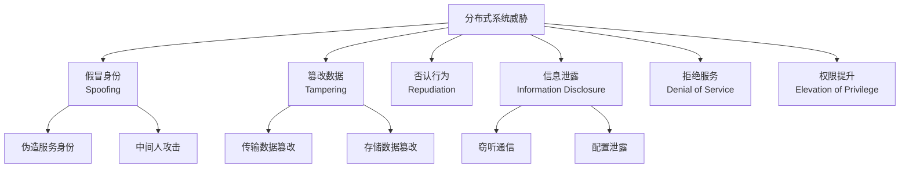
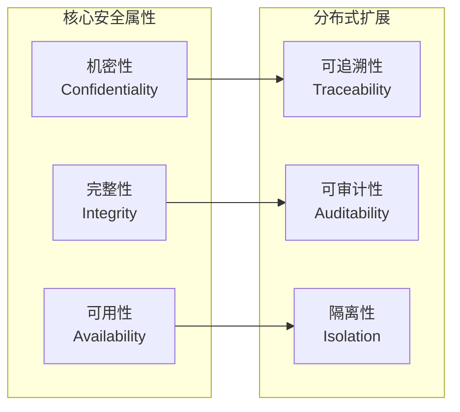
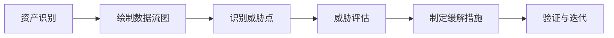
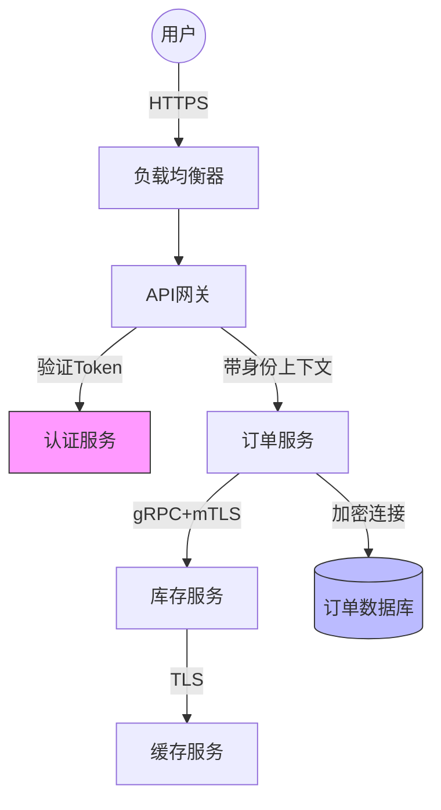
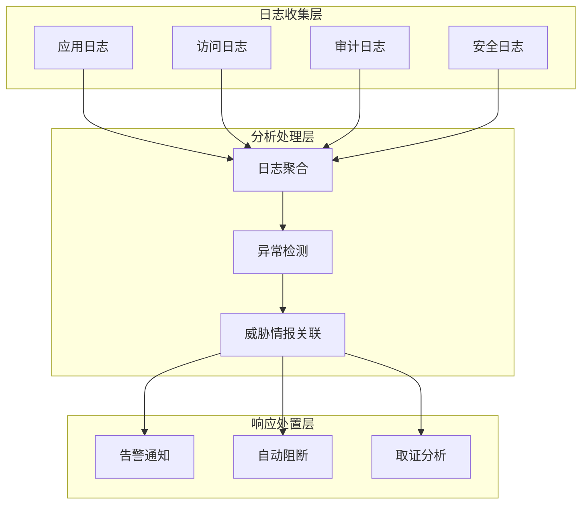

# 分布式安全基础 - 安全威胁模型

## 概述

分布式系统安全是保障多节点、多服务协同工作环境下的数据机密性、完整性和可用性的核心领域。与传统单体应用不同，分布式系统面临更复杂的攻击面，需要在网络层、服务层、数据层建立纵深防御体系。

## 分布式系统威胁模型

### STRIDE威胁分类



### 分布式特有威胁

| 威胁类型 | 描述 | 典型场景 |
|---------|------|---------|
| 服务间通信劫持 | 攻击者截获服务间流量 | 容器网络内部通信 |
| API滥用 | 未授权或过度调用API | 微服务间API调用 |
| 配置注入 | 恶意配置覆盖 | 配置中心被攻破 |
| 时序攻击 | 利用分布式时间差 | 分布式事务处理 |

## 安全架构原则

### CIA三元组扩展



### 纵深防御策略

```
┌─────────────────────────────────────────────────────────┐
│                    边缘安全防护层                          │
│           WAF / DDoS防护 / CDN / 流量清洗                   │
├─────────────────────────────────────────────────────────┤
│                    网络隔离防护层                          │
│           VPC / 子网划分 / 安全组 / 网络ACL                  │
├─────────────────────────────────────────────────────────┤
│                    服务访问防护层                          │
│           API网关 / 认证授权 / 限流熔断 / mTLS               │
├─────────────────────────────────────────────────────────┤
│                    数据安全防护层                          │
│           传输加密 / 存储加密 / 密钥管理 / 数据脱敏            │
├─────────────────────────────────────────────────────────┤
│                    运行时防护层                            │
│           容器安全 / 运行时监控 / 漏洞扫描 / 合规审计          │
└─────────────────────────────────────────────────────────┘
```

## 威胁建模方法

### 威胁建模流程



### 数据流图示例



## 安全基线配置

### 网络安全基线

```yaml
# 网络安全策略示例
network_security:
  # 零信任网络
  zero_trust:
    default_deny: true
    explicit_allow_only: true
    continuous_verification: true

  # 服务网格策略
  service_mesh:
    mtls_enabled: true
    mtls_mode: STRICT
    authorization_policy:
      - source:
          principals: ["cluster.local/ns/frontend/sa/web"]
        to:
          - operation:
              methods: ["GET", "POST"]
              paths: ["/api/v1/*"]

  # 网络分段
  segmentation:
    public_subnet: ["10.0.1.0/24"]
    app_subnet: ["10.0.2.0/24"]
    data_subnet: ["10.0.3.0/24"]
    management_subnet: ["10.0.4.0/24"]
```

### 服务安全基线

```yaml
# 服务安全配置
service_security:
  authentication:
    enabled: true
    method: "JWT"
    issuer: "https://auth.example.com"
    audience: ["api.example.com"]

  authorization:
    rbac_enabled: true
    policies:
      - role: "order-reader"
        permissions: ["orders:read"]
      - role: "order-admin"
        permissions: ["orders:*"]

  api_security:
    rate_limiting:
      requests_per_second: 100
      burst: 150
    input_validation: true
    output_encoding: true
    cors_policy:
      allowed_origins: ["https://app.example.com"]
      allowed_methods: ["GET", "POST", "PUT", "DELETE"]
```

## 安全监控体系



## 最佳实践总结

1. **默认安全**：所有服务默认拒绝访问，显式授权
2. **最小权限**：服务只拥有完成任务的最小权限
3. **安全左移**：在设计和开发阶段就考虑安全
4. **持续验证**：定期审查和更新安全策略
5. **纵深防御**：多层防护，不依赖单一安全措施

---

*文档版本: v1.0 | 最后更新: 2026-04-03*
